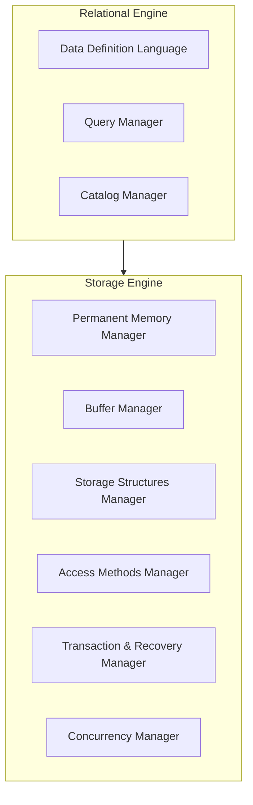
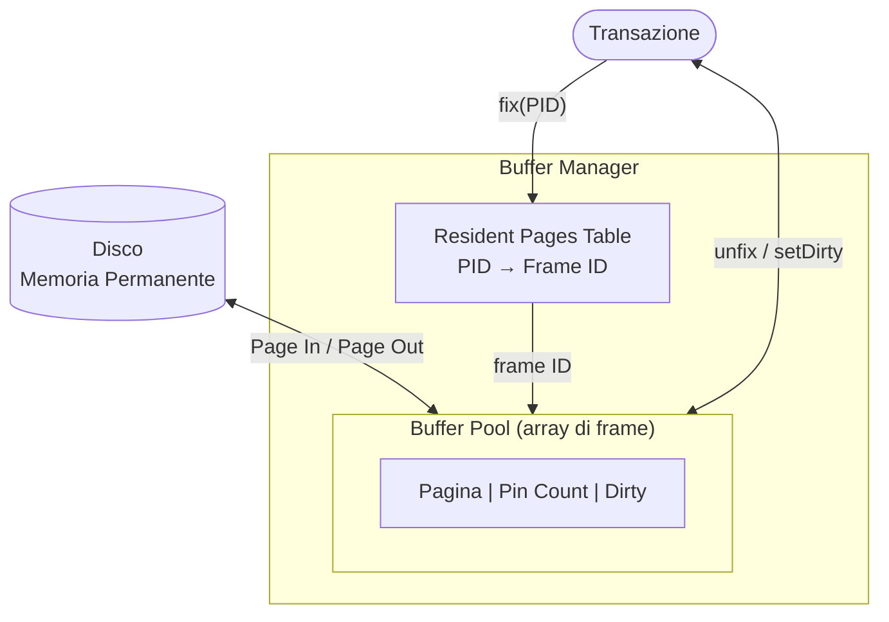
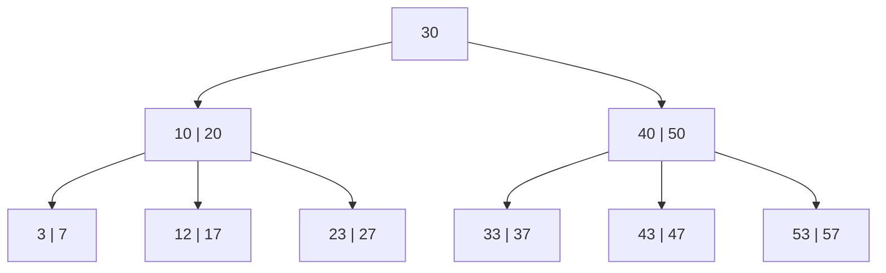
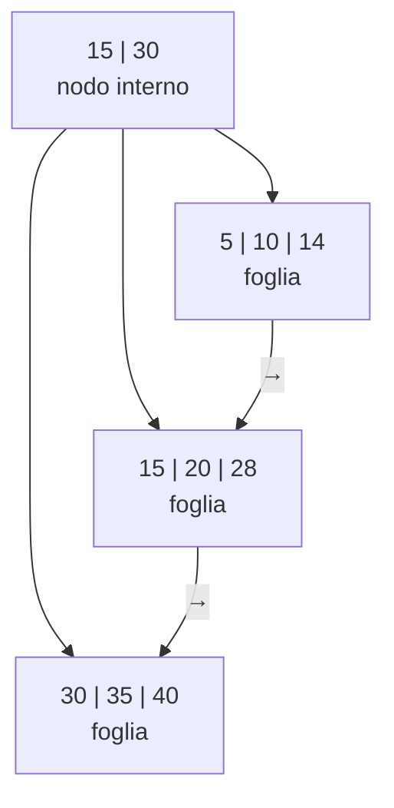
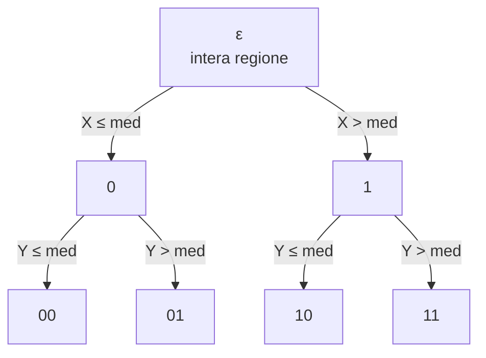

---
tags:
  - università/advanced-databases
  - DBMS
  - storage
  - indici
  - B-tree
  - hashing
data: 2024-01-01
lezione: "2 - Panoramica di un DBMS"
professore: ""
---
# Panoramica di un DBMS

Questo capitolo fornisce una panoramica generale della struttura di un DBMS (Data Base Management System) centralizzato basato sul modello relazionale, descrivendo i suoi componenti e le rispettive funzionalità.

---

## Architettura

> [!definition] Database
>
> Un database è una collezione di insiemi omogenei di dati, con relazioni definite tra loro, memorizzata in memoria permanente e accessibile tramite un DBMS.

> [!definition] DBMS
>
> Un DBMS è un software che fornisce le seguenti funzionalità:
> - Un linguaggio per descrivere lo schema del database (una collezione di definizioni che descrivono le strutture dati), le restrizioni sui tipi di dati ammessi e le relazioni tra gli insiemi di dati;
> - Le strutture dati per la memorizzazione e il recupero efficiente di grandi quantità di dati;
> - Un linguaggio per garantire accesso sicuro ai dati solo agli utenti autorizzati;
> - Un meccanismo di transazioni per proteggere i dati da malfunzionamenti HW/SW e da errori durante l'accesso concorrente.

L'architettura di un DBMS comprende le seguenti componenti di base:

- **Storage Engine**, che include moduli di supporto per:
  - Permanent Memory Manager;
  - Buffer Manager;
  - Storage Structures Manager;
  - Access Methods Manager;
  - Transaction and Recovery Manager;
  - Concurrency Manager.

- **Relational Engine**, che include moduli di supporto per:
  - Data Definition Language;
  - Query Manager;
  - Catalog Manager.

Nei sistemi reali, le funzionalità di questi moduli non sono completamente separate in componenti distinti, ma questa panoramica aiuta a comprendere lo scopo di ciascuno.

*Fig. 2.1 — Architettura di un DBMS: il Relational Engine gestisce query e schema, delegando le operazioni fisiche allo Storage Engine.*

### Permanent Memory Manager (PMM)

Il PMM gestisce l'allocazione e la deallocazione delle pagine sulla memoria su disco. Nasconde le caratteristiche del disco e del sistema operativo, fornendo un'astrazione della memoria come un insieme di database, ognuno costituito da un insieme di file logici di pagine fisiche (o blocchi) di dimensione fissa. Le pagine fisiche di un file sono numerate consecutivamente a partire da 0, e il loro numero può crescere dinamicamente. Ogni collezione di record (tabella o indice) di un database è memorizzata in un file logico.

Una volta che una pagina fisica viene trasferita in memoria principale, è chiamata semplicemente **pagina** (*page*) ed è rappresentata con una struttura specifica e complessa.

### Buffer Manager

Il **Buffer Manager** è responsabile del trasferimento di pagine tra la memoria temporanea e quella permanente, minimizzando il numero di accessi al disco. Le prestazioni delle operazioni su un database dipendono dal numero di pagine trasferite in memoria temporanea.

*Fig. 2.2 — Componenti del Buffer Manager: la Resident Pages Table mappa i PID ai frame, ogni frame tiene traccia del pin count e del dirty bit.*

Il **buffer pool** è un array di frame, ognuno contenente una copia di una pagina in memoria permanente più informazioni bookkeeping. Il pool ha dimensione fissa; quando non ci sono frame liberi, una pagina deve essere liberata con un algoritmo appropriato. Ogni frame memorizza due variabili:

- **Pin count**: conta il numero di transazioni che stanno usando la pagina. Inizia a 0 e si incrementa/decrementa ad ogni richiesta/rilascio;
- **Dirty**: indica se la pagina è stata modificata dall'ultimo trasferimento in buffer, segnalando che la modifica deve essere riflessa su disco.

La **resident pages table** è una hash table usata per sapere quale pagina in memoria permanente (identificata da un PID) è memorizzata in quale frame.

Una politica di rimpiazzo comunemente usata è la **LRU** (Least Recently Used): il frame scelto per essere liberato è quello con il pin più vecchio. Tuttavia, questa politica non è sempre ottimale: in un ciclo di join tra due tabelle, la politica ottimale per l'altra tabella è **MRU** (Most Recently Used).

### Storage Structures Manager

Lo **Storage Structure Manager** implementa i database come tabelle di record, che rappresentano i file di pagine forniti dal PMM. Al di sopra di questo modulo, l'unità di accesso è un record; al di sotto, è una pagina. L'unità di costo considerata è un singolo accesso a una pagina (lettura o scrittura).

Il tipo di file più importante è il **heap file**, che memorizza i record senza un particolare ordine. Un **record** è una collezione di attributi, con un'intestazione extra per la gestione. Ogni record è univocamente identificato da un **RID** (Record IDentifier), che specifica la pagina e l'offset del record.

Le pagine vengono memorizzate in due alternative: tramite due liste concatenate doppie (una per pagine libere, una per pagine piene), oppure tramite una directory con coppie PID-spazio disponibile.

---

## Ordinamento Esterno

Un'operazione frequente nei DBMS è l'ordinamento. Poiché la memoria temporanea non contiene tutti i record contemporaneamente, si usano algoritmi di **ordinamento esterno** (*external sorting*), il più usato dei quali è il **merge-sort**.

Siano $N_{pag}(R)$ il numero di pagine del file e $B$ il numero di pagine disponibili nel buffer. Il merge-sort opera in due fasi:

1. **Fase di ordinamento** (*sort phase*): vengono lette $B$ pagine nel buffer, ordinate e scritte su disco. Si creano esattamente $n = N_{pag}(R)/B$ sottoinsiemi ordinati di record, chiamati **run**;

2. **Fase di fusione** (*merge phase*): fonde i run ordinati per ricostruire il file. In ogni passo di fusione, $Z = B - 1$ run vengono fusi usando una pagina del buffer libera per produrre l'output. Il numero di run alla fine di ogni passo diventa $n = n/Z$. La fusione si ripete finché $n < 1$.

$Z$ è detto **merge order**, e servono in totale $Z + 1$ pagine del buffer per eseguire una $Z$-fusione. Il costo totale dell'algoritmo è:

$$C_{sort}(R) = 2 \cdot N_{pag}(R) + 2 \cdot N_{pag}(R) \cdot MergePasses$$

Se il numero di pagine è inferiore a $B^2$, i dati possono essere ordinati in un singolo passo:

$$C_{sort} = 4 \cdot N_{pag}(R)$$

Il numero totale di passi è:

$$k = \log_Z S, \quad \text{con } S = N_{pag}/B$$

E il costo totale può essere riscritto come:

$$C_{sort} = 2 \cdot N_{pag}(R) + 2 \cdot N_{pag}(R) \cdot \log_Z(S)$$

---

## Organizzazioni dei Dati

### Organizzazioni Heap e Sequenziale

Con l'**organizzazione heap**, ogni nuovo record viene aggiunto alla fine del file: l'inserimento è semplice ed efficiente. Ideale quando gli inserimenti sono più frequenti delle ricerche.

Con l'**organizzazione sequenziale**, i dati sono mantenuti ordinati su una chiave di ricerca $K$. Questo rende la ricerca per uguaglianza e per intervallo su $K$ molto efficienti. L'inserimento è più problematico perché l'ordine deve essere mantenuto sempre. L'inserimento può usare:
- una soluzione **statica**: ogni pagina viene riempita normalmente, spostando i record al momento dell'inserimento;
- una soluzione **dinamica**: si mantiene una parte dello spazio in ogni pagina libera; quando una pagina si riempie, il suo contenuto viene diviso;
- un **differential file**: tiene traccia delle modifiche da applicare alle pagine in un secondo momento.

Il **fattore di selettività** $sf$ stima la frazione di pagine contenenti record che soddisfano una condizione di ricerca per intervallo:

$$sf = \frac{k_2 - k_1}{k_{max} - k_{min}}$$

| Tipo | Memoria | Ricerca Eq. | Ricerca Intervallo | Inserimento | Cancellazione |
|------|---------|-------------|-------------------|-------------|---------------|
| Heap | $N_{pag}(R)$ | $N_{pag}(R)/2$ | $N_{pag}(R)$ | $2$ | $C_s + 1$ |
| Seq. | $N_{pag}(R)$ | $\log_2 N_{pag}(R)$ | $C_s - 1 + sf \cdot N_{pag}(R)$ | $C_s + 1 + N_{pag}(R)$ | $C_s + 1$ |

---

### Organizzazioni Basate su Chiave

> [!definition] Organizzazione Primaria e Secondaria
>
> Un'organizzazione di una tabella è **primaria** se determina come i record sono fisicamente memorizzati e quindi come possono essere recuperati. Altrimenti, è una **organizzazione secondaria**.

> [!definition] Organizzazione Primaria Statica e Dinamica
>
> - **Statica**: le prestazioni degradano gradualmente con inserimenti e cancellazioni, richiedendo riorganizzazione.
> - **Dinamica**: si evolve con inserimenti e cancellazioni, preservando l'efficienza.

In un'organizzazione secondaria, la mappatura da chiave a record è implementata con il metodo tabulare/indice.

#### Hashing Statico

I record della tabella $R$ sono memorizzati nell'**area primaria**, divisa in $M$ bucket, ognuno di capacità $c$ pagine. Il **fattore di carico dell'area primaria** è:

$$d = \frac{N}{M \cdot c}$$

La funzione di hash deve produrre indirizzi uniformemente distribuiti in $[0, M-1]$. Quando un inserimento viene tentato in una pagina completamente piena, si verifica un **overflow**, gestito con:
- **Open overflow**: ricerca lineare nell'area primaria per trovare il primo spazio libero;
- **Chained overflow**: i record in overflow vengono concatenati in un'area separata.

I parametri di design dello hashing statico sono: funzione di hash, tecnica di overflow, fattore di carico e capacità delle pagine. Per fattori di carico $d < 0.7$ il costo medio di una ricerca è 1. Per $d > 0.8$ le prestazioni degradano.

Un grosso svantaggio dello hashing statico è che non supporta efficientemente le range query.

#### Hashing Dinamico

Esistono quattro tipi principali di organizzazioni dinamiche:

**Virtual Hashing** — L'area dati inizialmente contiene $M$ pagine contigue. Un bit vector $B$ indica con 1 quali pagine contengono almeno un record. Una funzione iniziale $H_0$ mappa ogni chiave a un indirizzo $m$. Se si verifica un overflow, l'area dati viene raddoppiata e si usa una nuova funzione $H_1$ che mappa in $[0, 2M-1]$.

La serie di funzioni $H_0, H_1, H_2, \ldots, H_r$ soddisfa i vincoli:
$$H_{j+1}(k) = H_j(k) \quad \text{oppure} \quad H_{j+1}(k) = H_j(k) + 2^j \cdot M$$

Per trovare un record si usa la funzione ricorsiva `PageSearch(r, k)`.

**Extendible Hashing** — Usa un insieme fisso di pagine dati con una directory $B$ di puntatori alle pagine dati. Il valore di $H(k)$ è un valore binario di $b$ bit chiamato **hash key**. Solo i primi $p$ bit sono usati come offset nella directory $B$; $p$ è detto **directory level**. Quando una pagina piena deve essere divisa:
- Se $p' = p$: $B$ viene raddoppiata e $p$ diventa $p + 1$;
- Se $p' < p$: la pagina viene divisa in due e i puntatori nella directory vengono aggiornati.

**Linear Hashing** — Aumenta il numero di pagine dati non appena si verifica un overflow, ma la pagina divisa non è quella in overflow; è invece la pagina puntata dal puntatore $p$, inizialmente uguale a 0 e incrementato di 1 ogni volta che si verifica un overflow. Usa la funzione:

$$H_r(k) = k \mod 2^r M$$

Per recuperare un record con chiave $k$: se $H_i(k) < p$, usare $H_{i+1}(k)$; altrimenti usare $H_i(k)$.

**Spiral Hashing** — Considera la memoria come organizzata su una spirale invece di una linea. Non richiede indici, ma ha prestazioni e utilizzo della memoria migliori.

#### Organizzazioni ad Albero

Tutti gli hashing hanno lo svantaggio di non supportare la range search. Come alternativa, i DBMS usano strutture ad albero dinamico.

> [!definition] B-tree
>
> Un **B-tree** di ordine $m \geq 3$ è un albero di ricerca $m$-ario, vuoto o di altezza $h \geq 1$, con le seguenti proprietà:
> - Ogni nodo ha al massimo $m-1$ chiavi e (eccetto la radice) almeno $\lceil m/2 \rceil - 1$ chiavi;
> - Un nodo con $j$ chiavi ha $j+1$ puntatori ai figli;
> - Tutte le foglie si trovano allo stesso livello;
> - Ogni nodo interno ha la struttura $[p_0, k_1, p_1, k_2, \ldots, k_j, p_j]$.

La relazione tra altezza $h$, ordine $m$ e numero di chiavi $N$:

$$\log_m(N+1) \leq h \leq \log_{\lceil m/2 \rceil}\left(\frac{N+1}{2}\right) + 1$$

> [!note] Dove inserire l'immagine
>
> **[IMMAGINE - Fig. 2.3]**: Un albero binario paginato — ogni pagina contiene 8 nodi.

*Fig. 2.4 — Esempio di B-tree di ordine 3: ogni nodo ha al massimo 2 chiavi e 3 puntatori ai figli; tutte le foglie si trovano allo stesso livello.*

Costi delle operazioni su B-tree:

| Operazione | Caso migliore | Caso peggiore |
|-----------|---------------|---------------|
| Ricerca uguaglianza | $1$ | $h$ |
| Ricerca intervallo | $h$ | $N_{nodes}$ |
| Inserimento | $h+1$ | $2h+1$ |
| Cancellazione | $h+1$ | $(2h-1)+(h+1)$ |

I **B+-tree** sono una variante in cui tutti i record sono memorizzati ordinati nelle foglie, organizzate in una lista doppiamente concatenata. I nodi interni contengono solo la chiave massima del figlio puntato. Per la ricerca per intervallo il costo è $sf \cdot N_{leaves}$, molto migliore rispetto al B-tree.

*Fig. 2.5 — Esempio di B+-tree: i nodi interni contengono solo chiavi di routing, tutti i dati risiedono nelle foglie collegate in lista doppiamente concatenata.*

---

### Organizzazioni su Attributi Non-Chiave

#### Indici Invertiti

> [!definition] Indice Invertito
>
> Un **indice invertito** $Idx$ su un attributo non-chiave $K$ di una tabella $R$ è una collezione ordinata di entry, ognuna nella forma $(k_i, n, p_1, p_2, \ldots, p_n)$, dove ogni valore $k_i$ di $K$ è seguito dal numero di record $n$ con quel valore e dalla lista ordinata dei loro RID.

Per la **ricerca per uguaglianza**, il fattore di selettività è:

$$sf(\sigma) = \frac{1}{N_{key}(Idx)}$$

Il costo di accesso all'indice è $C_I = sf(\sigma) \cdot N_{leaf}(Idx)$. Il costo di accesso ai dati $C_D$ dipende da se l'indice è clustered o unclustered:

- Se **clustered**: $C_D = sf(\sigma) \cdot N_{pag}(R)$
- Se **unclustered**: $C_D = \phi(E_{rec}, N_{pag}(R))$, dove la formula di Cardenas è: $\phi(k, n) = n(1 - (1 - 1/n)^k) \approx \min(k, n)$

#### Bitmap Index

> [!definition] Bitmap Index
>
> Un **bitmap index** $Idx$ su un attributo non-chiave $K$ di una tabella $R$ con $N$ record, è una collezione ordinata di entry nella forma $(k_i, B)$, dove ogni $k_i$ di $K$ è seguito da una sequenza di $N$ bit tale che il $j$-esimo bit è 1 se il $j$-esimo record ha il valore $k_i$ per l'attributo $K$.

I bitmap index sono usati nei DBMS dove i dati non vengono mai aggiornati (es. data warehouse). Permettono di risolvere facilmente query multi-attributo con operazioni AND bit a bit. Convengono rispetto agli indici invertiti quando il numero di valori distinti dell'attributo è basso.

> [!note] Dove inserire l'immagine
>
> **[IMMAGINE - Fig. 2.6]**: Utilizzo di memoria degli indici bitmap e invertiti in funzione del numero di chiavi distinte.

---

### Organizzazione Multidimensionale

I **dati multidimensionali** (o spaziali) rappresentano oggetti geometrici in uno spazio multidimensionale. Le query tipiche includono la ricerca di punti in una regione rettangolare e la ricerca del vicino più prossimo. Un B+-tree tradizionale non cattura la "vicinanza" su più attributi contemporaneamente.

La soluzione è partizionare lo spazio in aree con lo stesso numero di punti, così che ogni partizione corrisponda a una pagina separata. La divisione si alterna tra gli assi finché ogni partizione non è abbastanza piccola.

> [!note] Dove inserire le immagini
>
> **[IMMAGINE - Fig. 2.7]**: Rappresentazione grafica di un dataset bidimensionale.
> **[IMMAGINE - Fig. 2.8]**: Divisione dello spazio in partizioni — mostra la suddivisione alternata sugli assi.

*Fig. 2.9 — Albero di decisione per la codifica delle partizioni nel G-tree: i bit vengono aggiunti al codice del genitore ad ogni split, alternando l'asse di divisione.*

#### G-tree

I **G-tree** sono la struttura dati per memorizzare indici multidimensionali. Ogni partizione è identificata da un **codice di partizione**. Man mano che lo spazio viene partizionato, si costruisce un albero di decisione, alternando gli attributi a ogni livello. I codici vengono assegnati:

- La regione iniziale è identificata dalla stringa vuota;
- Dopo il primo split: "0" e "1";
- Ad ogni split successivo si aggiunge "0" o "1" al codice del genitore.

I codici vengono poi completati fino a $M$ bit (il numero massimo di split). Il G-tree memorizza questi codici come un B+-tree, supportando ricerca puntuale, inserimento, cancellazione e range search spaziale.

> [!question] Possibili domande d'esame
>
> - Descrivi l'architettura di un DBMS e i ruoli dei moduli principali.
> - Come funziona il Buffer Manager? Cosa sono pin count e dirty?
> - Cos'è il merge-sort esterno e qual è il suo costo?
> - Confronta l'organizzazione heap e sequenziale (costi delle operazioni).
> - Differenza tra organizzazione primaria e secondaria, statica e dinamica.
> - Come funziona lo static hashing? Quali sono i parametri di design?
> - Descrivi le quattro organizzazioni di hashing dinamico.
> - Qual è la definizione formale di B-tree? Calcola i costi delle operazioni.
> - Come si differenziano i B+-tree dai B-tree?
> - Cos'è un indice invertito? E un bitmap index? Quando si usa l'uno o l'altro?
> - Come funziona il G-tree per dati multidimensionali?
