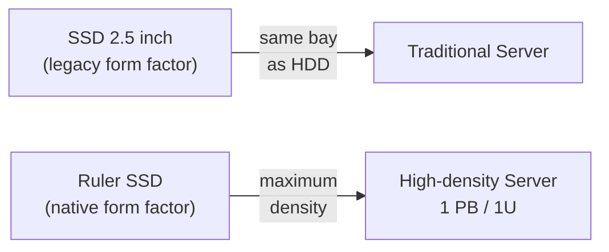
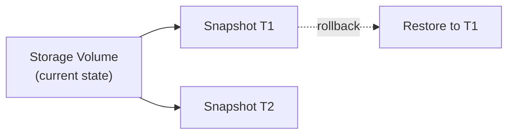
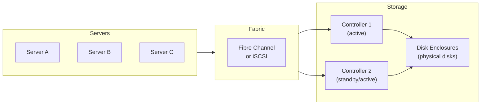
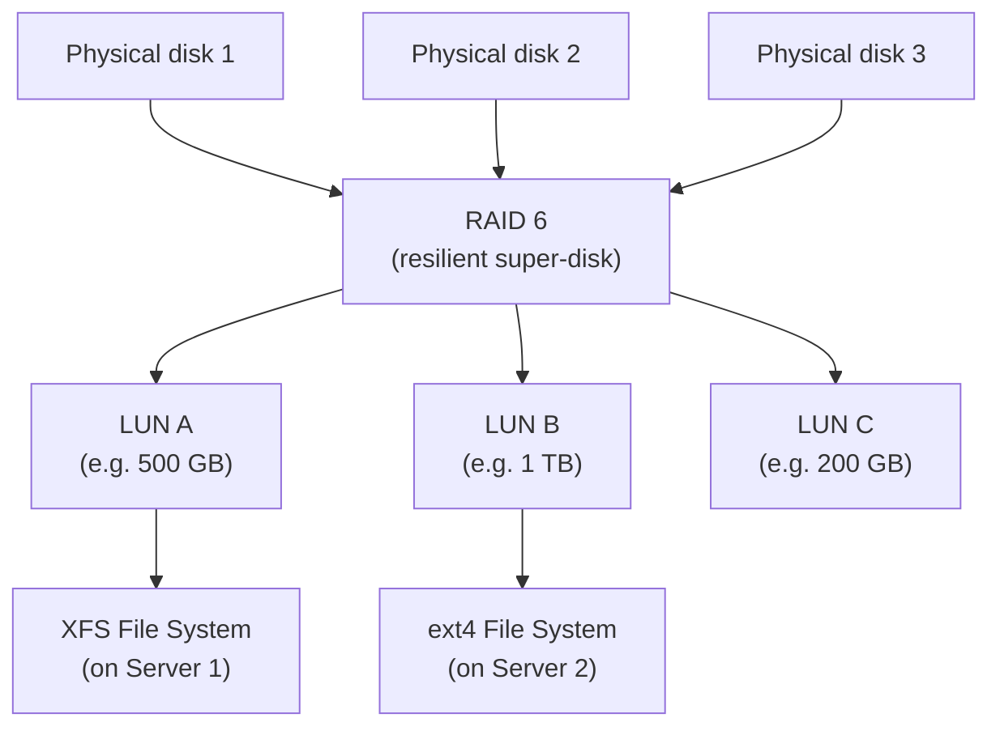
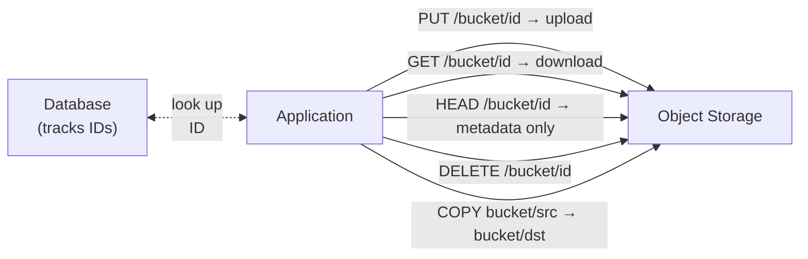
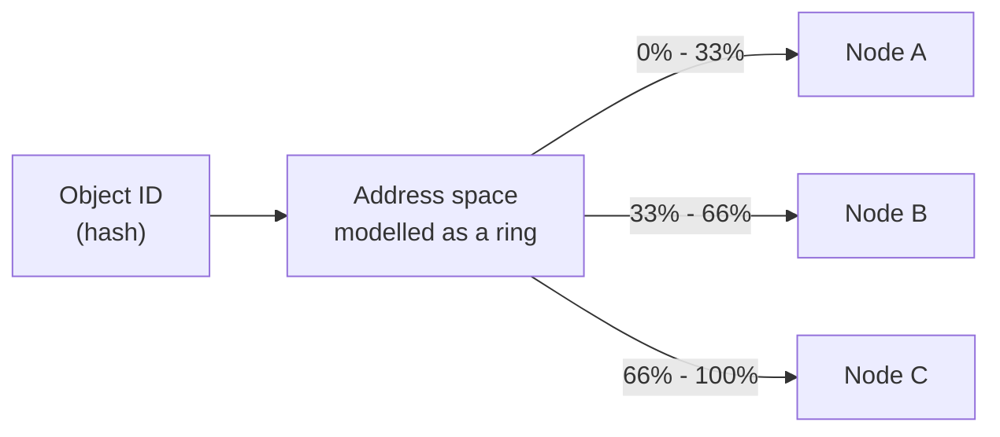
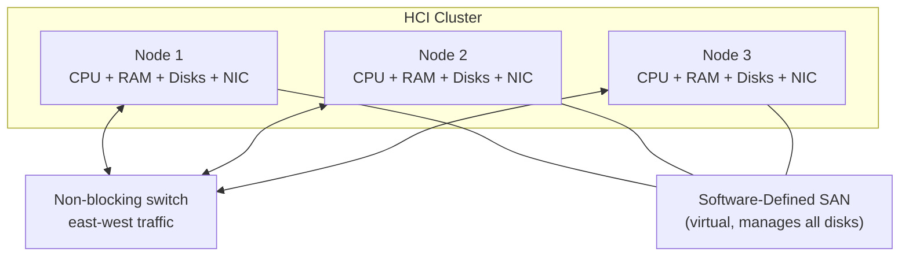
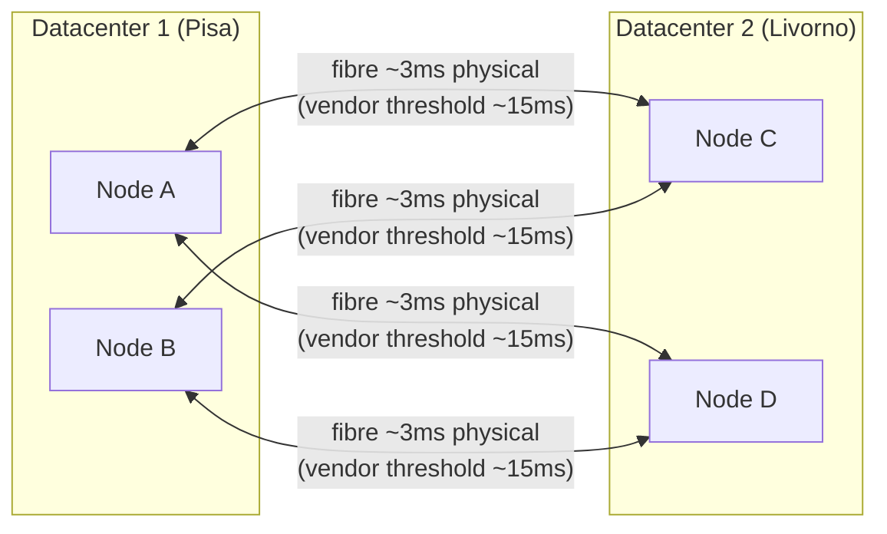
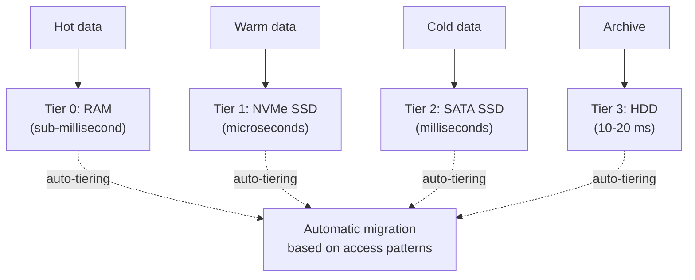

---
tags:
  - university/datacenter-design-and-operation
  - storage
  - SAN
  - NAS
  - object-storage
  - HCI
date: 2026-04-16
lecture: "Storage: Architectures and Services"
professor: "Antonio Cisternino"
---

# Storage: Architectures and Services

The lecture starts from an apparently trivial observation: the term *disk drive* is now an anachronism. Modern storage devices no longer contain rotating disks, yet we continue to call them that — exactly as the floppy disk icon still sits on the "Save" button of many applications. This is an exemplary case of the **substitution principle**: when a technology evolves, the previous form factor is often retained for compatibility with existing infrastructure, even when the new device no longer needs it.

---

## Form Factors and Storage Density

### The form factor in the datacenter

In enterprise servers the most widespread form factor remains the **2.5-inch** one, originally designed to hold a rotating disk. Today an SSD is inserted in that same slot, which has no need for that shape. The reason is simple: all the server infrastructure — backplanes, connectors, cages — was designed around that format and replacing it has a high cost.

> [!tip] The carriage and the automobile principle
>
> The first automobiles had the same dimensions as horse-drawn carriages, not out of technical necessity, but because roads, garages and habits were calibrated on the old standard. The same applies to disk drives in servers.

### The Ruler form factor

The evolution towards solid state storage has however pushed for the design of native form factors for SSDs. The most relevant is the **Ruler**, a long and narrow device that optimises:

- **Heat dissipation**: the circular form factor of the disk was efficient for spinning a platter, but is suboptimal for dissipating the heat generated by flash chips. The ruler has larger lateral surfaces that improve airflow.
- **Density**: multiple rulers can be stacked vertically in a single rack unit. Intel demonstrated roughly eight years ago a system in the order of **a petabyte in 1U** using approximately 24 ruler modules (number cited from memory by the professor, to be taken as an order of magnitude).

*Fig. — Comparison between the legacy form factor (2.5") and Ruler for solid state storage.*

The ruler can be installed with or without an integrated heatsink: the version with a heatsink (*wing*) is slightly thicker but guarantees superior thermal performance. The same logic is already present in laptops in the form of **M.2** modules, which are essentially miniature rulers.

*Source: Wikimedia Commons — An M.2 SSD module: the elongated shape identical to the Ruler principle, designed to maximise density in laptops.*

---

## Aggregating Storage: RAID and File Systems

### RAID recap

The starting point for building datacenter-grade storage is **aggregating multiple physical disks** into a more capable and resilient logical unit. The underlying technology is [[RAID]] (*Redundant Array of Inexpensive Disks*).

> [!warning] Data loss is the unforgivable sin
>
> In a datacenter, data loss is unacceptable. A user can tolerate a service interruption — the data is unreachable for a while, it is annoying but forgivable. But if the data is destroyed, the legal and reputational liability is enormous. Every architectural decision about storage must start from this premise.

**RAID 6** is today the most common choice in enterprise environments, because it allows losing one disk and **replacing it hot** (*hot swap*) while the system continues to operate, rebuilding the data in the background. With RAID 5, on the other hand, losing one disk requires taking the storage offline for reconstruction.

The cost of RAID storage is not only the cost of the physical disks: it also includes the **redundant space** necessary for protection, and all the management infrastructure.

### File systems and RAID

A recurring question: does aggregating multiple disks via RAID require a special file system? The answer is no. On Linux, RAID can be configured with **LVM** and the resulting volume formatted with any standard file system (ext4, XFS, etc.). RAID operates at the block level, transparent to the file system.

However, if the system must manage **highly concurrent accesses** from many parallel processes — such as in HPC (*High Performance Computing*) — the standard file system becomes the bottleneck. In that case, **parallel file systems** are used: GFS, GPFS, Lustre and similar, designed to support massive concurrency. For ordinary enterprise use (document sharing, email) a standard file system is sufficient.

---

## Services Required from Modern Storage

Before choosing an architecture, it is essential to understand what services a datacenter-grade storage system must offer. It is not just about exposing blocks over a network.

### Deduplication

If I send a 10 MB attachment to 1000 people in the same organisation, an intelligent storage system does not keep 1000 identical copies: it maintains **just one**, recording only references. Deduplication drastically reduces the space occupied, because users tend to duplicate files far more than one might think.

### Compression

Compression does not only serve to save space: compressed data is smaller, so the transfer from disk to memory requires **less I/O**. Even with modern fast SSDs, compression improves throughput, with a small CPU overhead for decompression. The trade-off is almost always favourable for compression.

### Security

An enterprise storage system must offer:
- **Encryption at rest**: data is encrypted when written to disk, but decrypted in memory during use.
- **ACL** (*Access Control List*): access control at the volume or file level.
- **Secure erase**: when a file is deleted, the blocks are effectively overwritten to prevent unauthorised recovery.

### Snapshot

A **snapshot** is a photograph of the state of a volume at a precise instant. If something goes wrong — a broken software update, ransomware, human error — the volume can be restored to that exact point. In enterprise systems this operation occurs without interrupting the service (copy-on-write technique).

*Fig. — Snapshot mechanism: the volume can be restored to any previously captured state.*

All these services — deduplication, compression, security, snapshots, and others — make storage management complex. This is why it makes sense to **centralise** storage, decouple it from individual servers, and entrust it to a specialised system that offers them uniformly across the entire infrastructure.

---

## Storage Area Network (SAN)

### Architecture

The **SAN** (*Storage Area Network*) is the most widely used storage architecture in enterprise datacenters. The idea is to physically separate storage from compute servers and connect them via a dedicated high-performance network.

*Fig. — SAN architecture: servers access storage via dedicated fabric towards redundant controllers.*

*Source: Wikimedia Commons — Example of a SAN architecture with servers, Fibre Channel switches and storage array.*

The key components are:

- **Fabric**: dedicated storage network. The traditional protocol is **Fibre Channel** (FC), which carries data blocks over optical fibre. Alternatively, **iSCSI** is used, which encapsulates the SCSI protocol over Ethernet.
- **HBA** (*Host Bus Adapter*): a card in the server that presents the operating system with a local disk, even though that disk is physically located in the remote storage. It is transparent to the OS.
- **Controller**: the brain of the storage. It receives block requests from servers, manages the mapping onto physical disks and returns the data. It is typically duplicated (active/active or active/passive) for fault tolerance.
- **Disk Enclosure**: the physical chassis containing the disks, connected to the controllers.

### LUN — Logical Unit Number

Physical storage is "sliced" into logical units called **LUNs** (*Logical Unit Numbers*), or *logical units*. A LUN is a virtual disk: it has a certain size, it is mapped onto physical blocks inside the storage (above a RAID layer), and is exposed to servers as if it were a local disk.

*Fig. — SAN hierarchy: from physical disks to RAID, from LUNs to file systems on servers.*

### Advantages and limitations of SAN

The main advantage of SAN is **centralisation**: a dedicated team manages all storage for the entire infrastructure, with backup, redundancy and advanced services in a single point.

> [!warning] The bottleneck with high-performance SSDs
>
> Classic SAN was born with mechanical disks, where the Fibre Channel network was always faster than the disk. With modern NVMe SSDs, capable of 16 GB/s each, the equation is reversed: if dozens of SSDs are aggregated in the same storage, the fabric bandwidth becomes the bottleneck. This has driven the development of alternative architectures.

---

## NAS — Network Attached Storage

### Fundamental differences from SAN

**NAS** (*Network Attached Storage*) takes a different approach: instead of exposing raw blocks to servers, it directly exposes **files and directories** via remote file system protocols.

| Characteristic | SAN | NAS |
|---|---|---|
| Abstraction level | Blocks (raw) | Files and directories |
| Protocol | Fibre Channel, iSCSI | NFS, SMB |
| Network | Dedicated fabric | Standard Ethernet |
| File system | Managed by the server | Managed by the storage |
| Memory mapping | Supported | Not supported |
| Latency | Low | Medium |

The two most common NAS protocols are:
- **NFS** (*Network File System*): the Unix/Linux standard, still dominant in datacenters.
- **SMB** (*Server Message Block*): born in the Microsoft world, today available on all platforms.

### Memory Mapping and why it matters

> [!definition] Memory Mapping
>
> *Memory mapping* is a technique that exploits the CPU's paging mechanism: a file is "mapped" into the process address space, and accesses to the file's bytes are handled directly by the hardware MMU as page faults. The kernel automatically loads the necessary blocks from disk into memory.

Memory mapping is today dominant — Windows and Linux both use it as the basis of their file I/O. It is enormously more efficient than the traditional APIs (`open`/`seek`/`read`) for random access, because it leverages hardware support rather than repeated system calls.

However, **memory mapping works on SAN, but not on NAS**. A remote NAS file system does not support `mmap()`. This makes SAN the only choice for applications requiring high-performance random access (databases, analytical algorithms, virtual machines).

### When to use NAS

NAS is suitable for:
- **Backup** and archiving
- **Document stores** (analogous to an internal OneDrive/SharePoint)
- Any workload with predominantly sequential access

> [!warning] Complexity of ACL integration
>
> The main practical problem with NAS is integrating the security model: the remote file system ACLs must be mapped onto user identities in the domain (LDAP, Active Directory). When multiple directories coexist, synchronisation becomes complicated and often generates limitations in the permissions model.

---

## Object Storage

### The origin: Amazon's problem

About fifteen years ago Amazon faced a problem that SAN and NAS could not solve: providing storage at **exabyte scale** to millions of users and applications simultaneously. With traditional architectures, adding ever more SAN and NAS had unsustainable management costs and scalability bottlenecks.

The solution was a new paradigm: **object storage**.

### What is object storage

Object storage is a **distributed** storage system, application-oriented, that exposes data via a simple **HTTP/REST** API. Each piece of data is an *object* identified by a **unique ID** and optionally accompanied by metadata.

> [!definition] Object Storage
>
> A storage system that represents data as immutable objects, identified by a unique ID, accessible via REST API (typically S3-compatible). There is no folder hierarchy, only flat containers called **buckets**.

There are no nested folders: only **buckets** (flat containers) that group objects. Logical organisation is the application's responsibility, which typically uses a database to track object IDs.

*Fig. — The fundamental S3 object storage operations: PUT, GET, HEAD, DELETE, COPY.*

### The S3 API

The de facto standard API for object storage is **S3** (*Simple Storage Service*), proposed and implemented by Amazon. The core operations are:

- **PUT Object**: uploads an object to a bucket.
- **GET Object**: downloads the entire object. There is no `seek`: you cannot request an internal byte range without downloading everything.
- **DELETE Object**: deletes an object.
- **HEAD Object**: retrieves only the metadata without downloading the payload — useful before deciding whether to download a multi-gigabyte object.
- **COPY Object**: copies an object internally within the storage, an operation the system executes in an optimised manner without requiring download + upload.

### Scalability via Consistent Hashing

The problem of an object storage distributed across many nodes is: given an object ID, which server holds it? Maintaining a centralised registry (database) would immediately create a bottleneck.

The solution adopted by implementations such as **RIAK** (cited by the professor as an example of distributed object storage; the attribution to GitHub has not been verified — RIAK is a distributed key-value store by Basho Technologies used by various providers) is **consistent hashing**:

*Fig. — Consistent hashing: the object ID is deterministically mapped to a node without consulting a centralised registry.*

The address space is treated as a circular ring and divided among the nodes. Adding a node requires a **rebalancing** algorithm, but once completed each client can determine the correct node directly from the ID, without querying any registry.

### Advantages, limitations and use cases

| Characteristic | Object Storage | NAS | SAN |
|---|---|---|---|
| Access | HTTP REST | NFS / SMB | Fibre Channel / iSCSI |
| Structure | Flat (bucket) | Hierarchical (folders) | Raw blocks |
| Scalability | Massive (exabyte+) | Medium | Medium |
| Latency | High (HTTP overhead) | Medium | Low |
| Memory Mapping | No | No | Yes |
| Use cases | Backup, media, IoT, ML datasets | Document share | VM disk, database |

Object storage is the ideal solution for **healthcare** (archiving scans and diagnostic images: written once, read back entirely, never modified), **media storage**, **backup**, and any scenario with **massive writes and infrequent reads**.

> [!note] File system on object storage
>
> It is possible to build a file system on top of object storage: objects become blocks, and the hierarchical structure is implemented at the application level. This allows scaling to billions of objects, but performance is not comparable to a native file system on SAN.

---

## HCI — Hyperconverged Infrastructure

### The problem with SAN and high-performance SSDs

About thirteen years ago, while VMware virtualisation was at its peak, a structural problem was observed in classic SAN: the *star topology* (all servers connected to a central controller) suffers from a physical bottleneck in the controller itself. With a single head node with 8 ports at 400 Gbit/s, you get at most 3.2 Tbit/s aggregate — and when dozens of fast SSDs are on the other side, that capacity runs out quickly.

The startup **Nutanix** proposed a radically different approach.

### The HCI paradigm

The central idea is to **transpose the matrix**: instead of separating compute, storage and network into horizontal layers, **nodes** are built that contain a bit of everything. Each node is a standard server with CPU, RAM, local disks and network cards. The software makes them look like a SAN.

*Fig. — HCI: nodes collaborate via switch to form a software-defined virtual SAN.*

The **HCI software** (Nutanix AOS, VMware vSAN, Microsoft Storage Spaces Direct) aggregates the disks from all nodes into a single storage pool, exposing it as a traditional SAN to virtual machines.

### Performance: the locality advantage

The main gain of HCI is **data locality**: the software can place the virtual disk of a VM on the same physical node that runs that VM. The access goes over the local PCIe bus — it does not traverse any network — which allows exploiting the full bandwidth of a local NVMe (tens of GB/s).

> [!tip] East-west traffic
>
> In HCI, data replication generates *east-west* traffic (node → node), not *north-south* (server → central controller). Thanks to the non-blocking switches of modern datacenters, this traffic does not interfere between different nodes — if N1 replicates to N2, N3 is not disturbed.

### Resilience: replication factor

If a node goes down, the data residing there must not be lost. The solution is the **replication factor**:

- With RF=2: each block written locally is also replicated to a second node.
- With RF=3: replicated to two other nodes (loss of any node is tolerated).

Writing works as follows: the local node writes to its own disk, then transmits the data to the remote node. When the remote node confirms that the data is in memory (not necessarily written to disk), the writer is unblocked. This allows write latencies competitive with SAN.

> [!warning] Licensing costs
>
> Technically, HCI is the architecture with the best absolute performance available today. Unfortunately, vendors (Nutanix, VMware vSAN, Microsoft Storage Spaces Direct) apply very expensive licences, which often bring back the appeal of traditional SANs for many contexts.

### Scale-up vs Scale-out

> [!definition] Scale-up and Scale-out
>
> **Scale-up** (*vertical scaling*): capacity of a single node is increased by adding resources (more RAM, more disks). Physical limit: eventually the node can no longer grow.
>
> **Scale-out** (*horizontal scaling*): nodes are added to the cluster. Aggregate capacity increases linearly. HCI is a scale-out architecture.

With HCI, adding a node to the cluster simultaneously increases compute, storage and network bandwidth proportionally and without central bottlenecks.

---

## Advanced SAN Enterprise Services

Whether using a traditional physical SAN or a software-defined HCI, the set of managed services is similar. Let us examine them in detail.

### Thin Provisioning

When a 2 TB LUN is allocated to a user, they perceive it as a 2 TB disk. But in reality, the system can **physically allocate only a portion** (e.g. 200 GB), expanding the physically reserved space as data grows.

> [!example] Thin provisioning in practice
>
> Prof. Cisternino recounts a university project for a database of botanical scans. Initial estimate: 75 TB. Ten years later, they are still using less than 10 TB. Thanks to thin provisioning, the researchers received 75 TB logical but the system physically allocated only the space actually used, saving tens of thousands of euros in storage.

The risk is **overcommitment**: if 4 TB is promised when only 2 TB is physically available and users fill them all, the system goes into crisis. It is necessary to monitor actual utilisation and act before physical space runs out.

> [!note] Real overcommitment
>
> In the University of Pisa HCI cluster, 725 VMs believe they have 1.5 PB of storage. The cluster physically has approximately 1 PB. This is a real example of thin provisioning and overcommitment in production.

### Multipath I/O

Multipath connects a server to storage via **multiple parallel paths** (multiple optical fibres, multiple HBAs). The advantages are:

- **Redundancy**: if one path fails, traffic is automatically routed over the others.
- **Aggregate bandwidth**: paths can be balanced to multiply the available bandwidth.

With modern NVMe SSDs at 16 GB/s each, multipath is almost indispensable: a single 100 Gbit/s link (~12 GB/s) is not enough to saturate a single SSD.

### Zoning and LUN Masking

These two mechanisms implement **access control** at the storage level:

- **Zoning**: defined in the fabric (Fibre Channel switch), determines which servers can "see" which parts of the storage. It is a network configuration: this WWN (World Wide Name, the server identifier) can communicate with this target.
- **LUN Masking**: defined in the storage controller, determines which specific LUN is exposed to which server. Even if the server sees the storage (due to zoning), it may only see certain LUNs.

### Snapshots, Clones and Replication

**Snapshot**: a point-in-time photograph of a LUN. Typically implemented with copy-on-write: the snapshot is initially empty and records only the blocks that change after its creation, initially occupying very little space.

**Clone**: a complete and independent copy of a LUN. Useful for testing a critical update: the production LUN is cloned, the update is performed on the clone, and if everything works the clone is promoted to production.

**Replication**: copying data to a second geographic site. Fundamental for **disaster recovery**. There are two modes:

- **Synchronous**: each write is confirmed only when it has been written to both sites. No data loss, but additional latency = distance limit.
- **Asynchronous**: writes are replicated with a certain delay. No performance impact, but in case of disaster the last time window is lost.

### Metro Cluster

A **metro cluster** extends an active-active cluster between **two geographically close datacenters**. The threshold of approximately **300 km / <15 ms** cited by the professor is a vendor guideline (Nutanix, VMware vSAN) for their synchronous clustering algorithms, not a physical limit: the physical latency over fibre at 300 km is ~3 ms round-trip, but the protocols apply more conservative thresholds. The clustering algorithms do not notice that the nodes are in separate buildings: they only see the additional network latency, which remains tolerable.

*Fig. — Metro cluster: cluster nodes are distributed across two distinct but geographically close datacenters.*

Beyond 300 km (e.g. Milan–Naples), latency exceeds the tolerable threshold for synchronous protocols. In that case, asynchronous replication is used: some data may be lost in case of disaster, but at least the remote site has a recent copy.

### Tiering and Caching

**Tiering**: storage is divided into levels (*tiers*) with different characteristics. *Hot* data (frequently accessed) resides on SSDs, *cold* data (rarely accessed) on HDDs. The system **automatically moves** data between tiers based on access patterns (*auto-tiering*).

**Caching**: the hottest data can be kept in the controller's **RAM**, completely eliminating disk access latency for repeated operations.

*Fig. — Tiering hierarchy: data migrates automatically towards the most appropriate tier based on access frequency.*

### Quality of Service (QoS)

The SAN can assign **different priorities** to different LUNs: in a moment of contention, the blocks of LUN A (critical database) are served before those of LUN B (backup). This prevents an I/O-intensive process (e.g. nightly backup) from degrading the performance of a production service.

### Security

- **Encryption at rest**: data is encrypted before being written to disk. In operational memory it is in plain text. If a disk is physically stolen, the data is unreadable.
- **Secure erase**: when space is freed, blocks are overwritten to prevent unauthorised recovery of residual data.
- **Access control and authentication**: integration with identity systems to control who can access which LUNs.
- **Data integrity**: block checksums to detect silent corruption.

---

## Choosing the Architecture: there is no single "best"

> [!warning] There is no universally superior architecture
>
> SAN, NAS, Object Storage and HCI each have optimal use cases. The choice always depends on the balance of performance, scalability, cost and nature of the workload.

| Scenario | Recommended architecture |
|---|---|
| Production VMs with intensive random access | SAN or HCI |
| Many VMs, limited budget, good performance | HCI (if licensing is sustainable) |
| Document store, backup, enterprise OneDrive | NAS |
| Massive archiving (medical scans, ML datasets) | Object Storage (S3) |
| Big data, HPC, parallel access | Parallel file system (Lustre, GPFS) |
| Geographically distributed disaster recovery | Asynchronous SAN replication |
| Metropolitan redundancy (same provider) | Metro cluster |

> [!example] Sizing: back-of-envelope calculation
>
> Scenario: ingest 1 TB/s of data from sensors.
> - A server with a 100 Gbit/s NIC = ~12 GB/s inbound bandwidth.
> - To sustain 1 TB/s: 1000/12 ≈ 84 servers.
> - With 100 servers there is sufficient margin.
> - Servers process locally and send the result to the central SAN.
> Not all inbound bandwidth needs to pass through the SAN — local buffering and asynchronous transfer is used.

---

## Real Case: the University of Pisa Private Cloud

Prof. Cisternino showed the real UniPi datacenter infrastructure as a concrete example:

- **2 hybrid HCI clusters** (acquired ~2019): storage with SSD + HDD tier, with automatic auto-tiering.
- **1 all-flash HCI cluster** (more recent): entirely solid state, more modern CPUs, density approximately three times higher than the 2019 clusters — demonstration of the trend in disk costs over time.
- **NAS server for cold storage**: approximately 1 petabyte of mechanical hard disks for long-term archiving.
- **No Fibre Channel**: the infrastructure uses iSCSI over high-performance Ethernet.

> [!example] Overcommitment in production
>
> The HCI cluster manages **725 virtual machines**. The VMs collectively believe they have **1.5 petabytes** of storage. The cluster physically has approximately **1 petabyte**. Thin provisioning allows this overcommitment because most VMs do not use all the space allocated to them.

---

> [!question] Possible exam questions
>
> - What is the fundamental difference between SAN and NAS? In which case would you use each?
> - Why is memory mapping not supported on NAS? What is the practical consequence?
> - What is meant by thin provisioning? What are the risks?
> - What is a LUN and where does it sit in the SAN hierarchy?
> - How does object storage work? Why does it scale better than SAN and NAS?
> - What is consistent hashing? How is it used in RIAK?
> - What distinguishes HCI from a traditional SAN? What are the current advantages and disadvantages?
> - What is the difference between scale-up and scale-out? Which is HCI?
> - What is a metro cluster? What is the distance limit and why?
> - Describe the main services that an enterprise SAN must offer.
