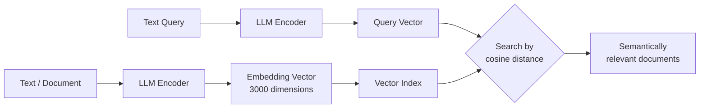
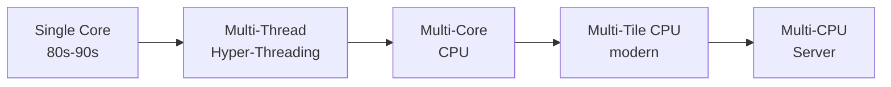

---
tags:
  - università/datacenter-design-and-operation
  - storage
  - vector-database
  - backup
  - compute
  - snapshot
data: 2026-04-17
lezione: "Advanced storage and introduction to compute"
professore: "Antonio Cisternino"
---

# Advanced Storage and Introduction to Compute

This lecture picks up from storage to complete some open topics, introduces two new AI-driven storage paradigms, deepens the metrics for storage performance and data resilience, and opens the third major pillar of the datacenter: compute.

---

## Hardware Specialization per Workload

Before roughly 2008, the dominant paradigm was the generic server: you bought hardware and decided later which workload to run on it. This worked as long as all workloads were sufficiently alike. With the rise of virtualization, and then big data (around 2013), it became clear that **real performance requires specializing hardware to the workload**.

This shift applies at every layer of the stack. In storage, vendors began differentiating their offerings per workload — for big data, high-capacity SATA drives became preferable to faster but more expensive SAS drives, because that workload values the capacity/price ratio over per-unit latency. At the CPU level, manufacturers now offer different configurations of the same die, tuned either for high-frequency single-thread execution or for massive parallel throughput.

The same specialization shapes storage architectures: SAN, NAS, HCI, and object storage are not interchangeable; each responds optimally to a well-defined class of workloads.

---

## New Forms of Storage

### Stream-based storage

Dell/EMC's **Nautilus** project introduced the concept of *stream-based storage*: a persistence layer designed specifically for IoT sensor data streams. An IoT stream is structurally different from a video stream: rather than transmitting sequential frames from a single source, it samples the **state of the world** (temperature, pressure, current) from many devices in parallel over time.

The computational interest is not necessarily the entire historical series, but often the current reading or aggregations over time windows. The problem with traditional *store-and-forward* is that it creates multiple copies of the same datum along the chain of nodes, with no clear ownership policy. Nautilus solved this by guaranteeing that, at any given moment, each piece of information existed in **exactly one copy** across the storage network, underpinned by a coherent computational model over the streams.

The project did not achieve major commercial success, but the open-source ecosystem addressed the same problem more pragmatically through frameworks like **Apache Kafka** and similar tools. The underlying principle — *store, process, forward* applied to time-series data — remains central to IoT and edge computing workloads.

### Vector databases

**Vector databases** are the most relevant new storage form to emerge in recent years, a direct consequence of the rise of generative AI.

Text retrieval has historically been vector-based: the *bag-of-words* model from the 1990s represented each document as a vector in word space, with one dimension per vocabulary term. Similarity between a document and a query was computed via the **cosine distance** between their respective vectors — the basis of search engines like Google. The fundamental limitation of this approach is its *syntactic* nature: the word "Python" produces the same vector regardless of context, making it impossible to distinguish the snake from the programming language.

> [!definition] Embedding
>
> An **embedding** is a dense, high-dimensional vector produced by the first portion of a Large Language Model's neural network. Unlike sparse, binary bag-of-words vectors, an embedding captures the **semantic representation** of text in context. The embedding of "Python" will differ depending on whether the word appears in a programming or a zoological context, because the network learned semantics during training.

OpenAI produces embeddings of **3,000 dimensions** with floating-point values — a far richer semantic space than classical vectors. A notable scientific result (Cornell University) demonstrated that a **conversion function** exists between the embeddings of different models: models trained on different data tend to produce representations of the same meaning that are mutually mappable up to a linear transformation. This suggests the existence of a universal latent semantic space, and justifies investing in embedding-based architectures regardless of the specific model used.

A **vector database** combines the flexibility of NoSQL databases (heterogeneous object collections, no rigid schema) with the ability to index objects via their embeddings and answer semantic queries by finding the nearest vectors in high-dimensional space.

*Fig. — Vector database pipeline: documents are indexed via embeddings; queries are resolved by semantic similarity in vector space.*

> [!tip] RAG — Retrieval Augmented Generation
>
> **RAG** (Retrieval Augmented Generation) is the dominant architecture of modern AI systems. When a user submits a prompt, the system first performs a semantic search over a document database (via vector search), injects the most relevant texts into the request context, and only then does the model generate its response. This dramatically reduces *hallucinations*: according to the Stanford AI Index, even the best models produce false information 30% of the time in pure mode; RAG mitigates this by grounding the response in verified data.

The datacenter impact is concrete: modern storage systems (such as VAS DATA) are integrating neural network execution capabilities to compute embeddings directly during data ingestion. Storage is no longer just a passive repository; it is becoming an active component capable of building semantic representations and answering intelligent queries.

---

## Storage Performance Metrics: IOPS

**Latency** and **bandwidth** alone are insufficient to characterize storage performance, because both figures depend heavily on the access pattern.

> [!definition] IOPS
>
> **IOPS** (Input/Output Operations Per Second) is the number of I/O operations a storage system can complete per second. It is not an absolute metric: it must always be qualified by the access type (sequential or random), block size, number of concurrent threads, and number of queues.

The need for IOPS as a separate metric is intuitive: storage optimized for streaming video (where the goal is to saturate the pipeline with contiguous data through aggressive prefetching) behaves radically differently from storage serving memory paging (random accesses to 4 KB blocks). Measuring only bandwidth in the latter case yields a value far lower than a sequential read on the same hardware.

> [!tip] Supermarket analogy
>
> - **IOPS** = customers served per second
> - **Latency** = service time per customer
> - **Queues** = waiting customers
> - **Parallelism** = number of open checkout lanes
>
> The analogy explains why, with a single queue and a single server, throughput equals exactly `1 / latency`. With multiple lanes in parallel, throughput scales accordingly.

The fundamental mathematical relationship for a single queue is:

$$\text{IOPS} \approx \frac{1}{\text{latency}}$$

With multiple queues or threads, throughput scales proportionally. Practical examples:
- Mechanical HDD (latency ~5 ms): ~200 IOPS per queue
- NVMe SSD (latency ~20 μs): ~50,000 IOPS per queue

Storage is inherently asynchronous: the CPU issues a read request and is unblocked while the operation is in flight, allowing a single thread to interleave multiple requests across multiple queues.

---

## Data Loss and Resilience

### Types of data loss

Treating hardware failure as the only source of data loss is a common mistake. The real causes include:

| Cause | Description | Countermeasure |
|---|---|---|
| Hardware failure | Broken disk, damaged controller | RAID, replication |
| Software corruption | Bug that overwrites valid data | Checksums, backup |
| Human error | Accidental deletion, misconfiguration | Backup, snapshot |
| Ransomware/encryption | Data encrypted by malware | Offline backup, snapshot |
| Cryptographic key loss | BitLocker/encryption without key backup | Key management |

**Human error** is statistically the leading cause of data loss, far exceeding hardware and software failures combined. A storage system with perfect replication does not protect against accidental deletion: the deletion is immediately replicated.

### Replication vs Backup

**Replication** is a synchronous or asynchronous copy of data to a second storage system, designed to ensure availability in case of hardware failure. Its structural limitation is that it is a *live* copy of the current state: any corruption or deletion propagates instantly to the replica. Replication does not protect against logical errors.

**Backup** is instead a *point-in-time* copy of data, kept separately. It allows restoration to a state prior to a corruption or deletion event. Backup is indispensable regardless of the level of storage redundancy.

### Data breach under GDPR

> [!warning] GDPR defines three pillars of data security
>
> A **data breach** is not only a confidentiality loss (data published or stolen). The GDPR recognizes three forms of violation, each with legal implications:
> 1. **Confidentiality**: data accessible to unauthorized parties
> 2. **Availability**: storage offline, data unreachable when needed
> 3. **Integrity**: data corrupted or modified without authorization
>
> A system unable to guarantee data availability is subject to sanctions in exactly the same way as one that suffers an information leak.

### RPO and RTO

> [!definition] RPO — Recovery Point Objective
>
> **RPO** defines the maximum amount of data loss acceptable in the event of a failure, measured in time. A daily backup implies an RPO of 24 hours: in case of an incident, up to one day of changes may be lost. RPO cannot be zero: if malicious software actively corrupts data, even frequent backups will contain corrupted data from a certain point onward.

> [!definition] RTO — Recovery Time Objective
>
> **RTO** defines the maximum tolerable downtime during a restoration. Restoring a petabyte of data can take more than a day even with the best infrastructure: this must be factored into backup design (the larger the backup unit, the higher the RTO).

Choosing an RPO is an economic trade-off: more frequent backups cost more (bandwidth, storage, CPU). In some cases the cost of compliance exceeds the cost of the fine, and the organization consciously accepts a looser RPO. This is a risk management decision, not a technical one.

RPO and RTO interact with replication policies: with synchronous replication already in place, the residual risk reduces to scenarios where both copies are lost simultaneously, making RPO relevant only for those extreme scenarios.

### Differential backup

To manage backup costs on large datasets, **differential backup** is used:

*Fig. — Differential backup scheme: a periodic full backup is complemented by daily incremental backups that store only modified blocks.*

Restoration requires sequentially applying the full backup and all subsequent diffs up to the desired point, increasing complexity but dramatically reducing the volume of data transferred.

---

## Storage Snapshots

Snapshots are one of the most powerful and versatile techniques in storage management.

### Copy-on-Write mechanism

> [!definition] Snapshot (Copy-on-Write)
>
> A **snapshot** is a logical photograph of a volume's state at a precise instant, obtained without physically copying data. The mechanism used is **Copy-on-Write (COW)**: at snapshot time, the current mapping between logical blocks and physical blocks is simply recorded. When a subsequent write modifies a block, the new data is written to a *new* physical block, while the original block remains intact and is referenced by the snapshot.

Step-by-step operation:

1. Logical volume: blocks A, B, C, D → mapped to physical blocks A, B, C, D
2. Snapshot S1 is created: S1 records the mapping A→A, B→B, C→C, D→D
3. Block B is modified: the new content is written to B' (a new physical block)
4. The current volume points to A, B', C, D; snapshot S1 still points to A, B, C, D

In this way, with minimal metadata overhead, two logical versions of the volume are maintained by sharing all unmodified blocks.

> [!tip] Practical use cases
>
> - **Safe upgrades**: before a database upgrade, take a snapshot. If the upgrade fails, instantly roll back to the previous state.
> - **Non-disruptive backup**: instead of stopping the database to back it up, take a snapshot (an instantaneous operation), and the backup system copies data from the snapshot while the database continues operating.
> - **Upgrade testing**: create a differential disk, test the change, and discard the diff if unsatisfactory.

> [!warning] Effect on available space
>
> With active snapshots, the logical volume size no longer reflects actual free physical space: blocks referenced by snapshots cannot be considered free. If 75% of blocks are rewritten after a snapshot, the effective physical size becomes 1.75× the logical size. For this reason, it is inadvisable to retain snapshots for extended periods — storage can run out unexpectedly.

### Examples in real operating systems

The snapshot concept is already embedded in common operating systems, often without users being aware of it:

- **Windows Shadow Volume Copy (VSS)**: enables backup of in-use files (normally locked by Windows) by creating a volume snapshot, then copying from the snapshot while the application continues writing to the live copy
- **macOS Time Machine**: uses free disk space to automatically maintain filesystem snapshots, enabling users to "travel back in time" to previous versions of files

### Application-consistent vs crash-consistent backup

A backup can be:

- **Crash-consistent**: the storage is photographed as-is at a given moment, without synchronizing with running applications. Data still in memory and not yet flushed to disk is lost. On restoration, the system behaves as if it had crashed abruptly, and applications apply their own recovery mechanisms (WAL, journal). Acceptable for most workloads.
- **Application-consistent**: the application (typically a DBMS) is notified before the backup, flushes in-memory data to disk, and signals the storage to proceed with acquisition in a consistent state. Guarantees a perfectly intact copy at the cost of greater coordination complexity.

The most common strategy combines both approaches: crash-consistent for generic virtual machines, application-consistent only for databases.

---

## Introduction to Compute

This lecture briefly introduces the third pillar of the datacenter, to be explored in depth in subsequent lectures.

### The end of linear single-core scaling

For nearly 40 years, **Moore's Law** guaranteed that transistor count would double every two years, producing an exponential progression in computational performance. This made modern AI possible: neural models were theoretically known since 1989 (backpropagation), but the quantity of data and computational power needed to train them at scale was simply unavailable.

At some point, single-core scaling plateaued: increasing the clock frequency beyond certain physical limits became impossible. The industry's answer was **replication**:

*Fig. — Evolution of the computational replication hierarchy: each level replicates the previous unit to increase parallelism while managing complexity at a higher abstraction level.*

The **tile** concept is the most recent: a tile is a complete block of cores (with cache, controller, etc.) that can be replicated on the die like a standard component, reducing on-chip fabric design complexity and allowing different product configurations by simply varying the number of tiles.

### Economics of chip manufacturing

ASIC production has peculiar economics: the fixed cost of mask design and fabrication is enormous (millions of dollars), and EDA software to generate the transistor layout from Verilog costs ~$1M/year in licensing. The breakeven point is around 2 million units sold. This explains why only a handful of players can afford custom chip production, and why general-purpose chips like CPUs remain dominant despite the efficiency advantages of dedicated ASICs.

> [!note] Upcoming lectures
>
> The compute cycle will continue with: detailed CPU and GPU architectures, blade vs rack systems, the OCP (Open Compute Project) form factor, server motherboard layouts, and the rationale behind these architectural choices.

---

> [!question] Possible exam questions
>
> - What is the difference between replication and backup? Why is replication alone insufficient?
> - What do RPO and RTO mean? How do they combine in the design of a backup policy?
> - How does the Copy-on-Write snapshot mechanism work? What is its main drawback?
> - What are embeddings and why did they make vector databases necessary?
> - What is RAG and how does it reduce hallucinations in AI models?
> - Why is IOPS a more meaningful metric than bandwidth or latency alone for storage?
> - What are the three forms of data breach under GDPR?
> - What is the difference between application-consistent and crash-consistent backup?
