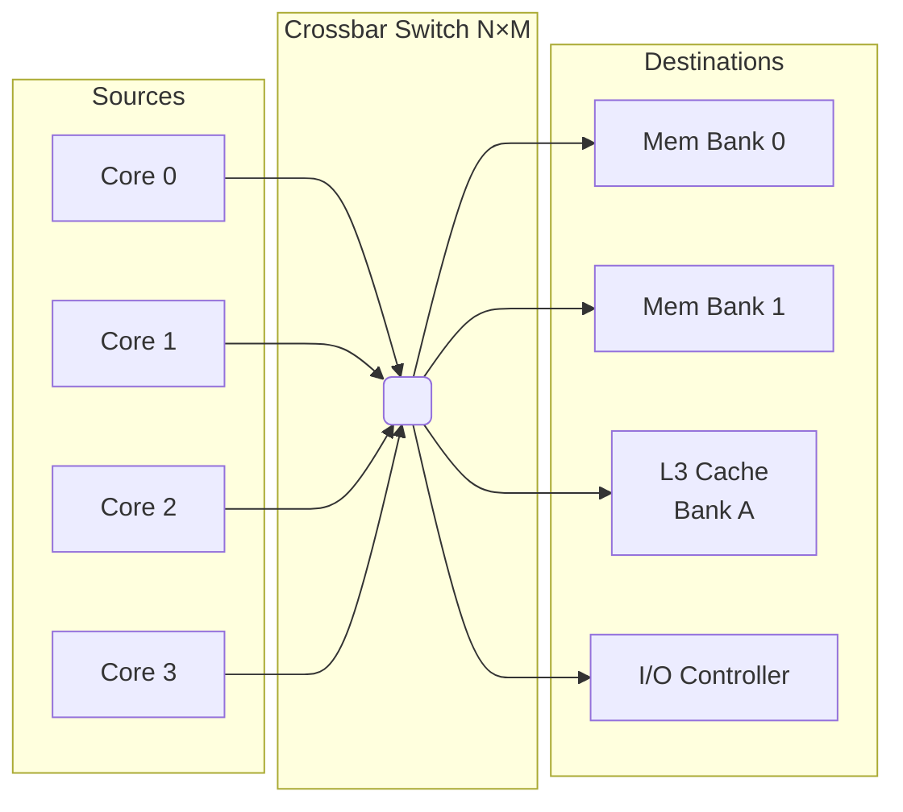
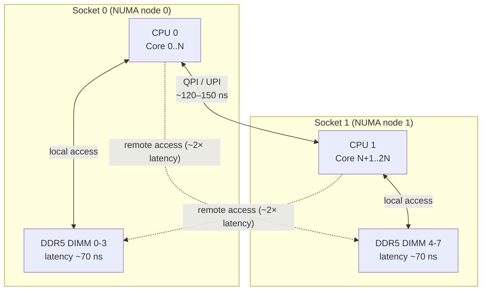
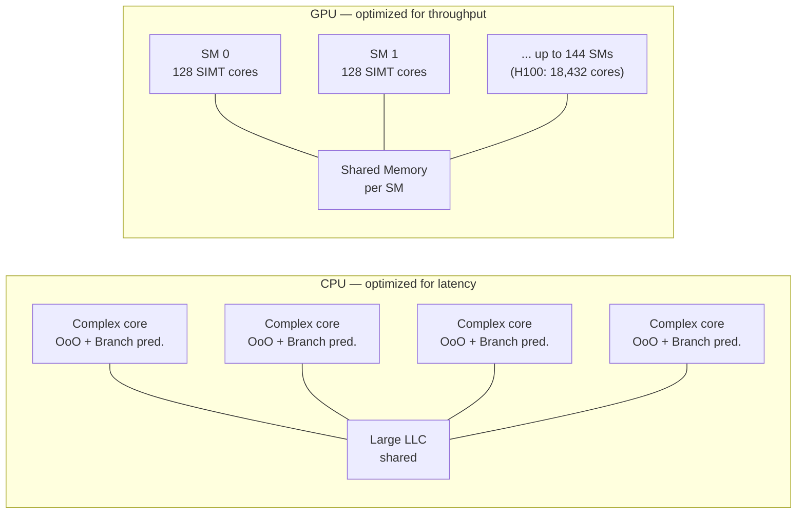
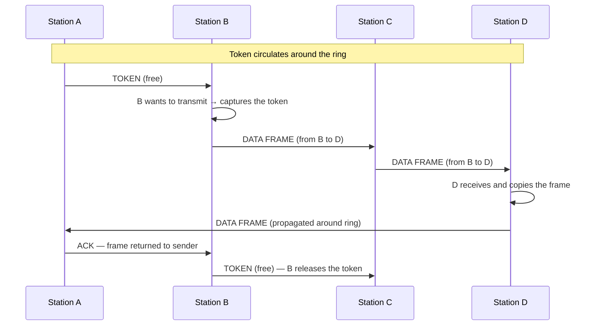

---
tags:
  - università/datacenter-design-and-operation
  - compute
  - cpu
  - gpu
  - npu
  - numa
  - sustainability
  - ocp
data: 2026-04-24
lezione: "Compute Architecture: CPU, GPU and NPU"
professore: "Antonio Cisternino"
---
# Compute Architecture: CPU, GPU and NPU

The previous lecture introduced compute as the third pillar of the datacenter, starting from the evolution of Moore's Law and the need to replicate computational units in response to the physical limits of a single core. This lecture digs into the internal architecture of modern processors — CPU, GPU and NPU — analyzing the design choices that determine their performance. It also introduces the energy sustainability context that constrains and shapes these choices at the infrastructure level.

---

## Datacenter Energy Sustainability

### The 2025 Annual Industry Report

One of the opening topics of the lecture concerns the environmental footprint of datacenters. The industry publishes annual reports measuring global energy consumption, carbon footprint and water resource usage. The 2025 data confirms a worrying trend: datacenter electricity consumption is growing exponentially, driven primarily by the spread of generative AI, which requires ever-larger GPU clusters for model training and inference.

Energy consumption must be analyzed along two distinct axes. The first is the cost of electricity itself, which directly affects the economic sustainability of operations. The second is the **carbon footprint**: a datacenter powered by renewable sources may consume the same kWh as one powered by coal, yet have a radically different climate impact. Large cloud providers communicate their carbon neutrality goals, but the relevant metric is not gross consumption but the **carbon intensity** of the electricity purchased, which varies enormously depending on geographic zone and time of day.

> [!note] Power Usage Effectiveness (PUE)
>
> **PUE** (Power Usage Effectiveness) is the ratio between the total energy consumed by the datacenter and the energy absorbed by IT equipment alone. A PUE of 1.0 is the ideal value (all energy goes to servers); modern datacenters typically sit around 1.2–1.4. Less efficient datacenters exceed 2.0, meaning that for every watt of computing, more than a watt is wasted in overhead (primarily cooling).

### Water Evaporation and WUE

An emerging theme in the 2025 reports concerns water consumption. Evaporative cooling tower systems — the most widespread in large datacenters — dissipate heat through **water evaporation**: heat is transferred to water, which evaporates into the atmosphere carrying away the thermal energy. This process is electrically efficient (low power draw from the tower) but has a real water cost: a large datacenter can consume millions of liters of water per day.

The corresponding metric is **WUE** (Water Usage Effectiveness), the water analogue of PUE: liters of water consumed per kWh of IT energy delivered. The 2025 reports note that, as more efficient liquid cooling systems (direct liquid cooling on chips) become widespread, WUE is improving in new datacenters, but the installed base remains predominantly evaporative. The trend is toward balancing PUE and WUE: optimizing only the electrical cost of cooling can mean shifting the cost onto water.

> [!tip] Sustainability as a design constraint
>
> Large datacenter operators are incorporating PUE, WUE and carbon intensity among site selection and facility design criteria — not as optional requirements but as contractual constraints towards enterprise customers who have their own sustainability targets (scope 3 emissions).

---

## Modern CPU Architecture

### The Cache Hierarchy

To understand the internal architecture of a modern CPU, the starting point is the **memory hierarchy**. Accessing main RAM has latencies on the order of 60–100 ns — an eternity for a processor that completes operations every nanosecond. The solution is a cascade of on-chip caches, each slower but larger than the previous:

| Level | Typical latency | Typical size | Sharing |
|---|---|---|---|
| Register | < 1 cycle | a few bytes | private to core |
| L1 (data + instructions) | ~4 cycles | 32–64 KB | private to core |
| L2 | ~12 cycles | 256 KB – 1 MB | private to core |
| L3 (LLC) | ~40 cycles | 8–256 MB | shared across cores |
| RAM | ~200 cycles | GB–TB | shared across sockets |

The L3 is shared and represents the main point of contention between cores: any core that accesses data not in L1/L2 must traverse the intra-chip interconnect to reach L3 or main memory.

### The Crossbar: Intra-Chip Interconnect

The interconnect problem between cores becomes critical when scaling to tens or hundreds of cores on the same die. The simplest approach — a **shared bus** — does not scale: only one master can transmit at a time, and with many cores the bus immediately becomes a bottleneck.

The solution adopted in modern server CPUs is the **crossbar** (or *crossbar switch*): a matrix interconnect that allows simultaneous and independent communications between any source–destination pair. Conceptually, it is like a telephone switchboard: multiple calls can be routed simultaneously as long as they do not share either the source or the destination.

*Fig. — An N×M crossbar schematic: each core can simultaneously communicate with any destination without contention, provided the active pairs are disjoint.*

The crossbar provides **full bisection bandwidth**: with N sources and M destinations, the crossbar has N×M crosspoints, each a small switch that is activated or not. Complexity grows as O(N×M), which becomes very expensive in silicon area for large N and M. For this reason, modern chip designers often use intermediate variants — 2D meshes, ring buses, hierarchical fabrics — that offer a trade-off between performance and area.

> [!example] AMD Infinity Fabric
>
> AMD EPYC uses the **Infinity Fabric** as the main interconnect between the dies (chiplets) that make up the processor. Within each chiplet the fabric has crossbar characteristics; between different chiplets it operates as a high-speed packet network. This allows assembling CPUs with many cores by replicating smaller, more testable dies, reducing production costs.

### Tiles: Silicon Modularity

The concept of a **tile** emerges from the modern trend of building complex processors not from a single monolithic die but by aggregating multiple specialized dies through advanced packaging technologies. Each tile is an autonomous silicon unit — it may contain a group of cores, a portion of the L3 cache, a memory controller, or an I/O interface — designed and manufactured independently, then interconnected to the others via high-speed buses integrated into the package.

Intel uses the term *tile* in its **Meteor Lake** architecture and in **Sapphire Rapids** Xeon processors: the chip is composed of a Compute Tile, a GPU Tile, a SoC Tile, and an I/O Tile, connected via **EMIB** (*Embedded Multi-die Interconnect Bridge*) or **Foveros** (3D stacking). AMD uses the equivalent term *chiplet* for the dies that make up EPYC processors.

> [!tip] Advantages of the tile approach
>
> Each tile can be manufactured on the technology node best suited to its role: the Compute Tile on the most advanced node (where cost per transistor is minimized), the I/O Tile on a mature, economical node (where robustness matters more than density). A manufacturing defect affects a single tile rather than the entire die, improving **yield** — the percentage of functional chips from total production — and reducing the average processor cost.

### Hyperthreading and Simultaneous Multithreading

**Hyperthreading** (HT) is Intel's commercial name for the architectural mechanism known as **SMT** (*Simultaneous Multithreading*). The problem it solves is core idle time: the internal execution units — ALUs, floating-point units, load/store units — often sit idle when a thread stalls on a cache miss or an instruction dependency.

Hyperthreading works around this waste by duplicating lightweight architectural resources — the **register file** (the registers visible to software) and the **program counter** — while keeping the physical execution units shared. The result is that the operating system sees **two logical cores** per physical core and can schedule two independent threads: when the first stalls, the core executes instructions from the second, reducing overall idle time. The actual benefit depends on the workload: memory-bound workloads benefit most; compute-dense, cache-friendly workloads see limited gains because both threads compete for the same execution units.

> [!warning] Hyperthreading and side-channel vulnerabilities
>
> The sharing of physical resources between two threads — L1 cache, TLB, execution buffers — is also what opens an attack surface for side-channel vulnerabilities such as **Spectre** and **MDS** (*Microarchitectural Data Sampling*). In these attacks, a malicious thread observes timing variations in shared resources to infer data from the victim thread. Some high-security configurations disable HT entirely to eliminate this attack surface.

---

## NUMA — Non-Uniform Memory Access

### The Multi-Socket Server Problem

In enterprise servers it is common to install two or four physical CPUs on the same system, sharing a single logical address space. Each socket (physical CPU) has dedicated memory channels it is directly connected to. When a core belonging to socket 0 accesses data residing in the DIMM modules of socket 1, the request must traverse the inter-socket interconnect (Intel QPI/UPI, AMD Infinity Fabric cross-die) — a physically longer path with significantly higher latency than a local access.

*Fig. — Two-socket NUMA architecture: local memory access is approximately 2× faster than accessing the remote socket's memory.*

> [!definition] NUMA — Non-Uniform Memory Access
>
> **NUMA** is a memory architecture in which access latency is not uniform across all processors: each CPU has preferential (low-latency) access to its own local memory, and higher-latency access to the memory of other sockets. The operating system manages NUMA nodes as distinct entities and tries to allocate memory in the node to which the thread that will use it belongs.

### Software Implications

A NUMA-unaware application can suffer significant performance degradation if threads are scheduled on one socket while data resides on the other. The Linux kernel exposes NUMA topologies through the `/sys` filesystem and provides syscalls (`mbind`, `set_mempolicy`) for explicit allocation control. High-performance databases and middleware (PostgreSQL, Redis, DPDK) implement explicit NUMA affinity policies to minimize access latency.

> [!warning] Virtualization and NUMA
>
> Hypervisors must propagate the NUMA topology to VMs to allow the guest OS to optimize accordingly. If a VM is configured with vCPUs and memory that cross a physical NUMA boundary, performance can degrade silently without a clear error signal. Enterprise VM tuners (VMware, Hyper-V) have NUMA spanning functions that must be configured correctly.

---

## CPU vs GPU: Two Computing Philosophies

### Different Design Objectives

The fundamental difference between a CPU and a GPU is not one of quantity but of philosophy: the two architectures respond to diametrically opposed optimization goals.

A **CPU** is designed to minimize the **latency** of individual operations. To achieve this, it integrates very sophisticated mechanisms: out-of-order execution, branch prediction, speculative prefetching, deep pipelines and large private caches. Each core can execute arbitrarily complex code in the shortest possible time, handling instruction dependencies, unpredictable conditional branches and non-sequential memory accesses. The price of this flexibility is size: a CPU core with all its control logic occupies a lot of silicon.

A **GPU** is designed to maximize **throughput** on uniform, parallel operations. Individual cores (called *shader processors* or *CUDA cores*) are much simpler — short pipelines, no branch prediction, minimal cache — but thousands of them are integrated on the same die. The execution model is **SIMT** (*Single Instruction Multiple Threads*): a single instruction stream is executed simultaneously by hundreds of threads operating on different data.

*Fig. — Architectural comparison: the CPU dedicates most of its silicon to control logic (caches, predictors, OoO scheduler), while the GPU dedicates it to arithmetic execution units running in parallel.*

### Vector Computations and SIMD

The GPU's strength is vector computation. An operation like the matrix-vector product $\mathbf{y} = \mathbf{A}\mathbf{x}$ requires applying the same operation (dot product) to every row of $\mathbf{A}$: thousands of identical operations on different data, exactly the pattern that the GPU's SIMT model executes optimally.

Modern CPUs also integrate **SIMD** (*Single Instruction Multiple Data*) extensions — AVX-512 on x86 allows processing 16 single-precision floats in parallel with a single instruction — but they remain far from the massive parallelism of a GPU. The difference is one of scale: 16 elements in parallel on a CPU versus tens of thousands on a GPU.

> [!tip] Why AI needs the GPU
>
> Training a neural model consists essentially of millions of matrix multiplications (forward pass + backpropagation). These operations are perfectly suited to the GPU's SIMT model: the mini-batch data is processed in parallel by thousands of cores, and throughput scales nearly linearly with core count. An NVIDIA H100 GPU delivers approximately 2,000 TFLOPS of fp8 operations — roughly 1,000× more than a high-end CPU.

---

## NPU — Neural Processing Unit

### Definition and Motivation

If the GPU is a general-purpose accelerator for parallel computation, the **NPU** (*Neural Processing Unit*) is an accelerator specialized exclusively for neural network operations — in particular low-precision matrix multiplication and activation operations.

> [!definition] NPU — Neural Processing Unit
>
> An **NPU** is an integrated circuit (or an IP block within a SoC) designed specifically to execute neural network inference with maximum energy efficiency. Unlike a GPU, which is flexible but relatively power-hungry, the NPU is optimized for a narrow set of operations executed on low-precision data (INT8, INT4, FP8), achieving performance-per-watt figures far superior to a GPU.

The dominant operation in transformer neural networks is dense matrix multiplication (*GEMM — General Matrix Multiply*). An NPU typically integrates a large array of multiply-accumulate units (**MAC**) organized in a **systolic array** structure: data flows through the MAC grid without returning to central memory after each operation, drastically reducing the memory bandwidth bottleneck.

NPUs are ubiquitous in modern edge devices: the **Neural Engine** in Apple M and A-series chips, Qualcomm's **Hexagon NPU**, and MediaTek's **Neural Processing Engine** are all examples of NPUs integrated in SoCs for smartphones and laptops. In datacenters, chips like the **Google TPU** (Tensor Processing Unit) apply the same philosophy at datacenter scale.

| | CPU | GPU | NPU/TPU |
|---|---|---|---|
| Flexibility | Maximum | High | Low (NN only) |
| Energy efficiency | Low | Medium | Maximum |
| Inference latency | High | Medium | Low |
| Cost | Medium | High | Medium |
| Typical use | Preprocessing, logic | Training, batch inference | Edge/production inference |

### Groq and the LPU

**Groq** is a startup founded by former Google engineers with the goal of building a radically different architecture for language model inference. Their flagship product is the **LPU** (*Language Processing Unit*), designed specifically for low-latency transformer inference.

The main architectural difference from a GPU is **deterministic execution**: a GPU manages thread execution with dynamic hardware schedulers, and performance depends on SM occupancy and memory access patterns. The LPU has a completely static execution model — the Groq compiler schedules every operation at compile time, eliminating all runtime variability and associated overhead. The result is a token generation throughput significantly higher than GPUs for models that fit within its on-chip SRAM.

> [!note] Acquisition by NVIDIA
>
> Groq was acquired by NVIDIA. The acquisition reflects NVIDIA's interest in consolidating its position in the AI inference market, where alternative architectures like the LPU represented a potential competitive alternative for latency-sensitive inference workloads.

---

## OCP — Open Compute Project

### Origins and Philosophy

The **Open Compute Project (OCP)** is a hardware standardization initiative launched by **Meta (Facebook)** in 2011. The original goal was ambitious: to open-source the specifications of datacenter hardware — servers, power supplies, racks, switches — in the same way open-source software had revolutionized application development.

The context that motivated this choice is economic: traditional servers from vendors like Dell, HP and Cisco incorporate high margins and a series of features (status LEDs, LCD panels, complex management logic) that make sense for a generic operator but that in a hyperscaler datacenter — where thousands of servers are centrally monitored — are redundant and costly. Meta designed its own servers by removing everything unnecessary and publishing the specifications.

> [!definition] Open Compute Project
>
> The **OCP** is a non-profit consortium that develops and publishes open hardware specifications for datacenters. Members (Meta, Microsoft, Google, Intel, AMD, and dozens of ODM manufacturers) contribute specifications and can produce compatible hardware, reducing vendor lock-in and driving cost competition. OCP specifications cover servers, racks, networking, storage and power.

### Impact on the Datacenter Ecosystem

OCP's impact has been significant on multiple levels. At the cost level, OCP servers produced by Taiwanese ODMs such as Wiwynn, Quanta and Foxconn typically cost 20–30% less than branded equivalents. At the efficiency level, OCP specifications eliminate unnecessary features and optimize thermal management for high-density environments. At the standardization level, the OCP 19" rack has standardized dimensions that allow mixing components from different vendors.

> [!note] OCP and the traditional datacenter
>
> OCP has not (yet) replaced the traditional server market. Its specifications are adopted almost exclusively by large hyperscalers and operators who can manage hardware directly without intermediate support layers. A company with a small on-premise datacenter will typically prefer servers with direct vendor support and contractual guarantees, where the manufacturer's margin translates into a service.

---

## Token Ring

### The Medium Access Problem

**Token Ring** is a data link layer network protocol (IEEE 802.5) developed by IBM in the 1980s, which solves the shared medium access problem in a radically different way from Ethernet.

In Ethernet (CSMA/CD), every station listens to the channel and transmits when it finds it idle: in case of a collision, both stations stop and retry after a random interval. This approach is simple but non-deterministic: under high load, the number of collisions grows and latency becomes unpredictable.

Token Ring solves this problem with a **token-based medium access control** mechanism: a special frame called a *token* circulates continuously around the ring. Only the station holding the token has the right to transmit. After transmission, the token is released and passes to the next station.

*Source: Wikimedia Commons — Ring topology diagram: each node is connected to the previous and next one, forming a closed path for token circulation.*

*Fig. — Token circulation and frame transmission in Token Ring: the frame traverses the entire ring and returns to the sender, which removes it and releases the token.*

> [!tip] Token Ring advantages over Ethernet
>
> Token Ring guarantees **deterministic access**: in a ring with N stations, each station receives the token at most every N × `max_transmission_time`. This makes it suitable for industrial and real-time contexts where the maximum access latency must be guaranteed. Classic Ethernet, being probabilistic, does not offer this guarantee. The price is complexity: managing the token (monitor election, lost token recovery) requires additional protocols.

Despite its elegant properties, Token Ring was superseded by Ethernet for economic reasons: the simplicity and lower cost of Ethernet hardware, combined with switched Ethernet (which eliminates collisions differently, through dedicated switches), made Token Ring commercially marginal from the 1990s onward. The token concept, however, survives in different contexts: industrial networks like **PROFIBUS** and some automotive networks use similar mechanisms to guarantee deterministic latencies.

---

> [!question] Possible exam questions
>
> - What is the fundamental architectural difference between a CPU and a GPU? Why is the GPU better suited for neural network training?
> - What is an NPU and how does it differ from a GPU for neural model inference?
> - Explain how the intra-chip crossbar works: why is it preferred over a shared bus in CPUs with many cores?
> - What is NUMA? What are the implications for software running on multi-socket servers?
> - What is the Open Compute Project and what problem motivated its creation?
> - How does the token mechanism in Token Ring work? What advantages does it offer over Ethernet CSMA/CD?
> - What do PUE and WUE measure? How do they combine in evaluating the sustainability of a datacenter?
> - What is a tile in the context of modern CPU architecture? What advantages does it offer over a monolithic die in terms of yield and production cost?
> - How does Hyperthreading work? Why does the performance gain depend on the type of workload?
