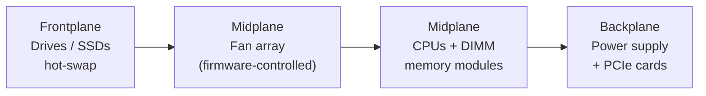
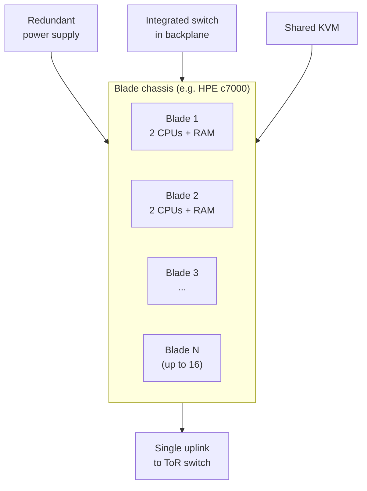
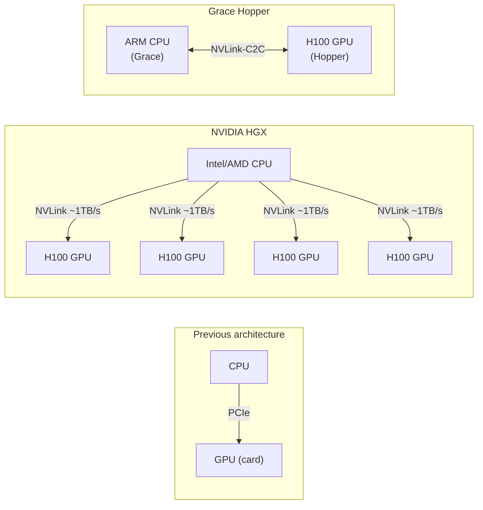
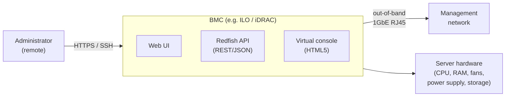
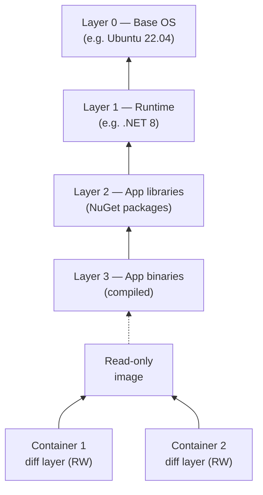
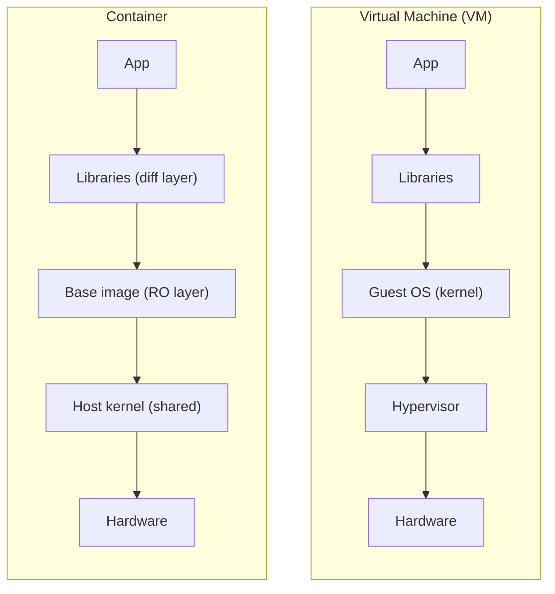
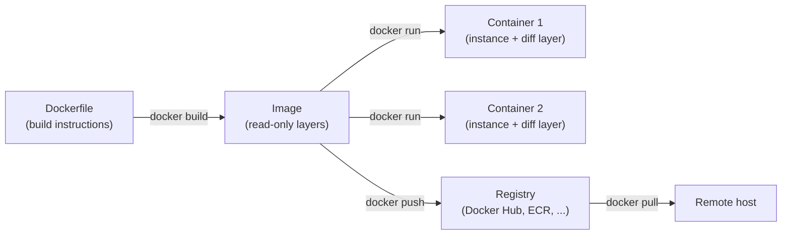

---
tags:
  - university/datacenter-design-and-operation
  - server-architecture
  - blade-server
  - containerization
  - docker
  - BMC
data: 2026-05-01
lecture: "14 - Servers, BMC and Containerization"
professor: "Antonio Cisternino"
---

# Servers, BMC and Containerization

This lecture closes the hardware portion of the course and opens the software portion. It starts from the physical anatomy of rack servers, examines how the growing demand for GPUs has radically transformed compute system architecture, introduces the **Base Management Console (BMC)** as the fundamental tool for remote management, and finally addresses **containerization** — the technology that decouples software from physical hardware and dominates modern application deployment.

---

## Physical Server Architecture

### The Standard 1U Rack Server

The starting point is the most common rack server: a **1U** machine (one rack unit, approximately 4.4 cm tall) optimized for general-purpose compute without GPU accelerators.

The internal layout follows an airflow path from front to back and reflects precise thermal constraints:


*Fig. — Internal layout of a standard 1U server. Air enters from the front drives and is expelled through the backplane.*

The **fans** do not run at a fixed speed: the firmware continuously monitors processor temperatures and increases or reduces speed proportionally to the computational load. An idle server is nearly silent; under full load, the noise is considerable. The typical power supply of a 1U system is around **750 W**.

This type of server supports a maximum of two CPU sockets: interconnecting more than two sockets through the external bus becomes a significant bottleneck for memory latency and bandwidth.

### Four-Way Server: Vertical Scaling

When a large amount of RAM is needed or more CPU sockets are required, servers of **4U or 5U** with a **four-way** architecture (four sockets) are used. The extra space accommodates:

- larger heatsinks for higher-TDP processors,
- more DIMM slots to increase total memory,
- more drive bays,
- more space for PCIe cards.

The four-way server is the right choice when the bottleneck is memory capacity: more sockets mean more memory channels and therefore higher aggregate bandwidth.

### Blade Server: Density and Cabling Simplification

> [!definition] Blade Server
>
> A modular system composed of a **shared chassis** and a set of insertable compute boards ("blades"), each of which is an independent server. The chassis provides redundant power, a network fabric integrated into the backplane, and a shared management console.

The history of the blade server is interesting. At the end of the 1990s, a British company called **RLX Technologies** (later acquired by HP) faced the challenge of increasing compute density. The idea was radical: take a laptop motherboard, flatten it into a blade-shaped card, and insert it into a chassis with rails. Three or four rack units were enough to hold **24 CPU boards**, creating a high-density parallel machine perfect for applications like web crawling for search engines.

The idea was so compelling that it was adopted by all major vendors as a **standard form factor**. The name "blade" refers precisely to the elongated, thin shape of the individual boards.


*Fig. — Blade chassis architecture. The switch in the backplane connects all blades; only a single uplink cable exits the chassis toward the top-of-rack switch.*

The main advantage of blades is not only CPU density but the **drastic simplification of cabling**: 16 compute nodes require a single uplink cable to the top-of-rack switch instead of 16 separate cables. Infrastructure management becomes far simpler.

With an HPE c7000 chassis holding 16 blades, each with 2 CPUs, the result is **32 CPUs in approximately 10U**, yielding roughly **3.2 CPUs/U** compared to **2 CPUs/U** for a traditional rack server.

> [!note] Blades and Ferrari F1
>
> The same HPE BladeSystem c7000 chassis shown during the lecture was the one used by the Ferrari Formula 1 team around 2008 for aerodynamic simulations.


*Fig. — HPE BladeSystem c7000: one of the most widely deployed blade chassis. Blades are inserted from the front; the backplane hosts the switch, power supplies, and KVM module.*

Over time, the growth of network bandwidth made it difficult to scale the chassis backplane, and some vendors attempted to discontinue the format. The market, however, continued to demand blades because the management simplification is a genuine value. Today blades still exist, alongside hybrid form factors.

### Twin Architecture: Density Without Integrated Networking

**SuperMicro** introduced the **Twin architecture** (or TwinPro) about 15 years ago: it superficially resembles a blade, but the chassis shares **only power** — there is no integrated networking in the backplane. Each node has its own independent network card.

The result is even higher density: **4 CPUs/U** with nodes arranged in pairs side by side. Technically it is not a blade, but it is often grouped with them due to the visual similarity.

### GPU Server Evolution

Before the AI era, GPUs were inserted into servers as **standard PCIe cards**, the same as in gaming machines. The solution was mechanically complicated: supplemental power cables, fragile mounting brackets, and PCIe bandwidth as a bottleneck.

With the explosion of machine learning, this architecture could no longer cope. NVIDIA responded with **HGX**: GPUs are no longer insertable cards but are **soldered directly onto the motherboard** like CPUs, interconnected via **NVLink** offering approximately **1 TB/s** bandwidth — orders of magnitude beyond PCIe.

The next step was **Grace Hopper**: a single module integrating an ARM CPU (Grace) with an H100 GPU (Hopper) connected via NVLink-C2C at extremely high bandwidth. The outcome is that today most AI servers are **designed directly by NVIDIA**, with HP, Dell, and others essentially just "putting a box around" the core motherboard.


*Fig. — GPU server architecture evolution: from PCIe card to on-board GPU (HGX) to the integrated Grace Hopper module.*

> [!tip] Form Factor Proliferation as a Signal
>
> In 2005 there were essentially two form factors: 1U and 2U. By 2008, blades had been added. Today there are **dozens** of different form factors. This proliferation is not accidental: it is a signal that general-purpose compute is now inadequate and that **hardware is specializing** for specific workloads. Each workload has its own optimal requirements for GPU density, RAM, storage, and networking.

### The Compromise Philosophy: Server as a Lego Puzzle

Configuring a server is a constrained optimization exercise: you start with a fixed space (the rack unit) and decide how to fill it.

| Workload | Optimal configuration |
|---|---|
| Intensive compute (AI, HPC) | Few drives, many GPUs, large GPU RAM |
| In-memory database | Four-way server, maximum CPU RAM |
| Pure CPU density, CPU-only | Twin or Blade |
| Mid-range GPU compute | 1U server with PCIe RTX cards |

If you decide to install 24 drives in a 2U server, you necessarily give up space for additional PCIe cards or memory slots. Every form factor choice has a cost in another dimension.

> [!tip] Resources for Exploring Form Factors
>
> The **SuperMicro** website has one of the most comprehensive server form factor catalogues available — from a single Twin board to GPU-populated pre-configured racks. It is an excellent reference for understanding the full range of possibilities concretely.

---

## Base Management Console (BMC)

### The Remote Management Problem

A datacenter with hundreds or thousands of servers cannot require a physical operator to be present for every operation. The **Base Management Console (BMC)** solves this problem: it is a board embedded in the server with its own processor, memory, and operating system, completely independent of the main server's state.

> [!definition] BMC — Base Management Console
>
> An autonomous hardware component present in every enterprise server that provides complete remote access to the machine, regardless of the main operating system's state. Each vendor uses a proprietary name: **ILO** (HP), **iDRAC** (Dell); **IPMI** is the underlying standard protocol.

### Capabilities

The BMC exposes a web interface reachable via browser or SSH, through which it is possible to:

- **Monitor** in real time: voltage, temperature, fan speed, power consumption, CPU and memory status,
- **Access the virtual console**: a session that emulates a physical monitor+keyboard connection, including the ability to send Ctrl+Alt+Del (which on a PC keyboard is a separate hardware interrupt, not interceptable by the operating system),
- **Mount ISO images** and install an operating system remotely as if inserting a physical DVD,
- **Configure BIOS and firmware** of the server.


*Fig. — The BMC connects to the management network via a dedicated network port and provides full hardware access regardless of the operating system state.*

### Redfish API: Provisioning Automation

For environments with many servers, manual management via web UI is inefficient. The **Redfish** standard defines a REST API that exposes the entire server data model in JSON, enabling full automation:

```
GET  /redfish/v1/Systems/1                  # system status
POST /redfish/v1/Systems/1/Actions/
     ComputerSystem.Reset                   # server reset
GET  /redfish/v1/Systems/1/Processors       # CPU info
GET  /redfish/v1/Chassis/1/Thermal          # temperatures and fans
```

Through Redfish it is possible to perform **zero-touch provisioning**: a script can format a server, mount an ISO image, start the installation, and configure the system — all without any operator physically present.

### Management Network Security

> [!warning] The Management Network Is Equivalent to Physical Access
>
> Anyone with access to the management network can reformat any server, reboot it, modify its firmware, or extract credentials. It is a **catastrophic** attack vector if exposed.

For this reason, the management network always follows one of these models:

- **Physically separate network** from the production network (out-of-band),
- **Dedicated VLAN** with access controlled by firewall/ACL,
- Access exclusively via **VPN** with strong authentication.

The BMC port is typically a single 1 GbE RJ45 port separate from the data ports. Its separation is an architectural requirement, not an option.

---

## Containerization

### The Problem: Software-Hardware Coupling

The physical datacenter — servers, network, storage, power, cooling — is the infrastructure. **Services** live on top of it. The classic problem is that a service tied to a specific physical server stops every time that server needs maintenance. To build highly available services, it is necessary to **decouple software from the underlying hardware**.

Virtualization (virtual machines) solves this problem but at a cost: each VM emulates complete hardware, has its own kernel, and consumes significant resources. **Containers** offer a different trade-off: isolation without emulation.

### CGroups: The Kernel Primitive

The technical foundation of Linux containers is a kernel feature called **CGroups** (Control Groups), originally developed by Google.

> [!definition] CGroups — Control Groups
>
> A Linux kernel feature that introduces **namespace scoping** for operating system resources. Instead of globally exposing all processes, file systems, network sockets, and devices, the kernel can restrict a process's visibility to a subset of resources belonging to the same group.

The reasoning is straightforward. Normally, when a process asks the kernel "give me the list of running processes," it receives the full list of all system processes. With CGroups, the kernel responds with the list of only the processes in the same container group.

The same logic applies to:
- **filesystem**: each container sees only its own directory tree,
- **networking**: each container has its own virtual network interface,
- **PID**: process IDs are local to the container (the init process inside a container has PID 1),
- **CPU/memory resources**: quotas allocatable per container.

> [!note] Why Google Invented CGroups
>
> Google needed to isolate each search query: if a user found a way to crash the engine through a malicious query, it should not bring down the global service. VMs were too expensive for this use case (one per query). CGroups made it possible to create a container for each search almost instantaneously, discard it at the end, and guarantee that nothing could "escape" from that query. Today every Google search runs in an isolated container.

### Differential File System: The Foundation of Images

The second fundamental component is the **differential file system** (or overlay filesystem). The concept is analogous to virtual disk differentials already seen in the storage section:


*Fig. — The differential file system allows multiple containers to share the same read-only layers. Only the modifications specific to each container are written in the top differential layer.*

Ten instances of the same container share a single copy of the common layers on disk. Only the differences generated at runtime — log files, written data, modified configurations — occupy additional space per instance.

> [!definition] Container (formal definition)
>
> A container is a **set of processes** to which the Linux kernel provides a restricted and isolated view of system resources, through CGroups for namespace isolation and a differential filesystem for filesystem isolation. It does not include its own kernel: it shares the host kernel.

### Container vs Virtual Machine

> [!warning] Container ≠ Virtual Machine
>
> A container shares the host kernel. A VM has its own separate kernel. This difference is critical for security: **side-channel attacks** (Spectre, Meltdown, and variants) that exploit shared CPU microarchitecture state are possible between containers on the same host, while they are much harder between VMs. A container provides logical isolation, not hardware isolation.

Because containers share the kernel, it is possible to run a **Debian container on a RedHat host**: the kernel is the same (Linux), and the difference between distributions lies essentially in the filesystem layout and the versions of dynamic libraries. When a container process executes, the loader looks for libraries in the container's filesystem (Debian), not the host's.

This works because the **Linux kernel API is extraordinarily stable**: syscalls do not change between versions. The risk only exists if a container requires features from a kernel much newer than the host's.


*Fig. — Structural difference between VM and container. The VM carries its own kernel; the container shares the host's.*

### Docker: The Most Widely Used Container Platform

**Docker** is not the only container runtime (Podman, containerd, and LXC also exist), but it is the most popular and has defined the industry conventions. The central file is the **Dockerfile**: a declarative sequence of instructions for building an image.

### Multi-Stage Build: The Common Practice

An important feature of modern Dockerfiles is the **multi-stage build**: multiple intermediate images are used to build the application, and only the final result is copied into the production image.

```
# Stage 1: build image (with compilers and SDK)
FROM mcr.microsoft.com/dotnet/sdk:8.0 AS build
WORKDIR /src
COPY src/ src/
RUN dotnet restore
COPY . .
RUN dotnet build

# Stage 2: compile and publish
FROM build AS publish
RUN dotnet publish -o /app/publish

# Stage 3: final image (runtime only, no compilers)
FROM mcr.microsoft.com/dotnet/aspnet:8.0 AS final
WORKDIR /app
COPY --from=publish /app/publish .
EXPOSE 8080
ENTRYPOINT ["dotnet", "app.dll"]
```

The advantage of this approach is twofold:
- **Security**: the final image contains no compilers, SDKs, or build tools. An attacker who compromises the container finds no C# compiler available,
- **Size**: the final image is much smaller because it does not include the SDK layer.

Key Dockerfile instructions:

| Instruction | Meaning |
|---|---|
| `FROM image AS name` | Base to start from (or alias for multi-stage) |
| `WORKDIR /path` | Sets the working directory inside the container |
| `COPY src dst` | Copies files from the host (or another stage) into the container |
| `RUN cmd` | Executes a command inside the container during build |
| `ENV KEY=VALUE` | Defines an environment variable |
| `EXPOSE port` | Declares the port the container intends to use |
| `ENTRYPOINT ["cmd"]` | Main process launched when the container starts |

### Port Mapping and Networking

Each container has its own virtual network interface. To make a container accessible from the outside, **port mapping** (technically a NAT) is required:

```
docker run -p 9000:8080 myapp   # host port 9000 → container port 8080
```

This allows multiple instances of the same container to run on the same host, each with a different external port, even though all of them internally listen on port 8080. The mechanism is implemented via `iptables` rules in the Linux kernel.

### Docker Compose: Service Composition

A real application is rarely a single process. A typical web app includes: a **reverse proxy** (NGINX or Caddy), an **application server** (the application code), and a **database** (PostgreSQL, SQL Server). Docker Compose allows the entire stack to be defined and started with a single YAML file:

```yaml
services:
  frontend:
    image: nginx:alpine
    ports: ["443:443", "80:80"]
    volumes:
      - ./nginx.conf:/etc/nginx/conf.d/default.conf:ro
    depends_on: [app]
    restart: always
    networks: [app-network]

  app:
    build: .
    environment:
      - ASPNETCORE_ENVIRONMENT=Production
      - ConnectionStrings__Default=Server=db;...
    ports: ["8080:8080"]
    depends_on: [db]
    networks: [app-network]

  db:
    image: mcr.microsoft.com/mssql/server:2022-latest
    environment:
      - SA_PASSWORD=MySecurePass1!
    ports: ["1433:1433"]
    volumes:
      - ./data:/var/opt/mssql
    networks: [app-network]

networks:
  app-network:
    driver: bridge
```

When `docker compose up` is run, Docker starts all defined containers, creates the **bridge** virtual network connecting them, and manages the volumes. Containers reach each other by name (the `app` container can connect to `db` using `db` as the hostname).

> [!tip] Why Container-Native Applications Use Environment Variables
>
> Docker Compose allows configurations to be passed to processes via environment variables rather than configuration files. This has become the standard for modern applications for two reasons: first, it is the natural mechanism for injecting configuration into a container without modifying the image; second, environment variables are intrinsic to the process and not written to disk, so when the process terminates, the configuration (including any credentials) disappears with it.

### Containers in the AI and Software Distribution Context

The phenomenon has expanded far beyond web apps. **NVIDIA** distributes its Linux GPU drivers exclusively as containers: the installation complexity (dependencies, kernel versions, modules) was such that packaging them in a container guarantees identical behavior on any compatible host.

More broadly, containers solve the classic dependency problem: if Node.js is used — which can download thousands of packages during `npm install` — those packages can be frozen in the container at build time. The application always runs with the same versions, even if the host system has updated its libraries.


*Fig. — Container lifecycle: from Dockerfile to image, to running instances, to distribution via a registry.*

> [!abstract] Summary — Containers
>
> A container is a process (or group of processes) to which the Linux kernel provides an isolated view of the system via **CGroups** and a **differential filesystem**. It does not include its own kernel. Compared to a VM it is much lighter (startup in milliseconds, minimal overhead), but shares the kernel with the host, which implies weaker security isolation. Docker is the standard platform for building (`Dockerfile`), distributing (registry), and composing (`docker compose`) containers. The technology was invented by Google to isolate search queries and is today the dominant deployment mechanism in cloud-native software.

---

## Upcoming Topics

The professor announced that the following lectures will cover:

1. **Virtualization** — decoupling software from hardware via hypervisors, motivated by the need for always-on services even during hardware maintenance,
2. **Cloud reference model** — how the physical datacenter becomes the foundation for cloud service models (IaaS, PaaS, SaaS).

> [!question] Potential Exam Questions
>
> - What is the difference between a blade server and a Twin architecture? How do they differ regarding networking?
> - Why has the number of server form factors multiplied in recent years? What does this proliferation indicate?
> - What is the BMC? What operations does it allow remotely? Why must the management network be separated from the production network?
> - What is Redfish? What type of API does it expose?
> - What are CGroups? How do they make containers possible?
> - What is the difference between a container and a virtual machine from a security standpoint?
> - Why is it possible to run a Debian container on a RedHat host?
> - What is a multi-stage build in Docker and what are its advantages?
> - How does port mapping work in Docker? Why is it necessary?
> - What is Docker Compose and in which scenario is it useful?
