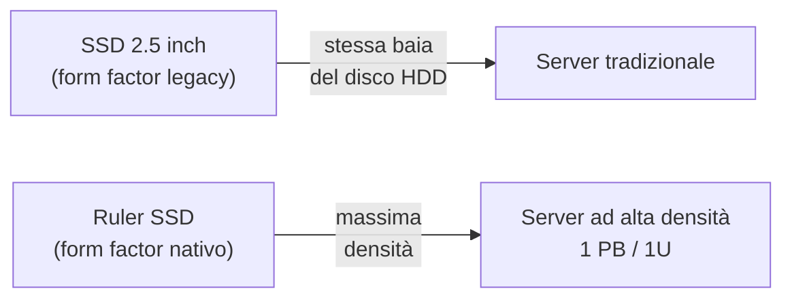
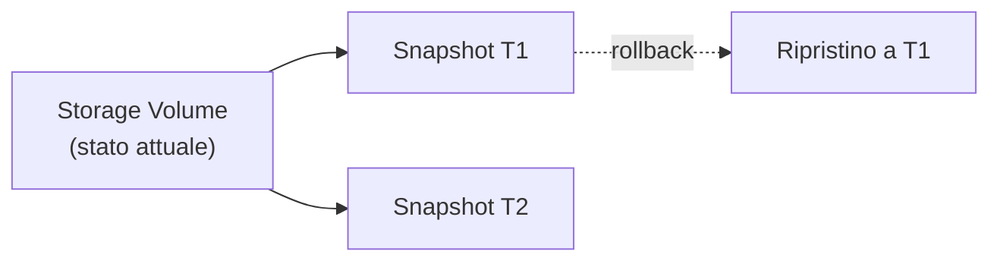
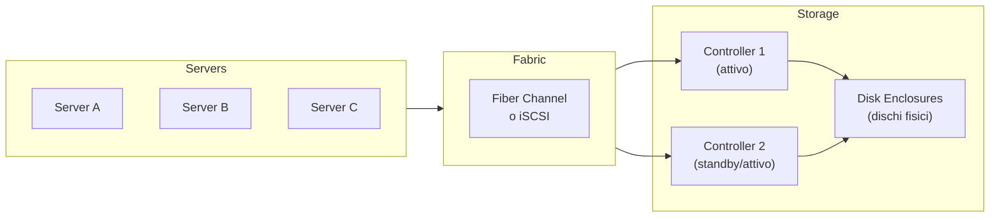
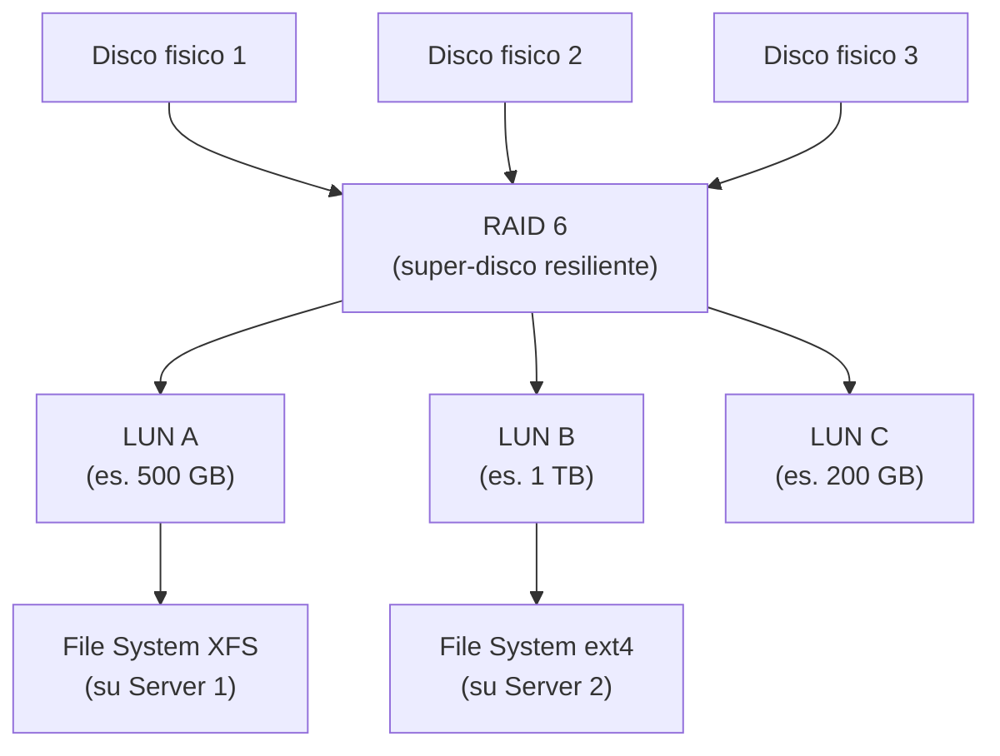
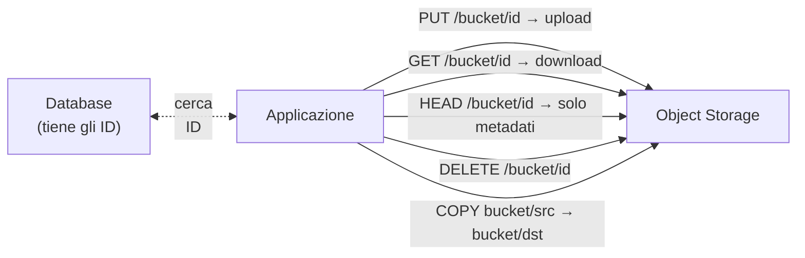
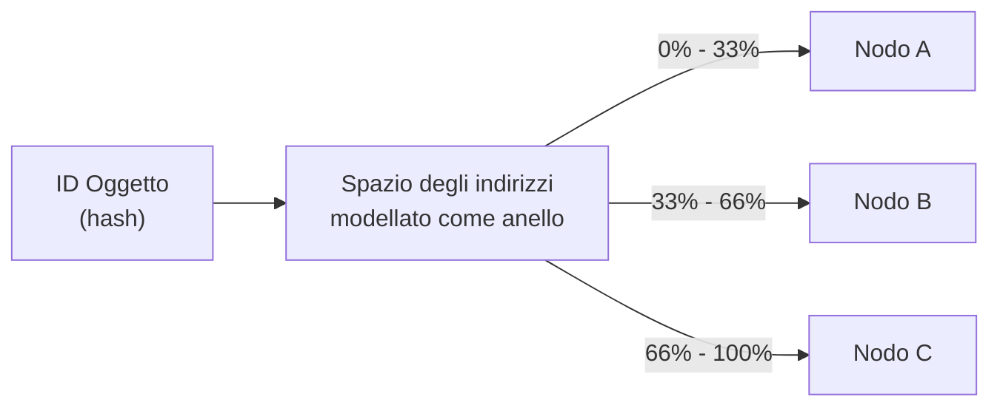
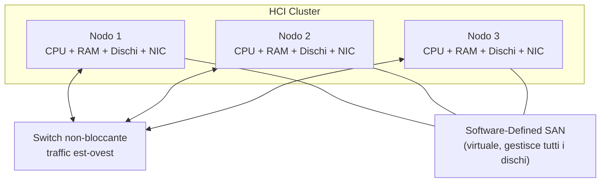
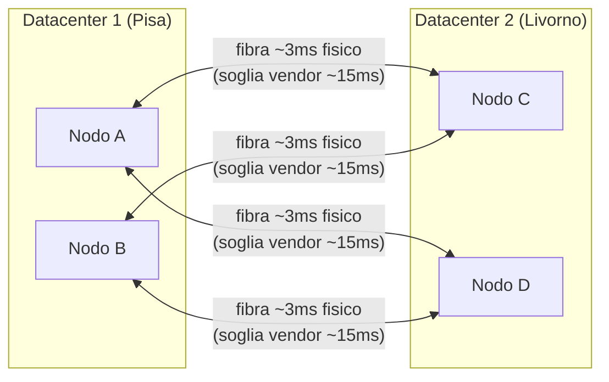
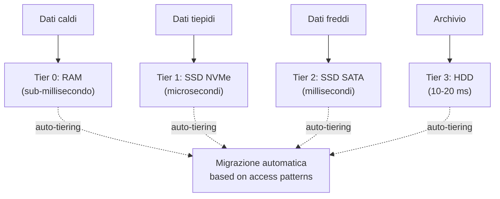

---
tags:
  - università/datacenter-design-and-operation
  - storage
  - SAN
  - NAS
  - object-storage
  - HCI
data: 2026-04-16
lezione: "Storage: Architetture e Servizi"
professore: "Antonio Cisternino"
---

# Storage: Architetture e Servizi

La lezione parte da un'osservazione apparentemente banale: il termine *disk drive* è ormai un anacronismo. I moderni dispositivi di storage non contengono più dischi rotanti, eppure continuiamo a chiamarli così — esattamente come l'icona del floppy disk campeggia ancora sul pulsante "Salva" di moltissime applicazioni. Questo è un caso esemplare del **principio di sostituzione**: quando si evolve una tecnologia, spesso si mantiene il form factor precedente per compatibilità con l'infrastruttura esistente, anche quando il nuovo dispositivo non ne ha più bisogno.

---

## Form Factor e Densità dello Storage

### Il form factor nel datacenter

Nei server enterprise il form factor più diffuso rimane quello da **2.5 pollici**, pensato originariamente per contenere un disco rotante. Oggi in quello stesso alloggiamento si inserisce un SSD, che non ha alcun bisogno di quella forma. Il motivo è semplice: tutta l'infrastruttura dei server — backplane, connettori, cage — è stata progettata attorno a quel formato e sostituirla ha un costo elevato.

> [!tip] Il principio del calesse e dell'auto
>
> Le prime automobili avevano le stesse dimensioni dei calessi a cavallo, non per necessità tecnica, ma perché strade, rimesse e abitudini erano calibrate sul vecchio standard. Lo stesso vale per i disk drive nei server.

### Il form factor Ruler

L'evoluzione verso lo storage solid state ha però spinto a progettare form factor nativi per gli SSD. Il più rilevante è il **Ruler** (*righello*), un dispositivo lungo e stretto che ottimizza:

- **Dissipazione del calore**: il form factor circolare del disco era efficiente per far ruotare un piatto, ma è subottimale per dissipare il calore generato dai chip flash. Il ruler ha superfici laterali maggiori che migliorano il flusso d'aria.
- **Densità**: più ruler possono essere impilati verticalmente in un singolo rack unit. Intel aveva dimostrato già circa otto anni fa un sistema nell'ordine del **petabyte in 1U** usando circa 24 moduli ruler (numero citato a memoria dal professore, da prendere come ordine di grandezza).

*Fig. — Confronto tra form factor legacy (2.5") e Ruler per storage solid state.*

Il ruler può essere installato con o senza dissipatore integrato: la versione con dissipatore (*wing*) è leggermente più spessa ma garantisce prestazioni termiche superiori. La stessa logica è già presente nei laptop sotto forma di moduli **M.2**, che sono essenzialmente dei ruler in miniatura.

*Fonte: Wikimedia Commons — Un modulo SSD M.2: forma allungata identica al principio del Ruler, progettata per massimizzare la densità nei laptop.*

---

## Aggregare lo Storage: RAID e File System

### Riepilogo RAID

Il punto di partenza per costruire uno storage di livello datacenter è **aggregare più dischi fisici** in un'unità logica più capace e resiliente. La tecnologia alla base è il [[RAID]] (*Redundant Array of Inexpensive Disks*).

> [!warning] La perdita di dati è il peccato imperdonabile
>
> In un datacenter la perdita di dati è inaccettabile. Un utente può tollerare un'interruzione del servizio — il dato è irraggiungibile per un po', è fastidioso ma forgivable. Ma se il dato viene distrutto, la responsabilità legale e reputazionale è enorme. Ogni scelta architetturale sullo storage deve partire da questa premessa.

Il **RAID 6** è oggi la scelta più comune in ambito enterprise, perché permette di perdere un disco e **sostituirlo a caldo** (*hot swap*) mentre il sistema continua a operare, ricostruendo i dati in background. Con RAID 5, invece, la perdita di un disco richiede di portare offline lo storage per la ricostruzione.

Il costo dello storage in RAID non è solo il costo dei dischi fisici: include anche lo **spazio ridondante** necessario alla protezione, e tutta l'infrastruttura di gestione.

### File system e RAID

Una domanda ricorrente: aggregare più dischi via RAID richiede un file system speciale? La risposta è no. Su Linux, si può configurare RAID con **LVM** e formattare il volume risultante con un qualsiasi file system standard (ext4, XFS, ecc.). Il RAID opera a livello di blocco, trasparente al file system.

Tuttavia, se il sistema deve gestire **accessi altamente concorrenti** da molti processi paralleli — come in ambito HPC (*High Performance Computing*) — il file system standard diventa il collo di bottiglia. In quel caso si usano **file system paralleli**: GFS, GPFS, Lustre e simili, progettati per supportare concorrenza massiva. Per uso aziendale ordinario (document sharing, email) un file system standard è sufficiente.

---

## Servizi Richiesti allo Storage Moderno

Prima di scegliere un'architettura, è fondamentale capire quali servizi uno storage di livello datacenter deve offrire. Non si tratta solo di esporre blocchi su una rete.

### Deduplicazione

Se invio un allegato da 10 MB a 1000 persone nella stessa organizzazione, uno storage intelligente non conserva 1000 copie identiche: ne mantiene **una sola**, registrando solo i riferimenti. La deduplicazione riduce drasticamente lo spazio occupato, perché gli utenti tendono a duplicare i file molto più di quanto si pensi.

### Compressione

La compressione non serve solo a risparmiare spazio: i dati compressi sono più piccoli, quindi il trasferimento da disco a memoria richiede **meno I/O**. Anche con i moderni SSD veloci, la compressione migliora il throughput, con un piccolo overhead CPU per la decompressione. Il trade-off è quasi sempre favorevole alla compressione.

### Sicurezza

Uno storage enterprise deve offrire:
- **Encryption at rest**: i dati sono cifrati quando scritti sul disco, ma decifrati in memoria durante l'uso.
- **ACL** (*Access Control List*): controllo di accesso a livello di volume o file.
- **Secure erase**: quando un file viene cancellato, i blocchi vengono effettivamente sovrascritti per impedire recupero non autorizzato.

### Snapshot

Uno **snapshot** è una fotografia dello stato di un volume in un preciso istante. Se qualcosa va storto — un aggiornamento software rovinato, un ransomware, un errore umano — si può ripristinare il volume a quel punto esatto. Nei sistemi enterprise questa operazione avviene senza interrompere il servizio (tecnica copy-on-write).

*Fig. — Meccanismo di snapshot: il volume può essere ripristinato a qualsiasi stato precedente catturato.*

Tutti questi servizi — deduplicazione, compressione, sicurezza, snapshot, e altri — rendono la gestione dello storage complessa. Per questo ha senso **centralizzare** lo storage, svincolarlo dai singoli server, e affidarlo a un sistema specializzato che li offra in modo uniforme a tutta l'infrastruttura.

---

## Storage Area Network (SAN)

### Architettura

La **SAN** (*Storage Area Network*) è l'architettura di storage più diffusa nei datacenter enterprise. L'idea è separare fisicamente lo storage dai server di calcolo e collegarli tramite una rete dedicata ad alte prestazioni.

*Fig. — Architettura SAN: i server accedono allo storage tramite fabric dedicato verso controller ridondanti.*

*Fonte: Wikimedia Commons — Esempio di architettura SAN con server, switch Fiber Channel e array di storage.*

I componenti chiave sono:

- **Fabric**: rete dedicata allo storage. Il protocollo tradizionale è **Fiber Channel** (FC), che trasporta blocchi di dati su fibra ottica. In alternativa si usa **iSCSI**, che incapsula il protocollo SCSI su Ethernet.
- **HBA** (*Host Bus Adapter*): scheda nel server che annuncia al sistema operativo un disco locale, anche se fisicamente quel disco si trova nello storage remoto. Per il SO è trasparente.
- **Controller**: il cervello dello storage. Riceve le richieste di blocchi dai server, gestisce la mappatura sui dischi fisici e restituisce i dati. Viene tipicamente duplicato (active/active o active/passive) per resistenza ai guasti.
- **Disk Enclosure**: lo chassis fisico che contiene i dischi, collegato ai controller.

### LUN — Logical Unit Number

Lo storage fisico viene "affettato" in unità logiche chiamate **LUN** (*Logical Unit Number*), o *logical units*. Una LUN è un disco virtuale: ha una certa dimensione, è mappata su blocchi fisici interni allo storage (sopra uno strato RAID), e viene esposta ai server come se fosse un disco locale.

*Fig. — Gerarchia SAN: dai dischi fisici al RAID, dalle LUN ai file system sui server.*

### Vantaggi e limitazioni della SAN

Il vantaggio principale della SAN è la **centralizzazione**: un team dedicato gestisce tutto lo storage per l'intera infrastruttura, con backup, ridondanza e servizi avanzati in un solo punto.

> [!warning] Il collo di bottiglia con SSD ad alte prestazioni
>
> La SAN classica nasce con i dischi meccanici, dove la rete Fiber Channel era sempre più veloce del disco. Con gli SSD NVMe moderni, capaci di 16 GB/s ciascuno, l'equazione si capovolge: se si aggregano decine di SSD nello stesso storage, la banda del fabric diventa il collo di bottiglia. Questo ha spinto allo sviluppo di architetture alternative.

---

## NAS — Network Attached Storage

### Differenze fondamentali da SAN

La **NAS** (*Network Attached Storage*) adotta un approccio diverso: invece di esporre blocchi grezzi ai server, espone direttamente **file e directory** tramite protocolli di file system remoti.

| Caratteristica | SAN | NAS |
|---|---|---|
| Livello di astrazione | Blocchi (raw) | File e directory |
| Protocollo | Fiber Channel, iSCSI | NFS, SMB |
| Rete | Fabric dedicato | Rete Ethernet standard |
| File system | Gestito dal server | Gestito dallo storage |
| Memory mapping | Supportato | Non supportato |
| Latenza | Bassa | Media |

I due protocolli NAS più comuni sono:
- **NFS** (*Network File System*): standard Unix/Linux, ancora dominante nei datacenter.
- **SMB** (*Server Message Block*): nato in ambito Microsoft, oggi disponibile su tutte le piattaforme.

### Memory Mapping e perché conta

> [!definition] Memory Mapping
>
> Il *memory mapping* è una tecnica che sfrutta il meccanismo di paginazione della CPU: un file viene "mappato" nello spazio di indirizzamento del processo, e gli accessi ai byte del file vengono gestiti direttamente dalla MMU hardware come page fault. Il kernel carica automaticamente i blocchi necessari dal disco in memoria.

Il memory mapping è oggi dominante — Windows e Linux lo usano entrambi come base del loro I/O su file. È enormemente più efficiente rispetto alle API tradizionali (`open`/`seek`/`read`) per accessi casuali, perché sfrutta il supporto hardware anziché chiamate di sistema ripetute.

Ebbene, **il memory mapping funziona su SAN, ma non su NAS**. Un file system remoto NAS non supporta `mmap()`. Questo rende la SAN l'unica scelta per applicazioni che richiedono accesso casuale ad alta performance (database, algoritmi analitici, virtual machine).

### Quando usare NAS

La NAS è adatta per:
- **Backup** e archiviazione
- **Document store** (analoga a OneDrive/SharePoint interno)
- Qualsiasi workload con accesso prevalentemente sequenziale

> [!warning] Complessità di integrazione degli ACL
>
> Il principale problema pratico della NAS è integrare il modello di sicurezza: gli ACL del file system remoto devono essere mappati sull'identità degli utenti del dominio (LDAP, Active Directory). Quando coesistono più directory, la sincronizzazione diventa complicata e spesso genera limitazioni nel modello di permessi.

---

## Object Storage

### L'origine: il problema di Amazon

Circa quindici anni fa Amazon si trovò di fronte a un problema che SAN e NAS non sapevano risolvere: fornire storage a scala di **exabyte** a milioni di utenti e applicazioni contemporaneamente. Con le architetture tradizionali, aggiungere sempre più SAN e NAS aveva costi di gestione insostenibili e bottleneck di scalabilità.

La soluzione fu un nuovo paradigma: l'**object storage**.

### Cos'è l'object storage

L'object storage è un sistema di storage **distribuito**, orientato alle applicazioni, che espone i dati tramite una semplice API **HTTP/REST**. Ogni dato è un *oggetto* identificato da un **ID univoco** e opzionalmente corredato da metadati.

> [!definition] Object Storage
>
> Sistema di storage che rappresenta i dati come oggetti immutabili, identificati da un ID univoco, accessibili tramite REST API (tipicamente S3-compatible). Non esiste una gerarchia di cartelle, solo contenitori piatti chiamati **bucket**.

Non esistono cartelle annidate: solo **bucket** (contenitori flat) che raggruppano oggetti. L'organizzazione logica è responsabilità dell'applicazione, che tipicamente usa un database per tenere traccia degli ID degli oggetti.

*Fig. — Le operazioni fondamentali dell'object storage S3: PUT, GET, HEAD, DELETE, COPY.*

### L'API S3

L'API standard de facto dell'object storage è **S3** (*Simple Storage Service*), proposta e implementata da Amazon. Le operazioni core sono:

- **PUT Object**: carica un oggetto in un bucket.
- **GET Object**: scarica l'intero oggetto. Non esiste `seek`: non si può richiedere un range di byte interno senza scaricare tutto.
- **DELETE Object**: elimina un oggetto.
- **HEAD Object**: recupera solo i metadati senza scaricare il payload — utile prima di decidere se scaricare un oggetto da gigabyte.
- **COPY Object**: copia un oggetto internamente allo storage, operazione che il sistema esegue in modo ottimizzato senza richiedere download + upload.

### Scalabilità tramite Consistent Hashing

Il problema di un object storage distribuito su molti nodi è: dato un ID oggetto, su quale server si trova? Mantenere un registro centralizzato (database) creerebbe un bottleneck immediato.

La soluzione adottata da implementazioni come **RIAK** (citato dal professore come esempio di object storage distribuito; l'attribuzione a GitHub non è verificata — RIAK è un key-value store distribuito di Basho Technologies usato da vari provider, ma non risulta essere il backend principale di GitHub) è il **consistent hashing**:

*Fig. — Consistent hashing: l'ID dell'oggetto viene mappato deterministicamente su un nodo senza consultare un registro centralizzato.*

Lo spazio degli indirizzi viene trattato come un anello circolare e diviso tra i nodi. Aggiungere un nodo richiede un algoritmo di **ribilanciamento**, ma una volta completato ogni client può determinare il nodo corretto direttamente dall'ID, senza interrogare alcun registry.

### Vantaggi, limiti e casi d'uso

| Caratteristica | Object Storage | NAS | SAN |
|---|---|---|---|
| Accesso | HTTP REST | NFS / SMB | Fiber Channel / iSCSI |
| Struttura | Flat (bucket) | Gerarchica (cartelle) | Blocchi grezzi |
| Scalabilità | Massiva (exabyte+) | Media | Media |
| Latenza | Alta (HTTP overhead) | Media | Bassa |
| Memory Mapping | No | No | Sì |
| Casi d'uso | Backup, media, IoT, ML datasets | Document share | VM disk, database |

L'object storage è la soluzione ideale per **healthcare** (archiviazione di scan e immagini diagnostiche: si scrive una volta, si rilegge integralmente, non si modifica), **media storage**, **backup**, e qualsiasi scenario con **scrittura massiva e lettura infrequente**.

> [!note] File system sull'object storage
>
> È possibile costruire un file system sopra l'object storage: gli oggetti diventano blocchi, e la struttura gerarchica viene implementata a livello applicativo. Questo permette di scalare fino a miliardi di oggetti, ma le prestazioni non sono paragonabili a un file system nativo su SAN.

---

## HCI — Hyperconverged Infrastructure

### Il problema con SAN e SSD ad alte prestazioni

Circa tredici anni fa, mentre la virtualizzazione VMware era al suo apice, si osservò un problema strutturale nella SAN classica: la topologia *a stella* (tutti i server connessi a un controller centrale) soffre di un collo di bottiglia fisico nel controller stesso. Con un solo head node da 8 porte da 400 Gbit/s, si ottengono al massimo 3.2 Tbit/s aggregati — e quando decine di SSD veloci sono dall'altro lato, quella capacità finisce subito.

La startup **Nutanix** propose un approccio radicalmente diverso.

### Il paradigma HCI

L'idea centrale è **trasporre la matrice**: invece di separare compute, storage e network in strati orizzonali, si costruiscono **nodi** che contengono un po' di tutto. Ogni nodo è un server standard con CPU, RAM, dischi locali e schede di rete. Il software li fa sembrare una SAN.

*Fig. — HCI: i nodi collaborano via switch per formare una SAN virtuale software-defined.*

Il **software HCI** (Nutanix AOS, VMware vSAN, Microsoft Storage Spaces Direct) aggrega i dischi di tutti i nodi in un unico pool storage, esponendolo come una SAN tradizionale alle virtual machine.

### Prestazioni: il vantaggio della locality

Il guadagno principale dell'HCI è la **data locality**: il software può collocare il disco virtuale di una VM sullo stesso nodo fisico che esegue quella VM. L'accesso va sul bus PCIe locale — non attraversa nessuna rete — il che consente di sfruttare tutto il bandwidth di un NVMe locale (decine di GB/s).

> [!tip] Traffico est-ovest
>
> In HCI la replica dei dati genera traffico *est-ovest* (nodo → nodo), non *nord-sud* (server → controller centrale). Grazie agli switch non-bloccanti dei datacenter moderni, questo traffico non interferisce tra nodi diversi — se N1 replica su N2, N3 non è disturbato.

### Resilienza: replication factor

Se un nodo cade, i dati che vi risiedevano non devono andare persi. La soluzione è il **replication factor**:

- Con RF=2: ogni blocco scritto localmente viene replicato anche su un secondo nodo.
- Con RF=3: replicato su altri due nodi (perdita di qualsiasi nodo è tollerata).

La scrittura funziona così: il nodo locale scrive sul proprio disco, poi trasmette i dati al nodo remoto. Quando il nodo remoto conferma che i dati sono in memoria (non necessariamente scritti su disco), il writer viene sbloccato. Questo permette latenze di scrittura competitive con la SAN.

> [!warning] Costi di licensing
>
> Tecnicamente, HCI è l'architettura con le migliori prestazioni assolute oggi disponibile. Purtroppo, i vendor (Nutanix, VMware vSAN, Microsoft Storage Spaces Direct) applicano licenze molto costose, che spesso fanno riemergere la convenienza delle SAN tradizionali per molti contesti.

### Scale-up vs Scale-out

> [!definition] Scale-up e Scale-out
>
> **Scale-up** (*vertical scaling*): si aumenta la capacità di un singolo nodo aggiungendo risorse (più RAM, più dischi). Limite fisico: prima o poi il nodo non può crescere ulteriormente.
>
> **Scale-out** (*horizontal scaling*): si aggiungono nodi al cluster. La capacità aggregata aumenta linearmente. HCI è un'architettura scale-out.

Con HCI, aggiungere un nodo al cluster aumenta simultaneamente compute, storage e network bandwidth in modo proporzionale e senza colli di bottiglia centrali.

---

## Servizi Avanzati della SAN Enterprise

Sia che si usi una SAN fisica tradizionale o un HCI software-defined, il set di servizi gestiti è simile. Vediamoli nel dettaglio.

### Thin Provisioning

Quando si alloca una LUN da 2 TB a un utente, costui la percepisce come un disco da 2 TB. Ma nella realtà, il sistema può **allocare fisicamente solo una porzione** (es. 200 GB), espandendo lo spazio fisico riservato man mano che il dato cresce.

> [!example] Thin provisioning in pratica
>
> Il prof. Cisternino racconta di un progetto universitario per un database di scan botanici. Stima iniziale: 75 TB. A distanza di dieci anni, usano ancora meno di 10 TB. Grazie al thin provisioning, i ricercatori hanno ricevuto 75 TB logici ma il sistema ha fisicamente allocato solo lo spazio effettivamente usato, risparmiando decine di migliaia di euro in storage.

Il rischio è l'**overcommitment**: se si promettono 4 TB quando se ne hanno 2 fisici e gli utenti li riempiono tutti, il sistema va in crisi. È necessario monitorare l'utilizzo reale e agire prima che lo spazio fisico finisca.

> [!note] Overcommitment reale
>
> Nel cluster HCI dell'Università di Pisa, 725 VM credono di avere 1.5 PB di storage. Fisicamente il cluster ha circa 1 PB. Questo è un esempio reale di thin provisioning e overcommitment in produzione.

### Multipath I/O

Il multipath connette un server allo storage tramite **più percorsi paralleli** (più fibre ottiche, più HBA). I vantaggi sono:

- **Ridondanza**: se un percorso si guasta, il traffico viene automaticamente indirizzato sugli altri.
- **Bandwidth aggregato**: i percorsi possono essere bilanciati per moltiplicare la banda disponibile.

Con gli SSD NVMe moderni da 16 GB/s ciascuno, il multipath è quasi indispensabile: un singolo link da 100 Gbit/s (~12 GB/s) non basta a saturare un solo SSD.

### Zoning e LUN Masking

Questi due meccanismi implementano il **controllo degli accessi** a livello di storage:

- **Zoning**: definito nel fabric (switch Fiber Channel), determina quali server possono "vedere" quali parti dello storage. È una configurazione di rete: questo WWN (World Wide Name, l'identificatore del server) può comunicare con questo target.
- **LUN Masking**: definito nel controller dello storage, determina quale LUN specifica è esposta a quale server. Anche se il server vede lo storage (per via dello zoning), potrebbe vedere solo alcune LUN.

### Snapshot, Clone e Replicazione

**Snapshot**: fotografia point-in-time di una LUN. Implementato tipicamente con copy-on-write: la snapshot è inizialmente vuota e registra solo i blocchi che cambiano dopo la sua creazione, occupando pochissimo spazio inizialmente.

**Clone**: copia completa e indipendente di una LUN. Utile per testare un aggiornamento critico: si clona la LUN di produzione, si esegue l'aggiornamento sul clone, e se tutto funziona si promuove il clone a produzione.

**Replicazione**: copia dei dati verso un secondo sito geografico. Fondamentale per il **disaster recovery**. Esistono due modalità:

- **Sincrona**: ogni scrittura è confermata solo quando è stata scritta su entrambi i siti. Nessuna perdita di dati, ma latenza aggiuntiva = limite di distanza.
- **Asincrona**: le scritture vengono replicate con un certo ritardo. Nessun impatto sulle prestazioni, ma in caso di disastro si perde l'ultima finestra temporale.

### Metro Cluster

Un **metro cluster** estende un cluster attivo-attivo tra **due datacenter geograficamente vicini**. La soglia di circa **300 km / <15 ms** citata dal professore è una linea guida di vendor (Nutanix, VMware vSAN) per i loro algoritmi di clustering sincrono, non un limite fisico: la latenza fisica su fibra a 300 km è ~3 ms round-trip, ma i protocolli applicano threshold più conservativi. Gli algoritmi di clustering non si accorgono che i nodi sono in edifici separati: vedono solo la latenza di rete aggiuntiva, che rimane tollerabile.

*Fig. — Metro cluster: i nodi del cluster sono distribuiti su due datacenter distinti ma vicini geograficamente.*

Oltre i 300 km (es. Milano-Napoli), la latenza supera la soglia tollerabile per i protocolli sincroni. In quel caso si usa la replicazione asincrona: si perde un po' di dati in caso di disastro, ma almeno il sito remoto ha una copia recente.

### Tiering e Caching

**Tiering**: lo storage viene diviso in livelli (*tier*) con caratteristiche diverse. I dati *caldi* (frequentemente acceduti) stanno su SSD, i dati *freddi* (raramente acceduti) su HDD. Il sistema **sposta automaticamente** i dati tra i tier in base ai pattern di accesso (*auto-tiering*).

**Caching**: i dati più caldi possono essere tenuti in **RAM** del controller, eliminando completamente la latenza di accesso al disco per le operazioni ripetute.

*Fig. — Gerarchia di tiering: i dati migrano automaticamente verso il tier più adatto in base alla frequenza di accesso.*

### Quality of Service (QoS)

La SAN può assegnare **priorità diverse** a LUN diverse: in un momento di contesa, i blocchi della LUN A (database critico) vengono serviti prima di quelli della LUN B (backup). Questo evita che un processo I/O-intensivo (es. backup notturno) degradi le prestazioni di un servizio di produzione.

### Sicurezza

- **Encryption at rest**: i dati vengono cifrati prima di essere scritti sui dischi. In memoria operativa sono in chiaro. Se un disco viene fisicamente sottratto, i dati sono illeggibili.
- **Secure erase**: quando uno spazio viene liberato, i blocchi vengono sovrascritti per prevenire recupero non autorizzato di dati residui.
- **Access control e autenticazione**: integrazione con sistemi di identità per controllare chi può accedere a quali LUN.
- **Data integrity**: checksum dei blocchi per rilevare corruzioni silenti.

---

## Scelta dell'Architettura: non esiste "la migliore"

> [!warning] Non esiste un'architettura universalmente superiore
>
> SAN, NAS, Object Storage e HCI hanno ciascuno casi d'uso ottimali. La scelta dipende sempre dal bilanciamento di performance, scalabilità, costo e natura del workload.

| Scenario | Architettura consigliata |
|---|---|
| VM in produzione con accessi random intensi | SAN o HCI |
| Molte VM, budget limitato, buone prestazioni | HCI (se licensing sostenibile) |
| Document store, backup, OneDrive aziendale | NAS |
| Archiviazione massiva (scan medici, dataset ML) | Object Storage (S3) |
| Big data, HPC, accessi paralleli | File system parallelo (Lustre, GPFS) |
| Disaster recovery geograficamente distribuito | Replicazione asincrona SAN |
| Ridondanza metropolitana (stesso provider) | Metro cluster |

> [!example] Dimensionamento: calcolo back-of-envelope
>
> Scenario: ingestire 1 TB/s di dati da sensori.
> - Un server con NIC da 100 Gbit/s = ~12 GB/s di banda in ingresso.
> - Per sostenere 1 TB/s: 1000/12 ≈ 84 server.
> - Con 100 server si ha margine sufficiente.
> - I server processano localmente e inviano il risultato alla SAN centrale.
> Non è necessario che tutta la banda in ingresso passi per la SAN — si fa buffer locale e trasferimento asincrono.

---

## Caso Reale: il Cloud Privato dell'Università di Pisa

Il prof. Cisternino ha mostrato l'infrastruttura reale del datacenter UniPi come esempio concreto:

- **2 cluster HCI ibridi** (acquisiti ~2019): storage con tier SSD + HDD, con auto-tiering automatico.
- **1 cluster HCI all-flash** (più recente): tutto solid state, CPU più moderne, densità circa tre volte superiore rispetto ai cluster del 2019 — dimostrazione dell'andamento del costo dei dischi nel tempo.
- **Server NAS per cold storage**: circa 1 petabyte di hard disk meccanici per archiviazione a lungo termine.
- **Nessun Fiber Channel**: l'infrastruttura usa iSCSI su Ethernet ad alte prestazioni.

> [!example] Overcommitment in produzione
>
> Il cluster HCI gestisce **725 virtual machine**. Le VM credono collettivamente di avere **1.5 petabyte** di storage. Il cluster ha fisicamente circa **1 petabyte**. Il thin provisioning permette questo overcommitment perché la maggior parte delle VM non usa tutto lo spazio che le è stato assegnato.

---

> [!question] Possibili domande d'esame
>
> - Qual è la differenza fondamentale tra SAN e NAS? In quale caso useresti ciascuna?
> - Perché il memory mapping non è supportato su NAS? Qual è la conseguenza pratica?
> - Cosa si intende per thin provisioning? Quali sono i rischi?
> - Cos'è una LUN e come si colloca nella gerarchia SAN?
> - Come funziona l'object storage? Perché scala meglio di SAN e NAS?
> - Cos'è il consistent hashing? Come viene usato in RIAK?
> - Cosa distingue HCI da una SAN tradizionale? Quali sono vantaggi e svantaggi attuali?
> - Qual è la differenza tra scale-up e scale-out? HCI è quale dei due?
> - Cos'è un metro cluster? Qual è il limite di distanza e perché?
> - Descrivi i servizi principali che una SAN enterprise deve offrire.
