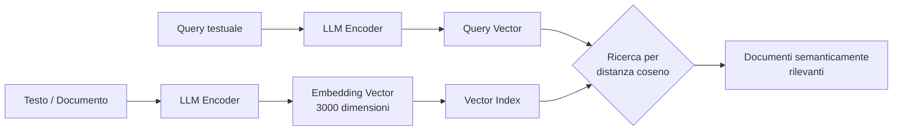
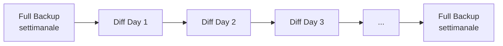
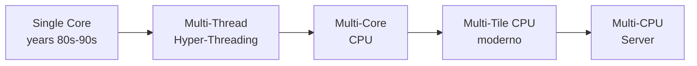

---
tags:
  - università/datacenter-design-and-operation
  - storage
  - vector-database
  - backup
  - compute
  - snapshot
data: 2026-04-17
lezione: "Storage avanzato e introduzione al compute"
professore: "Antonio Cisternino"
---
# Storage Avanzato e Introduzione al Compute

La lezione riprende dal tema dello storage per completare alcuni concetti rimasti aperti, introduce due nuove forme di storage emergenti legate all'AI, approfondisce le metriche di performance e resilienza dei dati, e apre il terzo grande pilastro del datacenter: il compute.

---

## Specializzazione hardware per workload

Prima del 2008 circa, il paradigma dominante era quello del server generico: si comprava hardware e poi si decideva quale workload farci girare. Questo approccio era sostenibile finché tutti i carichi di lavoro erano sufficientemente simili. A partire dall'era della virtualizzazione, e poi con il big data (intorno al 2013), ci si è resi conto che **le prestazioni reali si ottengono solo specializzando l'hardware al workload**.

Questa evoluzione vale per tutti i livelli dello stack: a livello di storage, i vendor iniziarono a differenziare le proprie offerte per workload specifici — per il big data, ad esempio, i dischi SATA da alta capacità diventarono preferibili ai dischi SAS più veloci ma costosi, perché quel workload privilegia il rapporto capacità/prezzo rispetto alla latenza unitaria. A livello di CPU, i produttori oggi offrono configurazioni diverse dello stesso die, ottimizzate per high-frequency single-thread oppure per il throughput parallelo massivo.

Questa specializzazione si riflette anche nelle architetture di storage: SAN, NAS, HCI e object storage non sono intercambiabili, ma rispondono in modo ottimale a classi di workload ben definite.

---

## Nuove forme di storage

### Stream-based storage

Il progetto **Nautilus** di Dell/EMC introdusse il concetto di *stream-based storage*: uno strato di persistenza pensato specificamente per flussi di dati derivanti da sensori IoT. Un flusso IoT è strutturalmente diverso da uno stream video: non trasmette fotogrammi sequenziali di un'unica sorgente, ma campiona nel tempo lo **stato del mondo** (temperatura, pressione, corrente) da molti dispositivi in parallelo.

L'interesse computazionale di questo modello non è necessariamente l'intera serie storica, ma spesso la misura corrente o aggregazioni su finestre temporali. Il problema del *store-and-forward* tradizionale è che produce copie multiple dello stesso dato lungo la catena di nodi, senza una politica chiara di ownership. Nautilus risolveva questo garantendo che, in qualsiasi istante, ogni informazione esistesse **in un'unica copia** nella rete di storage, con un modello computazionale coerente sopra i flussi.

Il progetto non ha avuto un grande successo commerciale, ma l'ecosistema open source ha risolto il problema in modo più pragmatico con framework come **Apache Kafka** e simili. Il principio di base — *store, process, forward* applicato a dati di serie temporali — è comunque centrale nella gestione di workload IoT e di edge computing.

### Vector database

I **vector database** sono la forma di storage più rilevante emersa negli ultimi anni, diretta conseguenza della diffusione dell'AI generativa.

La ricerca testuale era già storicamente basata su vettori: dal modello *bag of words* degli anni '90, ogni documento veniva rappresentato come un vettore nello spazio delle parole, con una dimensione per ogni termine del vocabolario. La similarità tra un documento e una query si calcolava con la **distanza coseno** tra i rispettivi vettori — base del funzionamento di motori di ricerca come Google. Il limite fondamentale di questo approccio è la sua natura *sintattica*: la parola "Python" produce lo stesso vettore indipendentemente dal contesto, rendendo impossibile distinguere il serpente dal linguaggio di programmazione.

> [!definition] Embedding
>
> Un **embedding** è un vettore denso ad alta dimensionalità prodotto dalla prima parte di una rete neurale di un Large Language Model. A differenza dei vettori bag-of-words (sparsi, binari), un embedding cattura la **rappresentazione semantica** del testo nel suo contesto. L'embedding di "Python" sarà diverso a seconda che la parola appaia in un contesto di programmazione o zoologico, perché la rete ha appreso la semantica durante il training.

OpenAI produce embedding di **3000 dimensioni** con valori floating-point, uno spazio semantico molto ricco rispetto ai vettori classici. Un risultato scientifico notevole (Cornell University) ha dimostrato che esiste una **funzione di conversione** tra gli embedding di modelli diversi: modelli addestrati su dati differenti tendono a produrre rappresentazioni dello stesso significato che sono mappabili l'una nell'altra, a meno di una trasformazione lineare. Questo suggerisce l'esistenza di uno spazio latente universale del significato, e giustifica l'investimento in architetture basate su embedding indipendentemente dal modello specifico.

Un **vector database** combina la flessibilità dei database NoSQL (collezioni di oggetti eterogenei, senza schema rigido) con la capacità di indicizzare gli oggetti tramite i loro embedding e di rispondere a query semantiche trovando i vettori più vicini nello spazio ad alta dimensionalità.

*Fig. — Pipeline di un vector database: i documenti vengono indicizzati tramite embedding, e le query vengono risolte per similarità semantica nello spazio vettoriale.*

> [!tip] RAG — Retrieval Augmented Generation
>
> La tecnica **RAG** (Retrieval Augmented Generation) è l'architettura dominante dei sistemi AI moderni. Quando l'utente invia un prompt, il sistema esegue prima una ricerca semantica su un database di documenti (tramite vector search), inserisce i testi più rilevanti nel contesto della richiesta, e solo poi il modello genera la risposta. Questo riduce drasticamente le *allucinazioni*: secondo lo Stanford AI Index, anche i modelli migliori producono informazioni false nel 30% dei casi in modalità pura; il RAG riduce questo problema ancorando la risposta a dati verificati.

L'impatto sul datacenter è concreto: i sistemi di storage moderni (come VAS DATA) stanno integrando capacità di esecuzione di reti neurali per computare embedding direttamente durante l'ingestion dei dati. Lo storage non è più solo un luogo dove i dati risiedono passivamente, ma una componente attiva capace di costruire rappresentazioni semantiche e rispondere a ricerche intelligenti.

---

## Misure di performance dello storage: IOPS

**Latenza** e **bandwidth** sono metriche insufficienti da sole per caratterizzare le prestazioni di uno storage, perché dipendono fortemente dal pattern di accesso.

> [!definition] IOPS
>
> **IOPS** (Input/Output Operations Per Second) è il numero di operazioni di I/O che uno storage riesce a completare in un secondo. Non è una metrica assoluta: va sempre accompagnata dal tipo di accesso (sequenziale o casuale), dalla dimensione del blocco, dal numero di thread concorrenti e dal numero di code.

Il motivo della necessità di IOPS come metrica separata è intuitivo: uno storage ottimizzato per leggere file video in streaming (dove l'obiettivo è saturare la pipeline con dati contigui, con prefetching aggressivo) si comporta in modo radicalmente diverso da uno storage che serve il paging della memoria (accessi casuali a blocchi di 4 KB). Se si misura solo la bandwidth in quest'ultimo caso, si ottiene un valore molto inferiore rispetto a una lettura sequenziale dello stesso storage.

> [!tip] Analogia del supermercato
>
> - **IOPS** = clienti serviti al secondo
> - **Latenza** = tempo di servizio per cliente
> - **Code** = clienti in attesa
> - **Parallelismo** = numero di casse aperte
>
> L'analogia spiega perché con una singola coda e un singolo cassiere, il throughput è esattamente `1 / latenza`. Con più casse in parallelo, il throughput scala.

La relazione matematica fondamentale con una singola coda è:

$$\text{IOPS} \approx \frac{1}{\text{latenza}}$$

Con più code o thread, il throughput scala proporzionalmente. Esempi pratici:
- HDD meccanico (latenza ~5 ms): ~200 IOPS per coda
- NVMe SSD (latenza ~20 μs): ~50.000 IOPS per coda

Lo storage è intrinsecamente asincrono: la CPU emette un'operazione di lettura e viene sbloccata mentre l'operazione è in corso, permettendo l'interleaving di più richieste da un singolo thread tramite code multiple.

---

## Perdita di dati e resilienza

### Tipologie di data loss

Concentrarsi solo sul guasto hardware come causa di perdita dati è un errore comune. Le cause reali includono:

| Causa | Descrizione | Contromisura |
|---|---|---|
| Guasto hardware | Disco rotto, controller danneggiato | RAID, replica |
| Corruzione software | Bug che sovrascrive dati validi | Checksum, backup |
| Errore umano | File cancellati per sbaglio, misconfiguration | Backup, snapshot |
| Ransomware/crittografia | Dati cifrati da malware | Backup offline, snapshot |
| Perdita di chiavi crittografiche | BitLocker/encryption senza backup della chiave | Key management |

L'**errore umano** è statisticamente la prima causa di perdita dati, largamente superiore a hardware e software combinati. Un sistema di storage con replica perfetta non protegge da una cancellazione accidentale: la cancellazione viene immediatamente replicata.

### Replica vs Backup

La **replica** è una copia sincrona o asincrona dei dati su un secondo storage, pensata per garantire disponibilità in caso di guasto hardware. Il suo limite strutturale è che è una copia *live* dello stato corrente: qualsiasi corruzione o cancellazione si propaga istantaneamente alla replica. La replica non protegge da errori logici.

Il **backup** è invece una copia *puntuale nel tempo* dei dati, conservata separatamente. Permette di ripristinare lo stato precedente a un evento di corruzione o cancellazione. Il backup è indispensabile indipendentemente dal livello di ridondanza dello storage.

### Data breach secondo il GDPR

> [!warning] Il GDPR definisce tre pilastri della sicurezza dei dati
>
> Un **data breach** non è solo la perdita di confidenzialità (dati pubblicati o rubati). Il GDPR riconosce tre forme di violazione, ciascuna con implicazioni legali:
> 1. **Confidenzialità**: dati accessibili a soggetti non autorizzati
> 2. **Disponibilità**: storage offline, dati irraggiungibili quando necessari
> 3. **Integrità**: dati corrotti o modificati in modo non autorizzato
>
> Un sistema che non può garantire la disponibilità dei propri dati è soggetto a sanzioni esattamente come uno che subisce una fuga di informazioni.

### RPO e RTO

> [!definition] RPO — Recovery Point Objective
>
> L'**RPO** definisce la quantità massima di dati che si è disposti a perdere in caso di failure, misurata in tempo. Un backup giornaliero implica un RPO di 24 ore: in caso di incidente, si possono perdere fino a un giorno di modifiche. L'RPO non può essere zero: se un software malevolo corrompe i dati attivamente, anche i backup frequenti conterranno dati corrotti a partire da un certo punto.

> [!definition] RTO — Recovery Time Objective
>
> L'**RTO** definisce il tempo massimo tollerabile di downtime durante un ripristino. Ripristinare un petabyte di dati può richiedere più di un giorno anche con la migliore infrastruttura: questo deve essere considerato nella progettazione del backup (più grande è il backup unitario, maggiore è l'RTO).

La scelta dell'RPO è un bilanciamento economico: backup più frequenti costano di più (bandwidth, storage, CPU). In certi casi il costo della compliance supera il costo della sanzione, e l'organizzazione sceglie consapevolmente di accettare un RPO meno stringente. Questa è una decisione di risk management, non tecnica.

L'RPO e l'RTO si combinano con le politiche di replica: se si dispone già di replica sincrona, il rischio residuo si riduce agli scenari in cui entrambe le copie vengono perse simultaneamente, rendendo l'RPO rilevante solo per quegli scenari estremi.

### Backup differenziale

Per gestire il costo del backup su dataset di grandi dimensioni, si usa il **backup differenziale**:

*Fig. — Schema di backup differenziale: un full backup periodico viene completato da backup incrementali giornalieri che conservano solo i blocchi modificati.*

Il ripristino richiede di applicare in sequenza il full backup e tutti i diff successivi fino al punto desiderato, aumentando la complessità ma riducendo drasticamente il volume di dati trasferiti.

---

## Snapshot dello storage

Lo snapshot è una delle tecniche più potenti e versatili della gestione dello storage.

### Meccanismo Copy-on-Write

> [!definition] Snapshot (Copy-on-Write)
>
> Uno **snapshot** è una fotografia logica dello stato di un volume in un istante preciso, ottenuta senza copiare fisicamente i dati. Il meccanismo utilizzato è il **Copy-on-Write (COW)**: al momento dello snapshot, si registra semplicemente la mappatura corrente tra blocchi logici e blocchi fisici. Quando una scrittura successiva modifica un blocco, il nuovo dato viene scritto in un blocco fisico *nuovo*, mentre il blocco originale rimane intatto e viene referenziato dallo snapshot.

Il funzionamento passo per passo:

1. Volume logico: blocchi A, B, C, D → mappati ai blocchi fisici A, B, C, D
2. Si crea snapshot S1: S1 registra la mappatura A→A, B→B, C→C, D→D
3. Si modifica il blocco B: il nuovo contenuto viene scritto in B' (blocco fisico nuovo)
4. Il volume corrente punta a A, B', C, D; lo snapshot S1 punta ancora a A, B, C, D

In questo modo, con un minimo overhead di metadati, si mantengono due versioni logiche del volume condividendo i blocchi non modificati.

> [!tip] Casi d'uso pratici
>
> - **Aggiornamenti sicuri**: prima di un upgrade del database, si prende uno snapshot. Se l'upgrade fallisce, si ripristina istantaneamente lo stato precedente.
> - **Backup senza interruzione**: invece di fermare il database per fare il backup, si prende uno snapshot (operazione istantanea), e il sistema di backup copia i dati dallo snapshot mentre il database continua a operare.
> - **Test di aggiornamenti**: si crea un disco differenziale, si prova il cambiamento, e si scarta il diff se non soddisfacente.

> [!warning] Effetto sullo spazio disponibile
>
> Con snapshot attivi, la dimensione logica del volume non riflette più lo spazio fisico effettivamente disponibile: i blocchi referenziati dagli snapshot non possono essere considerati liberi. Se il 75% dei blocchi viene riscrit­to dopo uno snapshot, la dimensione fisica effettiva diventa 1,75 volte quella logica. Per questo motivo è sconsigliato mantenere snapshot per periodi prolungati, e lo storage può esaurirsi inaspettatamente.

### Esempi in sistemi reali

Il concetto di snapshot permea già i sistemi operativi comuni senza che gli utenti ne siano consapevoli:

- **Windows Shadow Volume Copy (VSS)**: permette il backup di file in uso (normalmente bloccati da Windows) creando uno snapshot del volume, copiando dall'istantanea mentre l'applicazione continua a scrivere sulla copia live
- **macOS Time Machine**: utilizza lo spazio libero del disco per mantenere snapshot automatici del filesystem, permettendo di "tornare nel tempo" a versioni precedenti dei file

### Backup application-consistent vs crash-consistent

Un backup può essere:

- **Crash-consistent**: si fotografa lo storage così com'è in un dato momento, senza sincronizzarsi con le applicazioni in esecuzione. I dati in memoria non ancora scritti su disco vengono persi. Al ripristino, il sistema si comporta come se avesse subito un crash improvviso, e le applicazioni applicano i loro meccanismi di recovery (WAL, journal). Accettabile per la maggior parte dei workload.
- **Application-consistent**: l'applicazione (tipicamente un DBMS) viene notificata prima del backup, esegue un flush dei dati in-memory su disco, segnala allo storage di procedere con l'acquisizione in uno stato consistente. Garantisce una copia perfettamente integra al costo di maggiore complessità di coordinamento.

La strategia più comune è combinare i due approcci: crash-consistent per le virtual machine generiche, application-consistent solo per i database.

---

## Introduzione al Compute

La lezione introduce brevemente il terzo pilastro del datacenter, che verrà approfondito nelle lezioni successive.

### La fine della scalabilità lineare del singolo core

Per quasi 40 anni, la **Legge di Moore** ha garantito che il numero di transistor raddoppiasse ogni due anni, producendo una progressione esponenziale delle prestazioni computazionali. Questo ha reso possibile l'AI moderna: i modelli neurali erano teoricamente noti dal 1989 (backpropagation), ma la quantità di dati e potenza computazionale necessaria per addestrarli su scala era semplicemente indisponibile.

A un certo punto, la scalabilità del singolo core si è stabilizzata: aumentare la frequenza di clock oltre certi limiti fisici diventa impossibile. La risposta dell'industria è stata la **replicazione**:

*Fig. — Evoluzione della gerarchia di replicazione computazionale: ogni livello replica l'unità precedente per aumentare il parallelismo gestendo la complessità a un livello di astrazione più alto.*

Il concetto di **tile** è il più recente: un tile è un blocco di core completo (con cache, controller, etc.) che può essere replicato sul die come un componente standard, riducendo la complessità di progettazione del fabric on-chip e permettendo configurazioni diverse dello stesso prodotto semplicemente variando il numero di tile.

### Economia della produzione di chip

La produzione di ASIC ha un'economia particolare: il costo fisso di progettazione e realizzazione dei mask è elevatissimo (milioni di dollari), e il software EDA per generare il layout dei transistor a partire dal Verilog costa ~$1M/anno di licenze. Il punto di breakeven si aggira sui 2 milioni di pezzi venduti. Questo spiega perché solo pochissimi attori possono permettersi di produrre chip custom, e perché i chip general-purpose come le CPU rimangono dominanti nonostante l'efficienza degli ASIC dedicati.

> [!note] Prossime lezioni
>
> Il ciclo sul compute continuerà con: architetture CPU e GPU in dettaglio, sistemi blade vs rack, formato OCP (Open Compute Project), layout delle schede madri server, e il perché queste scelte architetturali esistono.

---

> [!question] Possibili domande d'esame
>
> - Qual è la differenza tra replica e backup? Perché la replica da sola non è sufficiente?
> - Cosa si intende per RPO e RTO? Come si combinano nella progettazione di una politica di backup?
> - Come funziona il meccanismo Copy-on-Write degli snapshot? Qual è il principale svantaggio?
> - Cosa sono gli embedding e perché hanno reso necessari i vector database?
> - Cos'è il RAG e come riduce il problema delle allucinazioni nei modelli AI?
> - Perché IOPS è una metrica più significativa di sola bandwidth o latenza per lo storage?
> - Quali sono le tre forme di data breach secondo il GDPR?
> - Qual è la differenza tra backup application-consistent e crash-consistent?
