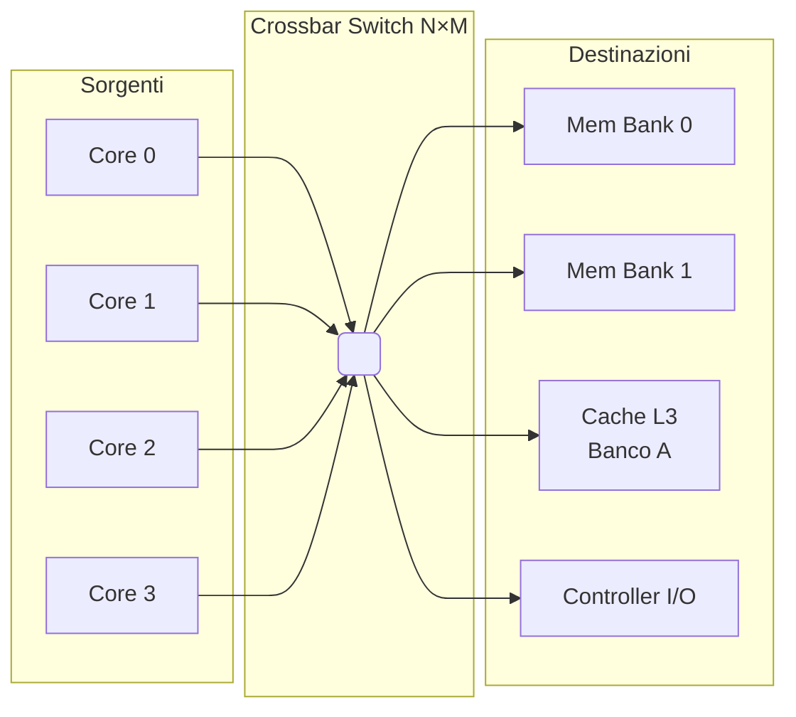
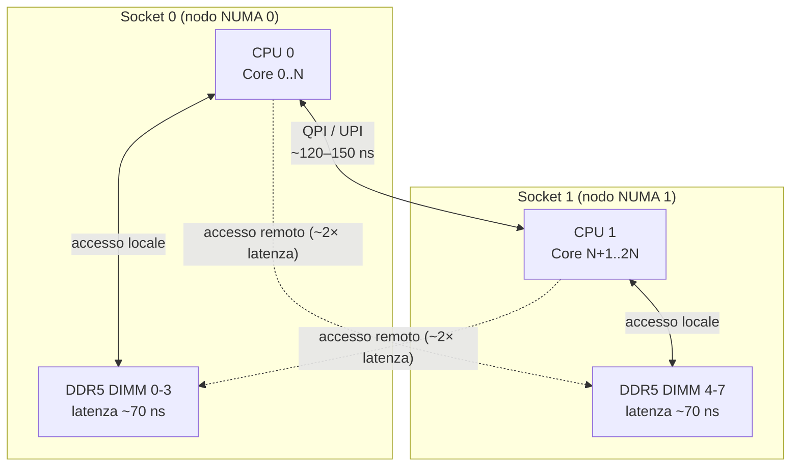
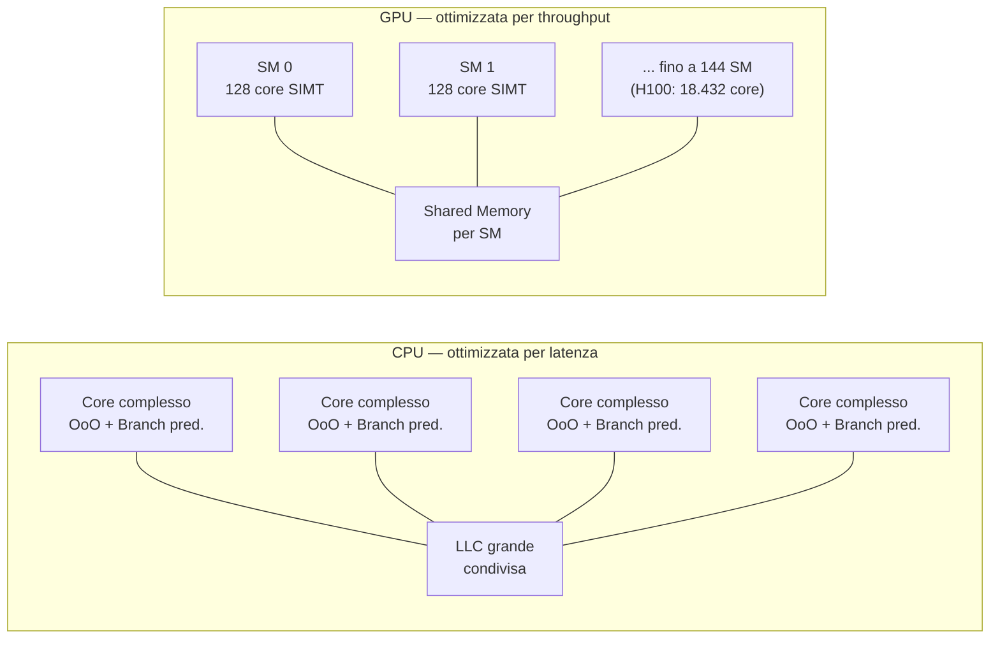
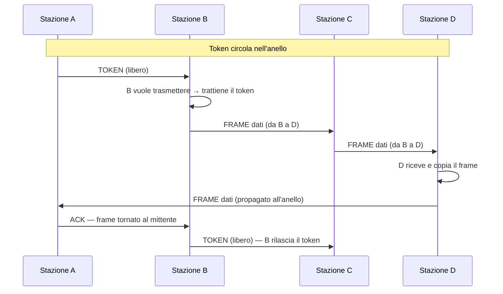

---
tags:
  - università/datacenter-design-and-operation
  - compute
  - cpu
  - gpu
  - npu
  - numa
  - sostenibilità
  - ocp
data: 2026-04-24
lezione: "Architettura Compute: CPU, GPU e NPU"
professore: "Antonio Cisternino"
---
# Architettura Compute: CPU, GPU e NPU

La lezione precedente aveva introdotto il tema del compute come terzo pilastro del datacenter, partendo dall'evoluzione della Legge di Moore e dalla necessità di replicare le unità computazionali in risposta ai limiti fisici del singolo core. In questa lezione si approfondisce l'architettura interna dei processori moderni — CPU, GPU e NPU — analizzando le scelte di progetto che ne determinano le prestazioni. Si introduce anche il contesto di sostenibilità energetica che vincola e orienta queste scelte a livello infrastrutturale.

---

## Sostenibilità Energetica dei Datacenter

### Il Report Annuale di Settore 2025

Uno dei temi di apertura della lezione riguarda il peso ambientale dei datacenter. Il settore pubblica ogni anno report che misurano il consumo energetico globale, l'impronta carbonica e l'utilizzo delle risorse idriche. I dati 2025 confermano un trend preoccupante: il consumo elettrico dei datacenter è in crescita esponenziale, trainato principalmente dalla diffusione dell'AI generativa, che richiede cluster di GPU sempre più grandi per l'addestramento e l'inferenza dei modelli.

Il consumo energetico va analizzato su due fronti distinti. Il primo è il costo dell'elettricità in sé, che incide direttamente sulla sostenibilità economica delle operazioni. Il secondo è l'**impronta carbonica**: un datacenter alimentato da fonti rinnovabili può avere lo stesso consumo in kWh di uno alimentato da carbone, ma un impatto sul clima radicalmente diverso. I grandi cloud provider comunicano i propri obiettivi di carbon neutrality, ma la metrica rilevante non è il consumo lordo bensì il **carbon intensity** dell'energia acquistata, che varia enormemente a seconda della zona geografica e dell'ora del giorno.

> [!note] Power Usage Effectiveness (PUE)
>
> Il **PUE** (Power Usage Effectiveness) è il rapporto tra l'energia totale consumata dal datacenter e quella assorbita dai soli apparati IT. Un PUE di 1,0 è il valore ideale (tutta l'energia va ai server); i datacenter moderni si attestano intorno a 1,2–1,4. I datacenter meno efficienti superano 2,0, il che significa che per ogni watt di computing si spreca più di un watt in overhead (soprattutto raffreddamento).

### Evaporazione dell'Acqua e WUE

Un tema emergente nei report 2025 riguarda il consumo idrico. I sistemi di raffreddamento a torre evaporativa — i più diffusi nei datacenter di grandi dimensioni — dissipano il calore attraverso l'**evaporazione dell'acqua**: il calore viene trasferito all'acqua, che evapora nell'atmosfera portando via l'energia termica. Questo processo è efficiente dal punto di vista energetico (basso consumo elettrico della torre) ma ha un costo idrico reale: un datacenter di grandi dimensioni può consumare milioni di litri d'acqua al giorno.

La metrica corrispondente è il **WUE** (Water Usage Effectiveness), analogo al PUE per l'acqua: litri d'acqua consumati per kWh di energia IT erogata. I report 2025 segnalano che, con il diffondersi di sistemi di raffreddamento a liquido più efficienti (liquid cooling diretto sui chip), il WUE sta migliorando nei nuovi datacenter, ma il parco installato resta prevalentemente a raffreddamento evaporativo. La tendenza è verso un bilanciamento tra PUE e WUE: ottimizzare solo il consumo elettrico del raffreddamento può significare scaricare il costo sull'acqua.

> [!tip] Sostenibilità come vincolo di progetto
>
> I grandi operatori di datacenter stanno incorporando PUE, WUE e carbon intensity tra i criteri di selezione del sito e di progettazione dell'impianto, non come requisiti facoltativi ma come vincoli contrattuali verso i clienti enterprise che hanno propri obiettivi di sostenibilità (scope 3 emissions).

---

## Architettura della CPU Moderna

### La Gerarchia di Cache

Per comprendere l'architettura interna di una CPU moderna, il punto di partenza è la **gerarchia di memoria**. L'accesso alla RAM principale ha latenze dell'ordine dei 60–100 ns — un'eternità per un processore che completa operazioni ogni nanosecondo. La soluzione è una cascata di cache on-chip, ognuna più lenta ma più grande della precedente:

| Livello | Latenza tipica | Dimensione tipica | Condivisione |
|---|---|---|---|
| Registro | < 1 ciclo | pochi byte | privato al core |
| L1 (dati + istruzioni) | ~4 cicli | 32–64 KB | privato al core |
| L2 | ~12 cicli | 256 KB – 1 MB | privato al core |
| L3 (LLC) | ~40 cicli | 8–256 MB | condiviso tra core |
| RAM | ~200 cicli | GB–TB | condivisa tra socket |

La L3 è condivisa e rappresenta il principale punto di contesa tra i core: ogni core che accede a dati non in L1/L2 deve attraversare l'interconnessione intra-chip per raggiungere la L3 o la memoria.

### La Crossbar: Interconnessione Intra-Chip

Il problema dell'interconnessione tra core diventa critico quando si scala a decine o centinaia di core sullo stesso die. L'approccio più semplice — un **bus condiviso** — non scala: solo un master alla volta può trasmettere, e con molti core il bus diventa immediatamente un collo di bottiglia.

La soluzione adottata nelle CPU server moderne è la **crossbar** (o *crossbar switch*): un'interconnessione a matrice che permette comunicazioni simultanee e indipendenti tra qualsiasi coppia sorgente–destinazione. Concettualmente, è come un centralino telefonico: più chiamate possono essere instradata contemporaneamente purché non condividano né la sorgente né la destinazione.

*Fig. — Schema di una crossbar N×M: ogni core può comunicare simultaneamente con qualsiasi destinazione, senza contesa, purché le coppie attive siano disgiunte.*

La crossbar garantisce **banda di bisection completa**: se ci sono N sorgenti e M destinazioni, la crossbar ha N×M incroci, ognuno un piccolo switch che viene attivato o meno. La complessità cresce come O(N×M), il che diventa molto costoso in area di silicio per N e M grandi. Per questo i progettisti di chip moderni spesso usano varianti intermedie — mesh 2D, ring bus, fabric gerarchici — che offrono un compromesso tra prestazioni e area occupata.

> [!example] Infinity Fabric di AMD
>
> AMD EPYC utilizza l'**Infinity Fabric** come interconnessione principale tra i die (chiplet) che compongono il processore. All'interno di ogni chiplet il fabric ha caratteristiche di crossbar; tra chiplet diversi opera come una rete a pacchetti ad alta velocità. Questo permette di assemblare CPU con molti core replicando die più piccoli e collaudabili, riducendo i costi di produzione.

---

## NUMA — Non-Uniform Memory Access

### Il Problema dei Server Multi-Socket

Nei server enterprise è comune installare due o quattro CPU fisiche sullo stesso sistema, condividendo un unico spazio di indirizzamento logico. Ogni socket (CPU fisica) dispone di canali di memoria dedicati a cui è direttamente connesso. Quando un core appartenente al socket 0 accede a un dato che risiede nei moduli DIMM del socket 1, la richiesta deve attraversare l'interconnessione inter-socket (Intel QPI/UPI, AMD Infinity Fabric cross-die) — un percorso fisicamente più lungo e con latenza significativamente maggiore rispetto all'accesso locale.

*Fig. — Architettura NUMA a due socket: l'accesso alla memoria locale è circa 2× più rapido rispetto all'accesso alla memoria del socket remoto.*

> [!definition] NUMA — Non-Uniform Memory Access
>
> **NUMA** è un'architettura di memoria in cui la latenza di accesso non è uniforme per tutti i processori: ogni CPU ha accesso preferenziale (a bassa latenza) alla propria memoria locale, e accesso a latenza maggiore alla memoria degli altri socket. Il sistema operativo gestisce i nodi NUMA come entità distinte e cerca di allocare memoria nel nodo a cui appartiene il thread che la utilizzerà.

### Implicazioni per il Software

Un'applicazione ignara di NUMA può soffrire degradazioni di prestazioni significative se i thread vengono schedulati su un socket mentre i dati risiedono nell'altro. Il kernel Linux espone le topologie NUMA attraverso il filesystem `/sys` e fornisce syscall (`mbind`, `set_mempolicy`) per il controllo esplicito dell'allocazione. Database e middleware ad alte prestazioni (PostgreSQL, Redis, DPDK) implementano politiche di affinità NUMA esplicita per minimizzare la latenza degli accessi.

> [!warning] Virtualizzazione e NUMA
>
> Gli hypervisor devono propagare la topologia NUMA alle VM per permettere al sistema operativo guest di ottimizzare. Se la VM è configurata con vCPU e memoria che attraversano un confine NUMA fisico, le prestazioni possono degradare silenziosamente senza un chiaro segnale di errore. I tuner di VM enterprise (VMware, Hyper-V) hanno funzioni di NUMA spanning che è importante configurare correttamente.

---

## CPU vs GPU: Due Filosofie di Calcolo

### Il Diverso Obiettivo di Progetto

La differenza fondamentale tra una CPU e una GPU non è di quantità ma di filosofia: le due architetture rispondono a obiettivi di ottimizzazione diametralmente opposti.

Una **CPU** è progettata per minimizzare la **latenza** della singola operazione. Per raggiungere questo obiettivo, integra meccanismi molto sofisticati: esecuzione fuori ordine (*out-of-order execution*), predizione dei branch, prefetching speculativo, pipeline profonde e grandi cache private. Ogni core è in grado di eseguire codice arbitrariamente complesso nel minor tempo possibile, gestendo dipendenze tra istruzioni, salti condizionali imprevedibili e accessi a memoria non sequenziali. Il prezzo di questa flessibilità è la dimensione: un core CPU con tutta la sua logica occupa molto silicio.

Una **GPU** è progettata per massimizzare il **throughput** su operazioni uniformi e parallele. I singoli core (chiamati *shader processor* o *CUDA core*) sono molto più semplici — pipeline corte, nessuna predizione di branch, cache minima — ma se ne integrano migliaia sullo stesso die. Il modello di esecuzione è **SIMT** (*Single Instruction Multiple Threads*): un singolo flusso di istruzione viene eseguito simultaneamente da centinaia di thread che operano su dati diversi.

*Fig. — Confronto architetturale: la CPU dedica la maggior parte del silicio alla logica di controllo (cache, predittori, scheduler OoO), mentre la GPU lo dedica alle unità di esecuzione aritmetica in parallelo.*

### Calcoli Vettoriali e SIMD

Il punto di forza della GPU è il calcolo vettoriale. Un'operazione come la moltiplicazione matrice-vettore $\mathbf{y} = \mathbf{A}\mathbf{x}$ richiede di applicare la stessa operazione (prodotto scalare) a ogni riga di $\mathbf{A}$: sono migliaia di operazioni identiche su dati diversi, esattamente il pattern che il modello SIMT della GPU esegue in modo ottimale.

Le CPU moderne integrano anch'esse estensioni **SIMD** (*Single Instruction Multiple Data*) — AVX-512 su x86 permette di elaborare 16 float a 32 bit in parallelo con una singola istruzione — ma rimangono molto lontane dal parallelismo massivo di una GPU. La differenza è di scala: 16 elementi in parallelo su CPU contro decine di migliaia su GPU.

> [!tip] Perché l'AI ha bisogno della GPU
>
> Il training di un modello neurale consiste essenzialmente in milioni di moltiplicazioni matriciali (forward pass + backpropagation). Queste operazioni sono perfettamente adatte al modello SIMT della GPU: i dati del mini-batch sono elaborati in parallelo da migliaia di core, e il throughput scala quasi linearmente con il numero di core. Una GPU H100 di NVIDIA esegue circa 2.000 TFLOPS di operazioni fp8, circa 1.000× più di una CPU di fascia alta.

---

## NPU — Neural Processing Unit

### Definizione e Motivazione

Se la GPU è un acceleratore general-purpose per il calcolo parallelo, la **NPU** (*Neural Processing Unit*) è un acceleratore specializzato esclusivamente per le operazioni delle reti neurali — in particolare la moltiplicazione di matrici a bassa precisione numerica e le operazioni di attivazione.

> [!definition] NPU — Neural Processing Unit
>
> Una **NPU** è un circuito integrato (o un blocco IP all'interno di un SoC) progettato specificamente per eseguire inferenza di reti neurali con la massima efficienza energetica possibile. A differenza della GPU, che è flessibile ma relativamente energivora, la NPU è ottimizzata per un insieme ristretto di operazioni eseguite su dati a bassa precisione (INT8, INT4, FP8), raggiungendo prestazioni per watt molto superiori.

L'operazione dominante nelle reti neurali trasformer è la moltiplicazione tra matrici dense (*GEMM — General Matrix Multiply*). Una NPU integra tipicamente un grande array di moltiplicatori-accumulatori (**MAC** — Multiply-Accumulate) organizzato in una struttura **systolic array**: i dati scorrono attraverso la griglia di MAC senza tornare in memoria centrale ad ogni operazione, riducendo drasticamente il collo di bottiglia della bandwidth.

Le NPU sono ubique nei dispositivi edge moderni: il **Neural Engine** dei chip Apple M e A-series, la **Hexagon NPU** di Qualcomm, e il **Neural Processing Engine** di MediaTek sono tutti esempi di NPU integrate in SoC per smartphone e laptop. Nei datacenter, chip come il **Google TPU** (Tensor Processing Unit) applicano la stessa filosofia a scala datacenter.

| | CPU | GPU | NPU/TPU |
|---|---|---|---|
| Flessibilità | Massima | Alta | Bassa (solo NN) |
| Efficienza energetica | Bassa | Media | Massima |
| Latenza inferenza | Alta | Media | Bassa |
| Costo | Medio | Alto | Medio |
| Uso tipico | Preprocessing, logica | Training, inferenza batch | Inferenza edge/produzione |

### Groq e l'LPU

**Groq** è una startup fondata da ex ingegneri Google con l'obiettivo di costruire un'architettura radicalmente diversa per l'inferenza di modelli linguistici. Il loro prodotto principale è la **LPU** (*Language Processing Unit*), progettata specificamente per l'inferenza di modelli transformer a bassa latenza.

La differenza architetturale principale rispetto a una GPU è l'**esecuzione deterministica**: una GPU gestisce l'esecuzione dei thread con scheduler hardware dinamici, e le prestazioni dipendono dall'occupazione dei SM e dai pattern di accesso alla memoria. La LPU ha invece un modello di esecuzione completamente statico — il compilatore Groq pianifica ogni operazione a compile time, eliminando qualsiasi variabilità a runtime e i relativi overhead. Il risultato è un throughput di token generati per secondo significativamente superiore rispetto alle GPU per i modelli che entrano nella sua SRAM on-chip.

> [!note] Acquisizione da parte di NVIDIA
>
> Groq è stata acquisita da NVIDIA. L'acquisizione riflette l'interesse di NVIDIA nel consolidare la propria posizione nel mercato dell'inferenza AI, dove architetture alternative come la LPU rappresentavano una potenziale alternativa competitiva per workload di inferenza latency-sensitive.

---

## OCP — Open Compute Project

### Origini e Filosofia

Il **Open Compute Project (OCP)** è un'iniziativa di standardizzazione hardware avviata da **Meta (Facebook)** nel 2011. L'obiettivo originale era ambizioso: rendere open source le specifiche dell'hardware datacenter — server, alimentatori, rack, switch — nello stesso modo in cui il software open source aveva rivoluzionato lo sviluppo applicativo.

Il contesto che ha motivato questa scelta è economico: i server tradizionali di vendor come Dell, HP e Cisco incorporano margini elevati e una serie di funzionalità (luci di stato, pannelli LCD, logiche di gestione complesse) che hanno senso per un operatore generico ma che in un datacenter hyperscaler — dove migliaia di server sono monitorati centralmente — sono ridondanti e costose. Meta progettò i propri server rimuovendo tutto ciò che non era necessario e pubblicando le specifiche.

> [!definition] Open Compute Project
>
> L'**OCP** è un consorzio no-profit che sviluppa e pubblica specifiche hardware aperte per datacenter. I membri (Meta, Microsoft, Google, Intel, AMD, e decine di produttori ODM) contribuiscono specifiche e possono produrre hardware compatibile, riducendo il vendor lock-in e incentivando la competizione sui costi. Le specifiche OCP coprono server, rack, networking, storage e power.

### Impatto sull'Ecosistema Datacenter

L'impatto dell'OCP è stato significativo su più livelli. A livello di costi, i server OCP prodotti da ODM taiwanesi come Wiwynn, Quanta e Foxconn costano tipicamente il 20–30% in meno rispetto agli equivalenti di brand. A livello di efficienza, le specifiche OCP eliminano feature non necessarie e ottimizzano la gestione termica per ambienti ad alta densità. A livello di standardizzazione, il rack OCP 19" ha dimensioni standardizzate che permettono di mescolare componenti di fornitori diversi.

> [!note] OCP e il datacenter tradizionale
>
> L'OCP non ha (ancora) sostituito il mercato dei server tradizionali. Le sue specifiche sono adottate quasi esclusivamente dai grandi hyperscaler e da operatori che possono gestire direttamente hardware senza livelli di supporto intermediari. Un'azienda con un piccolo datacenter on-premise preferirà tipicamente server con supporto vendor diretto e garanzie contrattuali, dove il margine del produttore si traduce in un servizio.

---

## Token Ring

### Il Problema dell'Accesso al Mezzo

Il **Token Ring** è un protocollo di rete a livello data link (IEEE 802.5) sviluppato da IBM negli anni '80, che risolve il problema dell'accesso condiviso al mezzo trasmissivo in modo radicalmente diverso rispetto a Ethernet.

In Ethernet (CSMA/CD), ogni stazione ascolta il canale e trasmette quando lo trova libero: in caso di collisione, entrambe le stazioni si fermano e riprovano dopo un intervallo casuale. Questo approccio è semplice ma non deterministico: in condizioni di carico elevato, il numero di collisioni cresce e la latenza diventa imprevedibile.

Il Token Ring risolve questo problema con un meccanismo di **controllo centralizzato del mezzo tramite token**: un frame speciale chiamato *token* circola continuamente lungo l'anello. Solo la stazione che detiene il token ha il diritto di trasmettere. Dopo la trasmissione, il token viene rilasciato e passa alla stazione successiva.

*Fonte: Wikimedia Commons — Schema di topologia ad anello: ogni nodo è connesso al precedente e al successivo, formando un percorso chiuso per la circolazione del token.*

*Fig. — Circolazione del token e trasmissione di un frame in Token Ring: il frame percorre l'intero anello e torna al mittente, che lo rimuove e rilascia il token.*

> [!tip] Vantaggi del Token Ring rispetto a Ethernet
>
> Il Token Ring garantisce **accesso deterministico**: in un anello con N stazioni, ogni stazione ottiene il token al massimo ogni N × `tempo_di_trasmissione_massimo`. Questo lo rende adatto a contesti industriali e real-time dove la latenza massima di accesso deve essere garantita. Ethernet classica, essendo probabilistica, non offre questa garanzia. Il prezzo è la complessità: gestire il token (elezione del monitor, recupero del token perso) richiede protocolli aggiuntivi.

Nonostante le sue proprietà eleganti, il Token Ring è stato soppiantato da Ethernet per ragioni economiche: la semplicità e il costo inferiore dell'hardware Ethernet, combinati con Ethernet switched (che elimina le collisioni in modo diverso, mediante switch dedicati), hanno reso il Token Ring commercialmente marginale dagli anni '90. Il concetto di token, tuttavia, sopravvive in contesti diversi: le reti industriali come **PROFIBUS** e alcune reti automotive usano meccanismi simili per garantire latenze deterministiche.

---

> [!question] Possibili domande d'esame
>
> - Qual è la differenza architetturale fondamentale tra CPU e GPU? Perché la GPU è più adatta al training di reti neurali?
> - Cos'è una NPU e in cosa differisce da una GPU per l'inferenza di modelli neurali?
> - Spiega il funzionamento della crossbar intra-chip: perché è preferita al bus condiviso in CPU con molti core?
> - Cos'è NUMA? Quali sono le implicazioni per il software che gira su server multi-socket?
> - Cos'è l'Open Compute Project e quale problema ha motivato la sua nascita?
> - Come funziona il meccanismo del token nel Token Ring? Quali vantaggi offre rispetto a Ethernet CSMA/CD?
> - Cosa misurano PUE e WUE? Come si combinano nella valutazione della sostenibilità di un datacenter?
