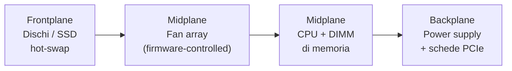
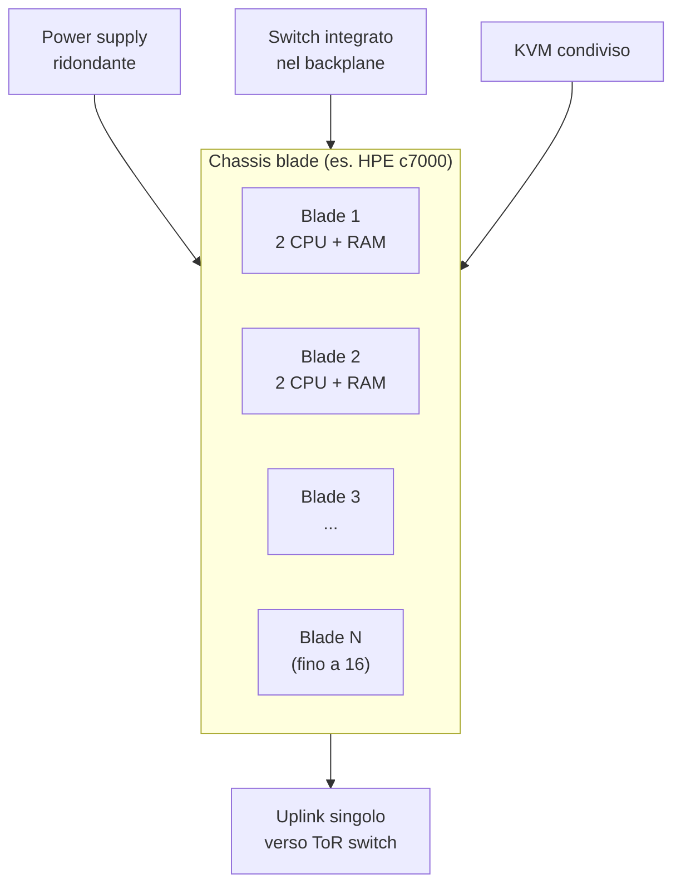
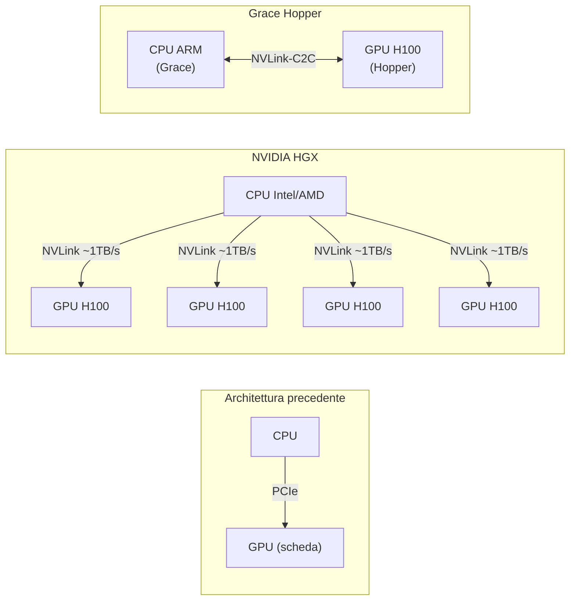
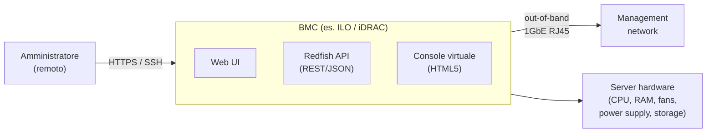
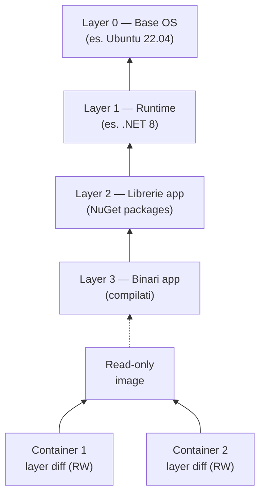
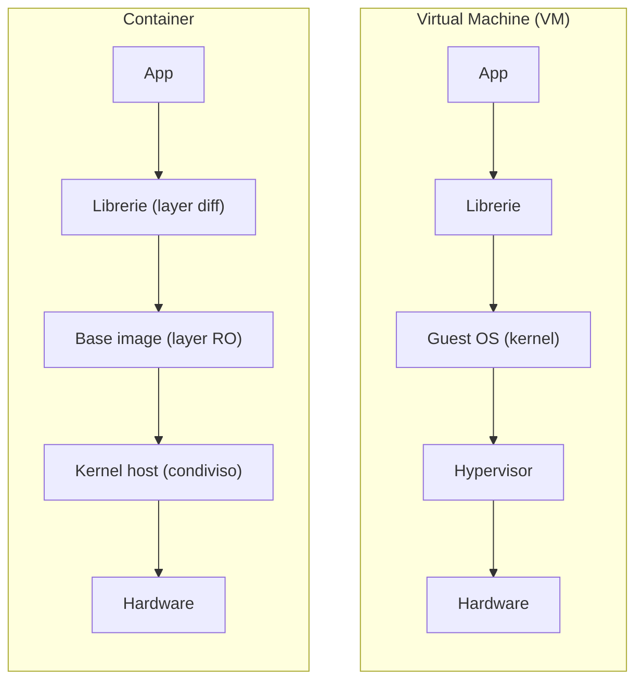
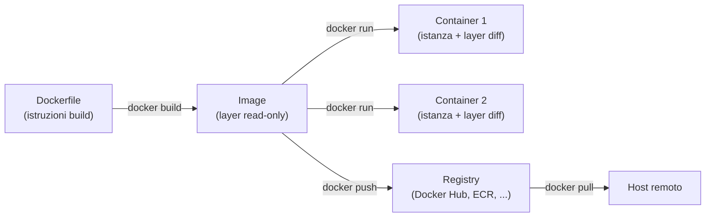

---
tags:
  - università/datacenter-design-and-operation
  - server-architecture
  - blade-server
  - containerizzazione
  - docker
  - BMC
data: 2026-05-01
lezione: "14 - Server, BMC e Containerizzazione"
professore: "Antonio Cisternino"
---
# Server, BMC e Containerizzazione

Questa lezione chiude la parte hardware del corso e apre la parte software. Si parte dall'anatomia fisica dei server rack, si analizza come la crescente domanda di GPU ha trasformato radicalmente l'architettura dei sistemi di calcolo, si introduce il **Base Management Console (BMC)** come strumento fondamentale per la gestione remota, e infine si affronta la **containerizzazione** — la tecnologia che disaccoppia il software dall'hardware fisico e che domina il deployment moderno delle applicazioni.

---

## Architettura fisica dei server

### Il server rack 1U standard

Il punto di partenza è il server rack più diffuso: una macchina **1U** (un'unità rack, circa 4,4 cm di altezza) ottimizzata per il calcolo general purpose senza acceleratori GPU.

L'organizzazione interna segue un flusso d'aria da davanti a dietro e riflette vincoli termici precisi:


*Fig. — Layout interno di un server 1U standard. L'aria entra dai dischi anteriori e viene espulsa dal backplane.*

I **fan** non girano a velocità fissa: il firmware monitora continuamente le temperature dei processori e aumenta o riduce la velocità in modo proporzionale al carico computazionale. Un server idle è quasi silenzioso; sotto carico pieno, il rumore è considerevole. Il power supply tipico di un sistema 1U si attesta intorno ai **750 W**.

Questo tipo di server ha un numero massimo di socket CPU pari a due: l'interconnessione tra più di due socket attraverso il bus esterno diventa un collo di bottiglia significativo per la latenza e la banda di memoria.

### Server four-way: scala verticale

Quando serve una grande quantità di RAM o si vogliono più socket CPU, si ricorre a server da **4U o 5U** con architettura **four-way** (quattro socket). Lo spazio aggiuntivo serve a:

- dissipatori più grandi per processori con TDP più elevato,
- più slot DIMM per aumentare la memoria totale,
- più bay per dischi,
- più spazio per le schede PCIe.

Il four-way è la scelta giusta quando il collo di bottiglia è la quantità di memoria: più socket significano più canali di memoria, quindi più banda aggregata.

### Blade server: densità e semplificazione del cabling

> [!definition] Blade Server
>
> Sistema modulare composto da uno **chassis condiviso** e da una serie di schede di calcolo inseribili (le "lame"), ciascuna delle quali è un server autonomo. Lo chassis fornisce alimentazione ridondante, fabric di rete integrato nel backplane e console di gestione condivisa.

La storia del blade server è interessante. Alla fine degli anni '90, una società britannica chiamata **RLX Technologies** (poi acquisita da HP) aveva il problema di aumentare la densità di calcolo. L'idea fu radicale: prendere la motherboard di un laptop, schiacciarla fino a darle la forma di una scheda da inserire in uno chassis con guide. Tre o quattro unità rack erano sufficienti a contenere **24 schede CPU**, creando una macchina parallela ad alta densità perfetta per applicazioni come il web crawling dei motori di ricerca.

L'idea era così buona che fu adottata da tutti i principali vendor come **form factor standard**. Il nome "blade" si riferisce proprio alla forma allungata e sottile delle singole schede.


*Fig. — Architettura di uno chassis blade. Lo switch nel backplane connette tutte le lame; verso l'esterno esce un solo cavo uplink per chassis.*

Il vantaggio principale del blade non è solo la densità CPU, ma la **drastica semplificazione del cabling**: 16 nodi di calcolo richiedono un solo cavo uplink verso il top-of-rack switch invece di 16 cavi separati. La gestione dell'infrastruttura diventa molto più semplice.

Con un chassis HPE c7000 da 16 lame, ognuna con 2 CPU, si ottengono **32 CPU in circa 10U**, ovvero circa **3.2 CPU/U** rispetto alle **2 CPU/U** del server rack tradizionale.

> [!note] Blade e Ferrari F1
>
> Lo stesso chassis HPE BladeSystem c7000 mostrato a lezione era quello utilizzato dalla scuderia Ferrari Formula 1 intorno al 2008 per le simulazioni aerodinamiche.


*Fig. — HPE BladeSystem c7000: uno degli chassis blade più diffusi. Le lame si inseriscono frontalmente; il backplane ospita switch, power supply e modulo KVM.*

Nel tempo, la crescita della banda di rete ha reso difficile scalare il backplane dello chassis, e alcuni vendor hanno cercato di abbandonare il formato. Il mercato ha però continuato a richiedere blade perché la semplificazione del management è un valore reale. Oggi i blade esistono ancora, affiancati da forme ibride.

### Twin architecture: densità senza networking integrato

**SuperMicro** ha introdotto circa 15 anni fa la **Twin architecture** (o TwinPro): assomiglia superficialmente a un blade, ma lo chassis condivide **solo l'alimentazione** — non c'è networking integrato nel backplane. Ogni nodo ha la propria scheda di rete indipendente.

Il risultato è una densità ancora più elevata: **4 CPU/U** con nodi disposti a coppie affiancate. Tecnicamente non è un blade, ma è spesso classificato insieme a loro per la somiglianza visiva.

### Evoluzione dei server GPU

Prima dell'era AI, le GPU venivano inserite nei server come **schede PCIe standard**, le stesse del gaming. La soluzione era meccanicamente complicata: cavi di alimentazione supplementari, strutture di supporto fragili, e la banda PCIe come bottleneck.

Con l'esplosione del machine learning, questa architettura non reggeva più. NVIDIA ha risposto con **HGX**: le GPU non sono più schede inseribili ma vengono **saldate direttamente sulla motherboard** come se fossero CPU, collegate tra loro via **NVLink** che offre una banda di circa **1 TB/s** — ordini di grandezza superiori al PCIe.

Il passo successivo è stato **Grace Hopper**: un modulo unico che integra una CPU ARM (Grace) con una GPU H100 (Hopper) collegate tramite NVLink-C2C ad altissima banda. Il risultato è che oggi la maggior parte dei server AI viene **progettata direttamente da NVIDIA**, con HP, Dell e altri che si limitano a "mettere il box intorno".


*Fig. — Evoluzione dell'architettura GPU server: da scheda PCIe a GPU on-board (HGX) fino al modulo integrato Grace Hopper.*

> [!tip] La proliferazione dei form factor come segnale
>
> Nel 2005 esistevano essenzialmente due form factor: 1U e 2U. Nel 2008 si erano aggiunti i blade. Oggi esistono **decine** di form factor diversi. Questa proliferazione non è casualità: è il segnale che il calcolo general purpose è ormai inadeguato e che **l'hardware si sta specializzando** per carichi di lavoro specifici. Ogni workload ha le sue esigenze ottimali di densità GPU, RAM, storage e networking.

### La filosofia del compromesso: server come Lego

Configurare un server è un esercizio di ottimizzazione vincolata: si parte da uno spazio fisso (il rack unit) e si decide come riempirlo.

| Workload | Configurazione ottimale |
|---|---|
| Calcolo intensivo (AI, HPC) | Poche drive, molte GPU, molto RAM GPU |
| Database in-memory | Server four-way, massima RAM CPU |
| Densità CPU pura, CPU-only | Twin o Blade |
| Calcolo GPU mid-range | Server 1U con schede PCIe RTX |

Se si decide di mettere 24 drive in un server 2U, si rinuncia necessariamente allo spazio per ulteriori schede PCIe o slot di memoria. Ogni scelta di forma ha un costo in un'altra dimensione.

> [!tip] Risorse per esplorare form factor
>
> Il sito di **SuperMicro** è uno dei cataloghi più completi di form factor server esistenti — dalla singola scheda Twin al rack pre-configurato con GPU. È un ottimo punto di riferimento per capire concretamente la gamma di possibilità.

---

## Base Management Console (BMC)

### Il problema della gestione remota

Un datacenter con centinaia o migliaia di server non può richiedere la presenza fisica di un operatore per ogni operazione. Il **Base Management Console (BMC)** risolve questo problema: è una scheda embedded nel server con un proprio processore, memoria e sistema operativo, completamente indipendente dallo stato del server principale.

> [!definition] BMC — Base Management Console
>
> Componente hardware autonomo presente in ogni server enterprise che fornisce accesso remoto completo alla macchina, indipendentemente dallo stato del sistema operativo principale. Ogni vendor usa un nome proprietario: **ILO** (HP), **iDRAC** (Dell), **IPMI** è lo standard di protocollo sottostante.

### Funzionalità

Il BMC espone un'interfaccia web raggiungibile tramite browser o SSH, attraverso cui è possibile:

- **Monitorare** in tempo reale voltaggio, temperatura, velocità fan, watt consumati, stato di CPU e memoria,
- **Accedere alla console virtuale**: una sessione che emula la connessione fisica monitor+tastiera, inclusa la possibilità di inviare Ctrl+Alt+Del (che nella tastiera PC è un interrupt hardware separato, non intercettabile dal sistema operativo),
- **Montare immagini ISO** e installare un sistema operativo da remoto come se si inserisse un DVD fisico,
- **Configurare BIOS e firmware** del server.


*Fig. — Il BMC si connette alla management network tramite una porta di rete dedicata e fornisce accesso completo all'hardware indipendentemente dal sistema operativo.*

### Redfish API: automazione del provisioning

Per ambienti con molti server, la gestione manuale via web UI è inefficiente. Lo standard **Redfish** definisce una API REST che espone l'intero modello dati del server in JSON, permettendo l'automazione completa:

```
GET  /redfish/v1/Systems/1                  # stato del sistema
POST /redfish/v1/Systems/1/Actions/
     ComputerSystem.Reset                   # reset del server
GET  /redfish/v1/Systems/1/Processors       # info CPU
GET  /redfish/v1/Chassis/1/Thermal          # temperature e fan
```

Attraverso Redfish è possibile fare **zero-touch provisioning**: uno script può formattare un server, montare un'immagine ISO, avviare l'installazione e configurare il sistema — tutto senza nessun operatore fisicamente presente.

### Sicurezza della management network

> [!warning] Il management network è equivalente all'accesso fisico
>
> Chiunque abbia accesso alla management network può riformattare qualsiasi server, riavviarlo, modificarne il firmware, o estrarne le credenziali. È un vettore di attacco **catastrofico** se esposto.

Per questo motivo, il management network segue sempre uno di questi modelli:

- **Rete fisicamente separata** dalla rete di produzione (out-of-band),
- **VLAN dedicata** con accesso controllato da firewall/ACL,
- Accesso esclusivamente tramite **VPN** con autenticazione forte.

La porta BMC è tipicamente una singola porta RJ45 da 1 GbE separata dalle porte di dati. La sua separazione è un requisito architetturale, non un'opzione.

---

## Containerizzazione

### Il problema: accoppiamento tra software e hardware

Il datacenter fisico — server, rete, storage, power, cooling — è l'infrastruttura. Sopra di essa vivono i **servizi**. Il problema classico è che un servizio legato a un server fisico specifico si ferma ogni volta che quel server deve essere manutenuto. Per costruire servizi con alta disponibilità, occorre **disaccoppiare il software dall'hardware sottostante**.

La virtualizzazione (macchine virtuali) risolve questo problema ma ha un costo: ogni VM emula un hardware completo, ha il suo kernel, e occupa risorse significative. I **container** offrono un compromesso diverso: l'isolamento senza l'emulazione.

### CGroups: la primitiva del kernel

La base tecnica dei container Linux è una funzionalità del kernel chiamata **CGroups** (Control Groups), sviluppata originariamente da Google.

> [!definition] CGroups — Control Groups
>
> Feature del kernel Linux che introduce uno **scoping dei nomi** per le risorse del sistema operativo. Invece di esporre globalmente tutti i processi, file system, socket di rete e device, il kernel può restringere la visibilità di un processo a un sottoinsieme di risorse appartenenti allo stesso gruppo.

Il ragionamento è semplice. Normalmente, quando un processo chiede al kernel "dammi la lista dei processi in esecuzione", riceve la lista completa di tutti i processi del sistema. Con i CGroups, il kernel risponde con la lista dei soli processi nello stesso container group.

La stessa logica si applica a:
- **filesystem**: ogni container vede solo il proprio albero di directory,
- **networking**: ogni container ha la propria interfaccia di rete virtuale,
- **PID**: i PID sono locali al container (il processo init dentro un container ha PID 1),
- **risorse CPU/memoria**: quote allocabili per container.

> [!note] Perché Google ha inventato i CGroups
>
> Google aveva bisogno di isolare ogni query di ricerca: se un utente trovava il modo di far crashare il motore tramite una query malevola, non doveva abbattere il servizio globale. Le VM erano troppo costose per questo use case (una per ogni query). I CGroups permisero di creare un container per ogni ricerca in modo quasi istantaneo, scaricarlo alla fine, e garantire che nulla potesse "uscire" da quella query. Oggi ogni ricerca Google gira in un container isolato.

### Differential file system: la base delle immagini

Il secondo componente fondamentale è il **differential file system** (o overlay filesystem). L'idea è analoga ai differenziali dei dischi virtuali già visti nella parte di storage:


*Fig. — Il differential file system permette a più container di condividere gli stessi layer read-only. Solo le modifiche specifiche di ogni container vengono scritte nel layer differenziale in cima.*

Dieci istanze dello stesso container condividono sul disco una sola copia dei layer comuni. Solo le differenze generate a runtime — file di log, dati scritti, configurazioni modificate — occupano spazio aggiuntivo per ogni istanza.

> [!definition] Container (definizione formale)
>
> Un container è un **insieme di processi** a cui il kernel Linux fornisce una visione ristretta e isolata delle risorse di sistema, grazie ai CGroups per il namespace isolation e a un differential filesystem per l'isolamento del filesystem. Non include un kernel proprio: condivide il kernel dell'host.

### Contenuto di un container vs macchina virtuale

> [!warning] Container ≠ Virtual Machine
>
> Un container condivide il kernel dell'host. Una VM ha il suo kernel separato. Questa differenza è cruciale per la sicurezza: **side-channel attacks** (Spectre, Meltdown, e varianti) che sfruttano la condivisione della microarchitettura CPU sono possibili tra container sullo stesso host, mentre sono molto più difficili tra VM. Il container offre un isolamento logico, non un isolamento hardware.

Poiché i container condividono il kernel, è possibile eseguire un container **Debian su un host RedHat**: il kernel è lo stesso (Linux), e la differenza tra le distribuzioni è essenzialmente nel layout del filesystem e nelle versioni delle librerie dinamiche. Quando un processo del container viene eseguito, il loader cerca le librerie nel filesystem del container (Debian), non in quello dell'host.

Questo funziona perché il **kernel Linux API è straordinariamente stabile**: le syscall non cambiano tra versioni. Il rischio esiste solo se un container richiede funzionalità di un kernel molto più recente di quello dell'host.


*Fig. — Differenza strutturale tra VM e container. La VM porta il proprio kernel; il container condivide quello dell'host.*

### Docker: la piattaforma container più diffusa

**Docker** non è l'unico runtime container (esistono anche Podman, containerd, LXC), ma è il più popolare e ha definito le convenzioni del settore. Il file centrale è il **Dockerfile**: una sequenza dichiarativa di istruzioni per costruire un'immagine.

### Multi-stage build: la pratica comune

Una caratteristica importante dei Dockerfile moderni è il **multi-stage build**: si usano più immagini intermedie per costruire l'applicazione, e si copia solo il risultato finale nell'immagine di produzione.

```
# Stage 1: immagine di build (con compilatori e SDK)
FROM mcr.microsoft.com/dotnet/sdk:8.0 AS build
WORKDIR /src
COPY src/ src/
RUN dotnet restore
COPY . .
RUN dotnet build

# Stage 2: compilazione e publish
FROM build AS publish
RUN dotnet publish -o /app/publish

# Stage 3: immagine finale (solo runtime, senza compilatori)
FROM mcr.microsoft.com/dotnet/aspnet:8.0 AS final
WORKDIR /app
COPY --from=publish /app/publish .
EXPOSE 8080
ENTRYPOINT ["dotnet", "app.dll"]
```

Il vantaggio di questo approccio è duplice:
- **Sicurezza**: l'immagine finale non contiene compilatori, SDK o tool di build. Un attaccante che compromette il container non trova alcun compilatore C# disponibile,
- **Dimensione**: l'immagine finale è molto più piccola perché non include il layer con l'SDK.

Le istruzioni principali di un Dockerfile:

| Istruzione | Significato |
|---|---|
| `FROM image AS name` | Base da cui si parte (o alias per multi-stage) |
| `WORKDIR /path` | Imposta la directory di lavoro nel container |
| `COPY src dst` | Copia file dall'host (o da un altro stage) nel container |
| `RUN cmd` | Esegue un comando nel container durante la build |
| `ENV KEY=VALUE` | Definisce una variabile d'ambiente |
| `EXPOSE port` | Dichiara la porta che il container vuole usare |
| `ENTRYPOINT ["cmd"]` | Processo principale avviato all'avvio del container |

### Port mapping e networking

Ogni container ha una propria interfaccia di rete virtuale. Se si vuole rendere il container accessibile dall'esterno, occorre fare **port mapping** (tecnicamente un NAT):

```
docker run -p 9000:8080 myapp   # porta host 9000 → porta container 8080
```

Questo permette di avviare più istanze dello stesso container sullo stesso host, ognuna con una porta esterna diversa, anche se tutte internamente ascoltano sulla stessa porta 8080. Il meccanismo è implementato tramite le regole `iptables` del kernel Linux.

### Docker Compose: composizione di servizi

Un'applicazione reale raramente è un singolo processo. Una web app tipica include: un **reverse proxy** (NGINX o Caddy), un **application server** (il codice applicativo), e un **database** (PostgreSQL, SQL Server). Docker Compose permette di definire e avviare l'intero stack con un singolo file YAML:

```yaml
services:
  frontend:
    image: nginx:alpine
    ports: ["443:443", "80:80"]
    volumes:
      - ./nginx.conf:/etc/nginx/conf.d/default.conf:ro
    depends_on: [app]
    restart: always
    networks: [app-network]

  app:
    build: .
    environment:
      - ASPNETCORE_ENVIRONMENT=Production
      - ConnectionStrings__Default=Server=db;...
    ports: ["8080:8080"]
    depends_on: [db]
    networks: [app-network]

  db:
    image: mcr.microsoft.com/mssql/server:2022-latest
    environment:
      - SA_PASSWORD=MySecurePass1!
    ports: ["1433:1433"]
    volumes:
      - ./data:/var/opt/mssql
    networks: [app-network]

networks:
  app-network:
    driver: bridge
```

Quando si esegue `docker compose up`, Docker avvia tutti i container definiti, crea la rete virtuale di tipo **bridge** che li connette tra loro, e gestisce i volumi. I container si raggiungono per nome (il container `app` può connettersi a `db` usando `db` come hostname).

> [!tip] Perché le applicazioni container-native usano variabili d'ambiente
>
> Docker Compose permette di passare configurazioni ai processi tramite variabili d'ambiente anziché file di configurazione. Questo è diventato lo standard per le applicazioni moderne per due motivi: primo, è il meccanismo naturale per iniettare configurazioni in un container senza modificare l'immagine; secondo, le variabili d'ambiente sono intrinseche al processo e non scritte su disco, quindi se il processo viene terminato, la configurazione (incluse eventuali credenziali) scompare con esso.

### Container nel contesto AI e distribuzione software

Il fenomeno si è espanso ben oltre le web app. **NVIDIA** distribuisce i propri driver GPU per Linux esclusivamente come container: la complessità dell'installazione (dipendenze, versioni del kernel, moduli) era tale che impacchettarla in un container garantisce che funzioni identicamente su qualsiasi host compatibile.

Più in generale, il container risolve il problema classico delle dipendenze: se si usa Node.js, che può scaricare migliaia di pacchetti durante `npm install`, basta fissare quei pacchetti nel container al momento della build. L'applicazione gira sempre con le stesse versioni, anche se il sistema ospite ha aggiornato le librerie.


*Fig. — Ciclo di vita di un container: dal Dockerfile all'immagine, alle istanze in esecuzione, fino alla distribuzione tramite registry.*

> [!abstract] Sintesi — Container
>
> Un container è un processo (o un gruppo di processi) a cui il kernel Linux fornisce una visione isolata del sistema tramite **CGroups** e un **differential filesystem**. Non include un kernel proprio. Rispetto a una VM è molto più leggero (avvio in millisecondi, overhead minimo), ma condivide il kernel con l'host, il che implica minore isolamento di sicurezza. Docker è la piattaforma standard per costruire (`Dockerfile`), distribuire (registry) e comporre (`docker compose`) container. La tecnologia è stata inventata da Google per isolare le query di ricerca ed è oggi il meccanismo di deployment dominante nel software cloud-native.

---

## Prossimi argomenti

Il professore ha annunciato che le lezioni successive copriranno:

1. **Virtualizzazione** — il disaccoppiamento tra software e hardware tramite hypervisor, motivato dalla necessità di servizi sempre disponibili anche durante la manutenzione hardware,
2. **Cloud reference model** — come il datacenter fisico diventa la base per i modelli di servizio cloud (IaaS, PaaS, SaaS).

> [!question] Possibili domande d'esame
>
> - Qual è la differenza tra un blade server e un'architettura Twin? In cosa differiscono per quanto riguarda il networking?
> - Perché il form factor dei server si è moltiplicato negli ultimi anni? Cosa indica questa proliferazione?
> - Cos'è il BMC? Quali operazioni permette di fare da remoto? Perché la management network deve essere separata dalla rete di produzione?
> - Cos'è Redfish? Che tipo di API espone?
> - Cosa sono i CGroups? Come rendono possibili i container?
> - Qual è la differenza tra un container e una macchina virtuale dal punto di vista della sicurezza?
> - Perché è possibile eseguire un container Debian su un host RedHat?
> - Cos'è un multi-stage build in Docker e quali vantaggi offre?
> - Come funziona il port mapping in Docker? Perché è necessario?
> - Cos'è Docker Compose e in quale scenario è utile?
