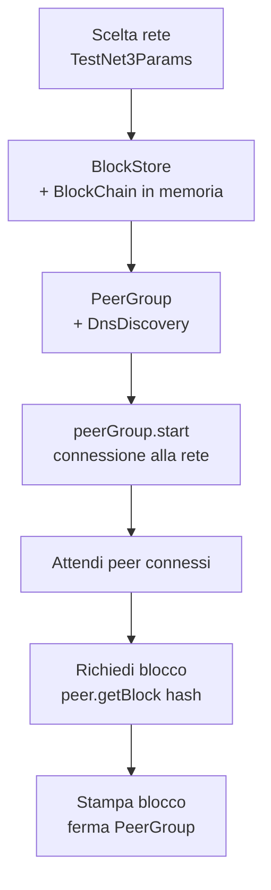

---
tags:
  - università/peer-to-peer-systems-and-blockchain
  - bitcoin
  - bitcoinj
  - java
  - testnet
  - laboratorio
data: 2026-03-10
lezione: "Lab 2 - Bitcoin con bitcoinj"
professore: "Damiano Di Francesco Maesa"
---
## Cosa si è fatto in questa lezione

Secondo laboratorio del corso, interamente dedicato a Bitcoin visto "dall'interno" tramite la libreria **bitcoinj**. Dopo aver discusso nella lezione precedente il layer P2P in astratto, qui si scrive vero codice Java che apre connessioni verso la rete Bitcoin, stampa informazioni sui peer, scarica un blocco di esempio dalla **testnet**, genera indirizzi di tutti i tipi previsti dal protocollo (legacy, SegWit, Taproot) e infine ispeziona il famoso **genesis block** estraendone il messaggio di Satoshi.

L'impianto è molto operativo: le slide presentano snippet di codice che lo studente riproduce e modifica. Alla fine della lezione è assegnato un esercizio pratico — generare una **vanity address** con prefisso a scelta — che richiede di comprendere la relazione tra chiave e indirizzo.

> [!info] Obiettivi concreti del laboratorio
>
> - Installare Bitcoin Core e importare `bitcoinj` in un progetto Java
> - Scrivere un client che si collega alla rete testnet e richiede un blocco specifico dato il suo hash
> - Generare chiavi ECDSA e derivarne indirizzi di tipi diversi (P2PKH, P2WPKH)
> - Scaricare e decodificare il genesis block di Bitcoin, in particolare la `coinbase` e il messaggio testuale in essa contenuto
> - **Esercizio 1**: scrivere un programma che genera indirizzi fino a trovarne uno con un prefisso scelto (vanity address)

---

## Strumenti e link di riferimento

Il laboratorio si appoggia su due strumenti principali. **Bitcoin Core** è il client di riferimento, scaricabile dal sito ufficiale:

- [bitcoin.org/en/download](https://bitcoin.org/en/download)

Per scrivere codice che parla con la rete Bitcoin dall'interno di un'applicazione Java si usa **bitcoinj**, una libreria molto matura che astrae il protocollo di rete, la serializzazione dei messaggi e la gestione delle chiavi:

- Sito ufficiale: [bitcoinj.org](https://bitcoinj.org/)
- JAR direttamente scaricabile da Maven Central: [bitcoinj-core-0.17.jar](https://search.maven.org/remotecontent?filepath=org/bitcoinj/bitcoinj-core/0.17/bitcoinj-core-0.17.jar)
- Javadoc della versione 0.17: [bitcoinj.org/javadoc/0.17/](https://bitcoinj.org/javadoc/0.17/)

> [!tip] Perché `bitcoinj`
>
> Scrivere da zero un client che parli il protocollo di Bitcoin è un'impresa: bisogna implementare la serializzazione dei messaggi, la gestione delle connessioni, le regole di consenso, la verifica degli header, ecc. `bitcoinj` fornisce tutto questo come API Java, permettendo di concentrarsi sulla logica applicativa. È la stessa libreria usata in produzione da wallet come **BitcoinJ Wallet** e da svariate soluzioni enterprise che integrano Bitcoin.

---

## Esempio di connessione alla rete

Il primo blocco di codice mostrato in aula ha uno scopo didattico molto chiaro: far vedere che bastano poche decine di righe per collegarsi alla **testnet3**, scoprire i peer tramite DNS, e scaricare un blocco noto.

L'**hash del blocco** di riferimento usato durante la lezione è preso da [blockstream.info](https://blockstream.info/testnet/block/0000000000000adc6423b570d751efcdf5e019d3d955fee155c28925913cb667) — un explorer che permette di navigare la testnet.

### Struttura del programma

```java
public static void connectionTest() throws InterruptedException {
    NetworkParameters netParams = TestNet3Params.get();

    BlockStore blockStore = new MemoryBlockStore(netParams.getGenesisBlock());
    BlockChain blockChain;

    try {
        blockChain = new BlockChain(netParams.network(), blockStore);
        PeerGroup peerGroup = new PeerGroup(netParams, blockChain);
        peerGroup.setUserAgent("Sample App", "1.0");
        peerGroup.addPeerDiscovery(new DnsDiscovery(netParams));
        peerGroup.start();

        Thread.sleep(10000);
        printNetStats(peerGroup);

        for (Peer p : peerGroup.getConnectedPeers()) {
            System.out.println(p.getAddr());
        }

        while (peerGroup.getConnectedPeers().isEmpty())
            Thread.sleep(5000);

        Sha256Hash blockHash = Sha256Hash.wrap(
            "0000000000000adc6423b570d751efcdf5e019d3d955fee155c28925913cb667");
        Block block;
        boolean flag = true;

        try {
            while (flag) {
                Peer pFirst = peerGroup.getConnectedPeers()
                    .get(peerGroup.getConnectedPeers().size() - 1);
                Future<Block> future = pFirst.getBlock(blockHash);
                block = future.get(5, TimeUnit.SECONDS);
                System.out.println("Here is the block: " + block);
                flag = false;
            }
        } catch (TimeoutException ex) {
            // do nothing, just try a new peer
        } catch (ExecutionException ex) {
            // do nothing, just try a new peer
        }

        Thread.sleep(10000);
        printNetStats(peerGroup);
        peerGroup.stop();

    } catch (BlockStoreException ex) {
        System.getLogger(P2PBClab1project.class.getName())
            .log(System.Logger.Level.ERROR, (String) null, ex);
    }
}

public static void printNetStats(PeerGroup peerGroup) {
    System.out.println("\n\nNETWORK INFO:");
    System.out.println("Max connections: " + peerGroup.getMaxConnections());
    System.out.println("Current connections: " + peerGroup.numConnectedPeers());
    System.out.println("Chain height: " + peerGroup.getMostCommonChainHeight());
    System.out.println("\n\n");
}
```

### Cosa fa, passo per passo

Il flusso concettuale è lineare e ricalca esattamente la discovery vista la lezione precedente:


*Fig. — Pipeline dell'esempio di connessione: tutto ruota attorno a `PeerGroup`, l'astrazione `bitcoinj` che gestisce il pool di connessioni P2P.*

La chiave è il `PeerGroup`: rappresenta un insieme di connessioni gestite automaticamente, incluso il mantenimento del numero target di peer e la ri-connessione in caso di timeout. `DnsDiscovery` è il meccanismo di bootstrapping che interroga i seed DNS di cui si è parlato nella lezione sul layer P2P.

La richiesta del blocco specifico (`peer.getBlock(hash)`) restituisce un `Future` — quindi è asincrona — e il loop `while(flag)` tenta la richiesta su peer diversi finché uno risponde entro 5 secondi. Questo pattern è tipico delle reti P2P: nessun peer specifico ha il "dovere" di rispondere, quindi il client deve essere preparato a ritentare.

> [!warning] Blocco di esempio su testnet
>
> L'hash `0000000000000adc6423b570d751efcdf5e019d3d955fee155c28925913cb667` si riferisce a un blocco **testnet**, non mainnet. È importante perché in testnet le regole di PoW sono rilassate (difficulty molto più bassa) e gli indirizzi hanno un prefisso diverso. Cambiare `TestNet3Params` in `MainNetParams` fa sì che il client si colleghi alla rete di produzione e tenti di recuperare blocchi reali — occhio alla quantità di dati!

---

## Indirizzi Bitcoin e loro tipologie

Una volta collegati alla rete, la lezione passa a mostrare come generare chiavi e indirizzi. Prima però viene fatto un rapido ripasso dei tipi di indirizzo che esistono oggi in Bitcoin mainnet.

> [!definition] Tipi di indirizzo Bitcoin (mainnet)
>
> | Tipo | Prefisso | Descrizione |
> |---|---|---|
> | **Legacy P2PKH** | `1...` | Pay-to-Public-Key-Hash — il formato storico |
> | **Legacy P2SH** | `3...` | Pay-to-Script-Hash — script generici (multisig, timelock, ...) |
> | **Nested SegWit P2SH-P2WPKH/P2WSH** | `3...` | SegWit impacchettato in un P2SH per compatibilità — solo transizionale |
> | **SegWit nativo P2WPKH/P2WSH** | `bc1q...` | Bech32, witness version 0 |
> | **Taproot P2TR** | `bc1p...` | Bech32m, witness version 1 — singole firme Schnorr o Tapscript |

Il nested SegWit (`3...`) è stato utile durante la transizione per permettere a wallet che non conoscevano il nuovo formato `bc1q` di inviare fondi a destinatari SegWit, ma oggi è essenzialmente deprecato: i nuovi wallet preferiscono generare direttamente `bc1q` (SegWit v0) o `bc1p` (Taproot) per beneficiare delle fee ridotte e delle nuove funzionalità.

### Generare un indirizzo da una chiave

```java
public static void createNewAddr() {
    NetworkParameters netParams1 = TestNet3Params.get();

    ECKey key = new ECKey();
    System.out.println("We created key " + key);
    Address addressFromKey = key.toAddress(ScriptType.P2PKH, netParams1.network());

    System.out.println("On the " + netParams1.network() +
        " network, we can use this address " + addressFromKey);

    NetworkParameters netParams2 = MainNetParams.get();
    addressFromKey = key.toAddress(ScriptType.P2PKH, netParams2.network());
    System.out.println("On the " + netParams2.network() +
        " network, we can use this address " + addressFromKey);

    addressFromKey = key.toAddress(ScriptType.P2WPKH, netParams2.network());
    System.out.println("On the " + netParams2.network() +
        " network, we can use this address " + addressFromKey);
}
```

L'esempio mostra tre cose importanti:

1. **Una stessa chiave ECDSA** (`ECKey key = new ECKey()`) può essere usata per derivare più indirizzi.
2. Lo stesso hash della chiave pubblica produce **indirizzi con prefisso diverso** a seconda della rete (testnet vs mainnet) perché il byte di version cambia.
3. Lo stesso hash produce anche **indirizzi formattati diversamente** a seconda dello `ScriptType` scelto: con `P2PKH` si ottiene un indirizzo legacy `1...`, con `P2WPKH` si ottiene un SegWit nativo `bc1q...`. La chiave privata è la stessa, ma lo script di lock differisce, e quindi cambia l'encoding dell'indirizzo.

> [!tip] Chiave → indirizzo non è iniettivo sul tipo
>
> Una stessa chiave genera indirizzi di tipo diverso perché l'indirizzo è una funzione di (hash della chiave pubblica, tipo di script, rete). Se si invia denaro al P2PKH di una chiave, non è automaticamente spendibile con la firma sul P2WPKH della stessa chiave: lo script di unlock è diverso. Il proprietario della chiave può firmare per entrambi, ma deve sapere a quale dei suoi indirizzi gli è stato inviato il denaro.

### Esercizio 1 — Vanity address

> [!example] Esercizio 1: vanity address
>
> **Consegna**: scrivere un programma che genera un indirizzo Bitcoin il cui encoding **inizia con una stringa scelta** dall'utente (es. `1Fabio...`, `bc1qgold...`).
>
> **Approccio**: non esiste un modo per costruire una chiave che produca un indirizzo con un prefisso specifico senza invertire la funzione hash (cosa infattibile). L'unica strada è **brute force**: generare chiavi casuali una dopo l'altra, calcolare l'indirizzo corrispondente, controllare se inizia con la stringa desiderata, e se no ripetere.
>
> ```java
> String target = "1Fab";
> while (true) {
>     ECKey key = new ECKey();
>     Address addr = key.toAddress(ScriptType.P2PKH, MainNetParams.get().network());
>     if (addr.toString().startsWith(target)) {
>         System.out.println("Found: " + addr);
>         System.out.println("Private key: " + key.getPrivateKeyAsWiF(MainNetParams.get().network()));
>         break;
>     }
> }
> ```
>
> Il tempo di esecuzione cresce **esponenzialmente** nella lunghezza del prefisso (approssimativamente un fattore 58 per ogni carattere aggiunto nel Base58): 3-4 caratteri si trovano in secondi, 6-7 in minuti, 10+ richiedono hardware dedicato.

> [!warning] Sicurezza delle vanity address
>
> Per chiavi cercate brute force su hardware proprio non c'è problema — la chiave privata resta locale. Si diffidi però dei servizi online che generano vanity address "per conto vostro": se il servizio genera la chiave e poi la invia, può trattenerne una copia e svuotare il wallet quando vi viene inviato denaro. L'unico pattern sicuro è lo **split-key vanity**, in cui la parte entropica proviene da voi e il servizio fornisce solo capacità di calcolo.

---

## Inspezione del genesis block

L'ultima parte del laboratorio è l'ispezione del blocco 0 di Bitcoin — il **genesis block**, minato da Satoshi Nakamoto il 3 gennaio 2009.

> [!definition] Genesis block di Bitcoin
>
> Il blocco con hash `0x000000000019d6689c085ae165831e934ff763ae46a2a6c172b3f1b60a8ce26f` è il primo blocco della blockchain di Bitcoin. È **hardcoded** nel codice di ogni client e serve come radice di fiducia da cui far partire la verifica dell'intera catena. La sua ricompensa coinbase (50 BTC) è spendibile in teoria ma è considerata non-spendibile di fatto perché l'UTXO corrispondente non è mai stato incluso nel UTXO set di Bitcoin Core.
>
> Riferimento: [en.bitcoin.it/wiki/Genesis_block](https://en.bitcoin.it/wiki/Genesis_block)

### Codice per leggere il genesis

```java
// 0x000000000019d6689c085ae165831e934ff763ae46a2a6c172b3f1b60a8ce26f
public static void getBtcGenesis() throws InterruptedException {
    NetworkParameters netParams = MainNetParams.get();

    Block genesis = netParams.getGenesisBlock();

    System.out.println(genesis);

    TransactionInput txIn = genesis.getTransactions().get(0).getInput(0);

    System.out.println(bytesToHex(txIn.getScriptBytes()));

    String message = hexToAscii(bytesToHex(txIn.getScriptBytes()));

    System.out.println(message);

    printBlockInfo(genesis);
    printTxInfo(genesis.getTransactions().get(0));
}

public static void printBlockInfo(Block blk) throws InterruptedException {
    System.out.println("Hash       " + blk.getHashAsString());
    System.out.println("Prev Hash  " + blk.getPrevBlockHash());
    System.out.println("Timestamp  " + blk.getTimeSeconds());
    System.out.println("Timestamp  " + blk.time());
}
```

### Il messaggio di Satoshi

La parte più suggestiva è la decodifica del **coinbase script** della prima (e unica) transazione del genesis block. In una transazione normale l'input contiene la firma che sblocca l'UTXO speso; in una coinbase, che non spende nulla, il campo `scriptSig` è libero e Satoshi lo ha sfruttato per incidere un messaggio leggibile in ASCII:

```
The Times 03/Jan/2009 Chancellor on brink of second bailout for banks
```

È il titolo del *Times* di Londra di quel giorno. Serve a due scopi: **dimostrare che il blocco è stato minato non prima del 3 gennaio 2009** (non si può predire un titolo di giornale futuro), e lasciare traccia storica del contesto politico-finanziario in cui Bitcoin nasce — una risposta esplicita alla crisi bancaria e ai salvataggi pubblici.

> [!tip] Timestamping incorporato nel protocollo
>
> La tecnica di scrivere un riferimento pubblico verificabile (come un titolo di giornale) in un blocco per dimostrarne la datazione "non prima di" è essenzialmente un **timestamping crittografico** fatto in modo manuale. In seguito è stato formalizzato da servizi come OpenTimestamps, che permettono di inserire hash di documenti arbitrari nella blockchain di Bitcoin come prova di esistenza a una certa data.

### Cosa estraiamo dal genesis

Eseguendo `printBlockInfo` e `printTxInfo` si vede concretamente la struttura di un blocco Bitcoin:

- **Hash** del blocco — `000000000019d6689c085ae165831e934ff763ae46a2a6c172b3f1b60a8ce26f`
- **Prev hash** — tutti zeri, perché non c'è un blocco precedente
- **Timestamp** — 1231006505 secondi Unix, cioè 3 gennaio 2009 18:15:05 UTC
- **Transazione coinbase** con il messaggio di cui sopra e un output di 50 BTC al public key di Satoshi (in formato P2PK, non P2PKH: è lo stile più vecchio)

---

## Transazioni e SegWit

Nel finale della lezione vengono indicate due risorse per approfondire ciò che si costruirà nei laboratori successivi (dove si imposteranno transazioni manualmente):

- **Deconstructing a Bitcoin transaction** — [dev.to/thunderbiscuit/deconstructing-a-bitcoin-transaction-4l2n](https://dev.to/thunderbiscuit/deconstructing-a-bitcoin-transaction-4l2n). Una spiegazione campo-per-campo di cosa c'è dentro una transazione Bitcoin: version, input list (previous outpoint, scriptSig, sequence), output list (value, scriptPubKey), locktime. Utile per capire come serializzare manualmente una transazione.
- **SegWit recap** — [learnmeabitcoin.com/technical/upgrades/segregated-witness](https://learnmeabitcoin.com/technical/upgrades/segregated-witness/). Introduzione al segregated witness, l'upgrade del 2017 che ha separato i dati di firma (witness) dal resto della transazione, risolvendo la transaction malleability e aprendo la strada a Lightning Network.

> [!note] Perché serve comprendere SegWit
>
> Il motivo per cui le slide ripassano SegWit proprio qui è che il tipo di indirizzo che si genera (`P2PKH` vs `P2WPKH`) si riflette direttamente nella struttura della transazione che lo spende: un P2WPKH mette la firma nel campo *witness*, non nello `scriptSig`, e calcola la fee in base al *virtual size* invece che alla dimensione grezza. Senza questo contesto, alcuni campi di una transazione moderna sembrano arbitrari.

---

## Sintesi del laboratorio

> [!abstract] Cosa resta in mano dopo questa lezione
>
> - Un progetto Java funzionante che si collega alla **testnet Bitcoin** tramite `bitcoinj` e scarica un blocco richiesto per hash
> - La capacità di **generare chiavi ECDSA** e derivarne indirizzi legacy (`P2PKH`) o SegWit nativi (`P2WPKH`) per mainnet o testnet
> - Un primo vanity address personale, ottenuto brute-forzando chiavi finché il loro indirizzo inizia con un prefisso scelto
> - Un'ispezione diretta del **genesis block** di Bitcoin, con la decodifica del messaggio di Satoshi nel coinbase della transazione 0
> - Link di riferimento per approfondire la struttura delle transazioni e SegWit in vista dei laboratori successivi

> [!question] Possibili domande d'esame
>
> - Descrivere il flusso con cui un client `bitcoinj` si connette alla rete e richiede un blocco per hash (DNS discovery, PeerGroup, getBlock asincrono).
> - Elencare i tipi di indirizzo Bitcoin e i loro prefissi, spiegando la differenza tra nested SegWit e SegWit nativo.
> - Spiegare perché una stessa chiave ECDSA genera indirizzi diversi a seconda dello `ScriptType` scelto.
> - Cos'è una vanity address e perché la sua generazione è necessariamente brute force? Qual è il rischio dei servizi online che generano vanity address "per conto terzi"?
> - Cosa contiene il `scriptSig` della coinbase del genesis block di Bitcoin? A cosa serve un messaggio incorporato in un blocco?
> - Quale ruolo storico gioca il genesis block e perché è hardcoded nel codice del client?
