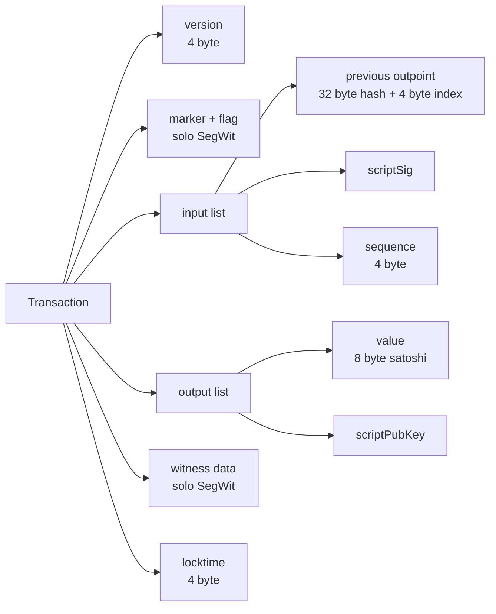

---
tags:
  - università/peer-to-peer-systems-and-blockchain
  - bitcoin
  - bitcoinj
  - java
  - transactions
  - script
  - op-return
  - laboratorio
data: 2026-03-11
lezione: "Lab 3 - Bitcoin Transactions e Scripts"
professore: "Damiano Di Francesco Maesa"
---
## Cosa si è fatto in questa lezione

Terzo laboratorio Bitcoin: dopo aver fatto conoscenza con `bitcoinj` nella lezione precedente (connessione alla rete, generazione di indirizzi, lettura del genesis block), qui si entra nel cuore della serializzazione del protocollo. Si scrive codice Java per **ispezionare una transazione campo per campo**, **decodificare gli script** di input e output mostrandoli come sequenze di opcode leggibili, e si affronta il caso speciale delle transazioni con `OP_RETURN` — l'opcode usato per inserire dati arbitrari nella blockchain.

La parte finale è operativa: si scaricano transazioni reali in formato hex da `blockchain.info`, si passano al parser di `bitcoinj` (`Transaction.read()`) e si confronta il risultato con il decoder ufficiale per verificare la correttezza della propria comprensione del formato binario.

> [!info] Obiettivi concreti del laboratorio
>
> - Scrivere una funzione `printTxInfo` che stampa in modo leggibile tutti i campi di una `Transaction` di bitcoinj (hash, coinbase flag, weight, witness flag, input/output con script e indirizzi)
> - Scrivere una funzione `printScriptAsOpCodes` che trasforma il bytecode grezzo di uno script Bitcoin in una sequenza testuale di opcode, gestendo correttamente i dati push e l'`OP_RETURN`
> - Scaricare transazioni reali dalla blockchain in formato **raw hex**, deserializzarle, ispezionarle e verificare il risultato contro il decoder pubblico
> - Vedere esempi concreti di tre tipi di transazione: **legacy**, **SegWit**, con **OP_RETURN**

---

## Riferimenti della lezione

Le slide citano esplicitamente una serie di link che sono il materiale di studio integrativo al codice mostrato in aula. Vale la pena tenerli a portata.

Per le **transazioni** e il loro formato:

- [Deconstructing a Bitcoin transaction](https://dev.to/thunderbiscuit/deconstructing-a-bitcoin-transaction-4l2n) — descrizione campo-per-campo molto chiara
- [SegWit recap](https://learnmeabitcoin.com/technical/upgrades/segregated-witness/) — come il witness cambia la struttura e perché

Per gli **script e gli opcode**:

- [Script e opcode list](https://learnmeabitcoin.com/technical/script/) — ripasso generale
- [Opcode Explained](https://opcodeexplained.com/opcodes/) — lista dettagliata di tutti gli opcode
- [Bitcoin Wiki — Script](https://en.bitcoin.it/wiki/Script) — riferimento storico canonico
- [OP_RETURN](https://learnmeabitcoin.com/technical/script/return/) — approfondimento sull'opcode più importante di questa lezione

Per l'**esercitazione pratica**:

- [blockchain.info raw transaction endpoint](https://blockchain.info/rawtx/a637ad18fabee7ad3ccd51e317091a6e16991311c0c9b83233b140b66b114448?format=hex) — esempio che restituisce l'hex della transazione
- [Blockchain.com Decode Transaction](https://www.blockchain.com/explorer/assets/btc/decode-transaction) — tool web per verificare la decodifica

---

## Struttura di una transazione Bitcoin

Prima di scrivere codice conviene fissare mentalmente i campi. Una transazione Bitcoin, nel formato serializzato, si compone di:


*Fig. — I campi di una transazione Bitcoin. `marker`/`flag` e `witness data` sono presenti solo nelle transazioni SegWit.*

La distinzione cruciale per il codice è fra transazione **legacy** e **SegWit**: nelle legacy la firma vive dentro `scriptSig` (un campo dell'input); nelle SegWit viene spostata in una sezione separata (`witness data`) in fondo alla transazione, lasciando `scriptSig` vuoto. Questo cambia il layout binario e richiede il parser di gestire i due casi. Bitcoinj si occupa di distinguerli automaticamente leggendo il **marker byte** (`0x00`) e il **flag byte** (`0x01`) che, se presenti subito dopo la version, segnalano una transazione SegWit.

> [!definition] Coinbase transaction
>
> La prima transazione di ogni blocco è la **coinbase**, che crea nuovi bitcoin (il block reward) e non ha un input spendibile precedente: il suo unico input ha `previous outpoint` con hash tutto-zero e indice `0xFFFFFFFF`, e `scriptSig` è lasciato libero dal miner per inserirvi dati arbitrari (tipicamente il numero del blocco per l'altezza — BIP 34 — o messaggi testuali, come fece Satoshi nel genesis).

---

## `printTxInfo` — stampare una transazione in modo leggibile

Il primo esercizio di laboratorio è una funzione che prende una `Transaction` di bitcoinj e ne stampa tutti i campi in formato umano. Il valore didattico è che costringe a distinguere i casi (coinbase vs regolare, con vs senza witness) e a ricavare gli indirizzi dai rispettivi script.

```java
public static void printTxInfo(Transaction tx) throws InterruptedException {
    // txHash, isCoinbase, weight, hasWitness
    StringBuilder line = new StringBuilder();
    boolean isCoinbase = false;
    boolean hasWitness = false;
    line.append(tx.getTxId().toString());
    line.append(",");
    if (tx.isCoinBase()) {
        isCoinbase = true;
        line.append("1");
    } else {
        isCoinbase = false;
        line.append("0");
    }
    line.append(",");
    line.append("" + tx.getWeight());
    line.append(",");
    if (tx.hasWitnesses()) {
        hasWitness = true;
        line.append("1");
    } else {
        hasWitness = false;
        line.append("0");
    }
    System.out.println("General info : " + line.toString());

    line = new StringBuilder();
    if (isCoinbase) {
        // check if it has messages inside input scripts
        boolean first = true;
        for (TransactionInput ii : tx.getInputs()) {
            if (first) first = false;
            else line.append("\n");
            line.append("Coinbase input script message? " +
                hexToAscii(bytesToHex(ii.getScriptBytes())));
        }
    } else {
        // not coinbase so there is at least one input
        // prevTx_Id, prevTxPos, script:
        boolean first = true;
        for (TransactionInput ii : tx.getInputs()) {
            if (first) first = false;
            else line.append("\n");
            line.append("Prev txHash " + ii.getOutpoint().hash().toString());
            line.append("\nPrev txPos  " + ii.getOutpoint().index());
            line.append("\nscriptSig   " + bytesToHex(ii.getScriptBytes()));
            if (ii.hasWitness()) {
                line.append("\nwitness     " + ii.getWitness().toString());
            }
        }
    }
    System.out.println("Inputs :\n" + line.toString());

    line = new StringBuilder();
    // addr, amount, outScriptBytes
    // there is always at least one output
    boolean first = true;
    for (TransactionOutput oo : tx.getOutputs()) {
        if (first) first = false;
        else line.append("\n");
        byte[] outScript = oo.getScriptBytes();
        String outAddr = ScriptParser.addrFromOut(outScript);
        int outType = ScriptParser.typeFromOut(outScript);
        if (outAddr == null) {
            // writes '#UNKNOWN#' as address if not decodable
            outAddr = "#UNKNOWN#";
        }
        line.append("Addr " + outAddr);
        line.append("\nAmount " + oo.getValue().getValue());
        line.append("\nscript " + bytesToHex(outScript));
        line.append("\nscript " + printScriptAsOpCodes(outScript));
        line.append("\nscript type " + ScriptTypeCustom.typeName(outType));
    }
    System.out.println("Outputs :\n" + line.toString());
}
```

### Cosa vale la pena notare

- **`getTxId()`** restituisce il doppio SHA-256 dei campi "non witness" della transazione. Per le SegWit è utile perché rende l'ID immune dalla *malleability*: modificare la firma non cambia l'ID della transazione.
- **`getWeight()`** è la metrica usata da Bitcoin per calcolare le fee dopo SegWit: i byte witness contano 1, quelli non-witness contano 4. Il limite di blocco è 4M weight units.
- **Caso coinbase**: si stampa il contenuto dello `scriptSig` interpretato come ASCII, per vedere l'eventuale messaggio del miner. È lo stesso trucco con cui si è letto il `Chancellor on brink of second bailout for banks` nel genesis.
- **Caso regolare**: per ogni input si stampa la coppia `(prev hash, prev index)` che identifica l'UTXO speso, il `scriptSig` in hex, e il witness se presente.
- **Per gli output**: si usa un `ScriptParser` custom che tenta di decodificare lo `scriptPubKey` in un indirizzo. Se lo script non corrisponde a un pattern noto (non è P2PKH, P2SH, P2WPKH, ...) si scrive `#UNKNOWN#` invece di inventare un indirizzo.

> [!tip] Indirizzo = pattern riconosciuto nello script
>
> Un **indirizzo non è un campo della transazione**: è una **reinterpretazione** dello `scriptPubKey` quando quest'ultimo ha una forma "nota". `OP_DUP OP_HASH160 <20B> OP_EQUALVERIFY OP_CHECKSIG` → P2PKH, `OP_HASH160 <20B> OP_EQUAL` → P2SH, e così via. Se lo script è arbitrario (es. un multisig bare, un timelock), non c'è un indirizzo standard da mostrare.

---

## `printScriptAsOpCodes` — decodificare uno script Bitcoin

Gli script di Bitcoin sono sequenze di byte che il parser deve interpretare come un misto di **opcode** (singoli byte con nome simbolico) e **push di dati** (un byte che dichiara la lunghezza, seguito dai dati). La funzione mostrata in aula fa proprio questo.

```java
public static String printScriptAsOpCodes(byte[] script) {
    StringBuilder line = new StringBuilder();
    for (int i = 0; i < script.length;) {
        int val = Utilities.readUnsignedByte(script[i]);
        line.append(ScriptOpCodes.getOpCodeName(val));
        line.append(" ");
        i++;
        if ((val >= 1) && (val <= 75)) {
            for (int j = 0; j < val; j++) {
                line.append(byteToHex(script[i]));
                line.append(" ");
                i++;
            }
        } else if (val == 106) {
            while (i < script.length) {
                line.append(hexToAscii(byteToHex(script[i])));
                line.append(" ");
                i++;
            }
        }
    }
    return line.toString();
}
```

### Logica del parser

Il parser ha tre rami:

- **Byte 1–75**: è un'istruzione implicita `OP_PUSHBYTES_N` — il byte stesso indica quanti byte successivi sono dati da pushare nello stack. Si stampano come hex.
- **Byte 106 (`OP_RETURN`)**: segnala che la transazione è "unspendable" e che tutto ciò che segue sullo script è **puro dato arbitrario**, interpretato come ASCII (per comodità: qualsiasi contenuto è ammesso).
- **Altri opcode**: si stampa solo il nome simbolico (es. `OP_DUP`, `OP_HASH160`, `OP_CHECKSIG`).

> [!warning] Parser semplificato
>
> La funzione non gestisce gli opcode di push a lunghezza esplicita (`OP_PUSHDATA1`, `OP_PUSHDATA2`, `OP_PUSHDATA4`, valori 76-78), che servono a pushare quantità di dati superiori a 75 byte. Per uno script P2PKH o P2SH standard non è un problema — gli hash sono 20 byte e le firme stanno sotto i 75. Per script più complessi, come alcuni `OP_RETURN` con payload grande, bisognerebbe estendere il parser.

### Esempio: decodifica di uno `scriptPubKey` P2PKH

Prendendo un output di tipo P2PKH, lo `scriptPubKey` in hex è tipicamente:

```
76 a9 14 <20-byte-hash> 88 ac
```

Passato a `printScriptAsOpCodes` restituisce:

```
OP_DUP OP_HASH160 OP_PUSHBYTES_20 <hex dell'hash> OP_EQUALVERIFY OP_CHECKSIG
```

— che è esattamente lo script canonico di pagamento a hash di chiave pubblica.

---

## OP_RETURN: dati arbitrari sulla blockchain

> [!definition] OP_RETURN
>
> `OP_RETURN` (opcode `0x6A`, decimale 106) termina immediatamente l'esecuzione dello script facendolo **fallire sempre**. Un output il cui `scriptPubKey` inizia con `OP_RETURN` non è mai spendibile: non esiste alcuna sequenza di `scriptSig` che possa farlo valutare a `true`. In compenso, i nodi Bitcoin accettano in coda all'opcode **fino a 80 byte** di dati arbitrari, che vengono così incisi permanentemente nella blockchain.

Il caso d'uso tipico è **timestamping**: si prende l'hash di un documento, lo si inserisce come payload di un `OP_RETURN`, si firma la transazione. Da quel momento esiste una prova pubblica e immutabile che il documento esisteva al timestamp del blocco che contiene la transazione. È l'idea alla base di servizi come [OpenTimestamps](https://opentimestamps.org/).

> [!tip] Perché OP_RETURN invece di mettere i dati nello scriptSig
>
> Si potrebbe teoricamente mettere dati arbitrari nello `scriptSig` di un input, ma quell'approccio crea **UTXO non spendibili che restano nel UTXO set** per sempre, gonfiandolo inutilmente. `OP_RETURN` è riconosciuto dai nodi come *provably unspendable*: l'output associato viene **escluso dal UTXO set**, quindi non pesa sulle prestazioni della rete. È la ragione per cui Bitcoin Core lo ha standardizzato.

---

## Parte operativa: leggere transazioni reali

L'ultima parte del laboratorio consiste nello scaricare transazioni vere dalla blockchain di produzione e farle digerire al parser. Il metodo è:

1. Prendere un TXID noto (anche da un explorer)
2. Chiedere l'hex grezzo con `https://blockchain.info/rawtx/<txid>?format=hex`
3. Passarlo a `bitcoinj` con `Transaction.read()`
4. Stampare con `printTxInfo`
5. Verificare il risultato con il [decoder ufficiale](https://www.blockchain.com/explorer/assets/btc/decode-transaction) di blockchain.com

### Il codice mostrato

```java
public static void readRawTx() throws InterruptedException {

    // String rawHex = "020000000180b98c54dbab5106d5a1449f4e5fdb9146deca1d48e93d66
    // 6c5d9290b7c37a3f010000006b483045022100f0e32ceb205a5056694611afcffe4c1f0e63e9c5738
    // 2607045ff2c3d9b5b7b3f0220111f0323e56d7462a9299833166569f1a68e1f5090b49bea64f541c4
    // 94109c6c012102d0648f06a31d47112f1ff7848c85ce54b772c513bc3337c98f081c19d3dca260fff
    // fffff02006d7c4d000000001976a91474d463a046e3175142464740db692fa0762a93e88accad5e5
    // f1b50000001976a914c98fc6bd9c2fd88533f28e6797cfa2a0a0e18ecf88ac00000000";

    // first segwit
    // dfcec48bb8491856c353306ab5febeb7e99e4d783eedf3de98f3ee0812b92bad
    // String rawHex = "01000000000101740e5e391018c5e9dc79f324f9607c9c46d21b02f66da
    // baa870b4add871d6379f01000000171600148d7a0a3461e3891723e5fdf8129caa0075060cffffff
    // fff01fcf60200000000001600148d7a0a3461e3891723e5fdf8129caa0075060cff02483045022100
    // 88025cffdaf69d310c6fed11832edd9c19b6a912c132262701ad0e6133227d9202207d73bbf777abd
    // 2aeae995d684e6bb1a048c5ac722e16de48bdd35643df7decf001210283409659355b6d1cc3c32dec
    // d5d561abaac86c37a353b52895a5e6c196d6f44800000000";

    // opreturn
    // d84f8cf06829c7202038731e5444411adc63a6d4cbf8d4361b86698abad3a68a
    String rawHex = "010000000178ded99d5bd03110a4e43d2cd7cddb3032af3e362d12ed0b8d"
        + "35cf811baf00255600000004948304502210fc323c40c6eb030c405bbacb478e6848b115c2bdbc5f7"
        + "8b275072ccecccacaf8a02207102afeb0a16c2caf7dd07a06d642d1ee0286ebe5f7c4d7092c78af4b0"
        + "4a44e101ffffffff02e80300000000000001976a9140910f9bbafabf5f653080ba23487d80a1dca614"
        + "388ac00000000000000000a6a084557204369616Ff2100000000";

    byte[] ba = hexStringToByteArray(rawHex);
    ByteBuffer bf = ByteBuffer.wrap(ba);
    Transaction tx = Transaction.read(bf);
    System.out.println("Tx ID: " + tx.getTxId());
    System.out.println("Inputs: " + tx.getInputs().size());
    System.out.println("Inputs: " + tx.getOutputs().size());
    printTxInfo(tx);
}
```

### Le tre transazioni di esempio

Il docente presenta tre rawHex commentati, uno per ogni caso significativo:

| Caso | TXID | Cosa mostra |
|---|---|---|
| **Legacy** (quello attivo nell'esempio iniziale) | — | Struttura classica: input con `scriptSig` pieno, nessun witness, un paio di output P2PKH |
| **SegWit** (primo esempio SegWit del docente) | `dfcec48b…bad` | Marker `0x00` + flag `0x01` dopo la version, `scriptSig` vuoto, firma spostata nel witness alla fine |
| **OP_RETURN** | `d84f8cf0…68a` | Uno degli output è un `OP_RETURN` con payload ASCII decodificabile |

> [!example] Workflow di verifica
>
> 1. Scommentare uno dei tre rawHex nel codice
> 2. Eseguire `readRawTx()` e leggere l'output stampato
> 3. Aprire nel browser `blockchain.com/explorer/assets/btc/decode-transaction`
> 4. Incollare lo stesso rawHex e confrontare i campi: version, input count, output count, TXID, tipo di script per ogni output
> 5. Se il codice è corretto, i due output coincidono campo per campo

---

## Sintesi operativa

> [!abstract] Cosa resta in mano dopo il laboratorio
>
> - Un parser Java che prende una `Transaction` di bitcoinj e ne stampa tutti i campi (TXID, weight, coinbase flag, witness flag, input con previous outpoint e scriptSig/witness, output con indirizzo decodificato e script in opcode)
> - Un decodificatore di script Bitcoin che gestisce push di dati (1–75 byte) e il caso speciale di `OP_RETURN` (106)
> - La capacità di scaricare una transazione arbitraria dalla blockchain tramite l'endpoint raw di `blockchain.info`, deserializzarla con `Transaction.read()` e confrontare il risultato con il decoder ufficiale
> - Tre esempi concreti — legacy, SegWit, OP_RETURN — che coprono i casi significativi che capiterà di incontrare nelle lezioni successive sugli Advanced Bitcoin Scripts

> [!question] Possibili domande d'esame
>
> - Quali sono i campi di una transazione Bitcoin? Che differenza c'è nella serializzazione tra una legacy e una SegWit?
> - Come si distingue una coinbase transaction e perché il suo `scriptSig` è arbitrario?
> - Descrivere la struttura di uno `scriptPubKey` P2PKH in termini di opcode, spiegando perché uno script così identifica un "indirizzo".
> - Come funziona il parser di uno script Bitcoin: qual è il significato dei byte nel range 1–75 e perché `OP_RETURN` (106) è trattato diversamente?
> - Cos'è `OP_RETURN`, perché gli output che lo contengono non occupano il UTXO set, e a cosa serve nella pratica (es. timestamping)?
> - Come si può ottenere il raw hex di una transazione dalla blockchain e come lo si verifica?
