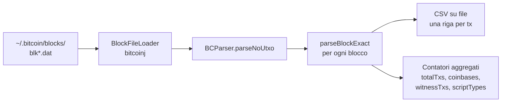

---
tags:
  - università/peer-to-peer-systems-and-blockchain
  - bitcoin
  - bitcoinj
  - java
  - script
  - blk-dat
  - blockchain-analysis
  - laboratorio
data: 2026-03-17
lezione: "Lab 4 - Script Classification e blk.dat"
professore: "Damiano Di Francesco Maesa"
---
## Cosa si è fatto in questa lezione

Quarto laboratorio Bitcoin. Si riprende da dove si era chiuso il lab precedente — la decodifica di una transazione raw — e si fa un salto di livello: invece di guardare transazioni **una alla volta**, si scrive un **parser dell'intera blockchain** che legge i file `blk*.dat` in cui Bitcoin Core salva i blocchi sul disco e produce statistiche aggregate (numero di transazioni, coinbase, witness, distribuzione dei tipi di script, indirizzi non decodificabili).

Il percorso logico della lezione è chiaro: prima si completa il parser di script costruendo le utility che **classificano** un output in una delle categorie standard (P2PK, P2PKH, P2SH, P2WPKH, P2WSH, `OP_RETURN`, empty) e che da uno `scriptPubKey` **ricavano l'indirizzo** nel formato Base58Check o Bech32 appropriato. Poi si fa un passo avanti e si applica il parser all'intera blockchain usando `BlockFileLoader` di bitcoinj.

> [!info] Obiettivi concreti del laboratorio
>
> - Scrivere `readRawTxAndDecode(rawHex)` che stampa per ogni input/output lo script in hex e come sequenza di opcode
> - Definire la classe `ScriptTypeCustom` con le costanti numeriche dei tipi di script e la funzione `typeName(code)` per stamparli
> - Scrivere `ScriptParser.typeFromOut(script)` che classifica un output pattern-matching sui byte
> - Scrivere `ScriptParser.addrFromOut(script)` che estrae l'indirizzo leggibile da uno `scriptPubKey` (P2PKH/P2SH con Base58Check, P2WPKH/P2WSH con Bech32)
> - **Esercizio**: estendere il parser per riconoscere anche **P2TR** (Taproot)
> - Conoscere il formato dei file `blk*.dat` di Bitcoin Core
> - Scrivere un `BCParser` che scorre tutti i `blk*.dat`, decodifica ogni transazione e produce statistiche aggregate sulla blockchain

---

## Riferimenti della lezione

- [Extending to Taproot — learnmeabitcoin.com/technical/script/p2tr](https://learnmeabitcoin.com/technical/script/p2tr/) — per l'esercizio di estensione
- [Bitcoin Core blk.dat format](https://learnmeabitcoin.com/technical/block/blkdat/) — spiegazione del layout binario dei file di blocchi

---

## Ripresa: decodificare uno script output

Per convenienza, la prima slide ricapitola il codice di parsing di una raw transaction con decodifica di input e output. È sostanzialmente il punto di arrivo del lab precedente:

```java
public static void readRawTxAndDecode(String rawHexTx) {
    byte[] ba = hexStringToByteArray(rawHexTx);
    ByteBuffer bf = ByteBuffer.wrap(ba);
    Transaction tx = Transaction.read(bf);

    for (TransactionInput in : tx.getInputs()) {
        byte[] inScript = in.getScriptBytes();
        System.out.println("INPUT script hex "     + bytesToHex(inScript));
        System.out.println("INPUT script OPcodes " + bytesToOpcode(inScript));
    }

    for (TransactionOutput out : tx.getOutputs()) {
        byte[] outScript = out.getScriptBytes();
        System.out.println("OUTPUT script hex "     + bytesToHex(outScript));
        System.out.println("OUTPUT script OPcodes " + bytesToOpcode(outScript));
        System.out.println("OUTPUT script Type "    + ScriptParser.typeFromOut(outScript));
        String outAddr = ScriptParser.addrFromOut(outScript);
        if (outAddr == null) outAddr = "#UNKNOWN#";
        System.out.println("OUTPUT script address " + outAddr);
    }
}
```

Il cuore interessante, ora, è quello che sta dentro `ScriptParser.typeFromOut` e `ScriptParser.addrFromOut`. Su di essi si basa tutta la classificazione successiva.

---

## `ScriptTypeCustom` — la tassonomia dei tipi di script

Per rendere il risultato del parser manipolabile (incrementi contatori, scelte basate sul tipo) si definisce una classe con costanti numeriche:

```java
public class ScriptTypeCustom {
    // type of script used 1=P2PK 2=P2PKH 3=P2SH 4=P2MS 5=other
    public static final int UNKNOWN = 0;
    public static final int P2PK    = 1;
    public static final int P2PKH   = 2;
    public static final int P2SH    = 3;
    public static final int RETURN  = 4;
    public static final int EMPTY   = 5;
    public static final int P2WPKH  = 6;
    public static final int P2WSH   = 7;
    public static final int SUPPORTEDSCRIPTTYPES = 8;

    // multisig example: txhash da738e29f64e90ae46dcc3e6b4154041d6324abbe7919e722d486a4a3148b7dc

    public static String typeName(int code) {
        switch (code) {
            case UNKNOWN: return "UNKNOWN";
            case P2PK:    return "P2PK";
            case P2PKH:   return "P2PKH";
            case P2SH:    return "P2SH";
            case RETURN:  return "PROVABLY UNSPENDABLE";
            case EMPTY:   return "ANYONE CAN SPEND";
            case P2WPKH:  return "P2WPKH";
            case P2WSH:   return "P2WSH";
            default:      return "ERROR - UNRECOGNIZED SCRIPT CODE";
        }
    }
}
```

Due etichette meritano commento:

- **`RETURN` → "PROVABLY UNSPENDABLE"**: un output con `OP_RETURN` non è mai spendibile, il nodo lo sa a priori e lo esclude dal UTXO set.
- **`EMPTY` → "ANYONE CAN SPEND"**: uno script vuoto valuta banalmente a `true`, quindi il primo chiunque può creare una transazione che lo spende. In pratica è un errore, ma esiste qualche transazione con output simili nei primi blocchi della blockchain.

Il commento sull'hash `da738e29f64e90ae46dcc3e6b4154041d6324abbe7919e722d486a4a3148b7dc` è un esempio di transazione con **bare multisig** (P2MS): uno script multisig pubblicato direttamente, senza essere impacchettato in P2SH. Non è riconosciuto dal parser della lezione (ricade in `UNKNOWN`) ma è importante sapere che esiste.

---

## `ScriptParser.typeFromOut` — classificare un output per pattern matching

L'idea è banale e potente allo stesso tempo: ogni tipo di script ha una **forma canonica** in termini di opcode; basta verificare se lo `scriptPubKey` ha esattamente quella forma.

```java
public class ScriptParser {
    private static final int OP_DUP           = 118;
    private static final int OP_HASH160       = 169;
    private static final int OP_EQUALVERIFY   = 136;
    private static final int OP_CHECKSIG      = 172;
    private static final int OP_CHECKSIGVERIFY = 173;
    private static final int OP_EQUAL         = 135;
    private static final int OP_RETURN        = 106;
    // between 1 and 75 it is a relevant op_push_data@ i.e. number of bytes to be pushed to the stack
    private static final int OP_PUSHDATA20 = 20;
    private static final int OP_PUSHDATA32 = 32;
    private static final int OP_PUSHDATA33 = 33;
    private static final int OP_PUSHDATA65 = 65;
    private static final int OP_0 = 0;

    private static boolean isOpCode(byte b, int opcode) {
        return Utilities.readUnsignedByte(b) == opcode;
    }

    public static int typeFromOut(byte[] script) {
        if ((script == null) || (script.length < 1))
            return ScriptTypeCustom.EMPTY;
        // no empty script
        if (isOpCode(script[0], OP_RETURN))
            return ScriptTypeCustom.RETURN;
        else if (isOpCode(script[0], OP_DUP) && (script.length >= 23)) {
            // P2PKH
            if (isOpCode(script[1], OP_HASH160) && isOpCode(script[2], OP_PUSHDATA20))
                return ScriptTypeCustom.P2PKH;
            else return ScriptTypeCustom.UNKNOWN;
        } else if (isOpCode(script[0], OP_PUSHDATA65) && (script.length >= 66)) {
            return ScriptTypeCustom.P2PK;
        } else if ((script.length == 66) &&
                   ((isOpCode(script[script.length - 1], OP_CHECKSIG))
                 || (isOpCode(script[script.length - 1], OP_CHECKSIGVERIFY)))) {
            // old broken P2PK
            return ScriptTypeCustom.P2PK;
        } else if (isOpCode(script[0], OP_HASH160)) {
            if ((script.length >= 23) && isOpCode(script[1], OP_PUSHDATA20)
                && (isOpCode(script[script.length - 1], OP_EQUAL)
                 || isOpCode(script[script.length - 1], OP_EQUALVERIFY))) {
                // P2SH 160
                return ScriptTypeCustom.P2SH;
            } else return ScriptTypeCustom.UNKNOWN;
        } else if (isOpCode(script[0], OP_0)) {
            // support for native segwit
            if (isOpCode(script[1], OP_PUSHDATA20) && (script.length == 22)) {
                // P2WPKH
                return ScriptTypeCustom.P2WPKH;
            } else if (isOpCode(script[1], OP_PUSHDATA32) && (script.length == 34)) {
                // P2WSH
                return ScriptTypeCustom.P2WSH;
            } else return ScriptTypeCustom.UNKNOWN;
        } else return ScriptTypeCustom.UNKNOWN;
    }
}
```

### Le forme canoniche in tabella

| Tipo | Lunghezza | Pattern |
|---|---|---|
| **P2PKH** | 25 byte | `OP_DUP OP_HASH160 <20B pubKeyHash> OP_EQUALVERIFY OP_CHECKSIG` |
| **P2PK** (moderno) | 67 byte | `<65B pubKey uncompressed> OP_CHECKSIG` |
| **P2PK** (rotto/vecchio) | 66 byte | forma storica mal-formattata che finisce con `OP_CHECKSIG(VERIFY)` |
| **P2SH** | 23 byte | `OP_HASH160 <20B scriptHash> OP_EQUAL` |
| **P2WPKH** | 22 byte | `OP_0 <20B pubKeyHash>` |
| **P2WSH** | 34 byte | `OP_0 <32B scriptHash>` |
| **RETURN** | variabile | inizia con `OP_RETURN` |
| **EMPTY** | 0 byte | script vuoto |

> [!warning] Il caso "old broken P2PK"
>
> Nei primissimi blocchi di Bitcoin alcuni script P2PK hanno una forma non perfettamente canonica (mancano byte di push espliciti, o usano `OP_CHECKSIGVERIFY` invece di `OP_CHECKSIG`). Il parser gestisce questo caso di recupero per evitare di classificarli come `UNKNOWN`. È il tipo di dettaglio storico che emerge solo quando si analizza la blockchain dall'inizio.

### Esercizio: estendere a P2TR

> [!example] Esercizio — aggiungere Taproot
>
> **P2TR** (Taproot) ha forma:
>
> ```
> OP_1 <32B x-only pubKey>
> ```
>
> ovvero la witness version `0x51` (`OP_1`) seguita da un push di 32 byte. Basta aggiungere una costante `P2TR = 8` in `ScriptTypeCustom`, aumentare `SUPPORTEDSCRIPTTYPES`, e nel parser aggiungere un ramo analogo a `OP_0`:
>
> ```java
> } else if (isOpCode(script[0], OP_1)) {
>     if (isOpCode(script[1], OP_PUSHDATA32) && (script.length == 34))
>         return ScriptTypeCustom.P2TR;
>     else return ScriptTypeCustom.UNKNOWN;
> }
> ```
>
> Rimane da aggiungere `typeName`, l'encoding Bech32m (diverso dal Bech32 di SegWit v0!) in `addrFromOut`, e il supporto al tipo in tutte le statistiche. Vedi [learnmeabitcoin.com/technical/script/p2tr](https://learnmeabitcoin.com/technical/script/p2tr/) per il formato completo.

---

## `ScriptParser.addrFromOut` — ricavare l'indirizzo dallo script

Una volta classificato il tipo, estrarre l'indirizzo significa applicare l'encoding giusto all'hash giusto. Il codice mostrato è un `switch` strutturato che copia la porzione di script rilevante in un array di byte e lo passa al codificatore corretto.

```java
public static String addrFromOut(byte[] script) {
    if ((script == null) || (script.length < 1)) return null;
    // no empty script
    if (isOpCode(script[0], OP_RETURN))
        return null;
    else if (isOpCode(script[0], OP_DUP) && (script.length >= 23)) {
        // it is P2PKH
        if (isOpCode(script[1], OP_HASH160) && isOpCode(script[2], OP_PUSHDATA20)) {
            byte[] res = new byte[20];
            System.arraycopy(script, 3, res, 0, 20);
            return getAddressFromPubHash(res);
        } else return null;
    } else if (isOpCode(script[0], OP_PUSHDATA65) && (script.length >= 66)) {
        // it is P2PK
        byte[] res = new byte[65];
        System.arraycopy(script, 1, res, 0, 65);
        return getAddressFromPubKey(res);
    } else if ((script.length == 66) &&
               ((isOpCode(script[script.length - 1], OP_CHECKSIG))
             || (isOpCode(script[script.length - 1], OP_CHECKSIGVERIFY)))) {
        // old broken version of P2PK without initial length byte
        byte[] res = new byte[65];
        System.arraycopy(script, 0, res, 0, 65);
        return getAddressFromPubKey(res);
    } else if (isOpCode(script[0], OP_HASH160)) {
        if ((script.length >= 23) && isOpCode(script[1], OP_PUSHDATA20)
            && (isOpCode(script[script.length - 1], OP_EQUAL)
             || isOpCode(script[script.length - 1], OP_EQUALVERIFY))) {
            // it is P2SH 160
            byte[] res = new byte[20];
            System.arraycopy(script, 2, res, 0, 20);
            return getAddressFromScriptHash(res);
        } else return null;
    } else if (isOpCode(script[0], OP_0)) {
        // support for native segwit
        if (isOpCode(script[1], OP_PUSHDATA20) && (script.length == 22)) {
            // P2WPKH
            byte[] res = new byte[20];
            System.arraycopy(script, 2, res, 0, 20);
            return SegwitAddress.fromHash(MainNetParams.get(), res).toBech32();
        } else if (isOpCode(script[1], OP_PUSHDATA32) && (script.length == 34)) {
            // P2WSH
            byte[] res = new byte[32];
            System.arraycopy(script, 2, res, 0, 32);
            return SegwitAddress.fromHash(MainNetParams.get(), res).toBech32();
        } else return null;
    } else return null;
}
```

### Helper di encoding

```java
// PRE: b is long 20
public static String getAddressFromPubHash(byte[] b) {
    // add version "00"
    byte[] version = { 0 };
    // base58check encoding
    return Base58.encodeChecked(version[0], b);
}

// PRE: b is long 65
public static String getAddressFromPubKey(byte[] b) {
    // get hash160 from pubkey
    // perform sha256
    // perform ripemd160
    // encode hash160
    return getAddressFromPubHash(sha256Ghash160(b));
}

// PRE: b is long 20
public static String getAddressFromScriptHash(byte[] b) {
    // add version "05"
    byte[] version = { 5 };
    // base58check encoding
    return Base58.encodeChecked(version[0], b);
}
```

> [!tip] I due encoding
>
> - **Base58Check** per gli indirizzi legacy (P2PK, P2PKH, P2SH): version byte + payload + checksum (doppio SHA-256, primi 4 byte), il tutto codificato in Base58 (niente `0`, `O`, `I`, `l` per evitare confusione visiva)
> - **Bech32** per SegWit nativo (P2WPKH, P2WSH): include il witness program, una HRP (`bc` per mainnet) e un checksum con proprietà di error-correction molto migliori
>
> I version byte per gli indirizzi Base58Check mainnet: **`0x00`** per P2PK/P2PKH (prefisso `1`), **`0x05`** per P2SH (prefisso `3`).

---

## Bitcoin Core — i file blk.dat

Arrivati a questo punto il laboratorio fa il salto di scala: non una transazione alla volta, ma l'intera blockchain, come viene effettivamente archiviata da Bitcoin Core sul disco.

> [!definition] blk*.dat
>
> Bitcoin Core, una volta sincronizzato, **non** tiene i blocchi in un database relazionale: li memorizza in una sequenza di file binari denominati `blk00000.dat`, `blk00001.dat`, ecc., ciascuno grande circa 128 MB, contenuti tipicamente in `~/.bitcoin/blocks/`. Ogni file contiene una serie di blocchi concatenati, ciascuno preceduto da un *magic number* (`0xF9BEB4D9` per mainnet) e dalla lunghezza del blocco. I blocchi **non sono necessariamente in ordine di altezza** — vengono scritti nell'ordine in cui arrivano durante la sincronizzazione, che in presenza di riorganizzazioni può non coincidere con quello della catena canonica.
>
> Riferimento: [learnmeabitcoin.com/technical/block/blkdat](https://learnmeabitcoin.com/technical/block/blkdat/)

Perché parsare i blk.dat invece di usare la JSON-RPC di Bitcoin Core? Perché è **drasticamente più veloce**: non c'è overhead di IPC né di serializzazione JSON, si legge direttamente il binario che il nodo stesso ha scritto. Per analisi di grandi quantità di blocchi (contare script types su tutta la storia, ricostruire il UTXO set, etc.) è l'unico approccio praticabile.

---

## `BCParser` — analizzare l'intera blockchain

Il laboratorio costruisce una classe `BCParser` che scorre tutti i file blk.dat e raccoglie statistiche.

### Struttura della classe

```java
public class BCParser {

    // Location of block files
    String chaindataFolder;
    int DEBUGtotalTxs;
    int DEBUGcoinbaseCounter;
    int DEBUGwitnessTxs;
    int DEBUGnullAddresses;
    int[] DEBUGscriptTypes;

    public BCParser(String f) {
        chaindataFolder = f;
        DEBUGtotalTxs = 0;
        DEBUGcoinbaseCounter = 0;
        DEBUGwitnessTxs = 0;
        DEBUGnullAddresses = 0;
        DEBUGscriptTypes = new int[ScriptTypeCustom.SUPPORTEDSCRIPTTYPES];
        for (int i = 0; i < DEBUGscriptTypes.length; i++)
            DEBUGscriptTypes[i] = 0;
    }

    // The method returns a list of files in a directory according to a certain
    // pattern (block files have name blkNNNNN.dat)
    public static List<File> buildList(String PREFIX) {
        List<File> list = new LinkedList<File>();
        for (int i = 0; true; i++) {
            File file = new File(PREFIX + String.format(Locale.US, "blk%05d.dat", i));
            if (!file.exists()) break;
            list.add(file);
        }
        return list;
    }
}
```

La `buildList` costruisce la lista dei file blk.dat scandendo ordinatamente `blk00000.dat`, `blk00001.dat`, ... finché ne trova uno mancante. Questa lista viene passata al `BlockFileLoader` di bitcoinj, che espone la sequenza di blocchi come un iterabile Java.

### Il parser principale

```java
public void parseNoUtxo(File out, int n) throws IOException {
    NetworkParameters np = MainNetParams.get();
    // Creates a BlockFileLoader object by passing a list of .dat files.
    BlockFileLoader loader = new BlockFileLoader(np, buildList(chaindataFolder));
    BufferedWriter bw = new BufferedWriter(new FileWriter(out));

    int blockCounter = 0;
    // NOTE: blocks are not ordered, so this is NOT the same as block height!!
    for (Block block : loader) {
        if (blockCounter >= n) break;
        if (blockCounter % 20000 == 0) {
            System.out.println("Analysed " + blockCounter + " NOT ORDERED blocks.");
            System.out.println(blockCounter + " - " + block.getHashAsString());
        }
        parseBlockExact(block, bw);
        blockCounter++;
    } // End of iteration over blocks
    bw.close();

    System.out.println("TotalTxs " + DEBUGtotalTxs
        + " , of which coinbases are " + DEBUGcoinbaseCounter
        + " and " + DEBUGwitnessTxs + " are witness transactions.");
    System.out.println("Scripts found :");
    int ttemp = 0;
    for (int i = 0; i < DEBUGscriptTypes.length; i++) {
        System.out.println(DEBUGscriptTypes[i] + " " + ScriptTypeCustom.typeName(i));
        ttemp += DEBUGscriptTypes[i];
    }
    System.out.println("Total : " + ttemp + " (" + DEBUGnullAddresses + " null addresses).");
}
```

> [!warning] I blocchi non sono ordinati
>
> Il commento nel codice è importante: `BlockFileLoader` restituisce i blocchi **nell'ordine in cui sono stati scritti sul disco**, che non coincide con l'altezza. Il 20000-esimo blocco processato **non è il blocco 20000 della catena**. Se serve l'ordine per altezza bisogna ricostruirlo a parte, usando i `prevBlockHash` per fare il chaining (e scartando gli orfani).

### `parseBlockExact` — processare un singolo blocco

Il secondo metodo scrive su file, per ogni transazione del blocco, una riga con le informazioni generali seguite da input e output.

```java
/**
 * Outputs script info for the given block as:
 * one tx per line
 * generalInfo ':' InputsInfo (empty if coinbase) ':' OutputsInfo
 * generalInfo := timeStamp',' blockHash',' txHash',' isCoinbase',' txSizeEstimate
 */
public void parseBlockExact(Block block, BufferedWriter bw) throws IOException {
    boolean isCoinbase;
    boolean first;
    StringBuilder line;
    for (Transaction tx : block.getTransactions()) {
        DEBUGtotalTxs++;
        // write tx general infos:
        // timestamp, blockHash, txHash, isCoinbase, estimatedSize, hasWitness
        line = new StringBuilder();
        line.append(block.time());
        line.append(",");
        line.append(block.getHashAsString());
        line.append(",");
        line.append(tx.getTxId().toString());
        line.append(",");
        if (tx.isCoinBase()) {
            isCoinbase = true;
            line.append("1");
        } else {
            isCoinbase = false;
            line.append("0");
        }
        line.append(",");
        line.append(tx.getVsize());
        line.append(",");
        if (tx.hasWitnesses()) {
            DEBUGwitnessTxs++;
            line.append("1");
        } else {
            line.append("0");
        }
        line.append(":");
        if (isCoinbase) {
            DEBUGcoinbaseCounter++;
        } else {
            // not coinbase so there is at least one input
            // save inputs in the format
            // |prevTx_Id,prevTxPos|*
            first = true;
            for (TransactionInput ii : tx.getInputs()) {
                if (first) first = false;
                else line.append(";");
                //line.append(Utilities.byteArrayToHexString(ii.getScriptBytes()));
                line.append(ii.getOutpoint().hash().toString());
                line.append(",");
                line.append(ii.getOutpoint().index());
            }
        }
        line.append(":");
        // save outputs in the format
        // |addr,amount,scriptType|[:addr,amount,scriptType]*
        // there is always at least one output
        first = true;
        for (TransactionOutput oo : tx.getOutputs()) {
            if (first) first = false;
            else line.append(";");
            byte[] outScript = oo.getScriptBytes();
            String outAddr = ScriptParser.addrFromOut(outScript);
            int outType = ScriptParser.typeFromOut(outScript);
            DEBUGscriptTypes[outType]++;
            if (outAddr == null) {
                // writes '#num' as address if not decodable
                outAddr = "#" + DEBUGnullAddresses;
                DEBUGnullAddresses++;
            }
            line.append(outAddr);
            line.append(",");
            line.append(oo.getValue().getValue());
            line.append(",");
            line.append(outType);
        }
        bw.write(line.toString());
        bw.newLine();
    }
}
```

### Formato del CSV-like in output

Ogni riga rappresenta una transazione e ha la forma:

```
timestamp,blockHash,txHash,isCoinbase,vsize,hasWitness : inputs : outputs
```

dove:

- **`inputs`** (vuoto se coinbase): `prevTxHash,prevTxPos;prevTxHash,prevTxPos;...`
- **`outputs`**: `addr,amount,scriptType;addr,amount,scriptType;...`

Gli indirizzi non decodificabili vengono rimpiazzati con un progressivo `#0`, `#1`, ... in modo da avere comunque un identificatore univoco per riga.


*Fig. — Pipeline di `BCParser`: dai file blk.dat al CSV-like con statistiche aggregate sulla blockchain intera.*

### Analisi possibili a valle

Con un output CSV-like di questo tipo si possono rispondere a domande come:

- Quanti script di tipo P2PKH vs P2SH vs P2WPKH ci sono nella storia di Bitcoin? E come è cambiato il mix nel tempo (segmentando sul timestamp)?
- Quante transazioni SegWit sono state fatte dopo l'attivazione di agosto 2017?
- Quanti output sono `PROVABLY UNSPENDABLE` (OP_RETURN)? Che payload contengono?
- Quanti indirizzi sono rimasti `UNKNOWN` — e quindi usano script non-standard (bare multisig, condizioni custom, ecc.)?

> [!tip] Il limite: niente UTXO set
>
> Il parser scritto in questo laboratorio si chiama `parseNoUtxo` per una ragione: non ricostruisce il set degli output non spesi. Per farlo bisognerebbe, per ogni input, cercare l'output corrispondente (prevTxHash + prevTxPos) e rimuoverlo dalla collezione degli UTXO vivi. È fattibile ma richiede molto più lavoro e memoria. Nella versione attuale ci si limita alle statistiche per transazione.

---

## Sintesi operativa

> [!abstract] Cosa resta in mano dopo il laboratorio
>
> - Un **classificatore di script** Bitcoin che riconosce per pattern i tipi standard (P2PK, P2PKH, P2SH, P2WPKH, P2WSH, OP_RETURN, empty) e restituisce un codice numerico
> - Un **decodificatore di indirizzo** che applica Base58Check (con version 0x00 o 0x05) o Bech32 a seconda del tipo di script
> - Un esercizio di estensione per Taproot (`OP_1 <32B>` + Bech32m)
> - Conoscenza del formato dei file `blk*.dat` di Bitcoin Core
> - Un **parser dell'intera blockchain** (`BCParser`) che legge i blk.dat tramite `BlockFileLoader`, scrive un CSV-like con una riga per transazione, e tiene contatori aggregati su tipi di script, coinbase, witness e indirizzi non decodificabili

> [!question] Possibili domande d'esame
>
> - Elencare i tipi di script Bitcoin standard e la loro forma canonica in termini di opcode.
> - Perché un output con `OP_RETURN` è detto *provably unspendable*? Perché un output con script vuoto è detto *anyone can spend*?
> - Come si ricava un indirizzo legacy da uno `scriptPubKey` P2PKH e quale version byte si usa nel Base58Check?
> - Quale differenza c'è tra l'encoding Base58Check e l'encoding Bech32, e a quali tipi di indirizzo si applicano?
> - Cos'è un file `blk.dat`? In che ordine vengono memorizzati i blocchi al suo interno, e perché non coincide con l'altezza?
> - Descrivere il flusso del `BCParser`: input, output, statistiche aggregate prodotte.
> - Perché parsare direttamente i blk.dat può essere preferibile rispetto a interrogare la JSON-RPC del nodo Bitcoin Core?
