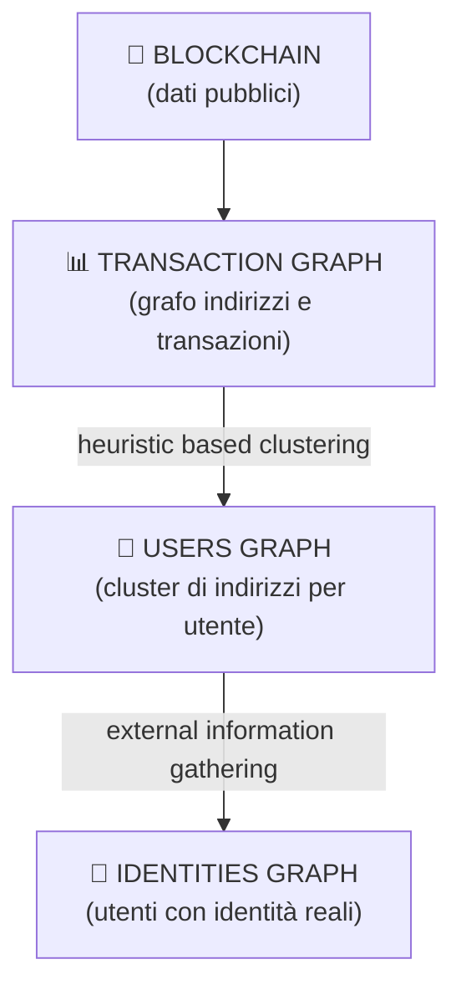

---
tags:
  - università/p2p-systems-blockchain
  - bitcoin
  - anonimato
  - deanonimizzazione
  - analisi-blockchain
data: 2026-03-30
lezione: "17 - (Lab) Bitcoin: Anonimato e Deanonimizzazione"
professore: "Damiano Di Francesco Maesa"
---

# (Lab) Bitcoin: Anonimato e Deanonimizzazione

Questa quinta lezione di laboratorio affronta due temi correlati: il completamento della pipeline di parsing del `blk.dat` con la gestione degli UTXO, e l'analisi dell'anonimato in Bitcoin, che è una delle proprietà più fraintese della blockchain. Il filo conduttore è che la blockchain è pubblica e persistente: tutto ciò che avviene su di essa è osservabile, e l'unica protezione offerta nativamente è la **pseudonimia**, non l'anonimato vero.

---

## Completamento della pipeline: dal blk.dat al CSV con UTXO

### Il problema degli UTXO nel formato custom

Nelle lezioni precedenti si era costruito un formato CSV custom per rappresentare le transazioni Bitcoin estratte dal `blk.dat`. Il formato aveva due problemi principali: i blocchi non erano ordinati per altezza, e le transazioni non contenevano informazioni dirette sugli UTXO (cioè, gli input referenziavano le transazioni precedenti per hash, non per valore). Il metodo `cleanExactNoUtxo` in Java risolve il primo problema in modo sequenziale: prima inferisce una mappa da block hash a block height (`inferBlockHeightMap`), poi sostituisce gli hash dei blocchi con le altezze numeriche (`replaceBlockHashes`), quindi ordina le transazioni per altezza del blocco (`sortPreservingTxOrder`), e infine sostituisce gli hash delle transazioni e degli indirizzi con ID numerici incrementali a partire da zero. Il risultato è un file ordinato con ID compatti, adatto a successive elaborazioni.

Il metodo `fillItUtxo` affronta invece il secondo problema: leggendo il CSV ordinato, mantiene in memoria una mappa `TreeMap<TxOutputIds, TxOutputCouple>` che tiene traccia degli output non ancora spesi. Per ogni input di ogni transazione, consulta questa struttura per recuperare il valore e l'indirizzo sorgente, aggiungendoli al record dell'input nel CSV. Quando un UTXO viene consumato, viene rimosso dalla mappa. Il codice gestisce anche casi limite come le transazioni coinbase (che non hanno input reali), le incoerenze nel dataset e i fee negativi.

> [!warning] Complessità e ordinamento
>
> Il metodo `fillItUtxo` funziona correttamente **solo** su un file già ordinato per block height. Senza ordinamento, gli UTXO verrebbero cercati prima di essere creati, causando errori di lookup sistematici. La separazione tra `cleanExactNoUtxo` e `fillItUtxo` riflette proprio questa dipendenza sequenziale.

---

## Anonimato in Bitcoin: pseudonimia e i suoi limiti

### Che cosa garantisce Bitcoin

Bitcoin non è anonimo: è **pseudonimo**. La differenza è sostanziale. In un sistema anonimo, le transazioni non sono riconducibili ad alcun attore. In Bitcoin, ogni transazione è firmata con la chiave privata dell'indirizzo mittente, e l'intera storia delle transazioni è pubblica e permanente nella blockchain. L'identità reale di chi controlla un indirizzo non è direttamente visibile, ma le sue azioni (movimenti di fondi, tempi, importi) sono completamente tracciate.

Un utente può generare un numero arbitrario di indirizzi diversi — è anzi pratica consigliata usarne uno nuovo per ogni transazione. Ma questo non rompe la pseudonimia: significa solo che la stessa persona reale controlla più pseudonimi. Il problema è che le euristiche di clustering, descritte più avanti, riescono spesso a raggruppare questi indirizzi ricondizionandoli allo stesso utente.

Un ulteriore punto di debolezza è che le transazioni vengono diffuse nella rete P2P principalmente dai loro creatori tramite **gossip**. Chi le crea le ha firmate, quindi conosce le chiavi private degli input: è il proprietario degli indirizzi. Questa osservazione è alla base degli attacchi di network listening.

---

## Attacchi di deanonimizzazione

### La pipeline concettuale

Un attacco di deanonimizzazione mira a collegare le identità reali del mondo fisico con gli indirizzi pseudonimi della blockchain. Il processo si articola in tre stadi progressivi, ciascuno con risorse e strumenti diversi:

*Fig. — Pipeline di deanonimizzazione: dalla blockchain al grafo delle identità reali.*

Il primo stadio è puramente passivo: si costruisce il **transaction graph** dalla blockchain pubblica, dove i nodi sono indirizzi e gli archi rappresentano flussi di fondi. Il secondo stadio applica **euristiche di clustering** per raggruppare indirizzi che probabilmente appartengono allo stesso utente, ottenendo un **users graph** dove i nodi sono cluster. Il terzo stadio arricchisce il users graph con **informazioni esterne** per etichettare i cluster con identità reali, producendo l'**identities graph**.

### Clustering euristico

Le euristiche si basano sull'osservazione del comportamento reale degli utenti Bitcoin e sui vincoli tecnici del protocollo. Sono dipendenti dal tempo (le abitudini degli utenti cambiano) e non universali: generano falsi positivi e falsi negativi. La prassi è preferire la riduzione dei falsi positivi a scapito di un aumento dei falsi negativi, perché attribuire erroneamente indirizzi a un utente sbagliato è più grave che non attribuirli affatto.

> [!definition] Common Inputs Heuristic (euristica degli input comuni)
>
> Tutti gli indirizzi usati come input in una stessa transazione appartengono allo stesso utente. La logica è che per firmare gli input di una transazione servono le chiavi private corrispondenti: solo chi le possiede tutte può costruire quella transazione. Quindi gli indirizzi di input condividono necessariamente lo stesso proprietario.

Graficamente, una transazione con input multipli `addr_1, addr_2, ..., addr_n` produce un arco tra tutti gli indirizzi nel users graph, che vengono riuniti nello stesso cluster. L'implementazione efficiente si riduce a trovare le **componenti connesse** del grafo degli input, ottenibile con una BFS in complessità lineare.

> [!definition] Change Address Heuristic (euristica dell'indirizzo di resto)
>
> Quando si spende un UTXO, il valore in eccesso rispetto all'importo inviato viene restituito al mittente su un nuovo indirizzo, detto *change address* (indirizzo di resto). L'euristica assume che tale indirizzo appartenga allo stesso utente degli indirizzi di input.

Identificare il change address non è banale: in una transazione con più output, quale è il destinatario e quale è il resto? La versione raffinata dell'euristica definisce criteri precisi:

> [!tip] Criteri per identificare un change address (versione raffinata)
>
> L'indirizzo $c$ è un change address nella transazione $t$ se e solo se:
> - $t$ non è una transazione coinbase
> - $|\text{outputs}(t)| > 1$ (almeno due output: uno di destinazione, uno di resto)
> - $\text{inputs}(t) \cap \text{outputs}(t) = \emptyset$ (nessun "self-change" diretto)
> - Nessun altro indirizzo negli output di $t$ è già noto come change address o appartiene al cluster del mittente
> - È la **prima volta** che $c$ compare nella blockchain
> - Nessun altro indirizzo negli output soddisfa contemporaneamente queste condizioni (univocità)

La condizione di prima comparsa è particolarmente rilevante: un utente attento genera un indirizzo fresco per ogni resto, quindi un indirizzo mai visto prima è un forte indizio che si tratti di un change address. Regole aggiuntive possono essere introdotte per tenere conto di pattern comportamentali noti (es. wallet specifici che generano output in un certo ordine).

### Raccolta di informazioni esterne

Anche le euristiche più raffinate lavorano solo su dati on-chain. Per associare cluster a identità reali si ricorre a fonti esterne:

- **Timing analysis**: se due transazioni avvengono in rapida successione, possono essere collegate allo stesso utente o dispositivo.
- **Amount analysis**: importi molto precisi o ricorrenti possono rivelare pattern di utilizzo.
- **Log interni di servizi terzi**: exchange, wallet custodial e marketplace raccolgono dati KYC (*Know Your Customer*) e indirizzi di consegna fisici. Se le autorità accedono a questi log, l'associazione indirizzo–identità è diretta.
- **Dust attack**: l'attaccante invia una quantità minuscola di BTC (*dust*) a un indirizzo bersaglio. Se il wallet della vittima usa automaticamente quel UTXO come input in una transazione futura, quell'indirizzo viene collegato tramite la common inputs heuristic ad altri indirizzi dello stesso utente.

Un caso emblematico di informazione esterna è il tweet di WikiLeaks del 14 giugno 2011 che pubblicava esplicitamente il proprio indirizzo di donazione Bitcoin (`1HB5XMLmzFVj8ALj6mfBsbifRoD4miY36v`). Da quel momento in poi, quell'indirizzo è permanentemente e pubblicamente etichettato nella blockchain.

### Network listening

Il network listening è una tecnica che mira a correlare un indirizzo Bitcoin con l'indirizzo IP del suo proprietario, sfruttando le proprietà del protocollo di diffusione delle transazioni.

Le assunzioni di base (non necessariamente sempre vere) sono due: il primo nodo a diffondere una nuova transazione nella rete è con alta probabilità il suo creatore, e il creatore, avendo firmato la transazione, conosce le chiavi private degli input e quindi è il proprietario degli indirizzi corrispondenti.

L'attaccante inserisce nella rete P2P un gran numero di **nodi ascoltatori** sotto il proprio controllo, con connettività elevata e connessioni veloci. Grazie all'alta connettività, questi nodi ricevono le transazioni appena diffuse quasi in contemporanea con i vicini del creatore. Triangolando i tempi di ricezione tra tutti i nodi ascoltatori, si stima quale nodo della rete ha originato la transazione. L'IP del nodo originante viene quindi associato all'indirizzo Bitcoin degli input.

> [!warning] Limiti del network listening
>
> L'IP di un nodo non equivale sempre all'identità del proprietario: NAT, VPN, Tor e proxy possono nasconderlo. Per questo l'attaccante può raffinare la stima combinando IP con l'insieme degli *entry node* usati dalla vittima. Inoltre, solo i **full node** sono direttamente targetizzabili, poiché i light client non propagano le transazioni direttamente.

### Topology discovery

Il network listening è spesso accoppiato con la **scoperta della topologia** della rete P2P. Conoscere la topologia aumenta la precisione della triangolazione, perché permette di modellare accuratamente il percorso di propagazione del gossip. Poiché Bitcoin non ha un overlay strutturato, l'unico modo per conoscere la topologia è chiedere direttamente ai nodi la loro lista di vicini. Questo processo può **corrompere le liste di connessione** degli altri nodi (pollution attack) e può causare effetti simili a un DoS sulla rete, poiché richiede connessioni dirette con ogni nodo target.

---

## Dataset: Users Graph 2013 e caso Wikileaks

Come caso di studio pratico, il laboratorio utilizza un sottoinsieme della blockchain del 2013 relativo a WikiLeaks: i blocchi dalla height 130863 alla 131006 (144 blocchi), contenenti 6094 transazioni che coinvolgono 8129 indirizzi. L'indirizzo di donazione di WikiLeaks (`1HB5XMLmzFVj8ALj6mfBsbifRoD4miY36v`) è l'anchor noto nel dataset. Il Users Graph 2013 dell'intera blockchain di quell'anno, una volta costruito e labelizzato, mostra cluster identificabili con servizi noti come Mt. Gox, Silk Road, BTC-e, Bitstamp e altri exchange o marketplace, evidenziando come la deanonimizzazione pratica fosse già possibile a quell'epoca.

> [!abstract] Assignment del laboratorio
>
> Costruire il **users graph** come mappa indirizzo → cluster ID applicando la **common inputs heuristic** al dataset Wikileaks sopra descritto. Il tip suggerito è di ridurre il problema al calcolo delle **componenti connesse** del grafo degli input, risolvibile con una BFS in complessità lineare $O(V + E)$.

---

## Tracciamento dei furti: taint analysis

La natura pubblica e immutabile della blockchain può essere usata anche in senso difensivo. Quando un furto di Bitcoin viene reso pubblico, l'indirizzo del ladro diventa noto a tutta la community. Gli utenti onesti possono tracciare i movimenti dei fondi rubati e applicare **blacklisting** sugli indirizzi del ladro. In pratica, è difficile tracciare con certezza *tutti* i fondi rubati, ma è spesso sufficiente tracciarne una piccola parte fino a un servizio terzo (un exchange, un mixer) per stabilire con alta probabilità che il ladro ne detiene il controllo.

> [!definition] Taint Analysis (analisi della contaminazione)
>
> Il **taint value** dell'indirizzo $A$ rispetto all'indirizzo $B$ è la percentuale dei fondi attualmente in possesso di $A$ che possono essere fatti risalire a $B$. Formalmente misura la dipendenza economica tra due indirizzi lungo la catena delle transazioni.

La taint analysis è uno strumento di base per seguire fondi rubati ma non tiene conto della *proprietà*: sa che i fondi sono passati per un certo indirizzo, ma non chi lo controlla. Due casi storici illustrano l'applicazione:

- **Furto allinvain** (13/06/2011, 25.001 BTC): l'analisi del transaction graph mostrò i fondi convergere verso il servizio MyBitcoin attraverso una serie di transazioni intermedie, identificando percorsi di movimento con timestamp precisi.
- **Ransomware TorrentLocker 2 (CryptoWall 2)** (15/09/2014, target: PA italiana): il malware richiedeva riscatti in Bitcoin. Tracciando gli indirizzi delle vittime note fu possibile seguire parte dei fondi raccolti e identificare gli exchange usati per il cashout.

---

## Contromisure per la privacy

### CoinJoin e CoinShuffle

**CoinJoin** (2013) è la prima contromisura collaborativa: più utenti si accordano per unire i propri input in un'unica transazione grande, firmata collettivamente. L'accordo può avvenire tramite un server di rendezvous centralizzato o tramite consensus decentralizzato. Si possono costruire catene di transazioni CoinJoin per aumentare l'offuscamento. I limiti principali sono che l'anonimato all'interno di ogni transazione è limitato al numero di partecipanti, che esiste linkabilità interna (gli output sono ancora osservabili), che è vulnerabile a DoS da parte di partecipanti malevoli, e che nascondere gli IP dei partecipanti richiede strumenti aggiuntivi.

**CoinShuffle** (2014) migliora CoinJoin introducendo un protocollo di shuffling crittografico degli output che elimina la linkabilità interna: nemmeno il server di coordinamento può sapere quale output corrisponde a quale input.

### Tecniche di offuscamento

Indipendentemente da CoinJoin, esistono tecniche individuali per spezzare il tracciamento della proprietà:

| Tecnica | Descrizione |
|---|---|
| **Split** | Divide un UTXO in molti output piccoli verso indirizzi diversi |
| **Aggregation** | Aggrega molti UTXO piccoli in uno grande per rompere il grafo |
| **Peeling chain** | Invia una quantità fissa ripetutamente, mantenendo un "residuo" che scorre verso un indirizzo fresco a ogni passo |
| **Binary tree** | Struttura ad albero di transazioni per distribuire i fondi su molteplici rami |

La **peeling chain** è particolarmente visibile nell'analisi on-chain: genera una sequenza lineare di transazioni dove ogni nodo ha un output di importo fisso (il pagamento) e uno di importo decrescente (il residuo). Si riconosce facilmente e non offre vera protezione a un analista esperto.

### Mixer

I **mixer** (o tumbler) sono servizi che accettano Bitcoin da un utente e restituiscono la stessa quantità (meno fee) prelevandola dai fondi di altri utenti, spezzando così completamente la catena di proprietà on-chain. Non esiste link diretto tra l'indirizzo di invio e quello di ricezione.

> [!warning] Problemi dei mixer
>
> - Sono **terze parti centralizzate**: richiedono fiducia e introducono un single point of failure
> - Addebitano **commissioni**
> - Devono proteggere e **distruggere permanentemente** i log interni
> - Per importi grandi il processo è lento e insicuro (rischio di deanonimizzazione o furto da parte del mixer stesso)
> - Catene di mixer aumentano i costi e la probabilità di furto ad ogni hop
>
> Alternativa pratica: il **chain hopping**, ovvero spostare i fondi su una blockchain diversa (es. Monero) per poi tornare su Bitcoin con un indirizzo nuovo, sfruttando la migliore privacy nativa di quella chain.

> [!question] Possibili domande d'esame
>
> - Qual è la differenza tra anonimato e pseudonimia in Bitcoin? Perché Bitcoin non è anonimo?
> - Descrivi la pipeline di deanonimizzazione in tre stadi, indicando risorse e strumenti di ciascuno.
> - Enuncia e motiva la common inputs heuristic. Perché è preferibile ridurre i falsi positivi?
> - Quali sono le condizioni del raffinamento dell'euristica del change address?
> - Come funziona un attacco di network listening? Quali sono le sue assunzioni e i suoi limiti?
> - Definisci la taint analysis. Cosa misura e cosa non misura?
> - Cos'è CoinJoin? Quali sono i suoi limiti rispetto a CoinShuffle?
> - Elenca e descrivi brevemente le quattro tecniche di offuscamento individuale.
> - Quali sono i problemi strutturali dei mixer come contromisura alla deanonimizzazione?
