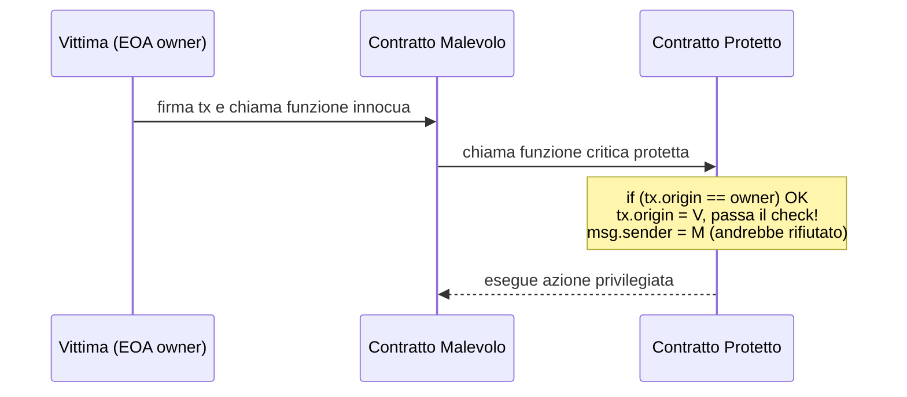
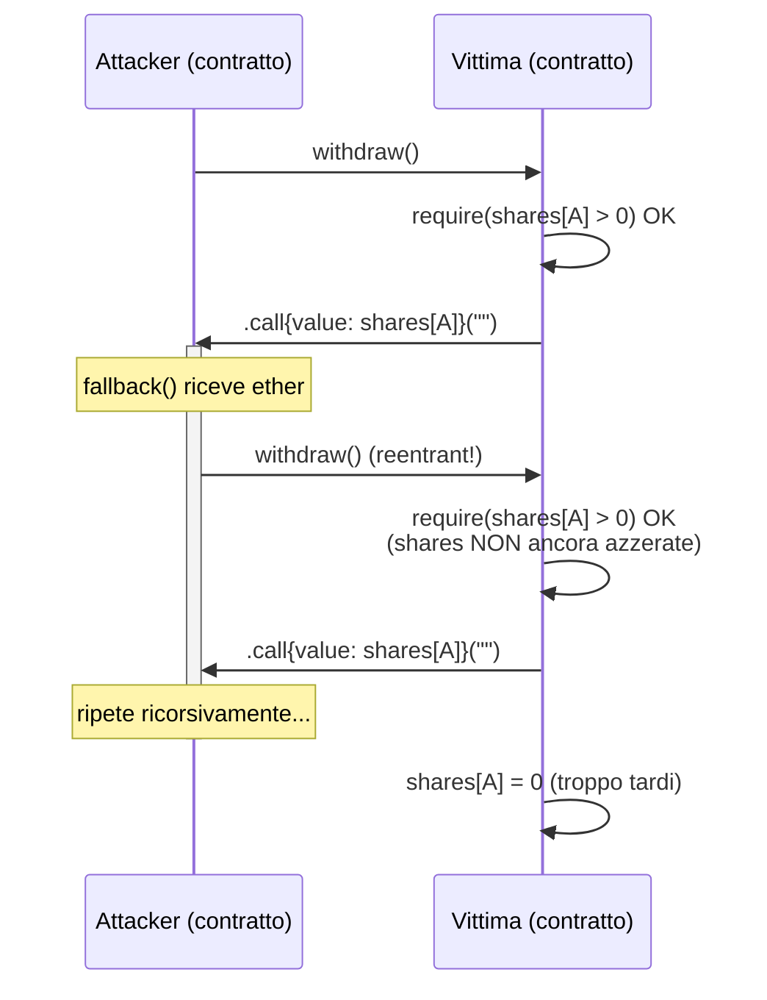
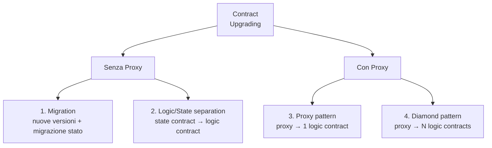
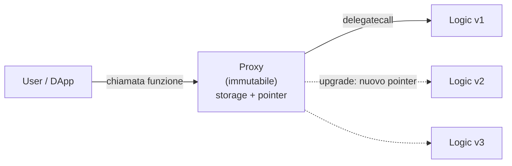
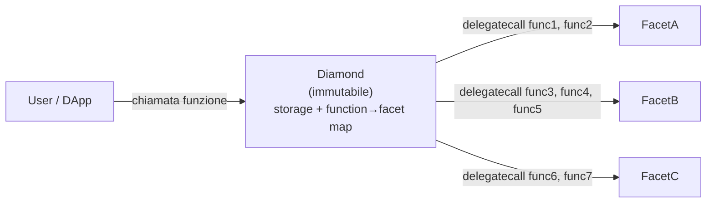
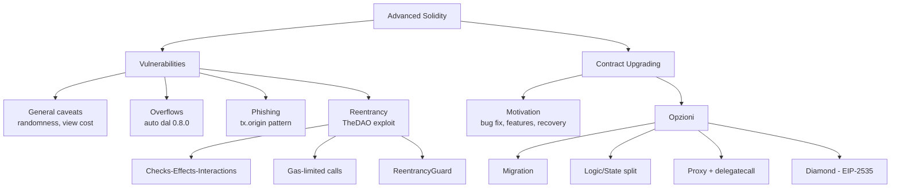

---
tags:
  - università/peer-to-peer-systems-and-blockchain
  - ethereum
  - solidity
  - smart-contracts
  - security
  - reentrancy
  - proxy-pattern
  - laboratorio
data: 2026-04-21
lezione: "Lab 8 - Advanced Solidity (Vulnerabilities e Upgrading)"
professore: "Damiano Di Francesco Maesa"
---
# Lab 8 — Advanced Solidity: Vulnerabilities e Contract Upgrading

Questa lezione chiude il ciclo su Solidity affrontando due temi che separano il codice didattico dal codice production-ready: le **vulnerabilità tipiche** degli smart contract e le **strategie di aggiornamento** per contratti che, per natura, nascono immutabili. I due temi sono strettamente collegati: l'impossibilità di correggere un contratto dopo il deploy rende le vulnerabilità particolarmente dannose, e i pattern di upgrading sono nati proprio per mitigare questa rigidità — al prezzo, però, di introdurre nuove forme di centralizzazione e nuovi vettori di attacco.

> [!tip] Filosofia della lezione
>
> In Ethereum il codice è legge, ma la legge può contenere bachi. Scrivere smart contract sicuri significa anticipare i modi in cui un attaccante può manipolare il contesto di esecuzione (chi chiama, quando, con quale gas, con quali effetti collaterali) e progettare il codice perché non dipenda da invarianti che l'attaccante può violare.

---

## Vulnerabilità comuni

Prima di entrare nei singoli pattern di attacco è utile fissare alcune considerazioni generali, valide trasversalmente per qualsiasi contratto che gestisca valore o logica critica.

### Caveat generali

Due insidie ricorrenti, spesso sottovalutate, riguardano la **generazione di casualità** e il **costo delle view function**.

La prima questione nasce dal fatto che, in un sistema deterministico e replicato come l'EVM, non esiste una vera sorgente di casualità interna alla blockchain. Qualsiasi valore apparentemente casuale (hash di un blocco, timestamp, difficulty) è in realtà **manipolabile dai validatori**, che possono scegliere di non produrre il blocco se l'esito non è loro favorevole — o di ritardarne la pubblicazione per estrarre valore. Un contratto che dipenda da "casualità on-chain" per decisioni economicamente rilevanti (lotterie, estrazioni, distribuzione di premi) è vulnerabile per costruzione. Le soluzioni vere richiedono oracoli specializzati con schemi commit-reveal o VRF (Verifiable Random Functions) come Chainlink VRF.

La seconda questione è più sottile. Una funzione marcata `view` non modifica lo stato e, **se chiamata esternamente da fuori la blockchain** (ad esempio via `eth_call` da una DApp), non costa gas. Tuttavia, se la stessa funzione viene chiamata **da un'altra funzione on-chain**, il suo costo viene sommato al gas della transazione che la contiene. Una view function con loop non limitato su una struttura dati che cresce nel tempo può quindi diventare un **denial-of-service economico**: inizialmente gratuita, poi progressivamente più costosa, fino a superare il block gas limit.

> [!warning] Le view function non sono "gratis" in assoluto
>
> `view` garantisce solo che la funzione non scriva sullo stato. Non garantisce che il costo di lettura sia limitato. Se un altro contratto la chiama, paga l'esecuzione. Un attaccante può **far crescere volutamente** strutture dati iterate dalle view per trasformarle in bombe a orologeria.

> [!note] Riferimenti della lezione
>
> La guida ufficiale Ethereum sui disaster recovery plans e la sezione sicurezza degli smart contract è disponibile su `ethereum.org/developers/docs/smart-contracts/security`. Per esercitarsi sui pattern di attacco è storicamente utile **Ethernaut** (`ethernaut.openzeppelin.com`), una CTF di OpenZeppelin sui bug classici: leggermente datato, ma ancora ottimo per allenare l'istinto difensivo.

### Overflows

Gli overflow aritmetici sono stati a lungo il bug più classico di Solidity. In una `uint256` l'operazione `type(uint256).max + 1` tornava silenziosamente a `0`, con effetti disastrosi quando il valore rappresentava un saldo o un contatore critico. La libreria **SafeMath** di OpenZeppelin è nata proprio per fornire operazioni aritmetiche con controllo esplicito e revert in caso di overflow.

Dalla versione **0.8.0** del compilatore Solidity, il controllo di overflow/underflow è diventato **automatico** per tutte le operazioni aritmetiche standard. Il compilatore inserisce istruzioni di verifica che fanno revert della transazione se il risultato uscisse dai limiti del tipo. SafeMath rimane storicamente rilevante ma, in pratica, l'uso è diventato marginale: i contratti moderni possono fare affidamento sul controllo automatico, a meno che non sia esplicitamente necessario l'overflow silente (nel qual caso si usa un blocco `unchecked { ... }` per disattivarlo localmente e risparmiare gas).

> [!tip] Quando usare `unchecked`
>
> Il blocco `unchecked` serve quando si è **matematicamente certi** che l'overflow non possa avvenire (es. una variabile di loop limitata, un decremento protetto da un `require` precedente) e si vuole evitare il costo del check automatico. Usarlo per errore è esattamente il tipo di bug che il controllo automatico è stato introdotto per prevenire.

### Phishing tramite `tx.origin`

Solidity espone due variabili globali che a prima vista sembrano intercambiabili: `msg.sender` e `tx.origin`. La differenza è cruciale. `msg.sender` è l'indirizzo dell'**ultimo chiamante** — il contratto o l'EOA (Externally Owned Account) che ha invocato direttamente la funzione corrente. `tx.origin` è invece l'indirizzo dell'**EOA che ha firmato la transazione** all'origine dell'intera catena di chiamate.

Un controllo di autorizzazione basato su `tx.origin` è vulnerabile a un classico attacco **man-in-the-middle**: un contratto malevolo può indurre la vittima (che magari è l'owner di un contratto protetto) a interagire con sé, e poi, durante quella stessa transazione, invocare il contratto protetto. A quel punto `tx.origin` è ancora l'indirizzo della vittima (che ha firmato la transazione), quindi il controllo passa, anche se l'effettivo chiamante immediato (`msg.sender`) è il contratto malevolo.


*Fig. — Schema dell'attacco di phishing basato su `tx.origin`: l'EOA della vittima resta `tx.origin` lungo tutta la catena di chiamate, quindi il controllo ingannevole passa nonostante il vero chiamante sia un contratto ostile.*

> [!warning] Regola pratica
>
> **Non usare mai `tx.origin` per controlli di autorizzazione.** Usa sempre `msg.sender`. L'unico uso legittimo di `tx.origin` è il rifiuto deliberato di chiamate da parte di contratti (`require(tx.origin == msg.sender)`), pattern oggi considerato scarsamente utile perché fragile e anti-composizionale.

### Reentrancy

La reentrancy è probabilmente la vulnerabilità più famosa della storia di Ethereum — è il bug che nel 2016 portò al collasso di **The DAO** e alla hard fork che separò Ethereum da Ethereum Classic. L'essenza del problema è semplice: si verifica quando **una funzione (o una combinazione di funzioni) viene richiamata dall'interno della propria esecuzione**, prima che gli effetti della prima chiamata siano stati consolidati nello stato del contratto.

Il vettore tipico è una chiamata esterna a un contratto non fidato: l'EVM, per `.call()`, `send` o `transfer` verso un indirizzo di contratto, esegue il codice del **fallback** o della `receive` di quel contratto. Se il fallback a sua volta richiama la funzione originaria, e questa non ha ancora aggiornato lo stato che regola l'accesso, l'attaccante può ottenere più volte il risultato di un'operazione che avrebbe dovuto essere unica.

#### Esempio classico: withdraw vulnerabile

```solidity
function withdraw() public {
    require(shares[msg.sender] > 0);

    (bool success,) = msg.sender.call{value: shares[msg.sender]}("");

    if (success)
        shares[msg.sender] = 0;
}
```

Il problema è l'**ordine delle operazioni**. La funzione:

1. verifica che il chiamante abbia share positive,
2. invia l'ether corrispondente (che trigger-a eventualmente il fallback del chiamante),
3. **solo dopo** azzera le share.

Se il chiamante è un contratto il cui fallback chiama di nuovo `withdraw()`, al passo 1 della seconda invocazione il controllo `shares[msg.sender] > 0` passa ancora (le share non sono state azzerate), e il contratto invia di nuovo ether. Il processo si ripete fino a svuotare il contratto o esaurire il gas della transazione.


*Fig. — Il flusso di una reentrancy classica: la chiamata esterna restituisce il controllo al contratto malevolo, che rientra nella funzione prima che lo stato sia aggiornato.*

#### Mitigazioni

La difesa principale è il pattern **Checks-Effects-Interactions**: prima si fanno tutti i **controlli** (`require`), poi si aggiornano **gli effetti** sullo stato locale, e **solo alla fine** si eseguono le **interazioni** con contratti esterni. Riscritto correttamente, l'esempio diventa:

```solidity
function withdraw() public {
    uint256 amount = shares[msg.sender];
    require(amount > 0);
    shares[msg.sender] = 0;                          // Effect prima
    (bool success,) = msg.sender.call{value: amount}("");
    require(success);
}
```

Ora, anche se il fallback del chiamante richiama `withdraw`, il check fallisce perché `shares[msg.sender]` è già 0.

Esistono mitigazioni complementari, meno robuste ma utili come difesa in profondità:

- **Limitare il gas della chiamata esterna** (usando `send` o `transfer`, che forniscono solo 2300 gas, o fissando un gas cap in `call`). È una mitigazione storica che però non è sempre applicabile: dopo l'EIP-1884 il costo di alcune operazioni è aumentato e i 2300 gas di `transfer` possono non bastare per fallback legittimi, rompendo l'interoperabilità.
- **Lock non-reentrant** (reentrancy guard): un mutex booleano che viene alzato all'ingresso di funzioni sensibili e abbassato all'uscita. Se una chiamata esterna prova a rientrare, il mutex è alto e il require fallisce. OpenZeppelin fornisce `ReentrancyGuardTransient` (versione ottimizzata con storage transient EIP-1153) e `ReentrancyGuard`. **Attenzione a non rimanere bloccati per sempre**: il mutex deve essere abbassato in ogni percorso di uscita, inclusi i revert gestiti.

> [!example] Reentrancy guard con modifier
>
> ```solidity
> bool private locked;
> modifier nonReentrant() {
>     require(!locked, "Reentrant call");
>     locked = true;
>     _;
>     locked = false;
> }
> ```
>
> Applicando `nonReentrant` alla funzione `withdraw`, qualunque rientro trova `locked == true` e viene rifiutato.

> [!note] Approfondimenti
>
> Un'analisi dettagliata del TheDAO exploit si trova su `medium.com/@zhongqiangc/smart-contract-reentrancy-thedao-f2da1d25180c`. Una raccolta sistematica di attacchi reentrancy è mantenuta in `github.com/pcaversaccio/reentrancy-attacks`. Il guard ufficiale OpenZeppelin è su `github.com/OpenZeppelin/openzeppelin-contracts/blob/master/contracts/utils/ReentrancyGuardTransient.sol`.

---

## Contract Upgrading

Gli smart contract su Ethereum sono **immutabili per design**: una volta deployato il bytecode, non esiste un'istruzione EVM per modificarlo. Questa proprietà è sia una forza (garantisce che il codice non possa essere alterato dopo il deploy) sia un limite (non permette di correggere bachi né di aggiungere funzionalità). Il **contract upgrading** è l'insieme dei pattern architetturali che consentono di aggirare questa rigidità quando è necessario.

### Perché (e perché no) aggiornare un contratto

I benefici dell'upgradability sono evidenti: permette di **correggere vulnerabilità o bachi** scoperti dopo il deploy, **aggiungere nuove funzionalità** che rispondano a requisiti emergenti, e predisporre **disaster recovery plans** per intervenire in caso di attacco o malfunzionamento grave.

Il costo è altrettanto concreto: un contratto upgradable è, per definizione, **meno immutabile**, quindi meno credibilmente neutrale. Introduce un potere centralizzato (chi controlla l'upgrade?) che può essere usato maliziosamente o compromesso. L'upgrade stesso è una superficie di attacco: un nuovo contratto logic può introdurre bug o backdoor non presenti nella versione originale.

La mitigazione standard è introdurre **timelock** (ritardi obbligatori tra annuncio e attivazione di un upgrade, per dare agli utenti tempo di uscire) e **multisig** (richiedere più firme per autorizzare l'upgrade, evitando single-point-of-failure sulla chiave del deployer). Il trade-off è evidente: i timelock rallentano le risposte in emergenza, i multisig aumentano il costo operativo. È un compromesso, non una soluzione.

> [!tip] L'upgradability come scelta politica
>
> Rendere un contratto upgradable è anche una dichiarazione di governance: chi può votare l'upgrade? Con quale maggioranza? Dopo quanto tempo? Molti protocolli DeFi hanno migrato nel tempo da multisig a DAO governance proprio per decentralizzare questo potere.

### Esempio guida della lezione

Come filo conduttore la lezione usa l'aggiunta di funzionalità di **"proper deactivation"** al posto di `selfdestruct` come disaster recovery plan: si parte dal contratto `Created.sol` e si trasforma in `CreatedSafe.sol`, ragionando su come far adottare la nuova logica senza rompere lo stato già esistente.

### Le quattro opzioni principali

Esistono due macrofamiglie di soluzioni — quelle **senza proxy** e quelle **con proxy** — per un totale di quattro pattern principali:


*Fig. — Tassonomia delle strategie di upgrading: si parte dalla scelta se introdurre o meno un proxy, e all'interno di ciascuna famiglia si distinguono approcci monolitici e modulari.*

#### Opzione 1 — Migration

Si crea una **nuova istanza** del contratto con la logica aggiornata e si **migrano i dati** dal vecchio al nuovo. È l'approccio più semplice concettualmente, ma impone che **tutti gli utenti passino al nuovo contratto**: ogni DApp, ogni wallet, ogni interazione esterna deve essere aggiornata al nuovo indirizzo. Rompe ogni integrazione on-chain che avesse hard-coded il vecchio indirizzo. Funziona bene per contratti di nicchia con pochi utenti coordinabili, male per protocolli con ampia adozione.

#### Opzione 2 — Separazione logic/state

Si divide il contratto in due: un **contratto di stato** (immutabile, contiene i dati) e un **contratto di logica** (mutabile, contiene il codice). Il contratto di stato espone getter/setter accessibili solo dal contratto di logica corrente, e mantiene un puntatore al contratto di logica attivo, aggiornabile dal proprietario.

Il vantaggio è che i dati non si spostano mai: lo stato rimane nello stesso indirizzo. Lo svantaggio è che **il caller interagisce con l'indirizzo della logica**, quindi un cambio di logica cambia l'indirizzo con cui l'utente interagisce — e le DApp devono aggiornarsi. È una mezza soluzione: risolve il problema della migrazione dati ma non quello dello stable address.

#### Opzione 3 — Proxy pattern

È l'approccio più diffuso nei protocolli moderni. Si usa un **proxy contract immutabile** che l'utente chiama sempre allo stesso indirizzo. Il proxy non contiene logica di business: contiene solo una **puntatore al contratto logic** e una funzione `fallback` che **delegate-call**-a al logic contract ogni invocazione ricevuta.

La chiave è `delegatecall`: a differenza di `call`, esegue il codice del callee **nel contesto (storage) del caller**. Quindi lo stato vive nel proxy, ma l'implementazione viene letta dal logic. Aggiornare il contratto significa cambiare il puntatore del proxy verso un nuovo logic contract.


*Fig. — Pattern proxy: l'utente interagisce sempre con lo stesso indirizzo (il proxy), ma la logica eseguita è quella del contratto puntato, sostituibile dall'owner.*

> [!definition] `delegatecall`
>
> Opcode EVM che esegue il codice di un altro contratto **nel contesto di storage, `msg.sender` e `msg.value` del caller**. A differenza di `call`, che esegue il callee nel proprio contesto, `delegatecall` tratta il codice del callee come una libreria: lo stato modificato è quello del caller. È il meccanismo fondamentale che rende possibile il pattern proxy.

L'implementazione di riferimento è `Proxy.sol` di OpenZeppelin, disponibile in `github.com/OpenZeppelin/openzeppelin-contracts/blob/v4.8.2/contracts/proxy/Proxy.sol`. Un tutorial pratico è `jamesbachini.com/proxy-contracts-tutorial/`.

> [!warning] Storage collision
>
> Il punto più delicato del pattern proxy è l'**allineamento dello storage**: proxy e logic devono avere layout di storage compatibili, perché entrambi scrivono nello stesso storage (quello del proxy). Se il logic v2 aggiunge una variabile nel mezzo della lista, tutte le variabili successive "scorrono" e vengono sovrascritte/lette da slot sbagliati. Per questo OpenZeppelin impone un layout di storage **append-only** e usa slot deterministici (EIP-1967) per le variabili del proxy stesso (come l'indirizzo dell'implementazione), così da non collidere con quelle della logic.

#### Sintassi Solidity: `virtual`, `override`, `abstract`

Il pattern proxy usa intensivamente l'ereditarietà, quindi richiede familiarità con tre parole chiave:

| Parola chiave | Significato |
|---|---|
| `virtual` | Il metodo **può essere sovrascritto** da un contratto che eredita. |
| `override` | Il metodo **sta sovrascrivendo** un metodo `virtual` del contratto padre. |
| `abstract` | Il contratto **non può essere istanziato** direttamente perché ha funzioni/parametri non implementati; serve solo come base per sottoclassi. |

Il concetto di `abstract` è analogo a Java: un contratto che dichiara firme di funzioni senza implementazione, lasciando ai derivati il compito di completarlo.

#### Opzione 4 — Diamond pattern (EIP-2535)

Il pattern proxy standard ha un limite: **un solo logic contract** alla volta. Ma un logic contract è un singolo contratto Solidity, quindi è soggetto al **limite di dimensione del bytecode** (circa 24 KB per EIP-170). Protocolli grandi (DEX, lending, derivati) rischiano di sbattere contro questo soffitto.

Il **diamond pattern** (EIP-2535) generalizza il proxy: un unico contratto "diamond" (immutabile, con lo stato) delega a **più logic contracts**, detti **facets**. Ogni selector di funzione (i 4 byte che identificano una funzione nell'ABI) è mappato al facet che la implementa. Quando un utente chiama una funzione, il diamond consulta la mappa, individua il facet competente, e delegate-call-a ad esso.


*Fig. — Pattern diamond: un unico indirizzo esposto all'utente, ma le funzioni sono implementate da più facet. La mappatura funzione → facet è aggiornabile, permettendo di sostituire, aggiungere o rimuovere facet nel tempo.*

Il cuore del pattern è la **function-to-facet mapping**:

```solidity
mapping(bytes4 => address) facets;

// Esempio di mapping:
// (func1) e2532512 => 0x0b22380B7c423470...  (FacetA)
// (func2) b1e5392a => 0x0b22380B7c423470...  (FacetA)
// (func3) 1857ea99 => 0x501E5D8e2FBbBc8A...  (FacetB)
// (func4) 876e3abc => 0x501E5D8e2FBbBc8A...  (FacetB)
// (func5) 79d9df55 => 0x501E5D8e2FBbBc8A...  (FacetB)
// (func6) 0b7eac44 => 0x39555988230b4c87...  (FacetC)
// (func7) d86e6291 => 0x39555988230b4c87...  (FacetC)
```

Il diamond gestisce anche più **storage struct** dedicate (una per facet o gruppo di facet), tipicamente usando il pattern **Diamond Storage** per isolare gli slot di storage di ciascun facet ed evitare collisioni: ogni facet usa uno slot di storage calcolato come hash di una stringa unica, garantendo che facet diversi non si pestino i piedi.

> [!tip] Perché "diamond"
>
> Il nome richiama la forma dell'ereditarietà multipla: un singolo punto di ingresso (il diamond) si apre su molte facce (i facet). A differenza dell'ereditarietà multipla tradizionale, qui non c'è un unico albero di compilazione: i facet sono contratti separati, deployati indipendentemente, e la "composizione" avviene a runtime tramite la mappa di selector. Il risultato è massima modularità, al prezzo di una maggiore complessità di governance (ora bisogna gestire upgrade, aggiunte e rimozioni di facet).

> [!abstract] Sintesi dei quattro pattern
>
> | Opzione | Indirizzo stabile? | Migrazione dati? | Complessità | Limite dimensione |
> |---|---|---|---|---|
> | Migration | no | sì | bassa | nessuno |
> | Logic/state separation | no (cambia logic) | no | media | ~24 KB |
> | Proxy | **sì** | no | media | ~24 KB |
> | Diamond | **sì** | no | alta | **nessuno** (molti facet) |

---

## Mappa concettuale della lezione


*Fig. — Struttura complessiva della lezione: da un lato i pattern di attacco e le relative difese, dall'altro l'evoluzione dei pattern architetturali per superare l'immutabilità degli smart contract.*

---

## Possibili domande d'esame

> [!question] Domande ricorrenti
>
> - Spiegare la differenza tra `msg.sender` e `tx.origin` e perché quest'ultimo non deve essere usato per controlli di autorizzazione.
> - Descrivere l'attacco di reentrancy con un esempio minimale e almeno due strategie di mitigazione, discutendone i trade-off.
> - Cosa si intende per pattern "Checks-Effects-Interactions"? Riscrivere una funzione vulnerabile applicandolo.
> - Perché il controllo di overflow è diventato automatico dalla 0.8.0 e quando ha senso usare `unchecked`?
> - Confrontare le quattro strategie di contract upgrading (migration, logic/state separation, proxy, diamond) evidenziando trade-off di complessità, indirizzo stabile e dimensione massima.
> - Descrivere il ruolo di `delegatecall` nel pattern proxy e spiegare il problema dello storage collision.
> - Cos'è il diamond pattern e quale limite del pattern proxy standard risolve?
> - Quali sono gli svantaggi di rendere un contratto upgradable e come si mitigano (timelock, multisig, governance)?
> - Perché la casualità on-chain è fondamentalmente problematica e quali soluzioni esistono?
> - Come può una view function contribuire a un denial-of-service economico?
