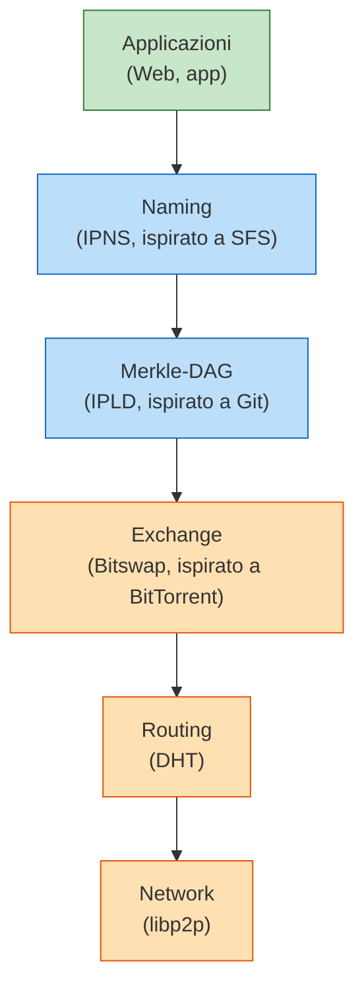
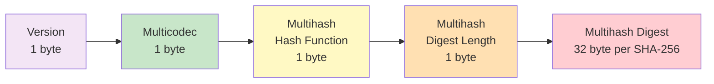
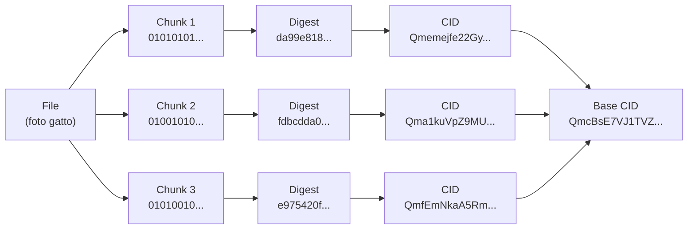
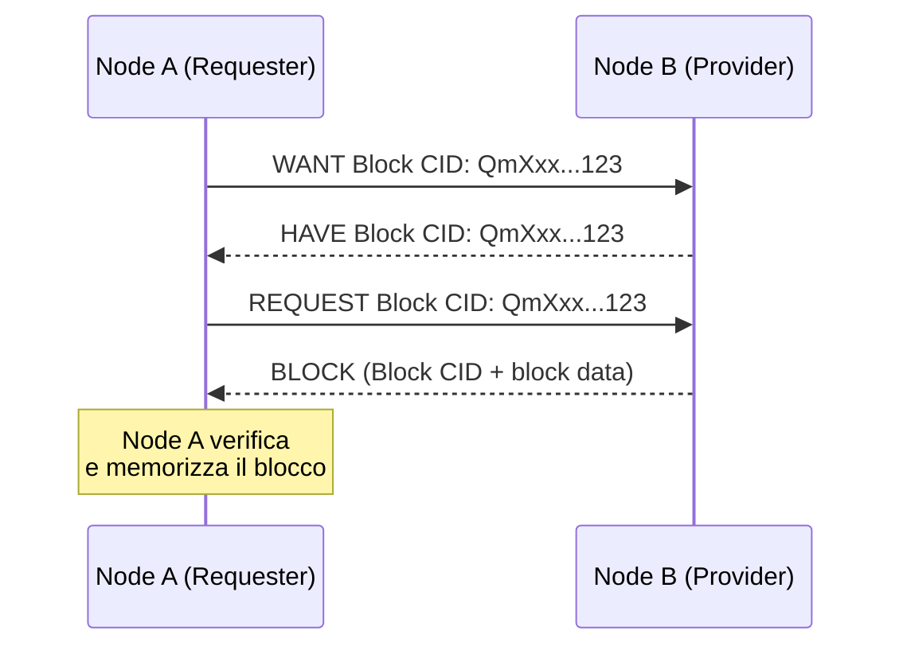

---
tags:
  - università/peer-to-peer-systems-and-blockchain
  - ipfs
  - content-addressing
  - merkle-dag
  - libp2p
  - bitswap
  - filecoin
data: 2026-04-23
lezione: "24 - IPFS: A Distributed Content Based Storage"
professore: "Laura Ricci"
---
# IPFS: Interplanetary File System

## Il Web centralizzato e il problema della localizzazione

Il Web così come lo conosciamo oggi si regge su un modello **location based**: quando scriviamo `http://sito.com/image.jpg` non stiamo chiedendo "voglio quella specifica immagine", bensì "contatta la macchina che risponde a `sito.com` e chiedigli il file `image.jpg`". L'indirizzo HTTP punta cioè a un **luogo** della rete — un dominio risolto in un indirizzo IP, che a sua volta identifica una macchina fisica. La conseguenza è duplice: il contenuto esiste solo fintanto che quel server è raggiungibile, e l'intero modello è fragile rispetto alla censura, ai guasti e alla centralizzazione delle infrastrutture.

> [!warning] Il problema della censura
>
> Se un governo o un provider decide di bloccare un dominio o un indirizzo IP, il contenuto diventa irraggiungibile per intere porzioni di rete, anche se copie dello stesso file sono fisicamente presenti su milioni di macchine sparse nel mondo. Il legame forte fra **contenuto** e **luogo** è ciò che rende possibile la censura su scala.

C'è inoltre un problema più sottile di *discovery*: immagina che Mary voglia una certa immagine e che Bob, sulla stessa rete locale, ce l'abbia già sul disco. Nel modello HTTP, Mary non ha alcun modo di sapere che il file è a due metri da lei: deve per forza contattare il web server d'origine, magari dall'altra parte del mondo. Manca un meccanismo che permetta di **recuperare il contenuto da dove esso si trova**, invece che da dove è stato pubblicato.

### Dal Web location-based al Web content-based

L'idea di IPFS è ribaltare la prospettiva: invece di indirizzare il *contenitore* (il server), si indirizza direttamente il *contenuto*. Non ci interessa sapere dove un file è ospitato, ci interessa solo **che cosa è** quel file. Se riusciamo a dare a ogni file un nome univoco derivato dal suo contenuto, allora la rete può occuparsi autonomamente di cercarlo dove esso si trova, replicarlo, servirlo dal nodo più vicino.

> [!tip] Intuizione chiave: content addressing
>
> In un sistema **content-addressed**, il nome di un file *è* il file — nel senso che è una funzione univoca dei suoi bit. Due file identici hanno lo stesso nome, ovunque essi siano; un file manomesso anche in un singolo bit ha un nome diverso. La localizzazione diventa un problema di rete, non di design del protocollo.

---

## IPFS: cos'è e da dove viene

IPFS (**InterPlanetary File System**) è un protocollo peer-to-peer per lo storage distribuito dei contenuti del Web, sviluppato da **Protocol Labs**. Lo slogan canonico, tratto dal white paper di Juan Benet del 2013, lo descrive come un "Content Addressed, Versioned, P2P File System". Il contributo di IPFS, secondo lo stesso Benet, non è inventare nuove tecniche, ma *combinare* in un unico sistema coerente idee già collaudate nel mondo peer-to-peer.

> [!info] L'ecosistema di Protocol Labs
>
> - **IPFS** — protocollo P2P content-based, alternativa a HTTP per lo scambio di contenuti.
> - **Filecoin** — rete di storage decentralizzata con un mercato basato su criptovaluta, costruita *sopra* IPFS per risolvere il problema degli incentivi allo storage.
> - **libp2p** — libreria modulare di rete nata come sotto-progetto di IPFS e poi diventata indipendente, usata da molti altri progetti.

Le idee che IPFS riprende e integra sono:

| Componente | Ispirazione |
|---|---|
| Routing | DHT (con miglioramenti da **S/Kademlia** per la sicurezza e **Coral sloppy DHT** per la performance) |
| Strutture dati | **Merkle DAG** (da Git e dai Merkle tree crittografici) |
| Scambio di blocchi | **BitTorrent**, adattato nel protocollo **Bitswap** |
| Versionamento | **Git** (version control system) |
| Namespace auto-certificante | **SFS** (Self-Certified File System) |

Nessuno di questi è un nodo "privilegiato": la rete IPFS è piatta, ogni peer memorizza oggetti nel proprio store locale e si connette ad altri peer per trasferire blocchi. L'identificazione dei contenuti è **content-based tramite hash crittografico sicuro**, lo scambio è peer-to-peer in stile BitTorrent, l'organizzazione dei file segue un **DAG di Merkle** che permette al tempo stesso verifica crittografica, deduplicazione e versionamento.

---

## Lo stack di IPFS a colpo d'occhio

Prima di entrare nei dettagli, è utile avere in mente l'architettura a livelli di IPFS. Il sistema si presenta come uno stack, in cui ogni livello si appoggia a quello sottostante e risolve un problema distinto.


*Fig. — Lo stack IPFS: il livello più basso trasporta i dati (network, routing, exchange), quello intermedio li definisce (Merkle-DAG, naming), quello superiore li usa (applicazioni).*

Tre blocchi logici emergono chiaramente. In basso troviamo **Transporting Data**, il compito di muovere bit tra peer: network (libp2p), routing (DHT), exchange (Bitswap). Al centro **Defining Data**, dove i bit diventano strutture identificabili: Merkle-DAG e naming (IPNS). In cima **Using Data**, dove le applicazioni si appoggiano a tutto il resto.

---

## Content addressing: l'hashing come indirizzo

L'idea fondativa di IPFS è trasformare ogni pezzo di contenuto in un identificatore derivato matematicamente dai suoi bit. Quando carichi una foto su IPFS, accade questo: l'immagine viene convertita in raw data (una sequenza di byte), e su questi byte viene calcolato un **hash crittografico sicuro** — per default **SHA-256**, ma l'architettura supporta esplicitamente l'uso di altri algoritmi (e vedremo fra poco perché questa flessibilità è cruciale). Il digest risultante diventa l'etichetta univoca del contenuto.

> [!definition] Hash crittografico come indirizzo
>
> Un hash crittografico è una funzione che mappa input di qualsiasi lunghezza in output di lunghezza fissa (256 bit per SHA-256), con tre proprietà fondamentali: **tamper-freeness** (cambiare un bit dell'input cambia drasticamente l'output), **verifiability** (chiunque può ricalcolare l'hash e verificare l'integrità del dato) e **security** (non è possibile risalire all'input dall'output).

Queste tre proprietà si traducono direttamente in tre garanzie di IPFS. La prima è **l'auto-certificazione**: se Bob ti invia un file dichiarando che ha un certo CID, basta ricalcolare l'hash per verificare che non sia stato manomesso — non serve fidarsi di Bob. La seconda è **l'integrità end-to-end**: se anche un singolo pixel di una foto viene modificato, il suo hash cambia completamente, quindi il CID corrispondente è diverso. La terza è **la robustezza contro la manipolazione**: non esistendo un modo efficiente per costruire un file diverso con lo stesso hash, IPFS è di fatto un file system a prova di tampering.

### Dal digest al CID (Content Identifier)

Il digest da solo, però, non basta. Per poter evolvere l'algoritmo di hashing nel tempo, supportare formati di codifica diversi e permettere a software differenti di interpretare correttamente i dati, IPFS non usa *l'hash puro* come indirizzo: lo avvolge in una struttura chiamata **CID (Content Identifier)**.

> [!definition] Content Identifier (CID)
>
> Un CID è un'identificazione **self-describing** del contenuto. Contiene:
>
> - **l'hash del contenuto** — che identifica *cosa* è il dato;
> - **metadata** che descrivono *come* interpretare/decodificare il dato (quale algoritmo di hash, quale codifica, quale formato di serializzazione).
>
> Il CID **non** indica dove il contenuto è memorizzato: non è un puntatore di rete, è un'"impronta digitale" auto-descrittiva.

Nelle versioni legacy, i CID cominciano con il prefisso `Qm…` (es. `QmPK1s3pNYLi9ERiq3BDxKa4XosgWwFRQUydHUtz4YgpqB`). Le versioni moderne (CIDv1) hanno una struttura più flessibile e ricca, che analizzeremo a breve.

---

## Il progetto Multiformat

La scelta di includere i metadata dentro il CID nasce da un'esigenza molto concreta di **evoluzione del software**. Se hard-codifichi SHA-256 ovunque nel tuo codice, il giorno in cui SHA-256 viene rotto (come è successo a MD5, e come potrebbe succedere domani con l'arrivo di computer più potenti o con attacchi crittografici imprevisti) devi riscrivere e ridistribuire tutto lo stack. Tool, applicazioni e script avranno fatto assunzioni *implicite* sulla lunghezza del digest, sul formato dell'identificatore, sul protocollo di rete. È un problema analogo al millennium bug.

> [!tip] L'insight dietro il Multiformat
>
> Invece di assumere un formato fisso, ogni valore trasporta con sé una descrizione di *quale* formato usa. Un'applicazione che riceve un dato lo interpreta leggendo prima i metadata, poi il valore. Così l'evoluzione dei protocolli di hashing, di codifica o di rete non richiede di modificare il codice delle applicazioni: basta che esse leggano correttamente il prefisso auto-descrittivo.

Il Multiformat è una **collezione di standard** nati all'interno di IPFS e poi diventati indipendenti. I protocolli attuali sono:

| Protocollo | Cosa descrive |
|---|---|
| **multihash** | hash auto-descrittivi (quale funzione di hash, quale lunghezza) |
| **multibase** | codifica auto-descrittiva di stringhe (base32, base58, base64...) |
| **multicodec** | formato di serializzazione auto-descrittivo |
| **multiaddr** | indirizzi di rete auto-descrittivi |

### Multibase: come leggere una stringa

Quando un CID viene presentato come stringa leggibile (per copiarlo in un URL, incollarlo in chat, stamparlo su una slide), i suoi byte binari devono essere codificati in caratteri alfanumerici. Esistono molte basi possibili — Base32, Base58 (la stessa usata da Bitcoin), Base64 — e Multibase risolve il problema di non dover sapere a priori quale è stata usata: **un singolo carattere di prefisso** identifica la codifica, e un'applicazione può decodificare qualsiasi stringa senza ipotesi hard-coded.

### Multihash: come leggere un digest

Un multihash non memorizza soltanto il valore dell'hash, ma anche **quale funzione di hash è stata usata** e **quale lunghezza ha il digest**. Il formato è compatto:

```
<hash-function-code> <digest-length> <digest-bytes>
```

Anche se oggi il sistema usa di fatto solo SHA-256, il formato multihash segnala alle applicazioni che domani potrebbe essere qualsiasi altra cosa. Tool, applicazioni e script non devono fare assunzioni sulla lunghezza: la leggono direttamente dal valore. Il risultato è che **la stragrande maggioranza del software non richiede alcun upgrade** quando l'algoritmo di hash cambia — un risparmio enorme di ore di engineering su larga scala.

### CID: tutto il Multiformat messo insieme

Un CIDv1 mette insieme tutti questi elementi: una versione, un multicodec che descrive il formato di serializzazione del contenuto, un multihash (con codice della funzione di hash, lunghezza e valore). La stringa visibile all'utente è poi passata attraverso multibase per essere codificata in caratteri stampabili.


*Fig. — Struttura a byte di un CIDv1 (dag-pb, sha2-256): versione, multicodec, funzione di hash, lunghezza, digest.*

Il CID completo è quindi un flusso di byte che viene poi raggruppato in chunk da 5 bit e codificato — tramite multibase — in caratteri Base32 (o altra base). Il carattere di prefisso della stringa finale identifica la base usata, completando il quadro auto-descrittivo.

> [!note] Perché 5 bit per Base32
>
> Base32 usa 32 simboli distinti, cioè $2^5$. Ogni gruppo di 5 bit del flusso binario diventa un carattere dell'alfabeto Base32. Si noti che i confini dei campi originari (versione, multicodec, ecc.) **non** sono allineati ai 5 bit: nella stringa Base32 finale la struttura a byte non è più visibile, si può recuperare solo dopo aver decodificato.

---

## IPLD e il Merkle DAG

Fin qui abbiamo parlato di file singoli. Ma IPFS deve gestire anche strutture più complesse — directory, collezioni di blocchi, versioni successive di uno stesso documento — e lo fa attraverso un livello chiamato **IPLD (InterPlanetary Linked Data)**, il modello dati di IPFS.

> [!definition] IPLD e Merkle DAG
>
> IPLD trasforma tutti i dati in un **grafo di nodi collegati da CID**. Ogni pezzo di dato è un nodo; i nodi sono connessi da *link*, dove un link è semplicemente il CID del nodo di destinazione. L'insieme forma un **Merkle DAG (Directed Acyclic Graph)**: un grafo orientato aciclico in cui ogni nodo contiene, all'interno dei propri dati, i digest dei nodi figli.

L'aggettivo "Merkle" viene dalle classiche strutture crittografiche di Ralph Merkle: **il contenuto di cui si calcola l'hash contiene i digest di altri contenuti**, quindi ogni nodo autentica ricorsivamente tutti i suoi discendenti. L'hash della radice è sufficiente per verificare l'integrità dell'intera struttura.

### Come funziona in concreto

Quando aggiungi un file a IPFS, il sistema lo divide in **chunk** (blocchi di dimensione fissa o variabile). Per ogni chunk calcola un digest e crea un CID. Poi costruisce un nodo "indice" che contiene i CID dei chunk in ordine, e ne calcola a sua volta il CID: questo è il **base CID** del file.


*Fig. — Costruzione del Merkle DAG di un file: chunking, hashing, generazione dei CID dei figli e del CID radice.*

### Deduplicazione automatica

Una conseguenza bellissima di questa struttura è la **deduplicazione**: lo stesso contenuto è memorizzato **una sola volta** nell'intera rete. Se due foto condividono gli stessi chunk — perché sono simili, perché hanno la stessa intestazione, perché qualcuno ha modificato solo una piccola parte dell'immagine — la parte comune ha lo stesso CID in entrambi i file, quindi non viene duplicata.

L'esempio limite è evocativo: immagina che ogni lettera dell'alfabeto abbia il suo CID e sia memorizzata una sola volta nel sistema. Un intero libro potrebbe essere rappresentato *componendo i CID delle lettere* — ovviamente in pratica si lavora a grana più grossa, ma l'idea è quella.

### Proprietà del Merkle DAG

La struttura ha tre proprietà fondamentali che conviene tenere a mente.

**Il CID di un nodo dipende dai CID di tutti i suoi discendenti.** Se fotoritocchi anche un solo pixel di un'immagine contenuta in una directory, il CID del chunk modificato cambia; di conseguenza cambia il CID del nodo che lo contiene; poi cambia il CID della directory; e così via fino alla radice. La modifica **si propaga verso gli antenati**, mai verso i fratelli.

**La costruzione avviene sempre dal basso verso l'alto.** Non si può creare un nodo padre finché i CID dei figli non sono noti. Questa è anche la ragione strutturale per cui il DAG non può contenere cicli: sarebbe una dipendenza circolare dei CID.

**Una modifica in un ramo non tocca gli altri rami.** Se cambi un file in `dir/foto/gatto.jpg`, i CID di tutti i file dentro `dir/foto/` vengono ricalcolati solo per il ramo interessato; gli altri file della directory mantengono invariato il loro CID. È la stessa proprietà che in Git permette di identificare in modo compatto un commit e di verificare rapidamente l'identità di due sottocartelle.

> [!example] Verifica di due directory
>
> Hai fatto una copia di backup di una directory durante un lavoro di editing, mesi fa. Oggi ritrovi le due copie e vuoi sapere se hanno lo stesso contenuto. Invece di confrontare file per file, calcoli il Merkle DAG di ciascuna: se i CID delle radici coincidono, le due directory sono *identiche* bit per bit — puoi cancellare una delle due in tutta sicurezza e liberare spazio. È lo stesso principio con cui Git confronta due commit.

### Ogni nodo può essere radice

Il Merkle DAG è **ricorsivo**: ogni sottografo è a sua volta un DAG completo, con una sua radice (il suo nodo di partenza) e un suo CID. Questo apre possibilità espressive molto potenti.

> [!tip] DAG come strutture componibili
>
> - Puoi **condividere un sottografo** semplicemente inviando il CID della sua radice — il destinatario non ha bisogno del contesto del grafo più grande.
> - Puoi **incorporare lo stesso sottografo in DAG diversi**: il CID del sottografo dipende solo dai suoi discendenti, non dai suoi antenati. Lo stesso file, lo stesso chunk, la stessa directory possono apparire in posizioni diverse di DAG diversi senza essere duplicati.

Questa proprietà è la base strutturale su cui IPFS costruisce file system versionati, blockchain e, più in generale, qualunque sistema che abbia bisogno di memorizzare dati autenticati, componibili e condivisibili.

---

## Il livello di rete: libp2p

Passiamo dalla struttura dei dati al modo in cui i nodi si parlano. Il livello di rete di IPFS è implementato da **libp2p**, una libreria modulare nata come sotto-progetto di IPFS e oggi usata da molti altri progetti peer-to-peer (tra cui Ethereum 2.0, Polkadot, Filecoin).

Libp2p si occupa di tutto ciò che serve per mettere in comunicazione due nodi senza fare assunzioni sulla rete sottostante. Le funzionalità principali sono:

| Funzionalità | Cosa fa |
|---|---|
| **Peer discovery** | trovare altri nodi tramite Kademlia DHT, mDNS, bootstrap node |
| **Transport abstraction** | supportare TCP, QUIC, WebSocket, WebRTC in modo trasparente |
| **Connection establishment** | aprire connessioni anche attraverso NAT e firewall (hole punching, relay) |
| **Secure communication** | cifratura e autenticazione (Noise, TLS) — i peer hanno identità crittografiche |
| **Stream multiplexing** | più stream logici sulla stessa connessione (come HTTP/2) |
| **Protocol handling** | supporto a protocolli custom (Request/Response, PubSub) |
| **Peer routing** e **Content routing** | trovare peer e contenuti |
| **PubSub messaging** | canali di publish/subscribe (es. Gossipsub) |
| **NAT traversal & relay** | raggiungere peer dietro NAT |
| **Peer identity** | ogni nodo ha un PeerId crittografico |

### PeerId e multiaddress

Ogni peer possiede una coppia di chiavi **(pubblica, privata)**. Il **PeerId** è l'hash crittografico della chiave pubblica — cioè un CID, coerentemente con la filosofia content-based di IPFS. La coppia di chiavi permette poi di stabilire canali sicuri e autenticati tra peer.

> [!definition] Multiaddress
>
> Un **multiaddress** è un indirizzo di rete **self-describing** che contiene tutte le informazioni necessarie per raggiungere un peer: protocollo di rete, indirizzo, porta, protocollo applicativo, PeerId.

Un esempio concreto:

```
/ip4/127.0.0.1/tcp/4001/p2p/12D3KooWJ...
```

Letto da sinistra a destra: "usa IPv4, indirizzo 127.0.0.1, protocollo TCP, porta 4001, protocollo p2p, PeerId 12D3KooWJ...". La struttura è componibile: si può sostituire `ip4` con `ip6`, `tcp` con `udp`/`quic`, aggiungere `wss` per WebSocket sicuri, o wrappare tutto in un relay. Ogni componente ha un codice di protocollo (varint) che lo identifica e alcuni hanno una lunghezza/byte value associati.

> [!tip] Perché il multiaddress è così flessibile
>
> - **Self-describing**: contiene tutti i protocolli e gli indirizzi necessari.
> - **Composable**: è fatto di componenti di protocollo concatenabili.
> - **Transport agnostic**: funziona con qualsiasi protocollo di rete.
> - **Extensible**: aggiungere nuovi protocolli è facile.

Esempi tipici: `/ip4/127.0.0.1/tcp/4001/p2p/12D3Koo...` per una connessione TCP locale, `/ip4/203.0.113.10/tcp/4001/p2p/12D3...` per TCP pubblico, `/dns4/example.com/tcp/443/wss/p2p/12D3...` per WebSocket su HTTPS, `/ip6/2001:db8::1/udp/443/quic-v1/p2p/12D3...` per QUIC su IPv6.

---

## Il livello di routing: la DHT

Quando richiedi un contenuto a partire dal suo CID, IPFS deve risolvere una domanda precisa: **quali peer hanno questo contenuto?** È compito del livello di **routing**, implementato tramite una **DHT (Distributed Hash Table)**.

> [!warning] Cosa fa (e cosa non fa) la DHT di IPFS
>
> La DHT di IPFS **non memorizza i dati**. Memorizza soltanto una mappa `CID → lista di PeerId che hanno dichiarato di averlo`. Quando un nodo pubblica un contenuto, annuncia alla DHT "io ho questo CID"; la DHT registra il mapping. Quando qualcuno cerca il CID, la DHT risponde "prova a chiedere a questi peer". Il trasferimento vero e proprio avviene **peer-to-peer direttamente**, bypassando la DHT.

Inoltre la DHT serve anche per la **peer discovery**: se hai un PeerId e vuoi sapere come raggiungerlo, la DHT può restituirti il suo multiaddress.

Il problema che risolve è concreto: tu hai un CID `bafybeigdyrzt...` ma non sai né chi ha il dato né da dove scaricarlo. La DHT fa da "elenco telefonico" decentralizzato: usa l'hash del file come chiave e restituisce le *locations* (i peer) del file.

### Miglioramenti rispetto a Kademlia

La DHT vanilla di Kademlia non basta per un sistema in produzione: IPFS adotta una serie di miglioramenti presi da due filoni di ricerca.

> [!note] Estensioni adottate
>
> - **S/Kademlia** — migliora la **sicurezza** contro attacchi Sybil ed eclipse: invece di affidarsi a un singolo percorso di routing, cerca i nodi attraverso percorsi disgiunti e verifica l'identità dei peer con primitive crittografiche.
> - **Coral sloppy DHT** — migliora la **performance** con una struttura gerarchica che permette di trovare repliche "vicine" (geograficamente o in termini di latenza), evitando di contattare sempre lo stesso nodo logicamente responsabile di una chiave.

---

## Il livello di scambio: Bitswap

Una volta che la DHT ti ha detto "questi peer dovrebbero avere il contenuto", serve un protocollo per **scambiare effettivamente i blocchi**. È il compito di **Bitswap**, il livello di exchange di IPFS.

### Perché non basta la DHT

La DHT ti dice "questo peer **ha annunciato** di avere il CID", ma non garantisce che ce l'abbia *in questo momento*. Tra il tempo in cui un peer pubblica l'annuncio e il tempo in cui un client cerca il contenuto possono succedere molte cose: il peer può essere andato offline, il blocco può essere stato rimosso (unpin, garbage collection), il peer può non rispondere per problemi di rete. L'informazione della DHT può essere **obsoleta**.

> [!abstract] Division of labor
>
> - **DHT** risponde alla domanda "*chi potrebbe avere il CID?*" — è un elenco, non una garanzia.
> - **Bitswap** risponde alla domanda "*chi effettivamente me lo dà adesso?*" — è il protocollo real-time che scarica i blocchi.

### Bitswap vs BitTorrent

Bitswap è ispirato a BitTorrent ma non coincide con esso. La differenza fondamentale è architetturale:

| BitTorrent | Bitswap (IPFS) |
|---|---|
| uno **swarm separato** per ogni file | un **unico swarm globale** per tutti i contenuti condivisi dagli utenti |
| il peer cerca chi ha quel file specifico | il peer partecipa a un unico mercato di blocchi in cui tutti domandano e offrono CID qualsiasi |
| file diviso in pezzi | tutto è diviso in **blocchi**, la più piccola unità di dato trasferibile |

Il white paper originale introduce anche una **strategia di bartering** di base per lo scambio (tu mi dai blocchi, io te ne do in cambio), che nel progetto **Filecoin** viene poi estesa con una criptovaluta vera e propria.

### Come funziona un trasferimento Bitswap

Il protocollo ruota attorno a quattro tipi di messaggio: **WANT** (voglio questo CID), **HAVE** (ho questo CID), **REQUEST** (mandami il blocco), **BLOCK** (ecco il blocco).


*Fig. — Scambio Bitswap: il nodo A chiede un blocco, il nodo B conferma di averlo, A richiede i dati e B li invia. A verifica l'integrità ricalcolando il CID.*

**A cosa serve HAVE?** Fornisce una **conferma in tempo reale**: la DHT dice "potrebbe avere", HAVE dice "ce l'ho *adesso*". È un messaggio **opzionale**: un peer può rispondere direttamente con il blocco (`WANT → REQUEST → BLOCK`), saltando la conferma intermedia. Bitswap è **best effort**: se un peer non risponde, il richiedente può provare con altri peer — nessuna garanzia di consegna da un singolo fornitore, ma alta probabilità grazie alla molteplicità.

> [!tip] Punti chiave di Bitswap
>
> - I blocchi sono identificati dal loro CID (content ID).
> - Bitswap è **demand-driven** ed efficiente: nulla viene trasferito se nessuno lo richiede.
> - **Più provider** possono rispondere allo stesso WANT in parallelo: il richiedente scarica dal più veloce.
> - La verifica avviene **lato ricevente** ricalcolando l'hash dei blocchi ricevuti.

---

## Disponibilità dei file: il problema della persistenza

Il modello peer-to-peer di IPFS ha un vantaggio enorme — la replicazione naturale dei contenuti popolari — ma porta con sé un problema di disponibilità. Dove sono memorizzati i file in IPFS? Ogni nodo mantiene una **cache** dei file che ha scaricato o condiviso; rimane online fintanto che ha interesse a esserlo e aiuta a distribuire se altri utenti lo richiedono. È un modello simile a uno swarm BitTorrent, con la differenza che **esiste un solo swarm per tutti i contenuti** anziché uno swarm per file.

> [!warning] Cosa succede se tutti i nodi che ospitano un file vanno offline?
>
> Il file diventa **irraggiungibile**. Il CID resta valido in astratto (è una proprietà matematica del contenuto), ma non c'è nessuno sulla rete che possa servire i blocchi corrispondenti. Questo è il problema di **persistenza dei dati** in IPFS.

Tre strategie di mitigazione sono possibili.

1. **Pinning services** — servizi centralizzati che mantengono sempre attivi i contenuti di interesse.
2. **Incentivazione economica** — pagare i nodi per tenere online certi file (la soluzione di Filecoin).
3. **Distribuzione proattiva** — replicare attivamente i file per garantire un numero minimo di copie nella rete.

### Pinning services: Pinata

**Pinata** è l'esempio più noto di pinning service centralizzato. Gestisce la propria infrastruttura, pinna i dati dei clienti e garantisce uptime.

> [!info] Come funziona Pinata
>
> Pinata esegue i propri nodi IPFS e "pinna" (fissa) i contenuti che i clienti caricano: significa che quei nodi non cancelleranno mai il blocco né lo rimuoveranno dalla cache. Risultato: il CID resta sempre servibile. L'interfaccia è semplice: *upload → ottieni CID → il dato resta disponibile*. È essenzialmente uno "storage cloud per IPFS".

Un aspetto importante: siccome il CID identifica il *contenuto* e non il *server*, lo stesso CID può essere pinnato **contemporaneamente** su Pinata, sul tuo nodo locale, e su altri peer. Non c'è un "vero proprietario" del dato — c'è solo un insieme di nodi che lo servono, e basta che uno sia raggiungibile perché il file sia accessibile.

### Filecoin: incentivare lo storage con una criptovaluta

Filecoin prende questa idea e la decentralizza: invece di un pinning service centralizzato, costruisce **un mercato decentralizzato per lo storage** sopra IPFS.

> [!definition] Filecoin
>
> Filecoin è un layer costruito sopra IPFS che trasforma lo storage in un bene scambiabile sul mercato. I nodi che hanno spazio libero sul disco possono affittarlo ad altri utenti e guadagnare in cambio un token, **FIL**. I clienti pagano in FIL per memorizzare i loro dati sulla rete.

L'idea economica è potente: c'è una quantità enorme di spazio storage inutilizzato sui computer del mondo, e al tempo stesso una domanda crescente di cloud storage. Filecoin connette domanda e offerta in un mercato competitivo.

Vantaggi rispetto alle alternative centralizzate (Pinata, Google Drive, Dropbox):

- **Prezzi più equi** — il mercato competitivo tende a pressare al ribasso i prezzi rispetto a quelli delle infrastrutture centralizzate.
- **Efficienza di utilizzo** — invece di costruire nuovo storage, si sfrutta quello esistente e sottoutilizzato.
- **Decentralizzazione** — nessun punto di fallimento unico, nessun singolo fornitore che può chiudere l'account.

Il token FIL viene usato dai client per pagare lo storage, e dai *miner* come ricompensa per i task che svolgono: memorizzare i dati, dimostrare crittograficamente di continuare a memorizzarli nel tempo, proteggere la rete, validare le transazioni.

---

## NFT e IPFS

Un uso concreto e molto diffuso di IPFS è lo storage dei metadata e degli asset degli **NFT (Non-Fungible Token)**. Un NFT su Ethereum non contiene di solito l'immagine o il file multimediale vero e proprio (sarebbe proibitivamente costoso in gas): contiene un **puntatore** a dove quel contenuto è memorizzato.

> [!warning] Il rischio dei puntatori HTTP
>
> Se il puntatore è un URL HTTP (`https://mysite.com/nft-image.jpg`), il NFT è tanto permanente quanto il dominio e il server. Se il sito chiude, l'immagine sparisce — e con essa tutto ciò che l'NFT "rappresenta". Storie di NFT che hanno perso il loro contenuto sono frequenti proprio per questa ragione.

La soluzione è usare un **CID IPFS** come puntatore. Il CID è immutabile e content-addressed: anche se un nodo specifico va offline, finché il contenuto esiste da qualche parte nella rete IPFS (tipicamente pinnato su un servizio come Pinata o su Filecoin), il NFT continua a puntare correttamente al contenuto originale. I marketplace NFT (OpenSea, Rarible, ecc.) leggono il CID dal metadata del token e risolvono il contenuto tramite IPFS gateway.

> [!tip] Perché IPFS è naturale per gli NFT
>
> Il CID **è** un'impronta digitale crittografica del contenuto. Se un giorno qualcuno sostituisse l'immagine con un'altra, il CID sarebbe diverso: non può silenziosamente cambiare a cosa punta un NFT. L'immutabilità dell'NFT sulla blockchain si estende, tramite il CID, all'immutabilità del contenuto puntato.

---

## Sintesi

> [!abstract] Riepilogo della lezione
>
> IPFS è un protocollo P2P **content-based** che sostituisce l'indirizzamento HTTP basato sulla location con identificatori crittografici (**CID**) derivati dal contenuto stesso. Lo stack si articola su tre blocchi logici: **trasporto** (libp2p per la rete, DHT per il routing, Bitswap per lo scambio), **definizione** (IPLD con Merkle DAG per la strutturazione dei dati, IPNS per il naming), **applicazioni**. Il progetto **Multiformat** (multihash, multibase, multicodec, multiaddr) rende tutti i valori auto-descrittivi, permettendo al protocollo di evolvere senza rompere il software esistente. Il **Merkle DAG** garantisce deduplicazione automatica, verifica crittografica end-to-end e versionamento naturale. La **persistenza** dei dati è un problema aperto, mitigato da servizi di pinning centralizzati (**Pinata**) o dal mercato decentralizzato di **Filecoin**, che incentiva lo storage con una criptovaluta.

> [!question] Possibili domande d'esame
>
> - Differenza tra Web location-based (HTTP) e Web content-based (IPFS): quali problemi risolve IPFS?
> - Cos'è un CID e perché include metadata oltre all'hash? Cosa sono multihash, multibase, multicodec, multiaddr?
> - Proprietà del Merkle DAG: perché la costruzione avviene dal basso verso l'alto? Perché non può contenere cicli? Come si propaga una modifica?
> - Come avviene la deduplicazione in IPFS? Perché due file simili condividono chunk?
> - Differenza tra DHT e Bitswap in IPFS: quale problema risolve ciascuno? Perché serve Bitswap se c'è già la DHT?
> - Messaggi Bitswap (WANT, HAVE, REQUEST, BLOCK) e loro ruolo. Differenza architetturale tra Bitswap e BitTorrent (swarm unico vs swarm per file).
> - Problema della persistenza dei file in IPFS: quali soluzioni? Cos'è Pinata, cos'è Filecoin?
> - Perché IPFS è adatto per lo storage dei contenuti degli NFT?
> - Cos'è libp2p? Quali funzionalità offre? Cos'è un PeerId e cos'è un multiaddress?
> - Quali miglioramenti IPFS adotta rispetto a una DHT Kademlia standard e perché (S/Kademlia, Coral sloppy DHT)?
