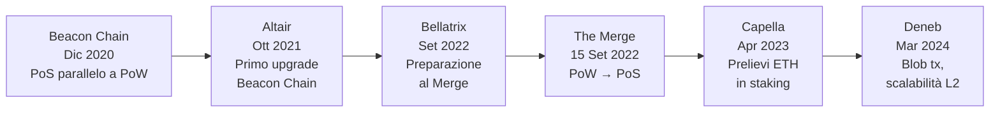
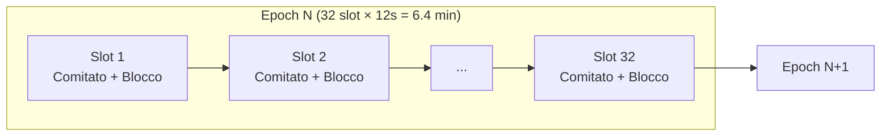
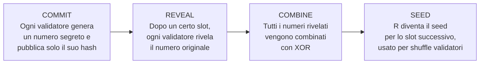
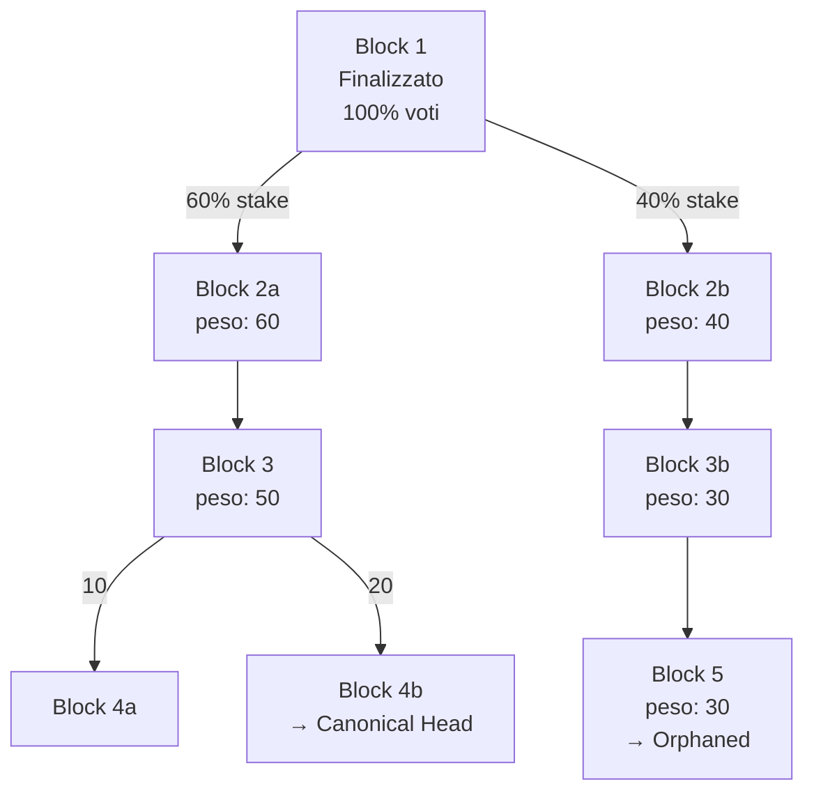
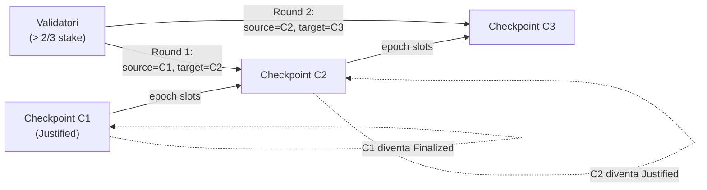

---
tags:
  - università/peer-to-peer-systems-and-blockchain
  - ethereum
  - proof-of-stake
  - consensus
  - blockchain
data: 2026-04-28
lezione: "Lezione 17 — Ethereum Consensus: Proof of Stake"
professore: "Laura Ricci"
---
# Ethereum Consensus: Proof of Stake

## Il Problema del Consenso Distribuito

Il consenso distribuito nasce da una sfida fondamentale: costruire un sistema affidabile su un'infrastruttura inaffidabile. Nell'ecosistema blockchain, "inaffidabile" significa che i nodi comunicano su Internet — con banda limitata, alta latenza, perdita di pacchetti — e possono comportarsi in modo arbitrariamente difettoso: possono semplicemente andare offline, seguire una versione diversa del protocollo, o tentare attivamente di ingannare altri nodi pubblicando messaggi contraddittori. L'obiettivo del consenso è fare in modo che decine di migliaia di nodi indipendenti, sparsi per il mondo, procedano in modo completamente sincronizzato.

### Il Problema dei Generali Bizantini

Il modello teorico di riferimento è il **Byzantine Generals Problem** (problema dei generali bizantini). Nell'analogia classica, un esercito circonda una città e i generali devono decidere unanimemente se attaccare o ritirarsi: possono comunicare solo tramite messaggeri, e alcuni generali potrebbero essere traditori.

I "traditori" esibiscono un **comportamento bizantino**: possono ritardare o riordinare messaggi, mentire, inviare messaggi contraddittori a destinatari diversi, o non rispondere affatto. Il requisito del consenso è che tutti i generali leali decidano lo stesso piano d'azione, e che nessun numero di traditori al di sotto di una certa soglia possa portarli ad adottare piani contraddittori.

---

## Safety e Liveness

Due proprietà fondamentali definiscono la qualità di un protocollo di consenso.

> [!definition] Safety — "Non accade mai nulla di brutto"
>
> Il sistema non raggiunge mai uno stato scorretto o inconsistente. Nel contesto della blockchain: nessun nodo onesto decide valori diversi sullo stesso blocco. La safety corrisponde all'assenza di conflitti e fork permanenti.

> [!definition] Liveness — "Prima o poi accade qualcosa di buono"
>
> Il sistema non si blocca indefinitamente. Nella blockchain: le transazioni vengono eventualmente incluse in un blocco, e nuovi blocchi vengono prodotti continuamente. La violazione della liveness è una situazione di stallo.

Il **Nakamoto Consensus** di Bitcoin sceglie deliberatamente di privilegiare la liveness rispetto alla safety: la catena continua sempre a crescere (always available), ma accetta inconsistenze temporanee sotto forma di fork, che vengono risolti applicando la regola della catena più lunga. La safety in Bitcoin è quindi *probabilistica*: non c'è finality assoluta, ma più conferme accumulate, più è improbabile un'inversione di catena.

> [!warning] CAP Theorem
>
> Il teorema CAP (Consistency, Availability, Partition Tolerance) afferma che, in presenza di una partizione di rete, un sistema distribuito deve scegliere tra consistenza (nessun nodo vede dati obsoleti) e disponibilità (ogni nodo risponde sempre). Non è possibile garantire entrambe simultaneamente.

---

## Dalla Proof of Work alla Proof of Stake

### Limiti del Nakamoto Consensus

Il mining Bitcoin ha costi enormi: consuma quantità sproporzionate di energia, e i mining pool controllano porzioni crescenti della catena, erodendo la decentralizzazione. Le alternative al PoW includono:

- **Proof of Stake** (Ethereum 2.0, Algorand, Cardano, Solana)
- **Delegated Proof of Stake** (Steemit, EOS)
- **Byzantine Consensus** (Hyperledger)

### La Timeline di Ethereum 2.0

*Fig. — Timeline degli upgrade del Consensus Layer di Ethereum 2.0, da Beacon Chain a Deneb.*

La **Beacon Chain** è stata una rete PoS completamente indipendente che ha funzionato in parallelo alla Mainnet Ethereum per quasi due anni. Il suo scopo era supportare la transizione senza interrompere il servizio. **The Merge** del 15 settembre 2022 ha unito la Execution Layer (Mainnet) con la Consensus Layer (Beacon Chain), completando il passaggio da PoW a PoS.

---

## Gasper: LMD GHOST + Casper FFG

Il protocollo di consenso di Ethereum PoS è detto **Gasper** e combina due meccanismi distinti con ruoli complementari:

> [!definition] Gasper
>
> Gasper = **LMD GHOST** (fork choice, liveness) + **Casper FFG** (finality gadget, safety). LMD GHOST sceglie la testa della catena in presenza di fork; Casper FFG aggiunge la finalità ai checkpoint, rendendo certi blocchi irrevocabili.

Questa architettura riflette la posizione di Ethereum rispetto al trade-off del CAP theorem: in condizioni normali, offre sia safety che liveness; in presenza di partizioni di rete, privilegia la liveness (i nodi continuano a produrre blocchi), ma la finalità può interrompersi.

> [!tip] Perché non solo un protocollo?
>
> LMD GHOST da solo garantisce che la catena cresca sempre, ma non fornisce garanzie di irrevocabilità — i blocchi possono sempre essere riorganizzati. Casper FFG da solo richiederebbe una supermajority in ogni round e si bloccherebbe se troppi validatori fossero offline. La combinazione bilancia i due estremi.

---

## I Validatori

### Ruolo e Incentivi

In Ethereum PoS non esistono miner. Al loro posto operano i **validatori** (validators): nodi che bloccano ETH come garanzia e partecipano al consenso. Ogni validatore svolge due ruoli:

- **Block proposer** (raramente): viene selezionato per creare un nuovo blocco in uno slot specifico, scegliendo e ordinando le transazioni pendenti.
- **Attester** (la maggior parte del tempo): vota sui blocchi proposti, confermando quale sia la testa corretta della catena.

### Diventare un Validatore

Per diventare validatore è necessario depositare esattamente **32 ETH** in un apposito *deposit smart contract*. Il deposito ha una funzione analoga al **collaterale** in finanza: un asset offerto come garanzia. Se il validatore si comporta correttamente, guadagna ricompense; se agisce in modo malevolo o negligente, può essere **slashed**, perdendo una porzione dello stake.

> [!note] Perché 32 ETH fissi?
>
> Un importo fisso permette di trattare ogni validatore in modo uguale nel calcolo dei voti. Chiunque può verificare che un validatore abbia depositato la somma corretta consultando il contratto pubblicamente.

Il sistema è altamente partecipativo: attualmente ci sono circa **1 milione** di istanze di validatori attivi, rendendolo genuinamente democratico.

### Staking senza 32 ETH

Chi non dispone di 32 ETH può partecipare tramite **staking pools** come Lido o Rocket Pool, o exchange centralizzati come Coinbase o Binance. In uno staking pool, gli ETH vengono aggregati da operatori professionali; in cambio si riceve un token che accumula le ricompense dello staking e può essere usato nei servizi DeFi.

---

## Slot ed Epoch

A differenza del PoW, che è un protocollo asincrono senza relazione con il tempo reale, il PoS di Ethereum organizza il tempo in unità discrete.

> [!definition] Slot ed Epoch
>
> - **Slot**: finestra temporale di **12 secondi**, durante la quale un comitato di validatori può votare per un beacon block.
> - **Epoch**: sequenza di **32 slot** = **6,4 minuti**. In un'epoch, ogni validatore attivo ha esattamente un'opportunità di partecipare.

*Fig. — Struttura temporale di epoch e slot in Ethereum PoS.*

All'interno di ogni slot si svolgono tre fasi: (1) un singolo validatore propone un blocco e lo diffonde via gossip; (2) tutti gli altri membri del comitato emettono il loro voto (attestation); (3) negli ultimi 4 secondi, i voti vengono aggregati e inoltrati al proposer del prossimo slot.

---

## RANDAO: Randomness Decentralizzata

Ethereum ha bisogno di casualità verificabile per scegliere i block proposer e assegnare i validatori ai comitati. Non è possibile affidarsi a un'entità centrale (che potrebbe barare) né a un valore prevedibile (che potrebbe essere sfruttato). La soluzione è **RANDAO**: un protocollo distribuito per generare numeri casuali che nessun singolo partecipante può controllare.

### Come Funziona RANDAO

Il meccanismo segue uno schema commit-reveal in quattro passi:

*Fig. — Il protocollo RANDAO: dalla generazione del segreto all'assegnazione dei ruoli.*

Il risultato finale $R = n_1 \oplus n_2 \oplus n_3 \oplus \ldots \oplus n_k$ è imprevedibile perché nessuno conosce tutti i segreti prima della reveal, è inalterabile dopo il commit, è decentralizzato poiché ogni validatore contribuisce, ed è verificabile pubblicamente.

L'output RANDAO viene usato come seed per mescolare (*shuffle*) i validatori e assegnarli a block proposer, comitati, aggregatori e sync committees, con un anticipo di **due epoch**.

---

## LMD GHOST: Fork Choice

### Perché si Formano i Fork

In Ethereum, dove i blocchi vengono prodotti ogni 12 secondi, il tempo di propagazione dei blocchi è dell'ordine di grandezza degli slot stessi. Non tutti i validatori vedono tutti i blocchi in tempo per attestarli o costruirci sopra. Il risultato è un albero di blocchi, non una singola catena.

### L'Algoritmo LMD GHOST

**LMD GHOST** (*Latest Message Driven Greedy Heaviest-Observed Sub-Tree*) è la regola di fork choice di Ethereum. L'intuizione centrale è sostituire la "catena più lunga" di Bitcoin con la "catena con più stake accumulato", usando solo il voto più recente di ogni validatore.

> [!definition] LMD GHOST
>
> Partendo dall'ultimo blocco finalizzato, l'algoritmo scende l'albero scegliendo ricorsivamente il ramo con il maggior peso totale. Il peso di un ramo è la somma del peso di tutti i voti per quel blocco e per tutti i suoi discendenti. Solo il messaggio più recente (LMD) di ogni validatore viene considerato.

Il peso di un voto è proporzionale al **bilancio effettivo** del validatore al momento del voto: deposito iniziale di 32 ETH, più le ricompense accumulate, meno le penalità subite. Quindi non conta il numero di voti, ma la quantità di ETH in staking che li sostiene.

*Fig. — LMD GHOST: il ramo superiore (60→50→20) vince sul ramo inferiore più lungo (40→30→30→30) perché ha più stake accumulato.*

> [!tip] Intuizione chiave di LMD GHOST
>
> Un voto per un blocco figlio è implicitamente un voto per tutti i suoi antenati. Se due figli dello stesso blocco padre ricevono voti da validatori diversi, entrambi i gruppi stanno confermando il padre. GHOST sfrutta al massimo tutte le informazioni disponibili, anziché scartarle come farebbe la longest chain rule.

---

## Il Problema del "Nothing at Stake"

In PoW, produrre un blocco è costoso in termini computazionali: questo incentiva i miner a concentrare le risorse su un'unica catena. In PoS naive, creare nuovi blocchi è quasi gratuito, creando il problema del **nothing at stake**: un validatore razionale potrebbe votare per tutte le catene concorrenti contemporaneamente, massimizzando la probabilità di essere sul lato vincente indipendentemente dall'esito.

Le conseguenze sono severe: più fork perché i validatori attestano tutti i rami, risorse sprecate su catene orfane, tempi di finalità più lunghi, e vulnerabilità agli attacchi di double-spending.

### Lo Slashing come Soluzione

Ethereum risolve questo problema con il **slashing**: se un validatore viene trovato in *equivocazione* (ha firmato due blocchi diversi per lo stesso slot, o ha violato le regole di Casper FFG), viene punito con la rimozione di una parte del suo stake e l'espulsione dal protocollo.

> [!warning] Slashing accidentale
>
> La maggior parte degli eventi di slashing non è dolosa: è dovuta a errori operativi come avere due client attivi con la stessa chiave (es. nodo principale + nodo di backup entrambi ON), configurazioni errate di Docker/Kubernetes, o failover senza spegnere l'istanza precedente. Un validatore deve comportarsi come una singola entità.

---

## Casper FFG: Finality Gadget

### Il Concetto di Finality

In Bitcoin la finality è probabilistica: più conferme, meno probabile la reversione, ma mai impossibile. **Casper FFG** (*Friendly Finality Gadget*) è un protocollo *meta-consenso* che aggiunge finality assoluta a un protocollo sottostante. In Ethereum, il protocollo sottostante è LMD GHOST.

> [!definition] Casper FFG
>
> Casper FFG è un overlay su LMD GHOST che opera su scala di epoch (non di singolo slot). Identifica blocchi speciali chiamati **checkpoint** e, tramite un processo di votazione a supermajority, li porta allo stato di *justified* prima, e infine *finalized*.

### Checkpoint, Justification e Finalization

Il primo blocco di ogni epoch è definito **checkpoint**. Ogni validatore produce esattamente un'attestazione per epoch, che contiene due voti:

- **SOURCE**: il checkpoint dell'epoch precedente già giustificato ("costruisco sulla catena giustificata all'epoch $e-1$")
- **TARGET**: il checkpoint dell'epoch corrente ("voto per questa come testa della catena all'epoch $e$")

Il formato di un'attestazione è:

| Campo | Contenuto |
|---|---|
| `slot` | slot 0 dell'epoch $e$ |
| `index` | indice del validatore |
| `source` | checkpoint giustificato dell'epoch $e-1$ |
| `target` | checkpoint candidato dell'epoch $e$ |
| `signature` | firma BLS del validatore |

Quando più di $2/3$ del totale dello stake (pesato per bilancio effettivo) vota per lo stesso checkpoint, quel checkpoint diventa **justified**. Il checkpoint della fonte (source) del round precedente diventa a sua volta **finalized**.

*Fig. — Il processo di justification e finalization in Casper FFG: due supermajority consecutive portano C1 alla finalità.*

### Perché Due Supermajority Consecutive Garantiscono la Finalità

La prova è elegante e si basa sul principio di inclusione-esclusione. Siano $S_1$ e $S_2$ i due insiemi di validatori che formano la supermajority in due epoch consecutive. Per definizione:

$$|S_1| \geq \frac{2}{3} N \qquad |S_2| \geq \frac{2}{3} N$$

dove $N$ è il totale dello stake. Applicando il principio di inclusione-esclusione, poiché $|S_1 \cup S_2| \leq N$:

$$|S_1 \cap S_2| = |S_1| + |S_2| - |S_1 \cup S_2| \geq \frac{2}{3}N + \frac{2}{3}N - N = \frac{1}{3}N$$

L'intersezione è quindi almeno $1/3$ dello stake totale. Qualsiasi tentativo di costruire una catena conflittuale richiederebbe a questi validatori di votare in modo inconsistente tra i due epoch, incorrendo nello slashing. Un attacco che reverta un blocco finalizzato costerebbe la bruciatura di almeno $1/3$ di tutto lo stake in Ethereum — miliardi di dollari — rendendo l'attacco economicamente irrazionale.

> [!abstract] Sintesi del meccanismo di finality
>
> C1 si finalizza quando: (1) nel Round 1 più di 2/3 dello stake vota C2 con sorgente C1 (C2 diventa justified); (2) nel Round 2 più di 2/3 dello stake vota C3 con sorgente C2 (C2 diventa justified per la seconda volta; C1 diventa finalized). La sovrapposizione obbligatoria di almeno 1/3 dello stake tra i due round rende impossibile una revisione senza un costo economico proibitivo.

---

## Il Traffico di Rete

La scala di Ethereum PoS è senza precedenti nel consenso distribuito: in 384 secondi (un'epoch), oltre **500.000 messaggi** devono essere propagati rispettando vincoli temporali rigidi. Nessun altro protocollo di consenso è stato progettato per un numero simile di partecipanti attivi.

Per contenere il traffico, Ethereum usa due meccanismi:
- **Message aggregation**: i comitati sono suddivisi in sottoreti; un validatore aggregatore raccoglie le firme di tutti i membri e le combina in una sola usando firme **BLS** (*Boneh-Lynn-Shacham*), che consentono di aggregare $n$ firme in una singola firma verificabile.
- **Node aggregators**: ruoli specializzati all'interno di ogni comitato.

---

## Ricompense e Penalità

Il comportamento dei validatori è regolato da un sistema di incentivi economici:

| Comportamento | Conseguenza |
|---|---|
| Attestazione corretta e tempestiva | Micro-ricompensa proporzionale al bilancio |
| Attestazione inclusa nel blocco successivo | Ricompensa massima |
| Attestazione mancante, tardiva o errata | Penalità |
| Block proposer che include attestazioni | Ricompensa proporzionale al numero di attestazioni |
| Equivocazione (doppio voto/proposta) | Slashing: perdita di stake + espulsione |

> [!question] Possibili domande d'esame
>
> - Qual è la differenza tra safety e liveness? Come si posiziona Bitcoin vs Ethereum PoS rispetto a questo trade-off?
> - Come funziona RANDAO e perché è necessario in Ethereum PoS?
> - Cos'è il problema del "nothing at stake" e come viene risolto dallo slashing?
> - Spiega l'algoritmo LMD GHOST: come sceglie la testa della catena in presenza di fork?
> - Cos'è Casper FFG? Qual è la differenza tra un checkpoint "justified" e uno "finalized"?
> - Dimostra che due supermajority consecutive garantiscono la finalità (overlap ≥ 1/3).
> - Cosa contiene una attestazione in Ethereum PoS? Spiega i campi SOURCE e TARGET.
> - Cos'è Gasper? Come si combinano LMD GHOST e Casper FFG?
> - Perché è stato necessario introdurre la Beacon Chain prima di The Merge?
