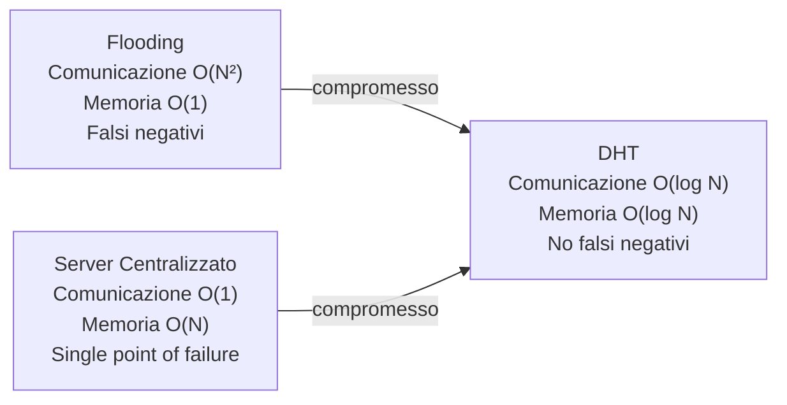
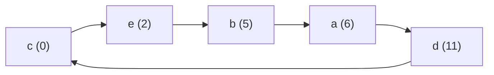
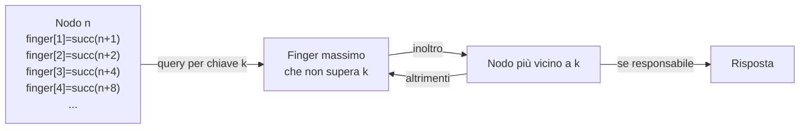
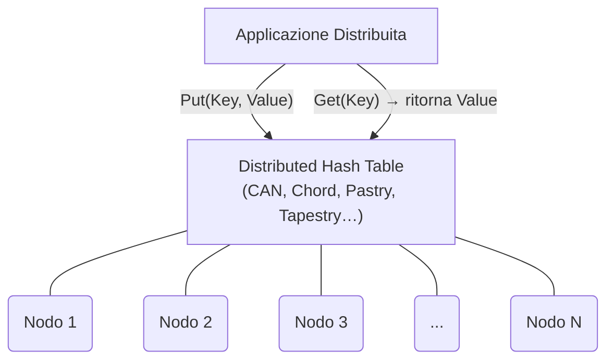

---
tags:
  - università/peer-to-peer-systems-and-blockchain
  - DHT
  - consistent-hashing
  - chord
  - content-addressing
data: 2026-02-19
lezione: "Lezione 3"
professore: "Laura Ricci"
---

# Introduzione alle DHT: Consistent Hashing e Routing

## Il Problema del Recupero Distribuito

In una rete P2P pura il problema fondamentale è il seguente: il nodo A possiede un contenuto I, il nodo B lo vuole ma non ne conosce la posizione. Come decidere dove memorizzare I e come trovarlo, senza ricorrere a un server centralizzato? Qualsiasi soluzione deve fare i conti con due requisiti irrinunciabili: la **scalabilità** — l'overhead di comunicazione e la memoria richiesta da ogni nodo devono essere funzioni contenute del numero di peer N — e l'**adattabilità**, ovvero la capacità di reggere ai guasti e al *churn* continuo di nodi che si connettono e disconnettono.

---

## Searching vs Addressing

In un sistema P2P puro, il recupero dei contenuti può seguire due paradigmi opposti.

Il **searching** guida la ricerca attraverso gli attributi del contenuto, in modo analogo a un motore di ricerca. Il vantaggio è l'immediatezza per l'utente: non sono necessarie strutture ausiliarie e le query complesse sono ammesse. Lo svantaggio è la scalabilità: nelle reti non strutturate con flooding ogni nodo contatta tutti i propri vicini, portando a un overhead di comunicazione $O(N^2)$ nel caso peggiore. Con ottimizzazioni come TTL e identificatori per evitare cicli il costo scende a $O(N)$, ma rimane comunque proibitivo per reti grandi.

L'**addressing** assegna un identificatore univoco a ogni contenuto — tipicamente il suo hash crittografico — e usa quella chiave per recuperarlo. È il fondamento delle **Distributed Hash Tables (DHT)**: l'hash del contenuto diventa la chiave di accesso, e la DHT instrada la query verso il nodo responsabile di quella chiave con garanzie teoriche precise. Il compromesso è la rinuncia alle query complesse e il costo del mantenimento della struttura di indirizzamento. Questo approccio non è più *location-based* (URL che puntano a una posizione), ma *content-based* (l'identità del dato è il suo hash, come fa IPFS).

---

## Motivazione per le DHT

Il punto di partenza è confrontare i due estremi già noti.

L'**approccio centralizzato** (un server di indicizzazione) offre ricerca in $O(1)$ e query complesse senza sforzo, ma richiede spazio $O(N)$ e banda $O(N)$ sul server, ed è un single point of failure. L'**approccio completamente distribuito** (rete non strutturata con flooding) non richiede strutture dati per il routing ($O(1)$ memoria per nodo) ed è intrinsecamente robusto, ma il costo di ricerca esplode a $O(N^2)$, con falsi negativi in caso di partizionamento.

Le DHT si collocano nel punto ottimale di compromesso tra i due:



*Fig. — Le DHT si collocano nel punto di compromesso: $O(\log N)$ sia per la comunicazione che per la memoria, senza falsi negativi e con auto-organizzazione.*

Le proprietà chiave che la DHT garantisce rispetto al flooding sono: scalabilità $O(\log N)$, assenza di falsi negativi, e *self-organization* — il sistema gestisce autonomamente join e leave dei nodi, sia volontari che per guasto.

---

## Funzioni Hash

Una **funzione hash** mappa dati di lunghezza arbitraria in un valore di lunghezza fissa (tipicamente un intero). Poiché l'insieme degli input è più grande dell'insieme degli output, le **collisioni** sono inevitabili. In una **hash table** classica, la chiave viene hashata per trovare direttamente il bucket, e ogni bucket contiene in media $\frac{\text{\#items}}{\text{\#buckets}}$ elementi.

Le **funzioni hash crittografiche** devono soddisfare proprietà aggiuntive di sicurezza rispetto alle semplici hash table. Il caso d'uso principale è **SHA** (Secure Hash Algorithm), la famiglia di standard usata anche nelle DHT:

- Input di lunghezza variabile → output di lunghezza fissa (*digest*)
- Una piccola variazione nell'input produce output completamente diversi (*effetto valanga*)
- La funzione è deterministica: lo stesso input produce sempre lo stesso output
- SHA-1 produce un digest di 40 cifre esadecimali = 160 bit → $2^{160}$ valori possibili

> [!example] Output SHA-1 in Java
>
> ```
> SHA1("")    = DA39A3EE5E6B4B0D3255BFEF95601890AFD80709
> SHA1("abc") = A9993E364706816ABA3E25717850C26C9CD0D89D
> SHA1("abd") = CB4CC28DF0FDBE0ECF9D9662E294B118092A5735
> ```
>
> "abc" e "abd" differiscono di un solo carattere ma producono digest completamente diversi — l'effetto valanga in azione. La stringa vuota produce un digest ben definito, non un errore.

Le famiglie disponibili sono SHA-1, SHA-224, SHA-256, SHA-384 e SHA-512, dove le ultime quattro sono note come **SHA-2** e il suffisso indica la lunghezza in bit del digest. Ethereum usa **Keccak** (una variante di SHA-3). Queste funzioni sono il mattone base sia per il consistent hashing delle DHT sia per i puzzle crittografici del Proof of Work di Bitcoin.

---

## Da Memcached alle DHT

**Memcached** è un sistema di caching distribuito per il web: mantiene un pool di server che forniscono accesso rapido alle informazioni, riducendo il carico sul database (l'accesso al DB avviene solo in caso di *cache miss*). L'idea è distribuire una hash table su più server per superare i limiti di memoria di una singola macchina.

Il meccanismo di base: l'hash dell'URL di una risorsa determina in quale server di cache è memorizzata; ogni macchina può calcolare *localmente* quale cache contiene la risorsa cercata, senza comunicazione tra le cache stesse. Questo schema viene esteso alle DHT per i sistemi P2P — ma in uno scenario dinamico emerge immediatamente il **problema del rehashing**.

---

## Il Problema del Rehashing

Le hash table distribuite classiche calcolano il nodo target come $h(\text{key}) \bmod N$, dove $N$ è il numero di server. Con $N$ fisso tutto funziona: 4 bucket con 12 chiavi assegnate uniformemente, ad esempio:

| Bucket | Chiavi assegnate |
|--------|-----------------|
| 1 | 1, 5, 9 |
| 2 | 2, 6, 10 |
| 3 | 3, 7, 11 |
| 4 | 4, 8, 12 |

Ora supponiamo che il bucket 3 vada offline e si aggiunga un nuovo bucket 5. Con $N$ che cambia da 4 a 4 (dopo la rimozione), il calcolo $h(\text{key}) \bmod 4$ rimane valido solo per le chiavi già allineate. Con il nuovo bucket 5 e $N=4 \to N=4$ la situazione è ancora peggio: le chiavi che restano sullo stesso nodo sono solo quelle per cui $h(\text{key}) \bmod 4 = h(\text{key}) \bmod 5$, che è una piccola minoranza.

> [!warning] Entità del problema
>
> Con la funzione classica $\text{SHA}(x) \bmod N$:
> - 4 nodi di caching → 6 nodi: quasi tutte le chiavi devono essere rimappate
> - Con 10 bucket e 1000 chiavi, circa il **99% delle chiavi deve essere riassegnato**
> - Questo produce un traffico enorme che satura la rete, rendendo il sistema inutilizzabile durante ogni operazione di scaling

Il problema è aggravato dal fatto che le chiavi vengono rimappate anche sui nodi che sono rimasti attivi — non solo a causa delle aggiunte o rimozioni, ma per il semplice cambiamento di $N$. In un sistema P2P con churn continuo, questo è inaccettabile.

---

## Consistent Hashing

> [!definition] Consistent Hashing
>
> Tecnica di hashing in cui sia i contenuti che i nodi vengono mappati nello **stesso spazio di indirizzamento**, organizzato come un **anello circolare** (*ring*) di dimensione $2^M$. Ogni nodo gestisce un **intervallo contiguo** di chiavi dell'anello, non un insieme sparso come avviene con il modulo. Lo schema non dipende direttamente dal numero di server: aggiungere o rimuovere nodi richiede di spostare solo una minoranza di elementi — in media $K/n$ chiavi, dove $K$ è il totale delle chiavi e $n$ il numero di nodi.

L'intuizione fondamentale è semplice: invece di mappare gli oggetti a un *indice di bucket* che dipende da $N$, si mappano sia gli oggetti che i nodi nello stesso spazio continuo, e si assegna ogni oggetto al primo nodo che si incontra procedendo in senso orario. Così, quando $N$ cambia, solo i nodi adiacenti alla modifica sono coinvolti nella redistribuzione.

---

## Costruzione di una DHT: l'Anello

La costruzione di una DHT basata su consistent hashing segue tre passi concettuali.

**Passo 1 — Spazio di chiavi comune.** Si definisce un *identifier space* condiviso tra nodi e dati, tipicamente $\{0, 1, \ldots, 2^M - 1\}$ organizzato come un anello modulo $2^M$. Tutti gli identificatori — sia dei nodi che dei contenuti — vivono in questo spazio.

**Passo 2 — Connessione dei nodi.** Ogni nodo è collegato a un numero piccolo e limitato di vicini in modo tale che il numero massimo di hop sia limitato. La topologia dell'overlay definisce diverse strutture possibili: anello con *chord* (scorciatoie), albero, ecc.

**Passo 3 — Assegnazione dei dati.** Sia i nodi che i dati vengono mappati dalla stessa funzione hash nello stesso spazio; si definisce una relazione tra hash dei contenuti e hash dei nodi per determinare chi memorizza cosa.

### Costruzione dell'Anello: Esempio con N=16

Consideriamo uno spazio di identificatori $\{0, \ldots, 15\}$ organizzato come un anello modulo 16, con cinque nodi $a, b, c, d, e$ che ottengono le seguenti posizioni tramite la funzione hash $H$:

$$H(a) = 6, \quad H(b) = 5, \quad H(c) = 0, \quad H(d) = 11, \quad H(e) = 2$$



*Fig. — Anello con N=16 e cinque nodi. I nodi (cerchi verdi) sono posizionati alle posizioni 0, 2, 5, 6, 11 dell'anello; ogni nodo punta al proprio successore, formando una lista circolare.*

### Il Successore

Il **successore** `succ(x)` è il primo nodo sull'anello con identificatore $\geq x$, procedendo in senso orario. Importanti distinzioni: `succ` può essere applicato sia a identificatori generici (non occupati da nodi) sia a posizioni di nodi.

> [!example] Calcolo del successore
>
> - `succ(12) = 0` — non ci sono nodi tra 12 e 15, si fa wrap-around all'inizio dell'anello
> - `succ(1) = 2` — il nodo più vicino in senso orario a partire da 1 è il nodo in posizione 2
> - `succ(6) = 6` — la posizione 6 è occupata da un nodo, quindi il successore coincide
>
> È fondamentale distinguere tra gli **identificatori** (tutti i valori 0–15) e i **nodi** (solo le cinque posizioni occupate).

Il successore di un nodo $n$ è definito come `succ(n+1)`:
- Il successore di 0 è `succ(1) = 2`
- Il successore di 2 è `succ(3) = 5`
- Il successore di 5 è `succ(6) = 6`
- Il successore di 6 è `succ(7) = 11`
- Il successore di 11 è `succ(12) = 0` (wrap-around)

### Dove Memorizzare i Dati

I dati vengono memorizzati usando la stessa funzione hash $H$ applicata alla chiave del contenuto. Una coppia `<key, value>` — ad esempio `key="crown"`, `value=JPEG della corona` — ottiene un identificatore $k = H(\text{key})$, e il dato viene archiviato nel nodo `succ(k)`.

Nell'esempio, i dati del gioco vengono distribuiti sull'anello così:

| Oggetto | Hash | Nodo responsabile (`succ`) |
|---------|------|---------------------------|
| Scudo | $H(\text{scudo}) = 12$ | `succ(12) = 0` |
| Ascia | $H(\text{ascia}) = 2$ | `succ(2) = 2` |
| Corona | $H(\text{corona}) = 9$ | `succ(9) = 11` |
| Spada | $H(\text{spada}) = 14$ | `succ(14) = 0` |
| Anello | $H(\text{anello}) = 4$ | `succ(4) = 5` |

Ogni oggetto si "sposta" in senso orario fino al primo nodo che incontra. Lo scudo (hash=12) e la spada (hash=14) atterrano entrambi sul nodo 0 perché non ci sono nodi tra 12 e 15.

### Peer Leave: Consistent Hashing in Azione

> [!example] Rimozione del nodo 11
>
> Se il nodo 11 abbandona la rete, solo le chiavi che gli erano assegnate devono essere rimappate — e vengono assegnate al suo successore, il nodo 0. La corona (hash=9) passa da nodo 11 a nodo 0. Tutti gli altri oggetti (ascia su nodo 2, anello su nodo 5, scudo e spada su nodo 0) restano invariati. Il resto dell'anello non è toccato dalla rimozione.

Questa è la proprietà chiave del consistent hashing: modificare di un'unità il numero di nodi non forza il rimapping globale, ma solo locale.

---

## Proprietà del Consistent Hashing

Quando la hash table viene ridimensionata, in media solo $K/n$ chiavi devono essere rimappate (dove $K$ è il numero totale di chiavi, $n$ il numero di server), a patto che la funzione hash sia uniforme.

- **Rimozione di un nodo**: solo le chiavi associate a quel nodo vengono riassegnate al suo successore. Tutte le altre rimangono invariate.
- **Aggiunta di un nodo**: le chiavi tra il nuovo nodo e il nodo precedente nell'anello vengono riassegnate al nuovo nodo; le altre rimangono invariate.

---

## Node Leave e Node Failure

Una **disconnessione volontaria** richiede tre operazioni: suddividere l'intervallo di indirizzi tra i nodi vicini, copiare le coppie chiave/valore ai nodi corrispondenti, e rimuovere il nodo dalle routing table degli altri nodi.

Un **guasto improvviso** (*node failure*) è più problematico perché tutti i dati memorizzati sul nodo vanno persi se non sono replicati altrove. Le soluzioni adottate nelle DHT reali sono:

- **Replicazione dei dati** su più nodi (ridondanza): ogni chiave viene memorizzata su $r$ successori anziché uno solo
- **Refresh periodico** delle informazioni: i nodi eseguono gossip per mantenere aggiornata la propria visione della rete
- **Percorsi di routing alternativi**: probing periodico dei nodi vicini per rilevarne l'attività; quando si rileva un guasto, si aggiornano le routing table per bypassare il nodo mancante

---

## Data Lookup e Routing

### Lookup Sequenziale

Per effettuare il lookup di una chiave $k$, un nodo calcola $H(k)$ e segue i puntatori al successore fino a trovare il nodo responsabile. Questo è implementato come algoritmo distribuito tramite **RPC** (*Remote Procedure Calls*): la notazione `n.foo()` indica una chiamata remota della funzione `foo()` sul nodo $n$.

> [!example] Lookup di "Crown" dal nodo 2
>
> Il nodo 2 vuole trovare "Crown". Calcola $H(\text{"Crown"}) = 9$. Segue i puntatori al successore: $2 \to 5 \to 6 \to 11$. Il nodo 11 ha la chiave 9 nel proprio intervallo (9 ≤ 11) e restituisce il valore al nodo iniziatore.

Se si usa solo il puntatore al successore diretto, il costo nel caso peggiore è $O(N)$: bisogna attraversare sequenzialmente l'intero anello. Con $N = 10^6$ nodi, questo significa fino a 500.000 hop — inaccettabile.

### Finger Table: Speeding Look Up

Chord risolve l'inefficienza con la **Finger Table**: ogni nodo $n$ mantiene $M$ puntatori verso nodi distanti a salti esponenzialmente crescenti.

> [!definition] Finger Table
>
> $$\text{finger}[i] = \text{succ}(n + 2^{i-1}) \quad \text{per } i = 1, \ldots, M$$
>
> La tabella ha dimensione $M$, dove $N = 2^M$. Ogni nodo conosce: `succ(n+1)`, `succ(n+2)`, `succ(n+4)`, `succ(n+8)`, ..., `succ(n+2^{M-1})`. La dimensione della routing table è $M = \log_2 N$ entry.

L'algoritmo di lookup con finger table funziona così: ad ogni step, il nodo che riceve la query la inoltra al finger il cui identificatore è il massimo che non supera la chiave cercata. Questo "avvicina" il query alla destinazione dimezzando l'intervallo residuo ad ogni hop.



*Fig. — Il meccanismo della finger table: ogni hop dimezza la distanza residua alla chiave cercata, portando il costo totale a $O(\log N)$ hop.*

> [!tip] Scala del miglioramento
>
> Con $N = 10^6$ nodi:
> - Routing sequenziale: fino a **500.000 hop**
> - Finger table: $\log_2(10^6) \approx$ **20 hop**
>
> Il miglioramento è di cinque ordini di grandezza. Sia la routing table che il numero di hop sono $O(\log N)$.

---

## Chord

**Chord** è il DHT di riferimento costruito esattamente sui principi illustrati. Fu sviluppato nel 2001 da un gruppo di ricerca formato da ricercatori del MIT e dell'Università della California (Ion Stoica, Robert Morris, David Liben-Nowell, David R. Karger, M. Frans Kaashoek, Frank Dabek, Hari Balakrishnan) e pubblicato su IEEE/ACM Transactions on Networking con il titolo *"Chord: A Scalable Peer-to-peer Lookup Protocol for Internet Applications"*.

La topologia di Chord è un anello con *chord* — le scorciatoie della finger table sono i "chord" che danno il nome al sistema. Ogni nodo mantiene un puntatore al predecessore (per le operazioni di join/leave) e la finger table per il routing efficiente.

> [!note] Varianti di DHT
>
> Diverse proposte "consistent-hashing compliant" differiscono nel modo in cui i dati vengono associati ai peer e nell'operatore usato per trovare il peer responsabile di una chiave (`FindPeer` o `FindSuccessor`). Esempi notevoli: **CAN** (Content-Addressable Network), **Chord**, **Pastry**, **Tapestry**, **Kademlia**. I termini "Structured Peer-to-Peer" e "DHT" sono spesso usati come sinonimi.

---

## Location Addressing vs Content Addressing

Il **location addressing** è il metodo classico di Internet: un link HTTP punta a una specifica posizione su uno o più server. L'identità del dato è dove si trova, non cosa contiene. Chi controlla quella posizione controlla il contenuto: anche se migliaia di persone hanno scaricato una copia di un dato, HTTP punta a una sola posizione fisica. Il web tradizionale ci costringe a fingere che i dati esistano in un unico posto, con tutte le implicazioni di censura, disponibilità e controllo che ne derivano.

Il **content addressing** rovescia il paradigma: il contenuto viene identificato dalla propria *impronta* crittografica — il suo hash — anziché dalla sua posizione. Avere l'hash di un contenuto permette di ottenerlo da chiunque ne abbia una copia, indipendentemente da dove si trova. L'hash non cambia mai, quindi i link restano validi qualunque sia la fonte, chiunque abbia aggiunto il contenuto, e quando è stato aggiunto.

> [!tip] Implicazioni del Content Addressing
>
> Nel content addressing il link è una *garanzia di integrità*: se ricevo dati il cui hash corrisponde alla chiave cercata, so che sono esattamente quelli che volevo, senza dovermi fidare della sorgente. Non è possibile ricevere contenuti contraffatti spacciandoli per la chiave corretta.

Questo approccio è alla base di **IPFS** (*InterPlanetary File System*), la rete P2P che implementa Web3, il web distribuito. I dati non sono più delegati a server centrali (Facebook, Instagram, Dropbox), ma memorizzati in un ambiente P2P distribuito dove chiunque può recuperare un contenuto da chiunque lo abbia.

### Content Lookup

In un sistema basato su content addressing, il routing è *content-based*: ogni nodo mantiene una routing table che rappresenta una visione parziale della rete. Quando si cerca un dato con hash $k$, il messaggio viene instradato hop-by-hop verso il nodo responsabile di $k$, con ciascun hop che si avvicina alla destinazione. Il numero di hop necessari è $O(\log N)$, con routing table di dimensione $O(\log N)$ per ogni nodo.

---

## API della DHT

Le DHT espongono intenzionalmente un'interfaccia minimale, indipendente dall'applicazione:

- `PUT(key, value)` — inserisce un valore associato a una chiave
- `GET(key)` → `value` — recupera il valore associato a una chiave

Non esiste generalmente una funzione esplicita per spostare le chiavi. Il valore associato a una chiave può essere un file, un indirizzo IP, un riferimento a un peer, o qualsiasi altro dato, a seconda dell'applicazione che usa la DHT come strato infrastrutturale.



*Fig. — L'API della DHT espone solo Put e Get all'applicazione, nascondendo completamente la complessità della distribuzione.*

---

## Load Balancing e Virtual Server

Il load imbalance in una DHT ha tre cause distinte:

1. **Spazio non uniforme**: un nodo gestisce una porzione di spazio di indirizzi più grande degli altri — risolvibile con una funzione hash uniforme.
2. **Dati pesanti**: lo spazio è distribuito uniformemente, ma il nodo gestisce una *quantità* di dati molto maggiore (le chiavi assegnategli corrispondono a file grandi).
3. **Query concentrate**: lo spazio è distribuito uniformemente, ma il nodo riceve molte più query perché i dati assegnatigli sono molto popolari (*hotspot*).

Il load imbalance produce: minore robustezza del sistema, minore scalabilità, e impossibilità di garantire i bound $O(\log N)$.

La soluzione standard è usare i **virtual server**: ogni nodo fisico mantiene più identità sull'anello — ossia è responsabile di più intervalli non contigui — distribuendo la responsabilità delle chiavi in modo più uniforme. Questo mitiga principalmente i problemi di tipo 1 e parzialmente di tipo 3, ma non risolve completamente il problema degli hotspot dovuti a contenuti virali.

---

## Sfide Aperte delle DHT

> [!warning] DHT Challenges
>
> - **Hotspot**: distribuire le responsabilità in modo uniforme per evitare che alcuni nodi siano molto più carichi di altri. I virtual server aiutano, ma un contenuto estremamente popolare resterà sempre un collo di bottiglia per il nodo responsabile.
> - **Churn**: redistribuire le responsabilità quando i nodi si connettono o disconnettono. In una rete P2P reale il churn è continuo e ad alta frequenza — ogni operazione di join/leave deve essere gestita senza interrompere il servizio.
> - **Trade-off strutturale**: dimensione delle routing table vs traffico nell'overlay vs *stretch* rispetto all'underlay. I percorsi logici nella DHT possono essere molto più lunghi dei percorsi fisici ottimali sulla rete sottostante — un nodo logicamente vicino può essere fisicamente a mezzo mondo di distanza.

---

## Confronto tra Architetture

| Approccio                          | Memoria per nodo | Overhead comunicazione | Query complesse | Falsi negativi | Robustezza |
| ---------------------------------- | ---------------- | ---------------------- | --------------- | -------------- | ---------- |
| **Server Centralizzato**           | $O(N)$           | $O(1)$                 | Sì              | Si             | No (SPOF)  |
| **P2P Non Strutturato (flooding)** | $O(1)$           | $O(N^2)$               | Sì              | No             | Sì         |
| **DHT**                            | $O(\log N)$      | $O(\log N)$            | No              | Si             | Sì         |

---

## Applicazioni delle DHT

Le DHT offrono un servizio generico di memorizzazione e indicizzazione distribuita. Il valore associato a una chiave può essere un file, un indirizzo IP, o qualsiasi altro dato — la semantica dipende dall'applicazione. Esempi concreti di sistemi che usano DHT:

- **IPFS** (*InterPlanetary File System*): file system distribuito content-addressed, base di Web3
- **BitTorrent**: memorizzazione dei riferimenti ai peer in uno swarm (il DHT di BitTorrent è basato su Kademlia)
- **Ethereum**: memorizzazione dei riferimenti ai peer nella rete P2P sottostante al protocollo
- Supporto a servizi di livello superiore: qualsiasi applicazione che necessiti di un registro distribuito di chiave/valore

---

> [!abstract] Sintesi
>
> Le DHT sono sistemi auto-organizzanti, semplici ed efficienti. Il routing è basato su chiave; le chiavi sono distribuite uniformemente tra i nodi, garantendo bottleneck avoidance, inserimento incrementale e fault tolerance. La realizzazione concreta di questo modello tramite consistent hashing con finger table (Chord) porta a una struttura con $O(\log N)$ hop per il lookup e $O(\log N)$ entry nella routing table per nodo. I termini "Structured Peer-to-Peer" e "DHT" sono spesso usati come sinonimi.

---

> [!question] Possibili domande d'esame
>
> - Qual è la differenza tra **searching** e **addressing** nel recupero distribuito dei contenuti? Quali sono le complessità nei due approcci?
> - Perché il **consistent hashing** risolve il problema del rehashing? Quante chiavi devono essere rimappate in media quando si aggiunge o rimuove un nodo?
> - Descrivi la costruzione di un anello di consistent hashing con $N=16$ e cinque nodi. Come si calcola il successore di una chiave?
> - Spiega il meccanismo della **Finger Table** di Chord: come è costruita, come viene usata nel lookup e quale complessità garantisce?
> - Qual è la differenza tra **location addressing** e **content addressing**? Quali sistemi reali adottano il content addressing?
> - Cosa sono i **virtual server** nelle DHT e perché vengono usati? Quali dei tre tipi di load imbalance risolvono?
> - Descrivi le tre cause di load imbalance in una DHT e come possono essere mitigate.
> - Confronta server centralizzato, overlay non strutturato e DHT in termini di memoria per nodo, overhead di comunicazione, query complesse e robustezza.
> - Spiega cosa succede in un **node leave** volontario e in un **node failure** improvviso in una DHT. Come si garantisce la disponibilità dei dati?
> - Quali sono le sfide aperte delle DHT (hotspot, churn, trade-off)? Come si correlano tra loro?
