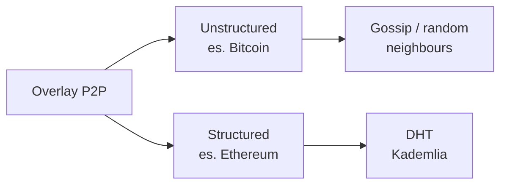
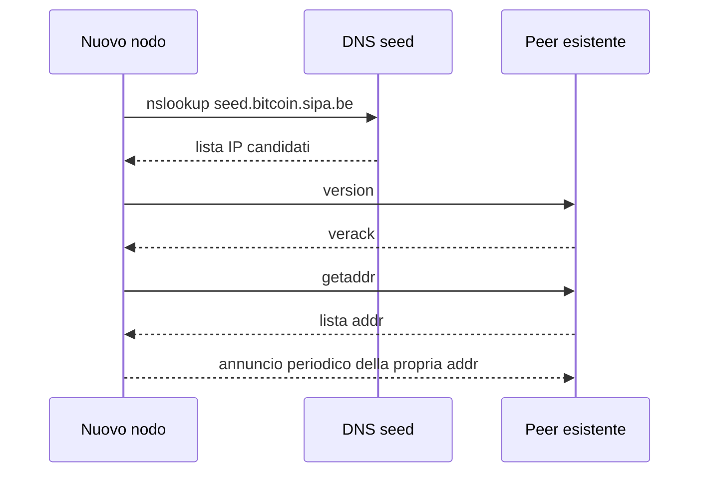
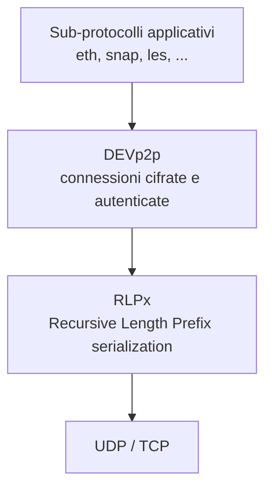
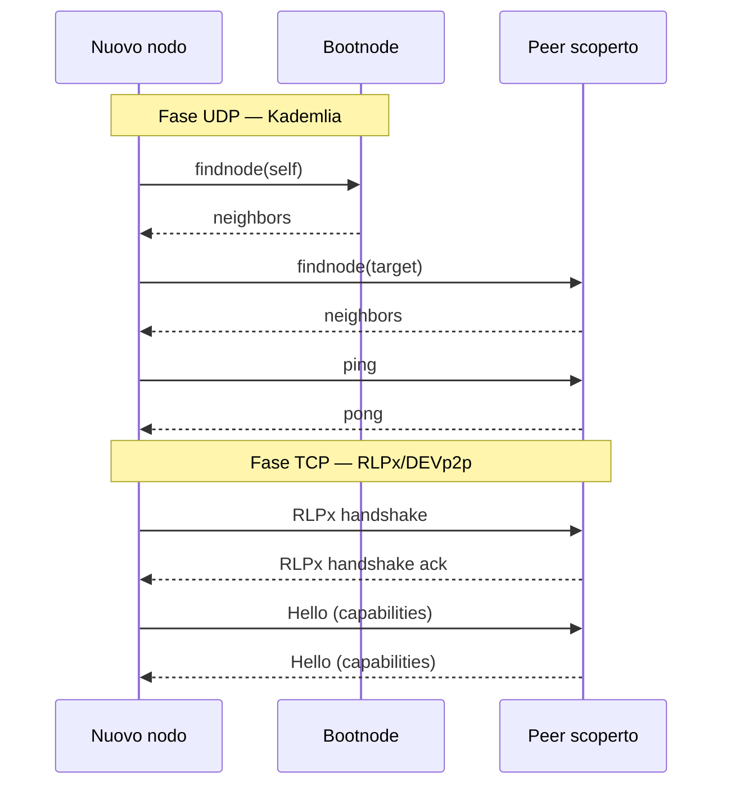

---
tags:
  - università/peer-to-peer-systems-and-blockchain
  - p2p
  - bitcoin
  - ethereum
  - kademlia
  - networking
  - laboratorio
data: 2026-02-24
lezione: "Lab 1 - P2P Networks in Bitcoin ed Ethereum"
professore: "Damiano Di Francesco Maesa"
---
## Inquadramento della lezione

Questo primo laboratorio del corso apre la sezione applicativa della parte P2P: anziché discutere in astratto le proprietà delle reti overlay, si guarda come due blockchain reali — Bitcoin ed Ethereum — abbiano implementato, ciascuna a modo suo, il livello di comunicazione peer-to-peer su cui tutto il resto (consenso, propagazione delle transazioni, sincronizzazione degli stati) si appoggia.

L'obiettivo è fare da ponte tra la teoria vista nelle lezioni iniziali (classificazione degli overlay, Kademlia, DHT) e ciò che si troverà effettivamente installando un client Bitcoin Core o un nodo `geth`. La chiave di lettura è il confronto: **Bitcoin ha scelto un overlay non strutturato** basato su gossip, **Ethereum uno strutturato** basato su Kademlia — due risposte molto diverse allo stesso problema, scoprire peer con cui parlare senza conoscere la topologia globale.

> [!info] Informazioni organizzative
>
> Il modulo di laboratorio segue in modo "organico" il modulo teorico: la scaletta degli argomenti si adatta a quelli già visti a lezione. Il materiale di riferimento è costituito dai link inseriti nelle slide di ogni laboratorio, e le domande possono essere poste in ufficio (333 Dip. Informatica) o via Teams su richiesta. Ogni studente lavora con il proprio dispositivo (*bring your own device*).

---

## Il problema di base delle reti P2P

Prima di confrontare i due approcci conviene ricordare qual è il problema comune. In una rete peer-to-peer un nodo possiede **solo informazioni topologiche locali**: non conosce — e, per ragioni di privacy e resistenza agli attacchi, **non deve** conoscere — la topologia complessiva. Ogni partecipante vede soltanto i propri vicini diretti.

Questa limitazione non è solo una scelta di design: è un requisito di sicurezza. Una rete in cui ogni nodo pubblica la lista completa dei peer sarebbe banalmente attaccabile, perché un avversario potrebbe ricostruire mappature globali e scegliere bersagli mirati.

Una rete P2P ben progettata deve essere resistente ad almeno tre famiglie di attacchi:

- **Sybil attack**: l'avversario crea un numero arbitrario di identità fittizie per influenzare la rete (routing, consenso, gossip)
- **Eclipse attack**: l'avversario circonda un nodo vittima con peer sotto il suo controllo, isolandolo dal resto della rete
- **Partizionamento**: l'avversario divide la rete in componenti non comunicanti, permettendo ad esempio di presentare stati divergenti a due sottoinsiemi di vittime

> [!warning] Bootstrapping problem
>
> Come fa un nodo appena avviato a scoprire il primo peer a cui connettersi, se per definizione non conosce nessuno? Questa "gallina-uovo" è nota come **bootstrapping problem** e viene tipicamente risolta con una lista di nodi di fiducia hardcoded nel client o con query DNS. È un punto di fragilità: chi controlla quei seed controlla potenzialmente anche chi riesce a entrare nella rete.

La scelta architetturale fondamentale, fatta questa premessa, è fra due famiglie di overlay:


*Fig. — Le due grandi famiglie di overlay P2P utilizzate dalle principali blockchain.*

In entrambi i casi lo scopo è lo stesso: **abilitare la comunicazione per un'applicazione decentralizzata**. Le strade scelte per raggiungerlo sono molto diverse.

---

## Bitcoin: overlay non strutturato e gossip

### Struttura generale

Bitcoin — almeno nella sua forma attuale, senza considerare Lightning — è una **rete di comunicazione P2P il cui unico scopo è scambiarsi informazioni su uno stato globale condiviso**. Le informazioni sono transazioni e blocchi; lo stato globale è il set UTXO.

Le scelte progettuali del livello network di Bitcoin si possono riassumere così:

| Aspetto | Scelta di Bitcoin |
|---|---|
| Overlay | Non strutturato, **gossip** |
| Bootstrapping | Lista DNS + hardcoded |
| Privacy | Randomizzazione (nessuna geolocalizzazione) |
| Sicurezza | Connessioni cifrate solo dalla v27+ (apr. 2024) |
| Trasporto | TCP |

> [!note] Cifratura tardiva
>
> Fino all'aprile 2024 le connessioni tra nodi Bitcoin erano in chiaro. Questo permetteva, a chi era posizionato sulla rete (ISP, punti di interscambio), di distinguere facilmente il traffico Bitcoin e fare fingerprinting. La v27 introduce finalmente il supporto nativo al cifrato, con BIP 324.

### Node discovery in Bitcoin

Un nodo appena avviato segue un protocollo relativamente semplice per entrare a far parte della rete:

1. **Ottiene una lista di indirizzi candidati** da DNS di fiducia o da una lista hardcoded: ad esempio `nslookup seed.bitcoin.sipa.be` restituisce gli IP di una serie di nodi "seeder" mantenuti da sviluppatori noti della community. L'elenco hardcoded nel sorgente vive in `src/chainparamsseeds.h`.
2. **Invia un messaggio `version`** a uno o più di questi peer per tentare la connessione.
3. Se il peer accetta, risponde con un messaggio **`verack`** (version acknowledgement).
4. Da quel momento il nodo può chiedere altri peer a chi già conosce tramite il messaggio **`getaddr`**, ricevendo in risposta una lista di indirizzi di altri partecipanti alla rete.
5. Periodicamente, il nodo **annuncia se stesso** (cioè invia la propria `addr`) ad alcuni vicini scelti casualmente, così che l'informazione della sua presenza si propaghi per gossip.


*Fig. — Handshake iniziale di un nuovo nodo Bitcoin: dal seed DNS all'inserimento attivo nella rete.*

Una volta stabilita la rete di vicini, i messaggi applicativi veri e propri — transazioni e blocchi — vengono propagati con un meccanismo a tre fasi: `inv` annuncia la disponibilità di un oggetto (un hash), `getdata` lo richiede, infine arriva il `block` o `tx`. Tecniche come **trickle** e **diffusion** randomizzano i tempi di propagazione per ridurre la possibilità che un osservatore risalga al nodo originatore di una transazione.

### Gestione delle connessioni

Un nodo Bitcoin mantiene un numero di connessioni "target" tra **8 e 11**, e un massimo configurabile (di default **125**). Il parametro `-maxconnections=<num>` controlla quest'ultimo. La logica concreta risiede in `src/net.h` nel repository di Bitcoin Core.

> [!tip] Perché 8 connessioni
>
> Il numero basso non è casuale: pochi peer stabilmente connessi bastano a garantire la raggiungibilità (ogni messaggio fa solo pochi hop prima di propagarsi a tutta la rete), limitano il consumo di banda e — soprattutto — rendono più costoso per un avversario circondare un nodo. Con 125 come limite massimo c'è spazio per accettare connessioni in ingresso da altri nodi.

### Monitoraggio della rete

Essendo Bitcoin una rete aperta, chiunque può scansionarla e tenerne conteggio. Due strumenti spesso citati:

- [bitnodes.io](https://bitnodes.io/) — conta i nodi raggiungibili e mostra grafici storici
- [21.ninja](https://21.ninja/) — visualizza la propagazione dei blocchi

Questi dashboard sono utili in due sensi: danno un'idea di quanti nodi sono "full" (oggi dell'ordine di decine di migliaia) e, guardando la serie temporale, permettono di correlare eventi (hard fork, aggiornamenti software) con variazioni nella topologia.

### Attacchi specifici al layer P2P di Bitcoin

Oltre ai Sybil/eclipse classici, la scarna sicurezza di rete di Bitcoin ha prestato il fianco storicamente a:

- **DNS poisoning** dei seed: se l'attaccante compromette la risoluzione DNS di un seed, può imporre a tutti i nuovi nodi una visione parziale della rete
- **Network listening**: l'intercettazione in chiaro del traffico (risolta solo con la v27)
- **Fingerprinting tramite il "addresses cookie"**: sfruttando il modo in cui i nodi memorizzano e ripropagano le `addr` si può ricostruire una mappa implicita dei peer, violando la privacy topologica

> [!note] Riferimento
>
> L'articolo di Biryukov et al. (<https://arxiv.org/pdf/1410.6079>) è un classico su come il livello di rete di Bitcoin leaks informazioni che minano la privacy degli utenti.

---

## Ethereum: overlay strutturato con Kademlia

Ethereum risponde allo stesso problema di Bitcoin — scambiare informazioni sullo stato globale — ma con un impianto più sofisticato, sia perché nato dopo (con più esperienza di attacchi), sia perché le sue esigenze applicative (molti sub-protocolli) lo richiedono.

| Aspetto | Scelta di Ethereum |
|---|---|
| Overlay | Strutturato, **Kademlia** |
| Bootstrapping | Lista hardcoded di *bootnodes* |
| Privacy | Randomizzazione nella scelta dei vicini |
| Sicurezza | Connessioni **autenticate e cifrate** |
| Trasporto | **UDP** per node discovery, **TCP** per comunicazione |

### Perché una DHT per il P2P

Kademlia è una DHT — una *distributed hash table* — e l'argomento per cui una DHT sia preferibile a un gossip non strutturato è ormai consolidato:

- **Decentralizzazione**: non serve coordinarsi per costruire la propria tabella di routing
- **Fault tolerance / dinamismo**: la struttura si adatta al *churn* (nodi che entrano ed escono continuamente), entro limiti ragionevoli
- **Scalabilità e load balancing**: la quantità di informazione locale cresce come $O(\log n)$ nel numero di nodi, e il routing richiede $O(\log n)$ hop

> [!tip] Il log magico
>
> Le DHT "log/log" sono il punto di equilibrio ideale: uno stato di routing piccolo che garantisce comunque latenze basse. Questo è ciò che permette a una rete con decine di migliaia di nodi Ethereum di continuare a scoprire peer in tempi ragionevoli.

### Come Kademlia è adattato in Ethereum

Le differenze rispetto al Kademlia "da manuale" sono interessanti e riflettono la diversa finalità. In Kademlia tradizionale si usa la DHT per cercare **valori associati a chiavi**. In Ethereum **non si fanno value lookup**: la DHT serve esclusivamente per trovare peer vicini — dove "vicino" non significa vicino geograficamente, ma vicino nello spazio degli identificatori.

| Dimensione | Kademlia "classico" | Kademlia di Ethereum |
|---|---|---|
| Chiavi vs nodi | Spazi distinti, key lookup | Stesso spazio, **solo node lookup** |
| Dimensione ID | Tipicamente 160 bit | **512 bit** (chiave pubblica) |
| Hash per distanza | SHA-1 | **Keccak-256** |
| Numero di bucket | 160 | **256** |
| Elementi per bucket | $k = 20$ | $k = 16$ |
| Meccanismo di reputazione | Uptime | Reputazione complessa (ping/pong + metriche) |

Gli **identificatori dei peer** in Ethereum sono la chiave pubblica stessa (già casuale per costruzione), e la distanza è calcolata come XOR tra due ID, prendendo il bit più significativo — esattamente lo schema di Kademlia. La tabella di routing è organizzata in 256 bucket, uno per ogni possibile "prefisso di distanza", ciascuno contenente fino a 16 elementi.

> [!definition] Enode (Ethereum Node Identifier)
>
> Il formato con cui un nodo Ethereum è identificato a livello di network è:
>
> ```
> enode://<public-key>@<IP>:<TCP-port>?discport=<UDP-discovery-port>
> ```
>
> Esempio reale:
>
> ```
> enode://6f8a80d14311c39f...cac9f77166ad92a0@10.3.58.6:30303?discport=30301
> ```
>
> La parte prima della `@` è la chiave pubblica a 512 bit (codificata esadecimale); poi l'IP, la porta TCP per la comunicazione autenticata, e la porta UDP dedicata alla *discovery* Kademlia.

> [!warning] Privacy e ricostruzione della tabella
>
> La tabella di routing di un nodo viene usata per **conoscere** i peer, ma non necessariamente per **connettersi** direttamente a loro. Questo è uno scudo di privacy: se un avversario riuscisse a ricostruire interamente le tabelle di routing di altri nodi, potrebbe dedurne informazioni sensibili. I vicini di comunicazione effettivi vengono scelti a caso tra i peer responsivi di tutti i bucket.

### Stack a livelli (tiered stack)

La comunicazione in Ethereum è stratificata in modo che ogni livello si occupi di una sola responsabilità:


*Fig. — Lo stack tiered di Ethereum: RLPx fornisce serializzazione e trasporto cifrato, DEVp2p gestisce le connessioni, e diversi sub-protocolli usano lo stesso canale in multiplex.*

- **RLPx** (*Recursive Length Prefix* serialization + crittografia) è il livello che rende possibile trovare peer e parlare con loro in modo sicuro. Definisce l'handshake iniziale e la serializzazione binaria dei messaggi.
- **DEVp2p** è il protocollo che stabilisce e mantiene le connessioni persistenti su cui poi si parlano i sub-protocolli.
- **Sub-protocolli** come `eth` (transazioni, blocchi, stato), `snap` (sync veloce), `les` (light client) viaggiano sulla stessa connessione DEVp2p in **multiplexing**.

### Node discovery in pratica

La scoperta dei peer avviene in due fasi distinte, sui due trasporti diversi:

**Fase UDP (Kademlia)** — localizzare peer:

1. Il nodo chiede i "vicini di se stesso" a uno dei **bootnode** hardcoded (vedi `params/bootnodes.go` nel repository go-ethereum).
2. Ricevuta la lista iniziale, iterativamente invia `findnode` ai peer appena scoperti per riempire i bucket.
3. Si effettua un **bonding** via `ping/pong` per verificare che i peer siano vivi.

**Fase TCP (RLPx + DEVp2p)** — stabilire la comunicazione vera e propria:

1. **Handshake RLPx**: verifica versioni, stabilisce chiavi effimere, autentica la controparte. Documentazione ufficiale: `devp2p/rlpx.md#initial-handshake`.
2. **Messaggio `Hello`** per comunicare le capability: quali sub-protocolli si è in grado di parlare. Da qui in poi il multiplexing è possibile.

Importante: indipendentemente da quale sub-protocollo applicativo si usi, è sempre RLPx a fornire il canale sottostante di autenticazione e cifratura.


*Fig. — Le due fasi della scoperta e connessione in Ethereum: UDP per trovare peer, TCP per parlarci in sicurezza.*

### Monitorare la rete Ethereum

Come per Bitcoin, anche Ethereum ha dashboard pubbliche. [etherscan.io/nodetracker](https://etherscan.io/nodetracker) è il riferimento più usato per avere un quadro del numero di nodi attivi e della loro distribuzione geografica.

---

## Esempio pratico: connettersi con `geth` a una rete privata

La parte operativa del laboratorio mostra come usare `geth` (il client Go di Ethereum) per entrare in una piccola rete privata, bypassando o controllando il meccanismo di discovery.

### Opzioni rilevanti

Due flag da ricordare:

- `--bootnodes enode://...,enode://...` permette di specificare *manualmente* la lista di bootnode invece di affidarsi a quelli hardcoded. Serve per reti private.
- `--nodiscover` disabilita del tutto la node discovery: utile quando si vuole una rete chiusa di nodi noti a priori.

### Procedura passo-passo

> [!example] Avvio di un nodo su una rete privata
>
> 1. Installare `geth` seguendo la [guida ufficiale](https://geth.ethereum.org/docs/getting-started/installing-geth).
> 2. Creare una cartella di lavoro per i dati del nodo:
>    ```bash
>    mkdir testLecture1
>    ```
> 3. Procurarsi il file di genesi `testlecture1.json` (il significato dei suoi campi verrà discusso più avanti nel corso).
> 4. Inizializzare il datadir con il file di genesi:
>    ```bash
>    geth --datadir testLecture1/ init testlecture1.json
>    ```
> 5. Avviare il nodo con una `networkid` custom e una porta dedicata, aprendo la console JavaScript interattiva:
>    ```bash
>    geth --datadir ~/testLecture1/ --networkid 35353 --port 3333 --vmdebug console
>    ```

Una volta dentro la console si possono ispezionare e manipolare i peer:

- `admin.nodeInfo` — stampa la propria `enode`, da condividere con altri per farsi trovare
- `admin.peers` — elenca i peer attualmente connessi
- `admin.addPeer("enode://...")` — aggiunge esplicitamente un peer di cui si conosce l'enode, senza passare dalla discovery

> [!tip] Reti private e `--nodiscover`
>
> In un laboratorio con pochi nodi conosciuti, disabilitare la discovery e usare `admin.addPeer` è la strada più semplice per ottenere una rete pulita, dove si ha controllo totale su chi parla con chi. Riprodurre questo scenario è essenziale per poter osservare in maniera deterministica il comportamento dei protocolli ai livelli superiori (consenso, smart contract, ...).

---

## Attacchi alla topologia di Ethereum

Il design di Kademlia è stato pensato per **scoraggiare** (non impedire) la ricostruzione completa della routing table altrui. Due sono le strategie che un avversario può tentare:

- **Usare il set noto degli ID esistenti**: invece di cercare ID casuali nello spazio a 512 bit (enorme), ci si concentra sugli ID dei peer effettivamente presenti nella rete. Questo riduce drasticamente lo spazio di ricerca.
- **Brute force mirato**: poiché in pratica solo i bucket con prefisso corto comune sono popolati (gli altri sarebbero dedicati a "distanze" in cui statisticamente non c'è nessuno), si concentra lo sforzo lì.

La difesa principale — lo **hash step** con Keccak-256 applicato agli ID — rende il costo della ricostruzione dipendente dal target e non lineare: non basta fare 256 richieste `findnode`, bisogna scegliere bene i target per coprire i bucket popolati.

> [!question] Domanda aperta di ricerca
>
> Quando un nodo riceve un `findnode`, risponde con un messaggio `neighbors` contenente i 16 nodi più vicini trovati nella propria tabella. Quanti messaggi `findnode`, con quali target, sono necessari per scaricare completamente la routing table di un nodo?
>
> È una domanda non banale. I lavori di riferimento sono Henningsen et al. (<https://ieeexplore.ieee.org/document/8969695>) e Marcus et al. (<https://eprint.iacr.org/2018/236.pdf>), che analizzano eclipse attack e ricostruzione di tabelle Kademlia in Ethereum.

---

## Sintesi comparativa

> [!abstract] Bitcoin vs Ethereum al layer P2P
>
> Entrambe le reti rispondono allo stesso problema — propagare informazioni in una rete aperta senza conoscere la topologia globale — ma con filosofie opposte. **Bitcoin** privilegia la semplicità di un gossip non strutturato: poche connessioni, propagazione randomizzata, sicurezza di rete aggiunta solo tardivamente. **Ethereum** investe in un overlay strutturato via Kademlia, con autenticazione e cifratura by design, e uno stack tiered (RLPx / DEVp2p / sub-protocolli) che gli permette di ospitare comodamente molti protocolli applicativi sulla stessa infrastruttura. La differenza non è cosmetica: influenza la resilienza agli attacchi di eclipse, la facilità di fingerprinting, e la capacità di evolvere il protocollo aggiungendo nuovi sub-protocolli senza rompere la rete.

> [!question] Possibili domande d'esame
>
> - Descrivere il problema del bootstrapping in una rete P2P e le soluzioni adottate da Bitcoin ed Ethereum.
> - Confrontare overlay strutturato e non strutturato: vantaggi, svantaggi, quando si preferisce uno all'altro.
> - Spiegare la sequenza `version` / `verack` / `getaddr` nella discovery di Bitcoin.
> - Quali sono le differenze tra il Kademlia di Ethereum e il Kademlia "da manuale"? Perché ID a 512 bit e 256 bucket?
> - Descrivere lo stack a livelli di Ethereum (RLPx, DEVp2p, sub-protocolli) e il ruolo di ciascun livello.
> - Cosa sono un enode e un bootnode? Come si avvia una rete privata con `geth`?
> - Quali attacchi mirano alla ricostruzione della routing table in Ethereum e quali difese il protocollo adotta?
